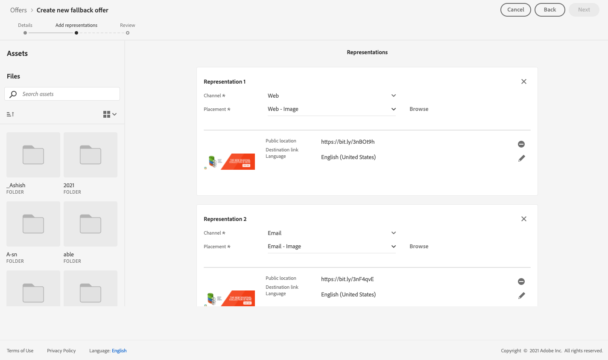

# Caso d’uso: configurare offerte personalizzate da utilizzare in un messaggio e-mail {#configure-add-personalized-offers-email}

Questa sezione presenta un esempio end-to-end per mostrare come configurare le offerte e utilizzarle in un’e-mail, in base a una decisione creata in precedenza.

## Passaggi principali {#main-steps}

I passaggi chiave per configurare le offerte, includerle in una decisione e sfruttare questa decisione in un’e-mail sono elencati di seguito:

1. Prima di creare offerte, [definire i componenti](#define-components)

   * Creare posizionamenti
   * Creare regole di decisione
   * Creare tag
   * Creare classificazioni (facoltativo)

1. [Configurare le offerte](#configure-offers)

   * Creare offerte
   * Per ogni offerta:

      * Crea rappresentazioni e seleziona un posizionamento e una risorsa per ogni rappresentazione
      * Aggiungi una regola per ogni offerta
      * Definire una priorità per ogni offerta

1. [Creare un’offerta di fallback](#create-fallback)

1. [Creare una raccolta](#create-collection) per includere le offerte personalizzate create

1. [Configurare la decisione](#configure-decision)

   * Creare una decisione
   * Selezionare i posizionamenti creati
   * Per ogni posizionamento, seleziona la raccolta
   * Per ogni posizionamento, seleziona una classificazione (facoltativo)
   * Selezionare il fallback

1. [Inserire la decisione in un messaggio e-mail](#insert-decision-in-email)

   * Selezionare un posizionamento corrispondente alle offerte che si desidera visualizzare
   * Seleziona la decisione tra gli elementi compatibili con il posizionamento selezionato
   * Anteprima delle offerte

Il processo decisionale complessivo per l’utilizzo delle offerte in un messaggio e-mail può essere descritto come segue:

## Definire i componenti {#define-components}

Prima di iniziare a creare le offerte, devi definire diversi componenti da utilizzare nelle offerte.

Li troverai sotto il **[!UICONTROL Decision Management]** > **[!UICONTROL Components menu]**.

1. Inizia creando **posizionamenti** per le offerte.

   Utilizzerai questi posizionamenti per definire dove verrà visualizzata l’offerta risultante durante la definizione della decisione di offerta.

   In questo esempio, crea tre posizionamenti con i seguenti tipi di canale e contenuto:

   * *Web - Immagine*
   * *E-mail - Immagine*
   * *Non digitale - Testo*

   

   I passaggi dettagliati per la creazione dei posizionamenti sono descritti in [questa sezione](../../using/offers/offer-library/creating-placements.md).

1. Crea **norme decisionali**.

   Le regole decisionali forniscono l’offerta migliore a un profilo in Adobe Experience Platform.

   Configura due semplici regole utilizzando la **[!UICONTROL XDM Individual Profile > Person > Gender]** attributo:

   * *Clienti Femminili*
   * *Clienti maschili*

   

   I passaggi dettagliati per la creazione delle regole sono descritti in [questa sezione](../../using/offers/offer-library/creating-decision-rules.md).

1. Puoi anche creare un **tag**.

   Potrai quindi associarlo alle offerte e utilizzare questo tag per raggruppare le offerte in una raccolta.

   In questo esempio, crea le *Yoga* tag .

   

   I passaggi dettagliati per la creazione dei tag sono descritti in [questa sezione](../../using/offers/offer-library/creating-tags.md).

1. Se desideri definire regole che determinino quale offerta deve essere presentata per prima per un determinato posizionamento (anziché tenere conto dei punteggi di priorità delle offerte), puoi creare un **formula di classificazione**.

   I passaggi dettagliati per la creazione di formule di classificazione sono descritti in [questa sezione](../../using/offers/offer-library/create-ranking-formulas.md#create-ranking-formula).

   >[!NOTE]
   >
   >In questo esempio, utilizzeremo solo i punteggi di priorità. Ulteriori informazioni su [regole di idoneità e vincoli](../../using/offers/offer-library/creating-personalized-offers.md#eligibility).

## Configurare le offerte {#configure-offers}

Ora puoi creare e configurare le offerte. In questo esempio, creerai quattro offerte da visualizzare in base a ciascun profilo specifico.

1. Creare un’offerta. [Ulteriori informazioni](../../using/offers/offer-library/creating-personalized-offers.md#create-offer).

1. In questa offerta, crea tre rappresentazioni. Ogni rappresentazione deve essere una combinazione di un posizionamento creato in precedenza e di una risorsa:

   * Uno corrispondente al *Web - Immagine* placement
   * Uno corrispondente al *E-mail - Immagine* placement
   * Uno corrispondente al *Non digitale - Testo* placement

   >[!NOTE]
   >
   >Un’offerta può essere visualizzata in posizioni diverse all’interno di un messaggio per creare ulteriori opportunità di utilizzo in contesti di posizionamento diversi.

   Ulteriori informazioni sulle rappresentazioni in [questa sezione](../../using/offers/offer-library/creating-personalized-offers.md#representations).

1. Seleziona un’immagine appropriata per i primi due posizionamenti. Immetti un testo personalizzato per la *Non digitale - Testo* posizionamento.

   

1. In **[!UICONTROL Offer eligibility]** sezione , seleziona **[!UICONTROL By defined decision rule]** e trascina e rilascia la regola scelta.

   

1. Compila il **[!UICONTROL Priority]**. In questo esempio, aggiungi *25*.

1. Rivedi l’offerta, quindi fai clic su **[!UICONTROL Save and approve]**.

   

1. In questo esempio, crea altre tre offerte con le stesse rappresentazioni, ma risorse diverse. Assegnali con regole e priorità diverse, ad esempio:

   * Prima offerta - Regola decisionale: *Clienti Femminili*, Priorità: *25*
   * Seconda offerta - Regola decisionale: *Clienti Femminili*, Priorità: *15*
   * Terza offerta - Regola decisionale: *Clienti maschili*, Priorità: *25*
   * Quarta offerta - Regola decisionale: *Clienti maschili*, Priorità: *15*

   

I passaggi dettagliati per la creazione e la configurazione delle offerte sono descritti in [questa sezione](../../using/offers/offer-library/creating-personalized-offers.md).

## Creare un’offerta di fallback {#create-fallback}

1. Creare un’offerta di fallback.

1. Definisci le stesse rappresentazioni delle offerte, con le risorse appropriate (devono essere diverse da quelle utilizzate nelle offerte).

   Ogni rappresentazione deve essere una combinazione di un posizionamento creato in precedenza e di una risorsa:

   * Uno corrispondente al *Web - Immagine* placement
   * Uno corrispondente al *E-mail - Immagine* placement
   * Uno corrispondente al *Non digitale - Testo* placement

   

1. Rivedi l’offerta di fallback, quindi fai clic su **[!UICONTROL Save and approve]**.

L’offerta di fallback è ora pronta per essere utilizzata in una decisione.

I passaggi dettagliati per la creazione e la configurazione di un’offerta di fallback sono descritti in [questa sezione](../../using/offers/offer-library/creating-fallback-offers.md).

## Creare una raccolta {#create-collection}

Quando configuri la decisione, dovrai aggiungere le offerte personalizzate come parte di una raccolta.

1. Per accelerare il processo decisionale, crea una raccolta dinamica.

1. Utilizza la *Yoga* per selezionare le quattro offerte personalizzate create in precedenza.

   

I passaggi dettagliati per la creazione di una raccolta sono descritti in [questa sezione](../../using/offers/offer-library/creating-collections.md).

## Configurare la decisione {#configure-decision}

Ora devi creare una decisione che combini i posizionamenti con le offerte personalizzate e l’offerta di fallback appena creata.

Questa combinazione verrà utilizzata dal motore di Offer decisioning per trovare l’offerta migliore per un profilo specifico: in questo esempio, si baserà sulla priorità e sulla regola decisionale che hai assegnato a ogni offerta.

Per creare e configurare una decisione di offerta, segui i passaggi principali seguenti:

1. Creare una decisione. [Ulteriori informazioni](../../using/offers/offer-activities/create-offer-activities.md#create-activity).

1. Seleziona la *Web - Immagine*, *E-mail - Immagine* e *Non digitale - Testo* posizionamenti.

   

1. Per ogni posizionamento, aggiungi la raccolta creata.

   

1. Se hai definito una classificazione quando [creazione di componenti](#define-components), puoi assegnarlo a un posizionamento nella decisione. Se più offerte sono idonee per essere presentate in questo posizionamento, la decisione utilizzerà questa formula per calcolare quale offerta distribuire per prima.

   I passaggi dettagliati per assegnare una formula di classificazione a un posizionamento sono descritti in [questa sezione](../../using/offers/offer-activities/configure-offer-selection.md#assign-ranking-formula).

1. Seleziona l’offerta di fallback creata. Sarà visualizzato come offerta di fallback disponibile per i tre posizionamenti selezionati.

   

1. Rivedi la tua decisione, quindi fai clic su **[!UICONTROL Save and approve]**.

   

La tua decisione è ora pronta per essere utilizzata per fornire offerte ottimizzate e personalizzate.

I passaggi dettagliati per la creazione e la configurazione di una decisione sono descritti in [questa sezione](../../using/offers/offer-activities/create-offer-activities.md).

## Inserire la decisione in un messaggio e-mail {#insert-decision-in-email}

Ora che la tua decisione è attiva, puoi inserirla in un messaggio e-mail. A questo scopo, segui i passaggi riportati qui sotto:

1. Crea il tuo messaggio e-mail, quindi apri il [E-mail Designer](../../using/messages/design-emails.md) per configurarne il contenuto.

1. Aggiungi un componente struttura dalla palette a sinistra.

1. Aggiungi un **[!UICONTROL Offer decision]** componente di contenuto. Scopri come utilizzare i componenti di contenuto in [questa sezione](../../using/messages/content-components.md).

   

1. Selezionala. Nella palette a destra, fai clic su **[!UICONTROL Select offer decision]** per aggiungere una decisione.

   

1. Seleziona il posizionamento corrispondente alle offerte che desideri visualizzare dal **[!UICONTROL Placements]** elenco a discesa.

   In questo caso, dai posizionamenti creati in precedenza come parte di questo esempio, solo il **E-mail - Immagine** Il posizionamento è disponibile come desideri utilizzare la decisione in un’e-mail. Ulteriori informazioni su [creazione di posizionamenti](../../using/offers/offer-library/creating-placements.md).

   

1. Decisioni corrispondenti alle **E-mail - Immagine** viene visualizzato il posizionamento . Seleziona la decisione da utilizzare nel componente contenuto, quindi fai clic su **[!UICONTROL Add]**.

   

   >[!NOTE]
   >
   >Nell’elenco vengono visualizzate solo le decisioni compatibili con il posizionamento selezionato.

Ora puoi visualizzare tutte le offerte personalizzate e l’offerta di fallback in E-mail Designer.

Utilizza la **[!UICONTROL Offers]** per sfogliare i dati, utilizza le frecce destra e sinistra dei componenti di contenuto. Puoi anche visualizzare le diverse offerte che fanno parte della decisione con un profilo cliente. [Ulteriori informazioni](../../using/messages/deliver-personalized-offers.md#preview-offers-in-email).

Dopo aver salvato le modifiche e dopo la pubblicazione del messaggio, le offerte sono pronte per essere visualizzate nei profili pertinenti al momento dell’invio del messaggio come parte di un percorso.

>[!NOTE]
>
>Quando aggiorni un&#39;offerta, un&#39;offerta di fallback, una raccolta di offerte o una decisione di offerta a cui si fa riferimento direttamente o indirettamente in un [pubblicato](../../using/messages/publish-manage-message.md) Gli aggiornamenti ora vengono automaticamente rispecchiati nel messaggio corrispondente, senza che sia necessario ripubblicarlo.

**Argomenti correlati:**

* Scopri come controllare l’anteprima del messaggio in [questa sezione](../../using/messages/preview.md#preview-your-messages).

* Scopri come pubblicare i messaggi in [questa sezione](../../using/messages/publish-manage-message.md).

* Scopri in che modo i messaggi vengono attivati da uno o più percorsi in [questa sezione](../building-journeys/journey.md).

<!--
* Learn how to measure your offer's success and impact on your targeted audience with reports in [this section](../reports/journey-global-report.md).
-->

