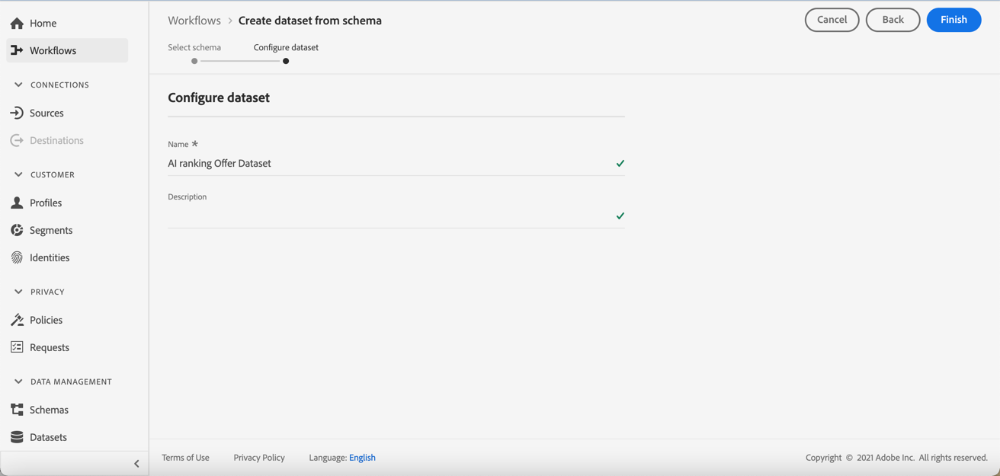

# Creare un set di dati per raccogliere gli eventi {#create-dataset}

Prima di creare un modello AI, devi creare un set di dati in cui verranno raccolti gli eventi di conversione. Inizia creando lo schema che verrà utilizzato nel set di dati:

1. Da **[!UICONTROL Gestione dati]** menu, seleziona **[!UICONTROL Schema]**, vai al **[!UICONTROL Sfoglia]** e fai clic su **[!UICONTROL Creare uno schema]**.

   

1. Scegli **[!UICONTROL ExperienceEvent XDM]**.

   

   >[!NOTE]
   >
   >Ulteriori informazioni sugli schemi e sui gruppi di campi XDM nella [Documentazione di panoramica del sistema XDM](https://experienceleague.adobe.com/docs/experience-platform/xdm/home.html?lang=it){target=&quot;_blank&quot;}.

1. Da **[!UICONTROL Gruppi di campi]** a sinistra, seleziona **[!UICONTROL Aggiungi]**.

   

1. In **[!UICONTROL Ricerca]** digitare &quot;proposition Interposition&quot; e selezionare il campo **[!UICONTROL Evento esperienza - Interazioni proposte]** gruppo di campi.

   

   >[!CAUTION]
   >
   >Lo schema che verrà utilizzato nel set di dati deve avere **[!UICONTROL Evento esperienza - Interazioni proposte]** gruppo di campi associato. In caso contrario, non potrai utilizzarlo nella tua strategia di classificazione.

1. Fai clic su **[!UICONTROL Aggiungi gruppi di campi]**.

   

   >[!NOTE]
   >Il gruppo di campi era precedentemente noto come mixin.

1. Digitare un nome e salvare lo schema.

>[!NOTE]
>
>Ulteriori informazioni sulla creazione degli schemi in [Nozioni di base sulla composizione dello schema](https://experienceleague.adobe.com/docs/experience-platform/xdm/schema/composition.html?lang=en#understanding-schemas){target=&quot;_blank&quot;}.

Ora puoi creare un set di dati utilizzando questo schema. Per farlo, segui la procedura indicata di seguito:

1. Da **[!UICONTROL Gestione dati]** menu, seleziona **[!UICONTROL Set di dati]**, vai al **[!UICONTROL Sfoglia]** e fai clic su **[!UICONTROL Creare un set di dati]**.

   

1. Seleziona **[!UICONTROL Creare un set di dati dallo schema]**.

   

1. Seleziona dall’elenco lo schema appena creato.

   

1. Fai clic su **[!UICONTROL Avanti]**.

1. Immetti un nome univoco per il set di dati nel **[!UICONTROL Nome]** campo e fai clic su **[!UICONTROL Fine]**.

   

Il set di dati è ora pronto per essere selezionato per raccogliere i dati dell’evento quando [creazione di una strategia di classificazione](#create-ranking-strategy).
