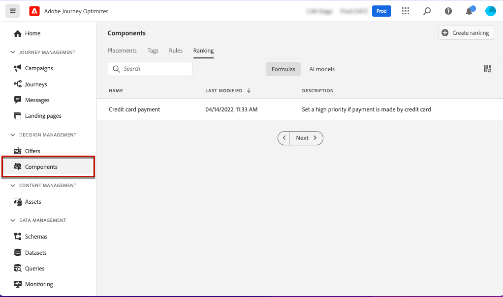
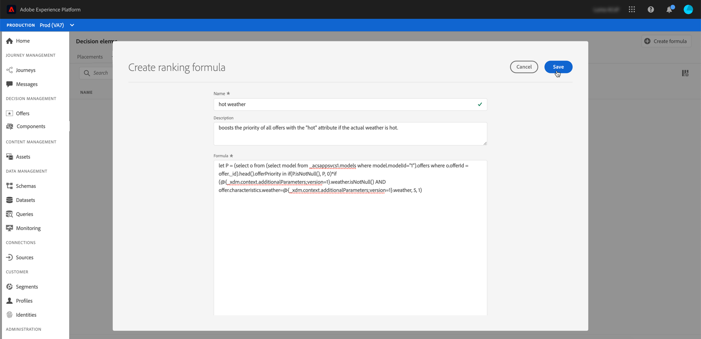

# Formule di classificazione {#create-ranking-formulas}

## Informazioni sulla classificazione delle formule {#about-ranking-formulas}

**Le formule di classificazione** ti consentono di definire regole che determineranno quale offerta deve essere presentata per prima per un determinato posizionamento, anziché tenere conto dei punteggi di priorità delle offerte.

Le formule di classificazione sono espresse in **sintassi PQL** e possono sfruttare attributi di profilo, dati contestuali e attributi di offerta. Per ulteriori informazioni su come utilizzare la sintassi PQL, consulta la [documentazione dedicata](https://experienceleague.adobe.com/docs/experience-platform/segmentation/pql/overview.html?lang=it).

Una volta creata una formula di classificazione, puoi assegnarla a un posizionamento in una decisione. Per ulteriori informazioni, consulta [Configurare la selezione delle offerte nelle decisioni](../offer-activities/configure-offer-selection.md).

## Creare una formula di classificazione {#create-ranking-formula}

Per creare una formula di classificazione, effettua le seguenti operazioni:

1. Accedi al menu **[!UICONTROL Componenti]**, quindi seleziona la scheda **[!UICONTROL Classifica]**. La scheda **[!UICONTROL Formule]** è selezionata per impostazione predefinita. Viene visualizzato l&#39;elenco delle formule create in precedenza.

   

1. Fai clic su **[!UICONTROL Crea classificazione]** per creare una nuova formula di classificazione.

   

1. Specificare il nome, la descrizione e la formula della formula.

   In questo esempio, vogliamo aumentare la priorità di tutte le offerte con l’attributo &quot;hot&quot; (caldo) se il tempo effettivo è caldo. A questo scopo, **contextData.weather=hot** è stato passato alla chiamata di decisioning. [Scopri come utilizzare i dati contestuali](../context-data.md)

   

   >[!IMPORTANT]
   >
   >Durante la creazione di una formula di classificazione, non è supportato guardare indietro a un periodo di tempo precedente. Ad esempio, se specifichi un evento esperienza che si è verificato nell’ultimo mese come componente della formula. Qualsiasi tentativo di includere un periodo di lookback durante la creazione della formula attiverà un errore durante il salvataggio.

1. Fai clic su **[!UICONTROL Salva]**. La formula di classificazione viene creata, puoi selezionarla dall’elenco per ottenere i dettagli e modificarla o eliminarla.

   È ora pronto per essere utilizzato in una decisione di classificare le offerte idonee per un posizionamento (consulta [Configurare la selezione di offerte nelle decisioni](../offer-activities/configure-offer-selection.md)).

   

## Esempi di formule di classificazione {#ranking-formula-examples}

Puoi creare diverse formule di classificazione in base alle tue esigenze. Di seguito sono riportati alcuni esempi.

<!--
Boost by offer ID

Boost the priority of an offer with the offer ID *xcore:personalized-offer:13d213cd4cb328ec* by 5.

**Ranking formula:**

```
if( offer._id = "xcore:personalized-offer:13d213cd4cb328ec", offer.rank.priority + 5, offer.rank.priority)
```

Change the offer priority based on a certain profile attribute

Set the offer priority to 30 for offer *xcore:personalized-offer:13d213cd4cb328ec* if the user lives in the city of Bondi.

**Ranking formula:**

```
if( offer._id = "xcore:personalized-offer:13d213cd4cb328ec" and homeAddress.city.equals("Bondi", false), 30, offer.rank.priority)
```

Boost multiple offers by offer ID based on the presence of a profile's audience membership

Boost the priority of offers based on whether the user is a member of a priority audience, which is configured as an attribute in the offer.

**Ranking formula:**

```
if( segmentMembership.get("ups").get(offer.characteristics.get("prioritySegmentId")).status in (["realized","existing"]), offer.rank.priority + 10, offer.rank.priority)
```
-->

### Incrementa le offerte con un determinato attributo di offerta basato sull’attributo del profilo

Se il profilo risiede nella città corrispondente all’offerta, allora raddoppia la priorità per tutte le offerte in quella città.

**Formula di classificazione:**

```
if( offer.characteristics.get("city") = homeAddress.city, offer.rank.priority * 2, offer.rank.priority)
```

### Incrementa le offerte la cui data di fine è inferiore a 24 ore

**Formula di classificazione:**

```
if( offer.selectionConstraint.endDate occurs <= 24 hours after now, offer.rank.priority * 3, offer.rank.priority)
```

### Incrementa le offerte in base alla propensione dei clienti ad acquistare il prodotto che viene offerto

Puoi aumentare il punteggio di un’offerta in base al punteggio di tendenza del cliente.

In questo esempio, il tenant dell&#39;istanza è *_salesvelocity* e lo schema del profilo contiene un intervallo di punteggi archiviati in un array:


Considerato questo, per un profilo come:

```
{"_salesvelocity": {"individualScoring": [
                    {"core": {
                            "category":"insurance",
                            "propensityScore": 96.9
                        }},
                    {"core": {
                            "category":"personalLoan",
                            "propensityScore": 45.3
                        }},
                    {"core": {
                            "category":"creditCard",
                            "propensityScore": 78.1
                        }}
                    ]}
}
```

### Incrementa le offerte in base ai dati contestuali {#context-data}

[!DNL Journey Optimizer] consente di aumentare alcune offerte in base ai dati contestuali trasmessi nella chiamata. Ad esempio, se `contextData.weather=hot` viene passato, la priorità di tutte le offerte con `attribute=hot` deve essere aumentata. Informazioni dettagliate su come trasmettere i dati contestuali utilizzando le API **Edge Decisioning** e **Decisioning**, consulta [questa sezione](../context-data.md)

Tieni presente che quando utilizzi l&#39;API **Decisioning**, i dati contestuali vengono aggiunti all&#39;elemento profilo nel corpo della richiesta, come nell&#39;esempio seguente.

```
"xdm:profiles": [
{
    "xdm:identityMap": {
        "crmid": [
            {
            "xdm:id": "CRMID1"
            }
        ]
    },
    "xdm:contextData": [
        {
            "@type":"_xdm.context.additionalParameters;version=1",
            "xdm:data":{
                "xdm:weather":"hot"
            }
        }
    ]
    
}],
```

Di seguito sono riportati alcuni esempi che illustrano come utilizzare i dati contestuali nelle formule di classificazione per aumentare la priorità delle offerte. Espandi ogni sezione per ottenere dettagli sulla sintassi della formula di classificazione.

>[!NOTE]
>
>Negli esempi di API Edge Decisioning, sostituisci `<OrgID>` con l&#39;ID tenant dell&#39;organizzazione.

+++Aumenta di 10 la priorità dell’offerta se il canale dai dati contestuali corrisponde al canale preferito dal cliente

>[!BEGINTABS]

>[!TAB API decisioning]

`if (@{_xdm.context.additionalParameters;version=1}.channel.isNotNull() and @{_xdm.context.additionalParameters;version=1}.channel.equals(_abcMobile.preferredChannel), offer.rank.priority + 10, offer.rank.priority)`

>[!TAB API Edge Decisioning]

`if (xEvent.<OrgID>.channel.isNotNull() and xEvent.<OrgID>.channel.equals(_abcMobile.preferredChannel), offer.rank.priority + 10, offer.rank.priority)`

>[!ENDTABS]

+++

+++Aumenta la priorità di tutte le offerte con &quot;attribute=hot&quot; se &quot;contextData.weather=hot&quot; viene passato nella chiamata.

>[!BEGINTABS]

>[!TAB API decisioning]

`if (@{_xdm.context.additionalParameters;version=1}.weather.isNotNull() and offer.characteristics.get("weather")=@{_xdm.context.additionalParameters;version=1}.weather, offer.rank.priority + 5, offer.rank.priority)`

>[!TAB API Edge Decisioning]

`if (xEvent.<OrgID>.weather.isNotNull() and offer.characteristics.get("weather")=xEvent.<OrgID>.weather, offer.rank.priority + 5, offer.rank.priority)`

>[!ENDTABS]

+++

+++Aumento origine contenuto

>[!BEGINTABS]

>[!TAB API decisioning]

`if (@{_xdm.context.additionalParameters;version=1}.contentorigin.isNotNull() and offer.characteristics.contentorigin=@{_xdm.context.additionalParameters;version=1}.contentorigin, offer.rank.priority * 100, offer.rank.priority)`

>[!TAB API Edge Decisioning]

`if (xEvent.<OrgID>.contentorigin.isNotNull() and offer.characteristics.contentorigin=xEvent.<OrgID>.contentorigin, offer.rank.priority * 100, offer.rank.priority)`

>[!ENDTABS]

+++

+++Incremento meteo

>[!BEGINTABS]

>[!TAB API decisioning]

`if (@{_xdm.context.additionalParameters;version=1}.weather.isNotNull() and offer.characteristics.weather=@{_xdm.context.additionalParameters;version=1}.weather, offer.rank.priority * offer.characteristics.scoringBoost, offer.rank.priority)`

>[!TAB API Edge Decisioning]

`if (xEvent.<OrgID>.weather.isNotNull() and offer.characteristics.weather=xEvent.<OrgID>.weather, offer.rank.priority * offer.characteristics.scoringBoost, offer.rank.priority)`

>[!ENDTABS]

+++
