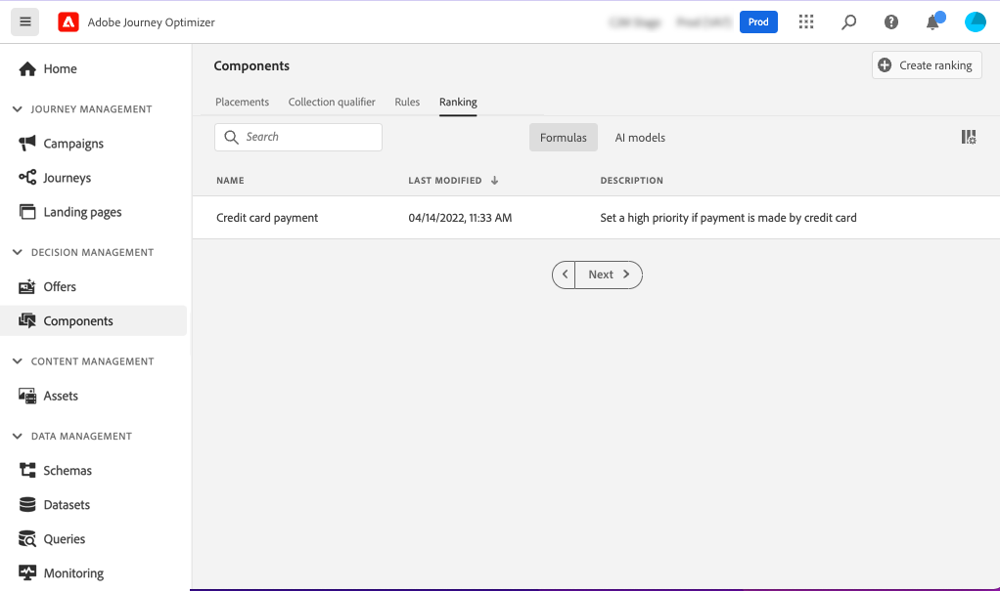

# Classificazione delle formule {#create-ranking-formulas}

## Informazioni sulla classificazione delle formule {#about-ranking-formulas}

**Classificazione delle formule** ti consente di definire regole che determinano quale offerta deve essere presentata per prima per un determinato posizionamento, anziché tenere conto dei punteggi di priorità delle offerte.

Le formule di classificazione sono espresse in **Sintassi PQL** e può sfruttare gli attributi del profilo, i dati contestuali e gli attributi dell’offerta. Per ulteriori informazioni su come utilizzare la sintassi PQL, consulta [documentazione dedicata](https://experienceleague.adobe.com/docs/experience-platform/segmentation/pql/overview.html).

Una volta creata una formula di classificazione, puoi assegnarla a un posizionamento in una decisione. Per ulteriori informazioni, consulta [Configurare la selezione delle offerte nelle decisioni](../offer-activities/configure-offer-selection.md).

## Creare una formula di classificazione {#create-ranking-formula}

Per creare una formula di classificazione, segui i passaggi seguenti:

1. Accedere al **[!UICONTROL Components]** quindi seleziona il **[!UICONTROL Rankings]** scheda . Viene visualizzato l’elenco delle classificazioni create in precedenza.

   

1. Fai clic su **[!UICONTROL Create ranking]** per creare una nuova formula di classificazione.

   

1. Specificare il nome, la descrizione e la formula della formula di classificazione.

   In questo esempio, vogliamo aumentare la priorità di tutte le offerte con l’attributo &quot;caldo&quot; se il tempo effettivo è caldo. Per eseguire questa operazione, **contextData.weather=hot** è stato passato nella chiamata decisionale.

   

1. Fai clic su **[!UICONTROL Save]**. La formula di classificazione viene creata, è possibile selezionarla dall&#39;elenco per ottenere i dettagli e modificarla o eliminarla.

   È ora pronto per essere utilizzato in una decisione per classificare le offerte idonee per un posizionamento (vedi [Configurare la selezione delle offerte nelle decisioni](../offer-activities/configure-offer-selection.md)).

   

## Esempi di formule di classificazione {#ranking-formula-examples}

Puoi creare diverse formule di classificazione in base alle tue esigenze. Di seguito sono riportati alcuni esempi.

<!--
Boost by offer ID

Boost the priority of an offer with the offer ID *xcore:personalized-offer:13d213cd4cb328ec* by 5.

**Ranking formula:**

```
if( offer._id = "xcore:personalized-offer:13d213cd4cb328ec", offer.rank.priority + 5, offer.rank.priority)
```

Change the offer priority based on a certain profile attribute

Set the offer priority to 30 for offer *xcore:personalized-offer:13d213cd4cb328ec* if the user lives in the city of Bondi.

**Ranking formula:**

```
if( offer._id = "xcore:personalized-offer:13d213cd4cb328ec" and homeAddress.city.equals("Bondi", false), 30, offer.rank.priority)
```

Boost multiple offers by offer ID based on the presence of a profile's segment membership

Boost the priority of offers based on whether the user is a member of a priority segment, which is configured as an attribute in the offer.

**Ranking formula:**

```
if( segmentMembership.get("ups").get(offer.characteristics.prioritySegmentId).status in (["realized","existing"]), offer.rank.priority + 10, offer.rank.priority)
```
-->

### Incrementa le offerte con determinati attributi di offerta basati sull’attributo di profilo

Se il profilo vive nella città corrispondente all’offerta, raddoppia la priorità per tutte le offerte della città.

**Formula di classificazione:**

```
if( offer.characteristics.city = homeAddress.city, offer.rank.priority * 2, offer.rank.priority)
```

### Incrementa le offerte in cui la data di fine è inferiore a 24 ore da ora

**Formula di classificazione:**

```
if( offer.selectionConstraint.endDate occurs <= 24 hours after now, offer.rank.priority * 3, offer.rank.priority)
```

### Incrementa le offerte con alcuni attributi di offerta in base ai dati contestuali

Incrementa alcune offerte in base ai dati contestuali passati nella chiamata decisionale. Ad esempio, se `contextData.weather=hot` viene passato nella chiamata decisionale, la priorità di tutte le offerte con `attribute=hot` devono essere potenziati.

**Formula di classificazione:**

```
if (@{_xdm.context.additionalParameters;version=1}.weather.isNotNull()
and offer.characteristics.weather=@{_xdm.context.additionalParameters;version=1}.weather, offer.rank.priority + 5, offer.rank.priority)
```

Tieni presente che quando utilizzi l’API decisionale, i dati contestuali vengono aggiunti all’elemento profilo nel corpo della richiesta, come nell’esempio seguente.

**Frammento dal corpo della richiesta:**

```
"xdm:profiles": [
{
    "xdm:identityMap": {
        "crmid": [
            {
            "xdm:id": "CRMID1"
            }
        ]
    },
    "xdm:contextData": [
        {
            "@type":"_xdm.context.additionalParameters;version=1",
            "xdm:data":{
                "xdm:weather":"hot"
            }
        }
    ]
 }],
```

### Migliora le offerte in base alla propensione dei clienti ad acquistare il prodotto offerto

Puoi incrementare il punteggio per un&#39;offerta in base a un punteggio di propensione del cliente.

In questo esempio, il tenant dell’istanza è *_velocità di vendita* e lo schema del profilo contiene un intervallo di punteggi memorizzati in un array:


In questo caso, per un profilo come:

```
{"_salesvelocity": {"individualScoring": [
                    {"core": {
                            "category":"insurance",
                            "propensityScore": 96.9
                        }},
                    {"core": {
                            "category":"personalLoan",
                            "propensityScore": 45.3
                        }},
                    {"core": {
                            "category":"creditCard",
                            "propensityScore": 78.1
                        }}
                    ]}
}
```

Le offerte conterrebbero un attributo per *propensityType* che corrisponde alla categoria dei punteggi:


La formula di classificazione può quindi impostare la priorità di ogni offerta in modo che sia uguale ai clienti *propensityScore* per *propensityType*. Se non viene trovato alcun punteggio, utilizza la priorità statica impostata nell’offerta:

```
let score = (select _Individual_Scoring1 from _salesvelocity.individualScoring
             where _Individual_Scoring1.core.category.equals(offer.characteristics.propensityType, false)).head().core.propensityScore
in if(score.isNotNull(), score, offer.rank.priority)
```
