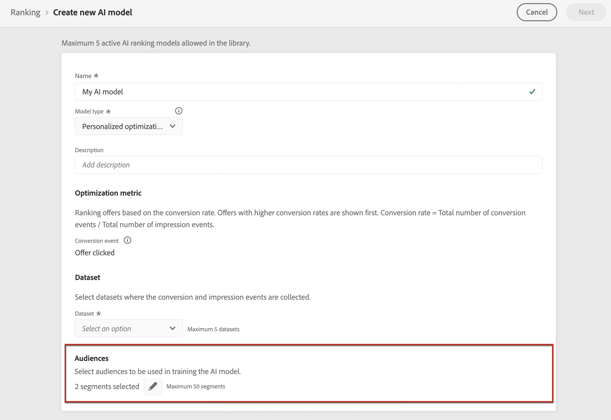

# Creare modelli IA {#ai-rankings}

[!DNL Journey Optimizer] consente di creare **modelli di IA** per classificare le offerte in base agli obiettivi aziendali.

>[!CAUTION]
>
>Per creare, modificare o eliminare modelli AI, è necessario disporre dell&#39;autorizzazione **Gestisci strategie di classificazione**. [Ulteriori informazioni](../../administration/high-low-permissions.md#manage-ranking-strategies)

## Creare un modello IA {#create-ranking-strategy}

>[!CONTEXTUALHELP]
>id="ajo_decisioning_ai_model_metric"
>title="Metrica di ottimizzazione"
>abstract="[!DNL Journey Optimizer] classifica le offerte in base al **tasso di conversione** (tasso di conversione = numero totale di eventi di conversione / numero totale di eventi di impression). Il tasso di conversione viene calcolato utilizzando due tipi di metriche: **Eventi di impression** (offerte visualizzate) e **Eventi di conversione** (offerte che generano clic tramite e-mail o Web). Questi eventi vengono acquisiti automaticamente utilizzando il Web SDK o il Mobile SDK fornito."

Per creare un modello di IA, segui i passaggi seguenti:

1. Crea un set di dati in cui verranno raccolti gli eventi di conversione. [Scopri come](../data-collection/create-dataset.md)

1. Nel menu **[!UICONTROL Componenti]**, accedi alla scheda **[!UICONTROL Classifica]**, quindi seleziona **[!UICONTROL Modelli AI]**.

   

   Vengono elencati tutti i modelli di IA creati finora.

1. Fare clic sul pulsante **[!UICONTROL Crea modello di IA]**.

1. Specifica un nome univoco e una descrizione per il modello di IA, quindi seleziona il tipo di modello di IA da creare:

   * **[!UICONTROL Ottimizzazione automatica]** ottimizza le offerte in base alle prestazioni delle offerte passate. [Ulteriori informazioni](auto-optimization-model.md)
   * **[!UICONTROL Ottimizzazione personalizzata]** ottimizza e personalizza le offerte in base al pubblico e alle prestazioni delle offerte. [Ulteriori informazioni](personalized-optimization-model.md)

   

   >[!NOTE]
   >
   >La sezione **[!UICONTROL Metrica di ottimizzazione]** fornisce informazioni sull&#39;evento di conversione utilizzato dal modello di intelligenza artificiale per calcolare la classificazione delle offerte.
   >
   >[!DNL Journey Optimizer] classifica le offerte in base al **tasso di conversione** (tasso di conversione = numero totale di eventi di conversione / numero totale di eventi di impression). Il tasso di conversione viene calcolato utilizzando due tipi di metriche:
   >* **Eventi di impression** (offerte visualizzate)
   >* **Eventi di conversione** (offerte che generano clic via e-mail o web).
   >
   >Questi eventi vengono acquisiti automaticamente utilizzando il Web SDK o il SDK mobile fornito. Per ulteriori informazioni, consulta [Panoramica di Adobe Experience Platform Web SDK](https://experienceleague.adobe.com/docs/experience-platform/edge/home.html?lang=it).

1. Seleziona i set di dati in cui vengono raccolti gli eventi di conversione e di impression. Scopri come creare questo set di dati in [questa sezione](../data-collection/create-dataset.md). <!--This dataset needs to be associated with a schema that must have the **[!UICONTROL Proposition Interactions]** field group (previously known as mixin) associated with it.-->

   

   >[!CAUTION]
   >
   >Nell&#39;elenco a discesa vengono visualizzati solo i set di dati creati da schemi associati al gruppo di campi **[!UICONTROL Evento esperienza - Interazioni proposta]** (precedentemente noto come mixin).

1. Se stai creando un modello di IA **[!UICONTROL Ottimizzazione personalizzata]**, seleziona i segmenti da utilizzare per addestrare il modello di IA.

   ➡️ [Scopri questa funzione nel video](#video)

   

   >[!NOTE]
   >
   >Puoi selezionare fino a 5 tipi di pubblico.

1. Salva e attiva il modello di intelligenza artificiale.

   

<!--At this point, you must have:

* created the AI model,
* defined which type of event you want to capture - offer displayed (impression) and/or offer clicked (conversion),
* and in which dataset you want to collect the event data.-->

Ogni volta che si visualizza e/o si fa clic su un&#39;offerta, si desidera che l&#39;evento corrispondente venga acquisito automaticamente dal gruppo di campi **[!UICONTROL Experience Event - Proposition Interactions]** utilizzando [Adobe Experience Platform Web SDK](https://experienceleague.adobe.com/docs/experience-platform/edge/web-sdk-faq.html?lang=it#what-is-adobe-experience-platform-web-sdk%3F){target="_blank"} o Mobile SDK.

Per poter inviare in tipi di evento (offerta visualizzata o offerta selezionata), è necessario impostare il valore corretto per ciascun tipo di evento in un evento esperienza inviato in Adobe Experience Platform. [Scopri come](../data-collection/schema-requirement.md)

## Video dimostrativo {#video}

Scopri come creare un modello di ottimizzazione personalizzato e come applicarlo a una decisione.

>[!VIDEO](https://video.tv.adobe.com/v/3419954?quality=12)
