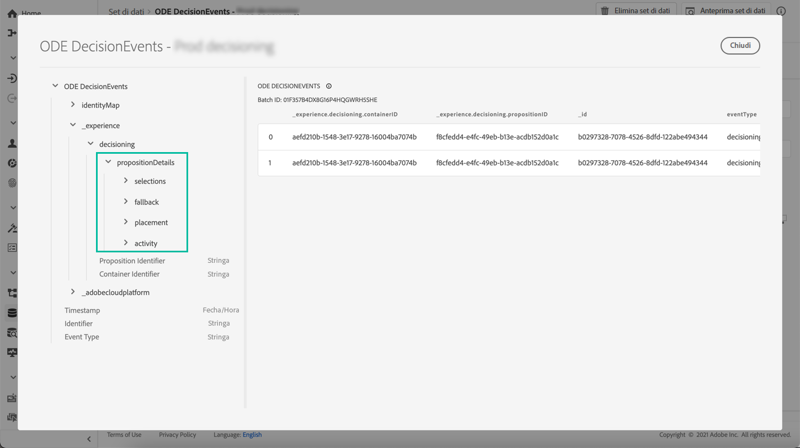
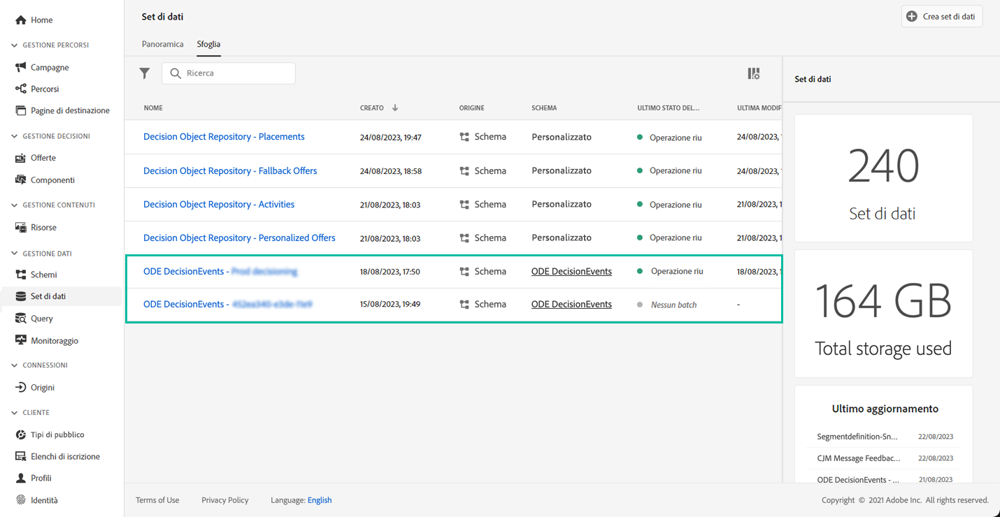

# Introduzione agli eventi di gestione delle decisioni {#monitor-offer-events}

Ogni volta che il servizio per la gestione delle decisioni prende una decisione per un determinato profilo, le informazioni relative a tali eventi vengono inviate automaticamente ad Adobe Experience Platform.

Questo ti consente di ottenere informazioni approfondite sulle tue decisioni, ad esempio per sapere quale offerta è stata presentata a un dato profilo. Puoi esportare questi dati per analizzarli nel tuo sistema di reporting o sfruttare il [Servizio query](https://experienceleague.adobe.com/docs/experience-platform/query/home.html?lang=it) di Adobe Experience Platform in combinazione con altri strumenti per analisi e reporting migliorati.

## Informazioni chiave disponibili nei set di dati {#key-information}

Ogni evento inviato quando viene presa una decisione contiene quattro punti dati chiave che puoi sfruttare a scopo di analisi e reporting:

* **[!UICONTROL Fallback]**: nome e ID dell’offerta di fallback, se non è stata selezionata alcuna offerta personalizzata
* **[!UICONTROL Posizionamento]**: nome, ID e canale del posizionamento utilizzato per la consegna dell’offerta
* **[!UICONTROL Selezioni]**: nome e ID dell’offerta selezionata per il profilo
* **[!UICONTROL Attività]**: Nome e ID della decisione.

Inoltre, puoi sfruttare i campi **[!UICONTROL identityMap]** e **[!UICONTROL Timestamp]** per recuperare informazioni sul profilo e sull’ora in cui è stata consegnata l’offerta.

Per ulteriori informazioni su tutti i campi XDM inviati con ciascuna decisione, consulta [questa sezione](xdm-fields.md).

## Accedere ai set di dati {#access-datasets}

I set di dati contenenti eventi di gestione delle decisioni sono accessibili dal menu **[!UICONTROL set di dati]** di Adobe Experience Platform. Al momento del provisioning di ciascuna istanza viene creato automaticamente un set di dati.

Questi set di dati si basano sullo schema **[!UICONTROL ODE DecisionEvents]**, che contiene tutti i campi XDM necessari per inviare informazioni dal servizio di gestione delle decisioni ad Adobe Experience Platform.

>[!NOTE]
>
>I set di dati ODE DecisionEvents sono **set di dati non di profilo**, che non possono essere acquisiti in Experience Platform per l’utilizzo da parte di Profilo cliente in tempo reale.
