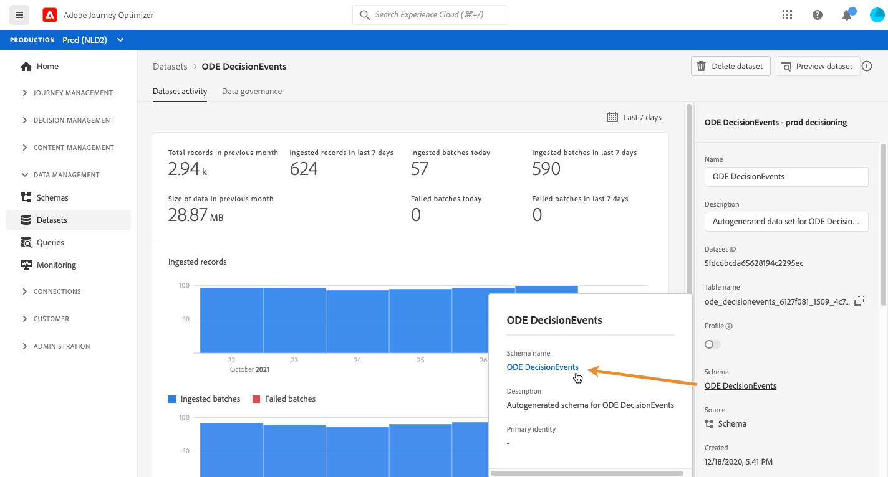

# Accedere ai campi XDM degli eventi {#decisioningevents-xdm-schema}

Puoi accedere allo schema XDM DecisioningEvents direttamente da un set di dati contenente gli eventi di Gestione decisioni.

Lo schema contiene tutti i campi necessari per inviare informazioni da Gestione decisioni a Adobe Experience Platform.

Per ottenere ulteriori informazioni su un campo specifico, selezionalo per visualizzare un riquadro di informazioni in cui sono riportate le proprietà del campo.

Per informazioni dettagliate su come lavorare con schemi e campi XDM, consulta la documentazione di Experience Data Model:

* [Panoramica del sistema XDM](https://experienceleague.adobe.com/docs/experience-platform/xdm/home.html?lang=it)
* [Esplorare le risorse XDM](https://experienceleague.adobe.com/docs/experience-platform/xdm/ui/explore.html?lang=it)
