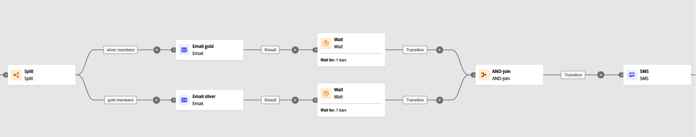

# AND-join {#join}

>[!CONTEXTUALHELP]
>id="ajo_orchestration_and-join"
>title="Attività AND-join"
>abstract="L’attività **And-join** consente di sincronizzare più rami di esecuzione di una campagna orchestrata. Viene attivata al termine di tutte le attività precedenti. Questo consente di assicurarti che determinate attività siano state completate prima di continuare a eseguire la campagna orchestrata."

L’attività **[!UICONTROL AND-join]** è un’attività di **[!UICONTROL Controllo del flusso]**. Consente di sincronizzare più rami di esecuzione di una campagna orchestrata.

Questa attività attiva la relativa transizione in uscita solo dopo che tutte le transizioni in entrata sono state attivate; in altre parole, dopo che tutte le attività precedenti sono state completate. Questo ti consente di verificare che alcune attività siano state completate prima di continuare a eseguire la campagna orchestrata.

## Configurare l’attività And-join{#and-join-configuration}

>[!CONTEXTUALHELP]
>id="ajo_orchestration_and-join_merging"
>title="Opzioni di unione"
>abstract="Seleziona le attività che vuoi unire. Nel menu a discesa **Set primario**, scegli la popolazione di transizione in entrata da mantenere."

Per configurare l’attività **[!UICONTROL AND-join]**, segui questi passaggi:

1. Aggiungi più attività, come le attività del canale, per creare almeno due rami di esecuzione diversi.

1. Inserisci un’attività **[!UICONTROL AND-join]** in uno qualsiasi dei rami.

1. Nella sezione **[!UICONTROL Opzioni di unione]**, seleziona tutte le attività precedenti che desideri unire.

1. Nel menu a discesa **[!UICONTROL Set primario]**, scegli la popolazione di transizione in entrata da mantenere.

## Esempio{#and-join-example}

Questo esempio illustra due rami coordinati della campagna, ciascuno con una consegna e-mail, uno indirizzato ai membri di livello Gold e l’altro ai membri di livello Silver. **[!UICONTROL AND-join]** si attiva quando vengono attivate entrambe le transizioni in ingresso e l’SMS verrà inviato solo dopo il completamento di entrambe le consegne e-mail, dopo un ritardo di 7 giorni.

{zoomable="yes"}
