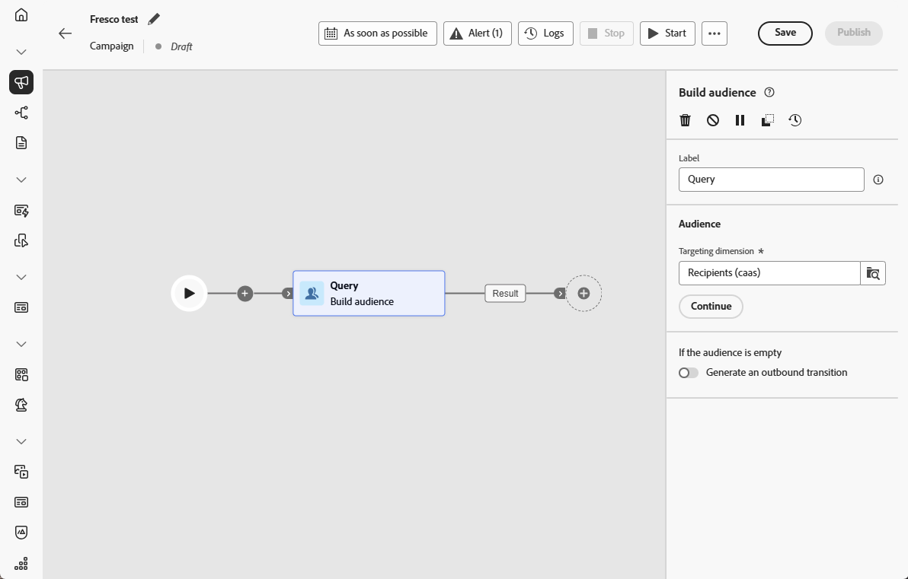
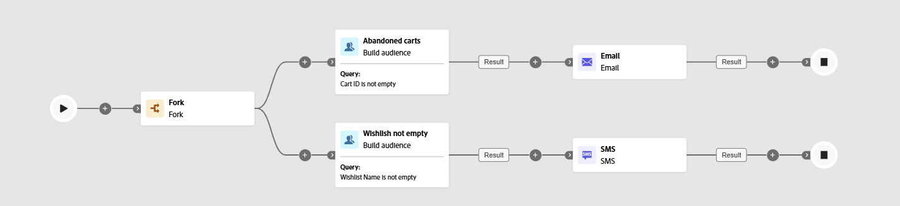

# Crea pubblico {#build-audience}

>[!CONTEXTUALHELP]
>id="ajo_orchestration_build_audience"
>title="Attività Crea pubblico"
>abstract="L’attività **Crea pubblico** ti consente di definire il pubblico che entrerà nella campagna orchestrata. Durante l’invio di messaggi nel contesto di una campagna orchestrata, il pubblico del messaggio non è definito nell’attività del canale, ma nell’attività **Crea pubblico**."

In qualità di marketer, puoi creare segmenti di pubblico complessi tramite un’interfaccia intuitiva, che ti consente di eseguire il targeting degli utenti in base a un’ampia gamma di criteri e comportamenti per adattare le campagne in modo più efficace.

A questo scopo, utilizza l’attività di targeting **[!UICONTROL Crea pubblico]**. Questa attività definisce il pubblico che entra nella campagna orchestrata. Quando si inviano messaggi come parte di una campagna orchestrata, il pubblico viene definito nell&#39;attività **[!UICONTROL Genera pubblico]**, non all&#39;interno della campagna orchestrata.

## Configurare l’attività Crea pubblico {#build-audience-configuration}

>[!CONTEXTUALHELP]
>id="ajo_orchestration_build_audience_audienceselector"
>title="Pubblico"
>abstract="Seleziona il pubblico nello stesso modo in cui utilizzi un pubblico durante la progettazione di una nuova consegna."

Per configurare l’attività **[!UICONTROL Crea pubblico]**, segui questi passaggi:

1. Aggiungi un’attività **[!UICONTROL Crea pubblico]**.

   

1. Definisci un’**[!UICONTROL etichetta]**.

1. Configura il pubblico seguendo i passaggi descritti nelle schede seguenti.

1. Scegli la **[!UICONTROL Dimensione targeting]**. La dimensione di targeting ti consente di definire la popolazione target dell’operazione: destinatari, beneficiari del contratto, operatore, abbonati, ecc. Per impostazione predefinita, il target viene selezionato dai destinatari.

1. Fai clic su **[!UICONTROL Continua]**.

1. Utilizza il generatore di regole per definire la query. [Ulteriori informazioni sul generatore di regole in questa sezione](../orchestrated-rule-builder.md)

1. Specifica se deve essere generata una transizione in uscita quando il pubblico è vuoto.

## Esempi{#build-audience-examples}

Ecco un esempio di campagna orchestrata con due attività **[!UICONTROL Genera pubblico]**. La prima esegue il targeting dei profili che hanno elementi nel carrello, seguito da una consegna e-mail. La seconda esegue il targeting dei profili con una wishlist, seguito da una consegna SMS.

Nell&#39;esempio seguente, l&#39;attività **[!UICONTROL Genera pubblico]** utilizza il generatore di regole per filtrare i profili in base al piano di abbonamento. Per l&#39;attributo `plan` è impostata una condizione che include solo i profili in cui `plan = "basic"`, restringendo il pubblico agli abbonati di livello base prima di trasmetterli all&#39;attività successiva.

{width="50%"}
