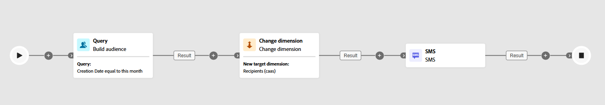

# Cambia dimensione {#change-dimension}

>[!CONTEXTUALHELP]
>id="ajo_orchestration_dimension_complement"
>title="Generare un complemento"
>abstract="Puoi generare una transizione in uscita aggiuntiva con la popolazione rimanente, che è stata esclusa come duplicato. A tale scopo, attiva l’opzione **Genera complemento**"

>[!CONTEXTUALHELP]
>id="ajo_orchestration_change_dimension"
>title="Attività Cambia dimensione"
>abstract="Questa attività ti consente di modificare la dimensione targeting durante la creazione di un pubblico. Sposta l’asse in base al modello di dati e alla dimensione di input. Ad esempio, puoi passare dalla dimensione “contratti” alla dimensione “clienti”."

In qualità di addetto al marketing, puoi migliorare il targeting del pubblico passando da un’entità dati a una correlata all’interno di una campagna orchestrata. Questo ti consente di andare oltre i profili utente e di concentrarti su comportamenti specifici, come acquisti, prenotazioni o altre interazioni.

A tal fine, utilizza l’attività **[!UICONTROL Modifica dimensione]**. Consente di regolare la dimensione di targeting durante la campagna orchestrata.

<!--
>[!IMPORTANT]
>
>Please note that the **[!UICONTROL Change Dimension]** and **[!UICONTROL Change Data source]** activities should not be added in one row. If you need to use both activities consecutively, make sure you include an **[!UICONTROL Enrichement]** activity in between them. This ensures proper execution and prevents potential conflicts or errors.-->

## Configurare l’attività Cambia dimensione {#configure}

Per configurare l’attività **[!UICONTROL Cambia dimensione]** segui questi passaggi:

1. Aggiungi un&#39;attività **[!UICONTROL Modifica dimensione]** alla campagna orchestrata.

   

1. Definisci la **[!UICONTROL nuova dimensione target]**. Durante la modifica della dimensione, tutti i record vengono mantenuti.

## Esempio {#example}

Questo caso d’uso si incentra sull’invio di un SMS ai profili che hanno creato una wishlist nell’ultimo mese.

Inizia con un’attività **[!UICONTROL Crea pubblico]**, utilizzando la dimensione di targeting **[!UICONTROL Wishlist]** per identificare tutte quelle rilevanti.

Quindi, aggiungi un’attività **[!UICONTROL Cambia dimensione]** per passare dalla dimensione di targeting **[!UICONTROL Wishlist]** a **[!UICONTROL Destinatario].** Questo passaggio assicura che la campagna orchestrata esegua il targeting dei profili corretti collegati a tali elenchi di desideri, consentendo l&#39;invio dell&#39;SMS ai profili desiderati.

