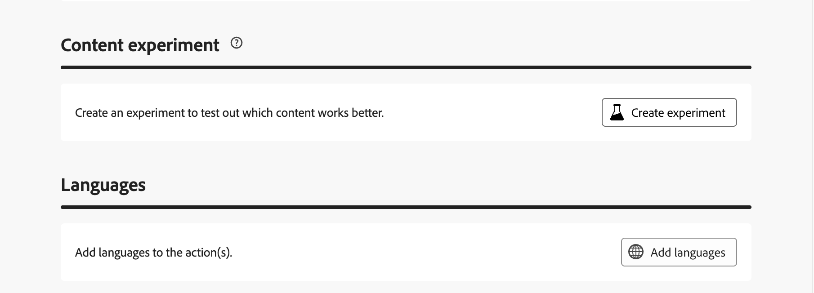
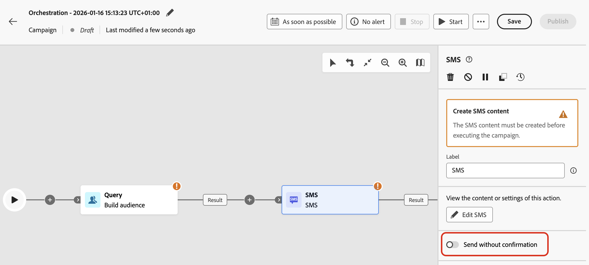
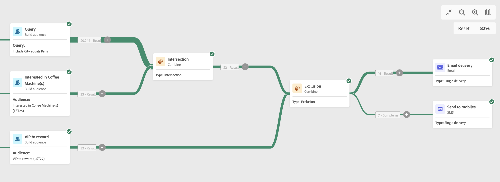
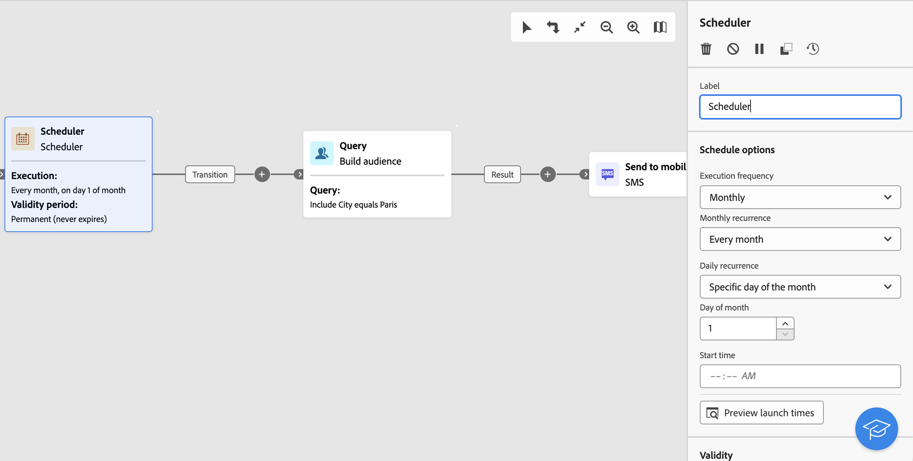

# Attività di canale {#channel}

>[!CONTEXTUALHELP]
>id="ajo_orchestration_email"
>title="Attività e-mail"
>abstract="L’attività E-mail consente di inviare e-mail all’interno della campagna orchestrata, sia per i messaggi singoli che ricorrenti. Consente di automatizzare il processo di invio di e-mail a una destinazione calcolata all’interno della stessa campagna orchestrata. È possibile combinare le attività del canale nell’area di lavoro di una campagna multifase per creare campagne cross-channel in grado di attivare azioni basate sui dati e sul comportamento della clientela."

>[!CONTEXTUALHELP]
>id="ajo_orchestration_sms"
>title="Attività SMS"
>abstract="L’attività SMS consente di inviare SMS all’interno della campagna orchestrata, sia per i messaggi singoli che ricorrenti. Consente di automatizzare il processo di invio di SMS a una destinazione calcolata all’interno della stessa campagna orchestrata. È possibile combinare le attività del canale nell’area di lavoro della campagna multifase per creare campagne cross-channel in grado di attivare azioni basate sui dati e sul comportamento della clientela."

>[!CONTEXTUALHELP]
>id="ajo_orchestration_push"
>title="Attività push"
>abstract="L’attività Push consente di inviare notifiche push come parte della campagna orchestrata. Consente la consegna di campagne orchestrate, sia singole che ricorrenti, automatizzando l’invio di notifiche push a una destinazione preimpostata all’interno della stessa campagna orchestrata. È possibile combinare le attività del canale nell’area di lavoro della campagna per creare campagne cross-channel in grado di attivare azioni basate sui dati e sul comportamento della clientela."

>[!CONTEXTUALHELP]
>id="ajo_orchestration_target"
>title="Target"
>abstract="Sezione Segnaposto per destinazione"

<!--
UNUSED IDs in BJ

>[!CONTEXTUALHELP]
>id="ajo_orchestration_push_ios"
>title="Push iOS activity"
>abstract="The Push iOS activity lets you send iOS Push notifications as part of your Orchestrated campaign. It enables the delivery of both one-time and recurring Orchestrated campaigns, automating the sending of iOS Push notifications to a predefined target within the same workflow. You can combine channel activities into the campaign canvas to create cross-channel campaigns that can trigger actions based on customer behavior and data."

>[!CONTEXTUALHELP]
>id="ajo_orchestration_push_android"
>title="Push Android activity"
>abstract="The Push Android activity lets you send Android Push notifications as part of your Orchestrated campaign. It enables the delivery of both one-time and recurring messages, automating the sending of Android Push notifications to a predefined target within the same Orchestrated campaign. You can combine channel activities into the Orchestrated campaign canvas to create cross-channel campaigns that can trigger actions based on customer behavior and data."
-->

>[!CONTEXTUALHELP]
>id="ajo_orchestration_directmail"
>title="Attività direct mail"
>abstract="L’attività direct mail facilita l’invio con direct mail all’interno della campagna orchestrata, sia per messaggi singoli che ricorrenti. Consente di automatizzare il processo di generazione del file di estrazione richiesto dai provider di direct mail. Puoi combinare le attività del canale nell’area di lavoro della campagna orchestrata per creare campagne cross-channel in grado di attivare azioni basate sui dati e sul comportamento della clientela."

[!DNL Adobe Journey Optimizer] consente di automatizzare ed eseguire campagne su più canali, e-mail, SMS, notifiche push e direct mail, sia per i messaggi di marketing che per quelli transazionali. Puoi combinare queste attività di canale nell’area di lavoro della campagna per creare campagne orchestrate cross-channel. Queste campagne possono attivare azioni in base al comportamento dei clienti e ai dati.

Ad esempio:

* Invia una serie di benvenuto tramite e-mail, SMS, push e direct mail.
* Consegna un’e-mail di follow-up dopo l’acquisto.
* Invia messaggi di auguri di compleanno personalizzati tramite SMS.

Utilizzando le attività dei canali, puoi creare campagne complete e personalizzate che coinvolgono la clientela su più punti di contatto e danno impulso alle conversioni.

>[!CAUTION]
>
>Nelle campagne orchestrate sono supportati solo i canali SMS, push, e-mail e direct mail.

## Aggiungere un’attività di canale e definirne le proprietà {#add}

>[!CONTEXTUALHELP]
>id="ajo_orchestration_category"
>title="Categoria"
>abstract="Scegli tra Marketing o Transazionale per questa attività del canale. I messaggi di marketing utilizzano le configurazioni dei canali di marketing e rispettano le regole di business standard. I messaggi transazionali sono destinati alle comunicazioni operative, spesso attivate dalle azioni di un individuo (ad esempio, reimpostazione della password o conferma dell’acquisto) o per avvisi urgenti come interruzioni o annullamenti. Utilizzano le configurazioni dei canali transazionali, le regole di business vengono ignorate e il consenso non è richiesto."

>[!PREREQUISITES]
>
>Prima di aggiungere un&#39;attività di canale, definisci il pubblico di destinazione utilizzando un&#39;attività [Genera pubblico](build-audience.md) o [Leggi pubblico](read-audience.md).

1. Aggiungi un’attività di canale nell’area di lavoro. Le attività del canale disponibili sono **[!UICONTROL E-mail]**, **[!UICONTROL SMS]**, **[!UICONTROL Push]** e **[!UICONTROL Direct mail]**.

   

1. Nella barra a destra, utilizza il campo **[!UICONTROL Categoria]** per scegliere **[!UICONTROL Marketing]** o **[!UICONTROL Transazionale]** per questo messaggio. I messaggi transazionali non richiedono il consenso e sono adatti per comunicazioni sensibili al tempo come interruzioni, emergenze o cancellazioni.

1. Seleziona l&#39;attività e fai clic su **[!UICONTROL Modifica e-mail]**, **[!UICONTROL Modifica SMS]**, **[!UICONTROL Modifica push]** o **[!UICONTROL Modifica direct mailing]** a seconda del canale scelto.

   

1. Nella scheda **[!UICONTROL Proprietà]**, immetti una descrizione, quindi passa alla scheda **[!UICONTROL Azioni]** per configurare l’attività.

## Messaggi di marketing e messaggi transazionali {#marketing-vs-transactional}

La scelta della categoria corretta determina il modo in cui i messaggi vengono consegnati e quali regole vengono applicate:

| | Marketing | Transazionale |
| --- | --- | --- |
| **Consenso richiesto** | Sì | No |
| **Regole di business** | Applicato (quota limite, regole di affaticamento) | Ignorato |
| **Tipo di configurazione canale** | Configurazione del canale di marketing | Configurazione del canale transazionale |
| **Casi d&#39;uso tipici** | Promozioni, newsletter, campagne stagionali | Conferme d’ordine, reimpostazione della password, avvisi di interruzione |
| **Pubblico** | Solo abbonati con consenso | Qualsiasi profilo, indipendentemente dallo stato di consenso |

>[!NOTE]
>
>Utilizza Transazionale solo per comunicazioni operative o urgenti. Classificare in modo errato un messaggio promozionale come Transazionale evita il consenso e le regole aziendali, il che può violare i requisiti normativi.

## Configurazione e impostazioni del canale {#configuration}

Utilizza la scheda **[!UICONTROL Azioni]** per selezionare una configurazione dei canali per il messaggio e configurare impostazioni aggiuntive, ad esempio il tracciamento, l’esperimento sul contenuto o il contenuto multilingue.

1. **Seleziona una configurazione di canale**

   Una configurazione viene definita da un [amministratore di sistema](../../start/path/administrator.md). Contiene tutti i parametri tecnici per l&#39;invio del messaggio, ad esempio parametri di intestazione, sottodominio, app mobili e così via. [Scopri come impostare le configurazioni del canale](../../configuration/channel-surfaces.md)

   

1. **Applica regole limite**

   Nell&#39;elenco a discesa **[!UICONTROL Set di regole]**, seleziona un set di regole di canale per applicare le regole di limitazione alla campagna. L’utilizzo dei set di regole di canale consente di impostare i limiti di frequenza per tipo di comunicazione per evitare di sovraccaricare i clienti con messaggi simili. [Scopri come utilizzare i set di regole](../../conflict-prioritization/rule-sets.md).

1. **Crea un esperimento sui contenuti**

   Utilizza la sezione **[!UICONTROL Esperimento contenuti]** per definire più trattamenti di consegna al fine di capire quale funzioni meglio per il tuo pubblico target. Fai clic sul pulsante **[!UICONTROL Crea esperimento]**, quindi segui i passaggi descritti in questa sezione: [Creare un esperimento sui contenuti](../../content-management/content-experiment.md).

1. **Aggiungi contenuto multilingue**

   Utilizza la sezione **[!UICONTROL Lingue]** per creare contenuti in più lingue all’interno della campagna. A tale scopo, fai clic sul pulsante **[!UICONTROL Aggiungi lingue]** e seleziona le **[!UICONTROL impostazioni lingua]** desiderate. Informazioni dettagliate su come impostare e utilizzare le funzionalità multilingue sono disponibili in questa sezione: [Introduzione ai contenuti multilingue](../../content-management/multilingual-gs.md).

   

Sono disponibili impostazioni aggiuntive a seconda del canale di comunicazione selezionato. Per ulteriori informazioni, espandi le sezioni seguenti.

+++**Rileva coinvolgimento** (e-mail e SMS).

Utilizza la sezione **[!UICONTROL Tracciamento delle azioni]** per tenere traccia di come i destinatari reagiscono alle consegne e-mail o SMS. I risultati del tracciamento sono accessibili dal rapporto della campagna una volta che è stata eseguita. [Ulteriori informazioni sui rapporti della campagna](../../reports/campaign-global-report-cja.md).

+++

+++**Attiva modalità Consegna rapida** (Push).

La modalità Consegna rapida è un componente aggiuntivo [!DNL Journey Optimizer] che consente l&#39;invio molto rapido di messaggi push in volumi elevati tramite campagne. La consegna rapida viene utilizzata quando il ritardo nella consegna dei messaggi è di importanza critica per l’azienda. Ad esempio, desideri inviare un avviso push urgente sui telefoni cellulari, ad esempio le ultime notizie, agli utenti che hanno installato la tua app per il canale news. Scopri come abilitare la modalità Consegna rapida per le notifiche push [&#x200B; in questa pagina](../../push/create-push.md#rapid-delivery).

Per ulteriori informazioni sulle prestazioni quando si utilizza la modalità Consegna rapida, consultare [Descrizione del prodotto Adobe Journey Optimizer](https://helpx.adobe.com/it/legal/product-descriptions/adobe-journey-optimizer.html){target="_blank"}.

+++

Una volta configurata l’attività del canale, seleziona la scheda **[!UICONTROL Contenuto]** per definirne il contenuto.

## Definire il contenuto {#content}

### Creare il contenuto del messaggio

Passa alla scheda **[!UICONTROL Contenuto]** per creare il messaggio. I passaggi del processo variano in base al canale selezionato. Scopri i passaggi dettagliati per creare il contenuto del messaggio nella pagina seguente:

<table style="table-layout:fixed"><tr style="border: 0; text-align: center;" >
<td> <a href="../../email/create-email.md"><strong>Creare un messaggio e-mail</strong></a></td>
<td> <a href="../../mobile/create-mobile-message.md"><strong>Creare un SMS</strong></a></td>
<td><a href="../../push/create-push.md"><strong>Creare una notifica push</strong></a></td><td><a href="../../direct-mail/create-direct-mail.md"><strong>Creare una direct mail</strong></a></td>
</tr></table>

### Aggiungere personalizzazione

Personalization in Campagne orchestrate funziona in modo simile ad altre campagne o percorsi [!DNL Journey Optimizer], con alcune differenze chiave specifiche per l&#39;area di lavoro orchestrata.

Quando accedi all’editor di personalizzazione da una campagna orchestrata, due cartelle principali contengono gli attributi disponibili per la personalizzazione, descritti di seguito.

* **[!UICONTROL Attributi del profilo]**

  Questa cartella include tutti i dati relativi al profilo di [!DNL Adobe Experience Platform]. Si tratta di attributi standard come nome, indirizzo e-mail, posizione o qualsiasi altra caratteristica acquisita nel profilo utente.

* **[!UICONTROL Attributi di destinazione]** (specifici delle campagne orchestrate)

  Questa cartella è univoca per le campagne orchestrate. Contiene attributi calcolati direttamente nell’area di lavoro della campagna. Contiene due sottocartelle:

   * **`<Targeting dimension>`** (ad esempio, &quot;Destinatari&quot;, &quot;Acquisti&quot;): contiene tutti gli attributi relativi alla dimensione di destinazione della campagna.

   * **`Enrichment`**: include i dati aggiunti tramite **[!UICONTROL attività di arricchimento]** nell&#39;area di lavoro. Questo consente di personalizzare i messaggi in base a set di dati esterni o a logica aggiuntiva incorporata durante l’orchestrazione. [Scopri come utilizzare un&#39;attività di arricchimento](../activities/enrichment.md)

Per una panoramica dettagliata su come utilizzare l&#39;editor di personalizzazione, consulta [Introduzione alla personalizzazione](../../personalization/personalize.md).

### Verifica e verifica il contenuto {#simulate-content-test-profiles}

Una volta creato il contenuto, utilizza il pulsante **[!UICONTROL Simula contenuto]** per visualizzare in anteprima e verificare il contenuto con profili di test o dati di input di esempio caricati da un file CSV/JSON, oppure aggiunti manualmente. [Ulteriori informazioni](../../content-management/preview-test.md)

Quando si simulano contenuti con **profili di test** in una campagna orchestrata, si applicano due vincoli importanti:

* **L&#39;esecuzione deve aver raggiunto l&#39;attività del canale nel test**. Eseguire la campagna nel test utilizzando il pulsante **[!UICONTROL Avvia]** in modo che il flusso di lavoro raggiunga l&#39;attività del canale che si desidera simulare. In modalità di test, il flusso di lavoro si interrompe in corrispondenza dell’attività del canale, per cui un’attività del canale che segue un’altra attività non viene mai raggiunta. Impossibile utilizzare **[!UICONTROL Simula contenuto]** per le attività del canale downstream. Vedi [Verifica la tua campagna prima di pubblicarla](../start-monitor-campaigns.md#test).

* **Il profilo di test deve corrispondere alla destinazione dell&#39;attività del canale**. Utilizzare un profilo di test appartenente al pubblico di destinazione dell&#39;attività del canale. Se il profilo non si trova in tale pubblico, la selezione non eseguirà il rendering di un’anteprima del contenuto. Consulta [Selezionare i profili di test](../../content-management/test-profiles.md).

## Conferma invio messaggio

Per impostazione predefinita, per le campagne orchestrate non ricorrenti, la consegna dei messaggi viene sospesa fino all’approvazione esplicita dell’invio. Dopo aver pubblicato la campagna, conferma la richiesta di invio dal riquadro delle proprietà dell’attività del canale.

È possibile disabilitare l’invio della conferma prima di pubblicare la campagna orchestrata. A questo scopo, seleziona l&#39;attività del canale nell&#39;area di lavoro per visualizzarne le proprietà e attiva **[!UICONTROL Invia senza conferma]**.

## Imposta il controllo della frequenza {#rate-control}

[!DNL Journey Optimizer] consente di abilitare il controllo della frequenza per le azioni in uscita nelle campagne orchestrate.

Questa funzione è particolarmente utile per prevenire il sovraccarico sui sistemi a valle, come le pagine di destinazione o le piattaforme di assistenza clienti. Ad esempio, puoi impostare un limite di velocità di 165 messaggi al secondo per garantire una consegna costante senza sovraccaricare i sistemi a valle.

Per impostare il controllo della velocità, effettuare le seguenti operazioni:

1. Seleziona un&#39;attività del canale in uscita nell&#39;area di lavoro e fai clic su **[!UICONTROL Modifica e-mail]**, **[!UICONTROL Modifica SMS]** o **[!UICONTROL Modifica push]** a seconda del canale scelto.

   

1. Passa alla scheda **[!UICONTROL Pianifica]** e abilita l&#39;opzione **[!UICONTROL Limita consegna]** nella sezione **[!UICONTROL Impostazioni consegna]**.

   

1. Specifica la **[!UICONTROL frequenza di consegna]** desiderata al secondo.

   * Velocità minima di consegna supportata: 1 al secondo.
   * Velocità massima di consegna supportata: 2000 al secondo quando l’opzione &quot;Limita consegna&quot; è abilitata.

>[!IMPORTANT]
>
>Quando si imposta una frequenza di consegna, l’intervallo di tempo massimo per il quale il pubblico di una campagna può essere eseguito è di 12 ore. Se la velocità di consegna è impostata su un valore che non consente a tutto il pubblico di ricevere il messaggio nell’arco di 12 ore, i profili rimanenti verranno esclusi dalla campagna. Puoi visualizzare il conteggio di questi profili esclusi nel rapporto della campagna.

## Passaggi successivi {#next}

Quando il contenuto del messaggio è pronto, torna alla campagna orchestrata utilizzando la freccia **[!UICONTROL Indietro]**. Puoi quindi completare l’orchestrazione delle attività nell’area di lavoro e pubblicare la campagna per iniziare a inviare messaggi. [Scopri come avviare e monitorare le campagne orchestrate](../start-monitor-campaigns.md)

<!--
## Examples {#cross-channel-workflow-sample}

Here is a cross-channel Orchestrated campaign example with a segmentation and two deliveries. The Orchestrated campaign targets all customers who live in Paris and who are interested in coffee machines. Among this population, an email is sent to the regular customers and an SMS is sent to the VIP clients.

<!--
description, which use case you can perform (common other activities that you can link before of after the activity)

how to add and configure the activity

example of a configured activity within a workflow
The Email delivery activity allows you to configure the sending an email in a workflow. 
-->

<!--
You can also create a recurring Orchestrated campaign to send a personalized SMS every first day of the month at 8 PM to all customers living in Paris.

-->

<!--
 Scheduled emails available?

This can be a single send email and sent just once, or it can be a recurring email.
* Single send emails are standard emails, sent once.
* Recurring emails allow you to send the same email multiple times to different targets over a defined period. You can aggregate the deliveries per period in order to get reports that correspond to your needs.

When linked to a scheduler, you can define recurring emails.
Email recipients are defined upstream of the activity in the same workflow, via an Audience targeting activity.
-->

<!--The message preparation is triggered according to the workflow execution parameters. From the message dashboard, you can select whether to request or not a manual confirmation to send the message (required by default). You can start the workflow manually or place a scheduler activity in the workflow to automate execution.-->

