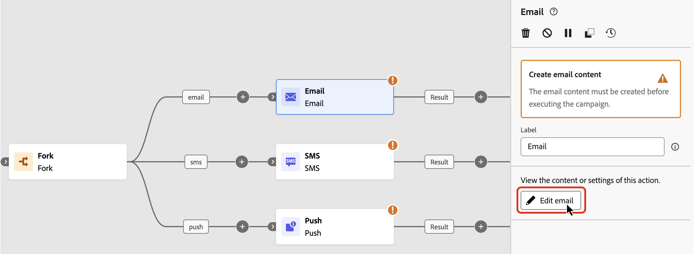

# Attività di canale {#channel}

>[!CONTEXTUALHELP]
>id="ajo_orchestration_email"
>title="Attività e-mail"
>abstract="L’attività E-mail ti consente di inviare e-mail all’interno della campagna orchestrata, sia per i messaggi singoli che ricorrenti. Consente di automatizzare il processo di invio di e-mail a una destinazione calcolata all’interno della stessa campagna orchestrata. È possibile combinare le attività del canale nell’area di lavoro di una campagna multifase per creare campagne cross-channel in grado di attivare azioni basate sui dati e sul comportamento della clientela."

>[!CONTEXTUALHELP]
>id="ajo_orchestration_sms"
>title="Attività SMS"
>abstract="L’attività SMS consente l’invio di SMS all’interno della campagna orchestrata, sia per i messaggi singoli che ricorrenti. Consente di automatizzare il processo di invio di SMS a una destinazione calcolata all’interno della stessa campagna orchestrata. È possibile combinare le attività del canale nell’area di lavoro della campagna multifase per creare campagne cross-channel in grado di attivare azioni basate sui dati e sul comportamento della clientela."

>[!CONTEXTUALHELP]
>id="ajo_orchestration_push"
>title="Attività push"
>abstract="L’attività push ti consente di inviare notifiche push come parte della campagna orchestrata. Consente la consegna di campagne orchestrate, sia singole che ricorrenti, automatizzando l’invio di notifiche push a una destinazione predefinita all’interno della stessa campagna orchestrata. È possibile combinare le attività del canale nell’area di lavoro della campagna per creare campagne cross-channel in grado di attivare azioni basate sui dati e sul comportamento della clientela."

<!--
UNUSED IDs in BJ

>[!CONTEXTUALHELP]
>id="ajo_orchestration_push_ios"
>title="Push iOS activity"
>abstract="The Push iOS activity let you send iOS Push notifications as part of your orchestrated campaign. It enables the delivery of both one-time and recurring orchestrated campaigns, automating the sending iOS Push notifications to a predefined target within the same workflow. You can combine channel activities into the campaign canvas to create cross-channel campaigns that can trigger actions based on customer behavior and data."

>[!CONTEXTUALHELP]
>id="ajo_orchestration_push_android"
>title="Push Android activity"
>abstract="The Push Android activity ket you send Android Push notifications as part of your orchestrated campaign. It enables the delivery of both one-time and recurring messages, automating the sending Android Push notifications to a predefined target within the same orchestrated campaign. You can combine channel activities into the orchestrated campaign canvas to create cross-channel campaigns that can trigger actions based on customer behavior and data."

-->

>[!CONTEXTUALHELP]
>id="ajo_orchestration_directmail"
>title="Attività direct mail"
>abstract="L’attività direct mail facilita l’invio con direct mail all’interno della campagna orchestrata, sia per messaggi singoli che ricorrenti. Consente di automatizzare il processo di generazione del file di estrazione richiesto dai provider di direct mail. È possibile combinare le attività del canale nell’area di lavoro della campagna orchestrata per creare campagne cross-channel in grado di attivare azioni basate sui dati e sul comportamento della clientela."

+++ Sommario

| Benvenuto in campagne orchestrate | Lanciare la prima campagna orchestrata | Eseguire query sul database | Attività di campagne orchestrate |
|---|---|---|---|
| [Introduzione alle campagne orchestrate](../gs-orchestrated-campaigns.md)  [Passaggi di configurazione](../configuration-steps.md)  [Accedere e gestire le campagne orchestrate](../access-manage-orchestrated-campaigns.md) | [Passaggi chiave per creare una campagna orchestrata](../gs-campaign-creation.md)  [Creare e pianificare la campagna](../create-orchestrated-campaign.md)  [Orchestrare le attività](../orchestrate-activities.md)  [Avviare e monitorare la campagna](../start-monitor-campaigns.md)  [Generazione rapporti](../reporting-campaigns.md) | [Utilizzare il generatore di regole](../orchestrated-rule-builder.md)  [Creare la prima query](../build-query.md)  [Modificare le espressioni](../edit-expressions.md)  [Retargeting](../retarget.md) | [Inizia a usare le attività](about-activities.md)  Attività: [Partecipa e unisci](and-join.md) - [Genera pubblico](build-audience.md) - [Modifica dimensione](change-dimension.md) - <b>[Attività canale](channels.md)</b> - [Combina](combine.md) - [Deduplicazione](deduplication.md) - [Arricchimento](enrichment.md) - [Fork](fork.md) - [Riconciliazione](reconciliation.md) - [Salva pubblico](save-audience.md) - [Dividi](split.md) - [Attendi](wait.md) |

{style="table-layout:fixed"}

+++

 

[!DNL Adobe Journey Optimizer] ti consente di automatizzare ed eseguire campagne di marketing su più canali: e-mail, SMS e notifiche push. Puoi combinare queste attività di canale nell’area di lavoro della campagna per creare campagne orchestrate cross-channel che possono attivare azioni in base al comportamento dei clienti e ai dati.

Ad esempio:
* Invia una serie di benvenuto tramite e-mail, SMS e push.
* Consegna un’e-mail di follow-up dopo l’acquisto.
* Invia messaggi di auguri di compleanno personalizzati tramite SMS.

Utilizzando le attività dei canali, puoi creare campagne complete e personalizzate che coinvolgono la clientela su più punti di contatto e danno impulso alle conversioni.

>[!PREREQUISITES]
>
>Prima di aggiungere un&#39;attività di canale, definisci il pubblico di destinazione utilizzando un&#39;[Attività di generazione del pubblico](build-audience.md).

## Aggiungere un’attività di canale e definirne le proprietà {#add}

1. Aggiungi un’attività di canale nell’area di lavoro. Le attività del canale disponibili sono **[!UICONTROL E-mail]**, **[!UICONTROL SMS]** e **[!UICONTROL Push]**.

   

1. Seleziona l&#39;attività e fai clic su **[!UICONTROL Modifica e-mail]**, **[!UICONTROL Modifica SMS]** o **[!UICONTROL Modifica push]** a seconda del canale scelto.

   

1. Nella scheda **[!UICONTROL Proprietà]**, immetti una descrizione, quindi passa alla scheda **[!UICONTROL Azioni]** per configurare l&#39;attività.

## Configurazione e impostazioni del canale {#configuration}

Utilizza la scheda **[!UICONTROL Azioni]** per selezionare una configurazione di canale per il messaggio e configurare impostazioni aggiuntive, ad esempio il tracciamento, l&#39;esperimento sul contenuto o il contenuto multilingue.

1. Seleziona una configurazione di canale.

   Configurazione definita da un [amministratore di sistema](../../start/path/administrator.md). Contiene tutti i parametri tecnici per l’invio del messaggio, ad esempio parametri di intestazione, sottodominio, app mobili e così via. [Scopri come impostare le configurazioni dei canali](../../configuration/channel-surfaces.md).

   

1. Tracciare il coinvolgimento (per e-mail e SMS).

   Utilizza la sezione **[!UICONTROL Tracciamento delle azioni]** per tenere traccia di come i destinatari reagiscono alle consegne e-mail o SMS. I risultati del tracciamento sono accessibili dal rapporto della campagna una volta eseguita la campagna. [Ulteriori informazioni sui report delle campagne](../../reports/campaign-global-report-cja.md)

1. Abilita la modalità Consegna rapida (per push).

   La modalità Consegna rapida è un componente aggiuntivo [!DNL Journey Optimizer] che consente l&#39;invio molto rapido di messaggi push in volumi elevati tramite campagne. La consegna rapida viene utilizzata quando il ritardo nella consegna dei messaggi è di importanza critica per l’azienda, quando si desidera inviare un avviso push urgente sui telefoni cellulari, ad esempio una notizia straordinaria agli utenti che hanno installato la tua app per il canale news. Per ulteriori informazioni sulle prestazioni quando si utilizza la modalità Consegna rapida, consultare [Descrizione del prodotto Adobe Journey Optimizer](https://helpx.adobe.com/it/legal/product-descriptions/adobe-journey-optimizer.html).

1. Crea un esperimento sui contenuti.

   Utilizza la sezione **[!UICONTROL Esperimento sui contenuti]** per definire più trattamenti di consegna e misurare quale offre le migliori prestazioni per il tuo pubblico di destinazione. Fai clic sul pulsante **[!UICONTROL Crea esperimento]**, quindi segui i passaggi descritti in questa sezione: [Crea un esperimento sui contenuti](../../content-management/content-experiment.md).

1. Aggiungere contenuto multilingue.

   Utilizza la sezione **[!UICONTROL Lingue]** per creare contenuti in più lingue all&#39;interno della campagna. A tale scopo, fare clic sul pulsante **[!UICONTROL Aggiungi lingue]** e selezionare le **[!UICONTROL impostazioni lingua]** desiderate. Informazioni dettagliate su come impostare e utilizzare le funzionalità multilingue sono disponibili in questa sezione: [Introduzione ai contenuti multilingue](../../content-management/multilingual-gs.md)

   

Una volta configurata l&#39;attività del canale, seleziona la scheda **[!UICONTROL Contenuto]** per definirne il contenuto.

## Definire il contenuto {#content}

Passa alla scheda **[!UICONTROL Contenuto]** per creare il messaggio. Il processo dei passaggi varia in base al canale selezionato. Scopri i passaggi dettagliati per creare il contenuto del messaggio nelle pagine seguenti.

<table style="table-layout:fixed"><tr style="border: 0; text-align: center;" >
<td> <a href="../../email/create-email.md"><strong>Creare un messaggio e-mail</strong></a></td>
<td> <a href="../../sms/create-sms.md"><strong>Creare un SMS</strong></a></td>
<td><a href="../../push/create-push.md"><strong>Creare una notifica push</strong></a></td>
</tr></table>

Una volta creato il contenuto, utilizza il pulsante **[!UICONTROL Simula contenuto]** per visualizzare in anteprima e verificare il contenuto con profili di test o dati di input di esempio caricati da un file CSV/JSON, oppure aggiunti manualmente. [Ulteriori informazioni](../../content-management/preview-test.md)

## Passaggi successivi {#next}

Quando il contenuto del messaggio è pronto, torna alla campagna orchestrata utilizzando la freccia **[!UICONTROL Indietro]**. Puoi quindi completare l’orchestrazione delle attività nell’area di lavoro e pubblicare la campagna per avviare l’invio dei messaggi. [Scopri come avviare e monitorare le campagne orchestrate](../start-monitor-campaigns.md)

<!--
## Examples {#cross-channel-workflow-sample}

Here is a cross-channel orchestrated campaign example with a segmentation and two deliveries. The orchestrated campaign targets all customers who live in Paris and who are interested in coffee machines. Among this population, an email is sent to the regular customers and an SMS is sent to the VIP clients.

<!--
description, which use case you can perform (common other activities that you can link before of after the activity)

how to add and configure the activity

example of a configured activity within a workflow
The Email delivery activity allows you to configure the sending an email in a workflow. 

-->

<!--You can also create a recurring orchestrated campaign to send a personalized SMS every first day of the month at 8 PM to all customers living in Paris.

-->

<!-- Scheduled emails available?

This can be a single send email and sent just once, or it can be a recurring email.
* Single send emails are standard emails, sent once.
* Recurring emails allow you to send the same email multiple times to different targets over a defined period. You can aggregate the deliveries per period in order to get reports that correspond to your needs.

When linked to a scheduler, you can define recurring emails.
Email recipients are defined upstream of the activity in the same workflow, via an Audience targeting activity.

-->

<!--The message preparation is triggered according to the workflow execution parameters. From the message dashboard, you can select whether to request or not a manual confirmation to send the message (required by default). You can start the workflow manually or place a scheduler activity in the workflow to automate execution.-->
