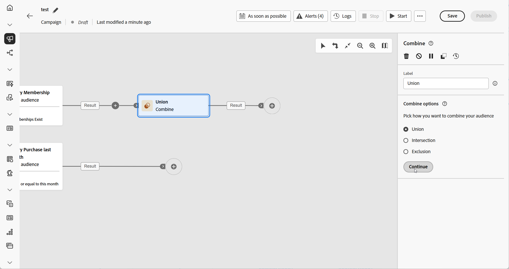
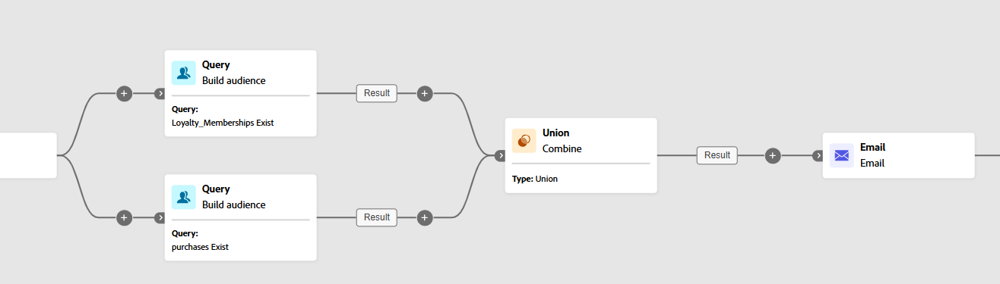
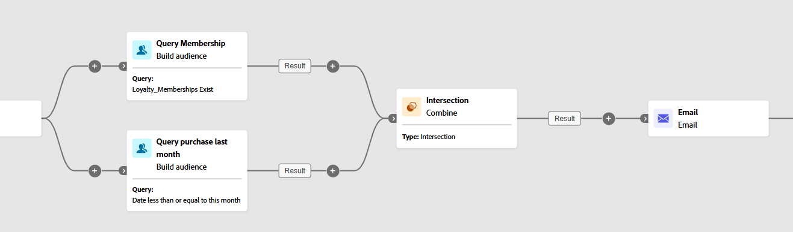
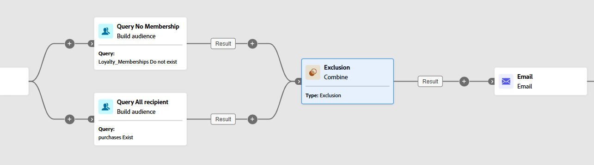

# Combina {#combine}

>[!CONTEXTUALHELP]
>id="ajo_orchestration_combine"
>title="Combina attività"
>abstract="L&#39;attività **Combine** ti consente di eseguire la segmentazione del gruppo in entrata. Puoi quindi combinare più popolazioni, escluderne parte o mantenere i dati comuni a più destinazioni."

L&#39;attività **[!UICONTROL Combine]** è un tipo di attività **[!UICONTROL Targeting]** che consente di segmentare in modo efficace il gruppo in entrata. Consente di unire più popolazioni, escludere segmenti specifici o mantenere solo i dati condivisi tra più destinazioni.

Sono disponibili le seguenti opzioni di segmentazione:

* **[!UICONTROL Unione]**: unisce i risultati di più attività in un&#39;unica destinazione unificata.

* **[!UICONTROL Intersezione]**: conserva solo gli elementi comuni a tutte le popolazioni in entrata.

* **[!UICONTROL Esclusione]**: rimuove elementi da un gruppo in base a criteri specificati.

## Configurare l’attività Combina {#combine-configuration}

>[!CONTEXTUALHELP]
>id="ajo_orchestration_intersection_merging_options"
>title="Opzioni di unione intersezione"
>abstract="L’intersezione ti consente di mantenere solo gli elementi comuni alle diverse popolazioni in entrata nell’attività. Nella sezione Imposta per il join selezionare tutte le attività precedenti a cui si desidera partecipare."

>[!CONTEXTUALHELP]
>id="ajo_orchestration_exclusion_merging_options"
>title="Opzioni di unione esclusione"
>abstract="L’esclusione ti consente di escludere elementi da una popolazione in base a determinati criteri. Nella sezione Imposta per il join selezionare tutte le attività precedenti a cui si desidera partecipare."

>[!CONTEXTUALHELP]
>id="ajo_orchestration_combine_options"
>title="Seleziona il tipo di segmentazione"
>abstract="Seleziona come combinare i tipi di pubblico. L&#39;**Unione** ti consente di raggruppare il risultato di più attività in un&#39;unica destinazione. L&#39;**intersezione** ti consente di mantenere solo gli elementi comuni alle diverse popolazioni in entrata nell&#39;attività. La **esclusione** ti consente di escludere elementi da una popolazione in base a determinati criteri. "

Segui questi passaggi comuni per iniziare a configurare l&#39;attività **[!UICONTROL Combina]**:

1. Aggiungi più attività, ad esempio **[!UICONTROL Genera pubblico]** per formare almeno due rami di esecuzione diversi.
1. Aggiungi un&#39;attività **[!UICONTROL Combina]** a uno qualsiasi dei rami precedenti.
1. Seleziona il tipo di segmentazione: [unione](#union), [intersezione](#intersection) o [esclusione](#exclusion).
1. Fai clic su **[!UICONTROL Continua]**.
1. Nella sezione **[!UICONTROL Imposta per partecipare]**, controlla tutte le attività precedenti a cui desideri partecipare.

## Union {#combine-union}

>[!CONTEXTUALHELP]
>id="ajo_orchestration_combine_reconciliation"
>title="Opzioni di riconciliazione"
>abstract="Selezionare il tipo di **riconciliazione** per definire la modalità di gestione dei duplicati. Per impostazione predefinita, l&#39;opzione **Chiavi** è attivata, il che significa che l&#39;attività mantiene un solo elemento quando gli elementi delle diverse transizioni in entrata hanno la stessa chiave. Utilizza l&#39;opzione **Selezione di colonne** per definire l&#39;elenco di colonne alle quali viene applicata la riconciliazione dei dati."

All&#39;interno dell&#39;attività **[!UICONTROL Combine]**, è possibile configurare un **[!UICONTROL Union]** selezionando un **[!UICONTROL Tipo di riconciliazione]** per determinare la modalità di gestione dei record duplicati:

* **[!UICONTROL Solo chiavi]** (impostazione predefinita): mantiene un singolo record quando più transizioni in entrata condividono la stessa chiave. Questa opzione è applicabile solo quando le popolazioni in entrata sono omogenee.

* **[!UICONTROL Selezione di colonne]**: consente di specificare quali colonne vengono utilizzate per la riconciliazione dei dati. Selezionare **[!UICONTROL Aggiungi attributo]**.

Nell&#39;esempio seguente viene utilizzata un&#39;attività **[!UICONTROL Combine]** con un **[!UICONTROL Union]** per unire i risultati di due query, **Membri fedeltà** e **Acquirenti**, in un unico pubblico più grande che include tutti i profili di entrambi i segmenti.

## Intersezione {#combine-intersection}

>[!CONTEXTUALHELP]
>id="ajo_orchestration_intersection_reconciliation_options"
>title="Opzioni di riconciliazione intersezione"
>abstract="Selezionare il tipo di **riconciliazione** per definire la modalità di gestione dei duplicati. Per impostazione predefinita, l&#39;opzione **Chiavi** è attivata, il che significa che l&#39;attività mantiene un solo elemento quando gli elementi delle diverse transizioni in entrata hanno la stessa chiave. Utilizza l&#39;opzione **Selezione di colonne** per definire l&#39;elenco di colonne alle quali viene applicata la riconciliazione dei dati."

Nell&#39;attività **[!UICONTROL Combina]** è possibile configurare un&#39;intersezione **&#x200B;**. A questo scopo, segui i passaggi aggiuntivi riportati di seguito:

1. Selezionare il tipo di **[!UICONTROL riconciliazione]** per definire la modalità di gestione dei duplicati:

   * **[!UICONTROL Solo chiavi]** (impostazione predefinita): mantiene un singolo record quando più transizioni in entrata condividono la stessa chiave. Questa opzione è applicabile solo quando le popolazioni in entrata sono omogenee.

   * **[!UICONTROL Selezione di colonne]**: consente di specificare quali colonne vengono utilizzate per la riconciliazione dei dati. Selezionare **[!UICONTROL Aggiungi attributo]**.

1. Abilitare **[!UICONTROL Genera completamento]** se si desidera elaborare il gruppo rimanente. Il complemento contiene l’unione di tutti i risultati dell’attività in entrata, esclusa l’intersezione. All’attività viene aggiunta un’ulteriore transizione in uscita.

L&#39;esempio seguente illustra l&#39;utilizzo dell&#39;**[!UICONTROL intersezione]** tra due attività di query. Viene utilizzato per identificare i profili che sono **membri fedeltà** e che hanno effettuato un acquisto nell&#39;ultimo mese.

## Esclusione {#combine-exclusion}

>[!CONTEXTUALHELP]
>id="ajo_orchestration_exclusion_options"
>title="Regole di esclusione"
>abstract="Se necessario, è possibile modificare le tabelle in entrata. In effetti, per escludere un target da un’altra dimensione, tale target deve essere riportato alla stessa dimensione di targeting del target principale. A questo scopo, fai clic su Aggiungi una regola nella sezione Regole di esclusione e specifica le condizioni di modifica della dimensione. La riconciliazione dei dati viene eseguita tramite un attributo o un join."

>[!CONTEXTUALHELP]
>id="ajo_orchestration_combine_sets"
>title="Seleziona i set da combinare"
>abstract="Nella sezione **Set da unire**, selezionare il **Set primario** dalle transizioni in entrata. Questo è il set da cui gli elementi vengono esclusi. Gli altri set corrispondono agli elementi prima di essere esclusi dal set principale."

>[!CONTEXTUALHELP]
>id="ajo_orchestration_combine_exclusion"
>title="Regole di esclusione"
>abstract="Se necessario, è possibile modificare le tabelle in entrata. In effetti, per escludere un target da un’altra dimensione, tale target deve essere riportato alla stessa dimensione di targeting del target principale. A questo scopo, fai clic su Aggiungi una regola nella sezione Regole di esclusione e specifica le condizioni di modifica della dimensione. La riconciliazione dei dati viene eseguita tramite un attributo o un join."

>[!CONTEXTUALHELP]
>id="ajo_orchestration_combine_complement"
>title="Combina genera complemento"
>abstract="Attiva l’opzione Genera complemento per elaborare la popolazione rimanente in una transizione aggiuntiva."

Nell&#39;attività **[!UICONTROL Combina]**, puoi configurare un&#39;esclusione **&#x200B;**. A questo scopo, segui i passaggi aggiuntivi riportati di seguito:

1. Nella sezione **[!UICONTROL Set da unire]**, scegliere il **[!UICONTROL Set primario]**, che rappresenta il gruppo principale. I record trovati negli altri set sono esclusi da questo set principale.

1. Se necessario, puoi regolare le tabelle in entrata per allineare i target da dimensioni diverse. Per escludere un target da un’altra dimensione, è necessario innanzitutto inserirlo nella stessa dimensione di targeting della popolazione principale. A tale scopo, fare clic su **[!UICONTROL Aggiungi una regola]** e definire le condizioni per la modifica della dimensione. La riconciliazione viene quindi eseguita utilizzando un attributo o un join.

1. Abilitare **[!UICONTROL Genera completamento]** se si desidera elaborare il gruppo rimanente. Il complemento contiene l’unione di tutti i risultati dell’attività in entrata, esclusa l’intersezione. All’attività viene aggiunta un’ulteriore transizione in uscita.

L&#39;esempio di **[!UICONTROL esclusione]** seguente mostra due query configurate per filtrare i profili che hanno acquistato un prodotto. I profili che non hanno un’iscrizione fedeltà vengono quindi esclusi dal primo set.

