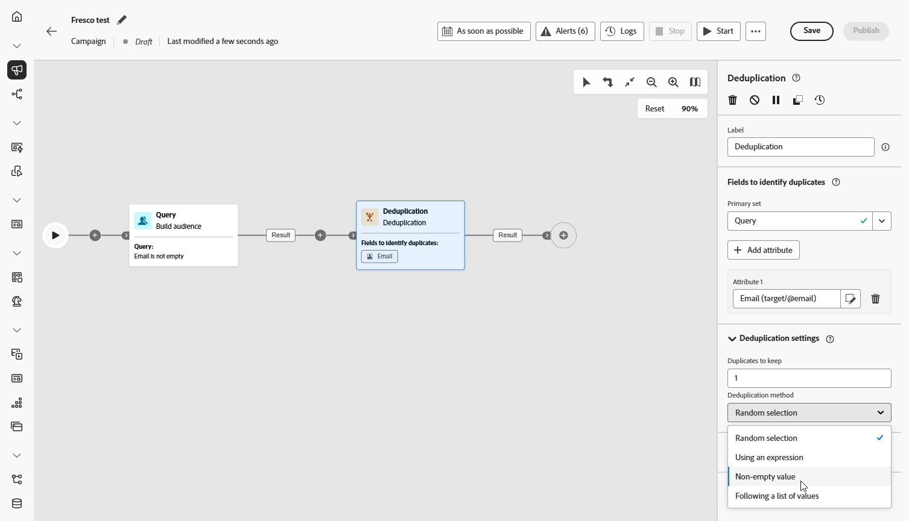

# Deduplica {#deduplication}

>[!CONTEXTUALHELP]
>id="ajo_orchestration_deduplication_fields"
>title="Campi per identificare i duplicati"
>abstract="Nella sezione **Campi per identificare i duplicati** , fai clic sul pulsante **Aggiungi attributo** per specificare i campi per i quali i valori identici consentono l’identificazione dei duplicati, ad esempio: indirizzo e-mail, nome, cognome e così via. L’ordine dei campi consente di specificare quali elaborare per primi."

>[!CONTEXTUALHELP]
>id="ajo_orchestration_deduplication"
>title="Attività Deduplica"
>abstract="L’attività **Deduplica** consente di eliminare i duplicati nei risultati delle attività in entrata. Viene utilizzato principalmente dopo le attività di targeting e prima delle attività che consentono l’utilizzo di dati mirati."

>[!CONTEXTUALHELP]
>id="ajo_orchestration_deduplication_complement"
>title="Generare un complemento"
>abstract="Puoi generare una transizione in uscita aggiuntiva con la popolazione rimanente, che è stata esclusa come duplicato. A tale scopo, attiva l’opzione **Genera complemento**"

>[!CONTEXTUALHELP]
>id="ajo_orchestration_deduplication_settings"
>title="Impostazioni di deduplica"
>abstract="Per eliminare i duplicati nei dati in arrivo, definisci il metodo di deduplica nei campi seguenti. Per impostazione predefinita, viene mantenuto un solo record. Devi anche selezionare la modalità di deduplica in base a un’espressione o a un attributo. Per impostazione predefinita, il record da escludere dai duplicati viene selezionato in modo casuale."

+++ Sommario

| Benvenuto in campagne orchestrate | Lanciare la prima campagna orchestrata | Eseguire query sul database | Attività di campagne orchestrate |
|---|---|---|---|
| [Introduzione alle campagne orchestrate](../gs-orchestrated-campaigns.md)  [Passaggi di configurazione](../configuration-steps.md)  [Accedere e gestire le campagne orchestrate](../access-manage-orchestrated-campaigns.md) | [Passaggi chiave per creare una campagna orchestrata](../gs-campaign-creation.md)  [Creare e pianificare la campagna](../create-orchestrated-campaign.md)  [Orchestrare le attività](../orchestrate-activities.md)  [Avviare e monitorare la campagna](../start-monitor-campaigns.md)  [Generazione rapporti](../reporting-campaigns.md) | [Utilizzare il generatore di regole](../orchestrated-rule-builder.md)  [Creare la prima query](../build-query.md)  [Modificare le espressioni](../edit-expressions.md)  [Retargeting](../retarget.md) | [Inizia a usare le attività](about-activities.md)  Attività: [Partecipa e unisci](and-join.md) - [Genera pubblico](build-audience.md) - [Modifica dimensione](change-dimension.md) - [Attività canale](channels.md) - [Combina](combine.md) - <b>[Deduplicazione](deduplication.md)</b> - [Arricchimento](enrichment.md) - [Fork](fork.md) - [Riconciliazione](reconciliation.md) - [Salva pubblico](save-audience.md) - [Dividi](split.md) - [Attendi](wait.md) |

{style="table-layout:fixed"}

+++

 

L’attività **[!UICONTROL Deduplica]** è un’attività di **[!UICONTROL targeting]**. Questa attività consente di eliminare i duplicati nei risultati delle attività in entrata, ad esempio i profili duplicati nell’elenco dei destinatari. L’attività **[!UICONTROL Deduplica]** viene generalmente utilizzata dopo le attività di targeting e prima delle attività che consentono l’utilizzo di dati mirati.

## Configurare l’attività Deduplica{#deduplication-configuration}

Per configurare l’attività **[!UICONTROL Deduplica]** segui questi passaggi:

1. Aggiungi un&#39;attività **[!UICONTROL Deduplicazione]** alla campagna orchestrata.

1. Nella sezione **[!UICONTROL Campi per identificare i duplicati]** , fai clic sul pulsante **[!UICONTROL Aggiungi attributo]** per specificare i campi per i quali i valori identici consentono l’identificazione dei duplicati, ad esempio: indirizzo e-mail, nome, cognome e così via. L’ordine dei campi consente di specificare quali elaborare per primi.

   

1. Nella sezione **[!UICONTROL Impostazioni deduplicazione]**, scegli il numero di record univoci da continuare a utilizzare il campo Duplicati da mantenere. Il valore predefinito è 1, che mantiene un record per gruppo duplicato. Impostatelo su 0 per mantenere tutti i duplicati.

   Ad esempio, se i record A e B sono duplicati di Y e il record C è un duplicato di Z:

   * **Se il valore del campo è 1**: vengono conservati solo i record Y e Z.
   * **Se il valore del campo è 0**: vengono conservati tutti i record (A, B, C, Y, Z).
   * **Se il valore del campo è 2**: vengono mantenuti C e Z, più due valori da A, B e Y, in modo casuale o in base al metodo di deduplicazione utilizzato.

1. Scegli un **[!UICONTROL metodo di deduplicazione]**, che definisce il modo in cui il sistema decide quali record mantenere da ogni gruppo di duplicati:

   * **[!UICONTROL Selezione casuale]**: seleziona casualmente il record da escludere dai duplicati.
   * **[!UICONTROL Utilizzo di un&#39;espressione]**: mantiene i record con il valore più alto o più basso in base a un&#39;espressione definita dall&#39;utente.
   * **[!UICONTROL Valori non vuoti]**: mantiene i record in cui il campo selezionato non è vuoto, ad esempio conserva solo i profili con un numero di telefono.
   * **[!UICONTROL Seguendo un elenco di valori]**: consente di assegnare priorità a valori specifici per uno o più campi. È ad esempio possibile assegnare priorità ai record con &quot;Paese&quot; impostato su Francia. Fare clic su **[!UICONTROL Attributo]** per scegliere un campo o creare un&#39;espressione personalizzata. Utilizza il **[!UICONTROL pulsante Aggiungi]** per immettere i valori preferiti nell&#39;ordine di priorità.

   

1. Se desideri sfruttare la popolazione rimanente, seleziona l’opzione **[!UICONTROL Genera complemento]**. Il complemento è costituito da tutti i duplicati. Verrà quindi aggiunta all’attività un’ulteriore transizione.

## Esempio{#deduplication-example}

Nell&#39;esempio seguente viene utilizzata un&#39;attività **[!UICONTROL Deduplication]** per rimuovere i record duplicati dal pubblico di destinazione prima di inviare una consegna. Il pubblico viene innanzitutto filtrato in modo da includere solo i profili con un campo E-mail non vuoto. L&#39;attività **[!UICONTROL Deduplication]** utilizza quindi l&#39;indirizzo e-mail per identificare ed escludere i duplicati.

