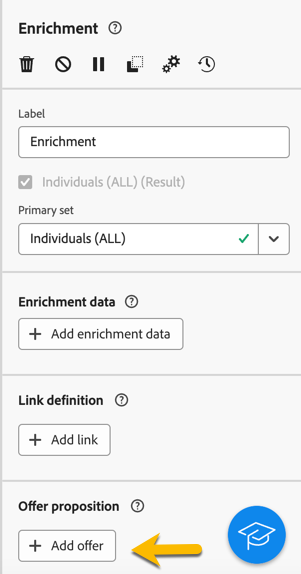

# Arricchimento {#enrichment}

>[!CONTEXTUALHELP]
>id="ajo_orchestration_enrichment"
>title="Attività Arricchimento"
>abstract="L’attività di **Arricchimento** consente di migliorare i dati mirati con informazioni aggiuntive provenienti dal database. Viene comunemente utilizzata in un flusso di lavoro dopo le attività di segmentazione."

+++ Sommario

| Benvenuto in campagne orchestrate | Lanciare la prima campagna orchestrata | Eseguire query sul database | Attività di campagne orchestrate |
|---|---|---|---|
| [Introduzione alle campagne orchestrate](../gs-orchestrated-campaigns.md)  [Passaggi di configurazione](../configuration-steps.md)  [Passaggi chiave per la creazione di campagne orchestrate](../gs-campaign-creation.md) | [Creare una campagna orchestrata](../create-orchestrated-campaign.md)  [Orchestrare le attività](../orchestrate-activities.md)   [Avviare e monitorare la campagna](../start-monitor-campaigns.md)  [Generazione rapporti](../reporting-campaigns.md) | [Utilizzare Query Modeler](../orchestrated-rule-builder.md)  [Creare la prima query](../build-query.md)  [Modificare le espressioni](../edit-expressions.md) | [Inizia a usare le attività](about-activities.md)  Attività: [Partecipa e unisci](and-join.md) - [Genera pubblico](build-audience.md) - [Modifica dimensione](change-dimension.md) - [Attività canale](channels.md) - [Combina](combine.md) - [Deduplicazione](deduplication.md) - [Arricchimento](enrichment.md) - [Fork](fork.md) - [Riconciliazione](reconciliation.md) - [Dividi](split.md) - [Attendi](wait.md) |

{style="table-layout:fixed"}

+++

 

L&#39;attività **[!UICONTROL Enrichment]** è un&#39;attività **[!UICONTROL Targeting]** che consente di migliorare i dati del pubblico con attributi aggiuntivi.

Puoi sfruttare queste informazioni per segmentare il pubblico in modo più preciso, in base a comportamenti, preferenze o esigenze, e per creare messaggi personalizzati che si connettano meglio con ciascun profilo.

## Aggiungere un’attività Arricchimento {#enrichment-configuration}

>[!CONTEXTUALHELP]
>id="ajo_targetdata_personalization_enrichmentdata"
>title="Dati di arricchimento"
>abstract="Seleziona i dati da utilizzare per arricchire la campagna orchestrata. Puoi selezionare due tipi di dati di arricchimento: un attributo di arricchimento singolo dalla dimensione di destinazione oppure un collegamento di raccolta, ossia un collegamento con cardinalità 1-N tra più tabelle."

>[!CONTEXTUALHELP]
>id="ajo_orchestration_enrichment_data"
>title="Attività Arricchimento"
>abstract="Una volta aggiunti alla campagna orchestrata, i dati di arricchimento possono essere utilizzati nelle attività aggiunte dopo l’attività di Arricchimento per segmentare la clientela in gruppi distinti in base a comportamenti, preferenze ed esigenze, o per creare messaggi e campagne di marketing personalizzati che hanno più probabilità di suscitare l’interesse del pubblico target."

Per configurare l’attività **Arricchimento** segui questi passaggi:

1. Aggiungi un’attività **Arricchimento**.

1. Fare clic su **Aggiungi dati di arricchimento** e selezionare l&#39;attributo da utilizzare per arricchire i dati.

   Puoi selezionare due tipi di dati di arricchimento: un singolo attributo di arricchimento dalla dimensione di destinazione o un collegamento di raccolta. Ciascuno di questi tipi è descritto negli esempi seguenti:

   * [Attributo di arricchimento singolo](#single-attribute)
   * [Collegamento di raccolta](#collection-link)

   

## Esempi {#example}

### Attributo di arricchimento singolo {#single-attribute}

In questo esempio, arricchisci il pubblico con un singolo attributo, ad esempio la data di nascita, dalla dimensione di targeting corrente.

Per eseguire questa operazione:

1. Fai clic su **[!UICONTROL Aggiungi dati di arricchimento]**.

1. Selezionare un campo semplice, ad esempio **[!UICONTROL Data di nascita]**, dalla dimensione corrente.

   

1. Fai clic su **[!UICONTROL Conferma]**.

### Collegamento di raccolta {#collection-link}

Questo caso d’uso arricchisce il pubblico con i dati di una tabella collegata. Ad esempio, desideri recuperare i tre acquisti più recenti di valore inferiore a 100 $.

Per ottenere questo risultato, configura l’arricchimento come segue:

* **Attributo di arricchimento**: **[!UICONTROL Prezzo]**

* **Numero di record da recuperare**: 3

* **Filtro**: includere solo gli acquisti il cui **[!UICONTROL prezzo]** è inferiore a $100

#### Aggiungere l’attributo {#add-attribute}

Innanzitutto, seleziona il collegamento della raccolta che contiene i dati che desideri arricchire.

1. Fai clic su **[!UICONTROL Aggiungi dati di arricchimento]**.

1. Dalla tabella **[!UICONTROL Acquisti]**, selezionare il campo **[!UICONTROL Prezzo]**.

   

#### Definire le impostazioni di raccolta{#collection-settings}

Quindi, configura come devono essere raccolti i dati e quante voci includere.

1. Nel menu a discesa **[!UICONTROL Seleziona la modalità di raccolta dei dati]**, scegli **[!UICONTROL Raccolta dati]**.

   

1. Nel campo **[!UICONTROL Righe da recuperare (Colonne da creare)]**, immettere `3`.

1. Per eseguire un&#39;aggregazione (ad esempio, importo medio di acquisto), selezionare **[!UICONTROL Dati aggregati]**, quindi scegliere **[!UICONTROL Media]** dal menu a discesa **[!UICONTROL Funzione di aggregazione]**.

   

1. Utilizza i campi **[!UICONTROL Etichetta]** e **[!UICONTROL Alias]** per facilitare l&#39;identificazione degli attributi arricchiti nelle attività successive.

#### Definire i filtri{#collection-filters}

Infine, applica i filtri per garantire che siano inclusi solo i record rilevanti:

1. Fai clic su **[!UICONTROL Crea filtri]**.

1. Aggiungi queste due condizioni:

   * **[!UICONTROL Il prezzo]** esiste (per escludere i valori NULL)

   * **[!UICONTROL Il prezzo]** è inferiore a 100

   

1. Fai clic su **[!UICONTROL Conferma]**.

<!--
#### Define the sorting{#collection-sorting}

We now need to apply sorting in order to retrieve the three **latest** purchases.

1. Activate the **Enable sorting** option.
1. Click inside the **Attribute** field.
1. Select the **Order date** field.
1. Click **Confirm**. 
1. Select **Descending** from the **Sort** drop-down.

## Data reconciliation {#reconciliation}

>[!CONTEXTUALHELP]
>id="ajo_orchestration_enrichment_reconciliation"
>title="Reconciliation"
>abstract="The **Enrichment** activity can be used to reconcile data from the Journey Optimizer schema with data from another schema, or with data coming from a temporary schema such as data uploaded using a Load file activity. This type of link defines a reconciliation towards a unique record. Journey Optimizer creates a link to a target table by adding a foreign key in it for storing a reference to the unique record."

The **Enrichment** activity can be used to reconcile data from the the Campaign database schema with data from another schema, or with data coming from a temporary schema such as data uploaded using a Load file activity. This type of link defines a reconciliation towards a unique record. Journey Optimizer creates a link to a target table by adding a foreign key in it for storing a reference to the unique record.

For example, you can use this option to reconcile a profile's country, specified in an uploaded file, with one of the countries available in the dedicated table of the Campaign database. 

Follow the steps to configure an **Enrichment** activity with a reconciliation link: 

1. Click the **Add link** button in the **Reconciliation** section.
1. Identify the data you want to create a reconciliation link with.

    * To create a reconciliation link with data from the Campaign database, select **Database schema** and choose the schema where the target is stored. 
    * To create a reconciliation link with data coming from the input transition, select **Temporary schema** and choose the orchestrated campaign transition where the target data is stored. 

1. The **Label** and **Name** fields are automatically populated based on the selected target schema. You can change their values if necessary.

1. In the **Reconciliation criteria** section, specify how you want to reconcile data from the source and destination tables:

    * **Simple join**: Reconcile a specific field from the source table with another field in the destination table. To do this, click the **Add join** button and specify the **Source** and **Destination** fields to use for the reconciliation.

        >[!NOTE]
        >
        >You can use one or more **Simple join** criteria, in which case they must all be verified so that the data can be linked together.

    * **Advanced join**: Use the query modeler to configure the reconciliation criteria. To do this, click the **Create condition** button then define your reconciliation criteria by building your own rule using AND and OR operations.

The example below shows an orchestrated campaign configured to create a link between Journey Optimizer profiles table and a temporary table generated a **Load file** activity. In this example, the **Enrichment** activity reconciliates both tables using the email address as reconciliation criteria.

### Enrichment with linked data {#link-example}

The example below shows an orchestrated campaign configured to create a link between two transitions. The first transitions targets profile data using a **Query** activity, while the second transition includes purchase data stored into a file loaded through a Load file activity.

* The first **Enrichment** activity links the primary set (data from the **Query** activity) with the schema from the **Load file** activity. This allows us to match each profile targeted by the query with the corresponding purchase data.

    

* A second **Enrichment** activity is added in order to enrich data from the orchestrated campaign table with the purchase data coming from the **Load file** activity. This allows us to use those data in further activities, for example, to personalize messages sent to the customers with information on their purchase.

    

## Create links between tables {#create-links}

>[!CONTEXTUALHELP]
>id="ajo_orchestration_enrichment_simplejoin"
>title="Link definition"
>abstract="Create a link between the working table data and Adobe Journey Optimizer. For example, if you load data from a file which contains the account number, country and email of recipients, you have to create a link towards the country table in order to update this information in their profiles."

The **[!UICONTROL Link definition]** section allows you to create a link between the working table data and Adobe Journey Optimizer. For example, if you load data from a file which contains the account number, country and email of recipients, you have to create a link towards the country table in order to update this information in their profiles.

There are several types of links available:

* **[!UICONTROL 1 cardinality simple link]**: Each record from the primary set can be associated with one and only one record from the linked data.
* **[!UICONTROL 0 or 1 cardinality simple link]**: Each record from the primary set can be associated with 0 or 1 record from the linked data, but not more than one.
* **[!UICONTROL N cardinality collection link]**: Each record from the primary set can be associated with 0, 1 or more (N) records from the linked data.

To create a link, follow these steps:

1. In the **[!UICONTROL Link definition]** section, click the **[!UICONTROL Add link]** button.

    

1. In the **Relation type** drop-down list, choose the type of link you want to create.

1. Identify the target you want to link the primary set to:

    * To link an existing table in the database, choose **[!UICONTROL Database schema]** and select the desired table from the **[!UICONTROL Target schema]** field.
    * To link with data from the input transition, choose **Temporary schema** and select the transition whose data you want to use.

1. Define the reconciliation criteria to match data from the primary set with the linked schema. There are two types of joins available:

    * **Simple join**: Select a specific attribute to match data from the two schemas. Click **Add join** and select the **Source** and **Destination** attributes to use as reconciliation criteria. 
    * **Advanced join**: Create a join using advanced conditions. Click **Add join** and click the **Create condition** button to open the query modeler.

A workflow example using links is available in the [Examples](#link-example) section.

## Add offers {#add-offers}

>[!CONTEXTUALHELP]
>id="ajo_orchestration_enrichment_offer_proposition"
>title="Offer proposition"
>abstract="The Enrichment activity allows you to add offers for each profile."

The **[!UICONTROL Enrichment]** activity allows you to add offers for each profile.

To do so, follow the steps to configure an **[!UICONTROL Enrichment]** activity with an offer: 

1. In the **[!UICONTROL Enrichment]** activity, at the **[!UICONTROL Offer proposition]** section, click on the **[!UICONTROL Add offer]** button

    

1. You have two choices for the offer selection :

    * **[!UICONTROL Search for the best offer in category]** : check this option and specify the offer engine call parameters (offer space, category or theme(s), contact date, number of offers to keep). The engine will calculate the best offer(s) to add according to these parameters. We recommend completing either the Category or the Theme field, rather than both at the same time.

        

    * **[!UICONTROL A predefined offer]** : check this option and specify an offer space, a specific offer, and a contact date to directly configure the offer that you would like to add, without calling the offer engine.

        

1. After selecting your offer, click on **[!UICONTROL Confirm]** button.

You can now use the offer in the delivery activity.

### Using the offers from Enrichment activity

Within an orchestrated campaign, if you want to use the offers you get from an enrichment activity in your delivery, follow the steps below:

1. Open the delivery activity and go in the content edition. Click on **[!UICONTROL Offers settings]** button and select in the drop-down list the **[!UICONTROL Offers space]** corresponding to your offer. 
If you want to to view only offers from the enrichment activity, set the number of **[!UICONTROL Propositions]** to 0, and save the modifications.

     

1. In the Email Designer, when adding a personalization with offers, click on the **[!UICONTROL Propositions]** icon, it will display the offer(s) you get from the **[!UICONTROL Enrichment]** activity. Open the offer you want to choose by clicking on it.

     

    Go in **[!UICONTROL Rendering functions]** and choose **[!UICONTROL HTML rendering]** or **[!UICONTROL Text rendering]** according to your needs.

     

>[!NOTE]
>
>If you choose to have more than one offer in the **[!UICONTROL Enrichment]** activity at the **[!UICONTROL Number of offers to keep]** option, all the offers are displayed when clicking on the **[!UICONTROL Propositions]** icon.

-->