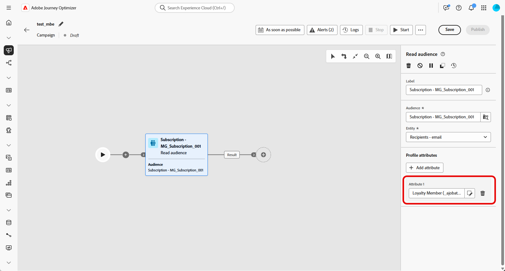

# Leggi pubblico {#read-audience}

>[!CONTEXTUALHELP]
>id="ajo_orchestration_read_audience"
>title="Attività Crea pubblico"
>abstract="L&#39;attività **Read audience** ti consente di selezionare il pubblico che entrerà nella campagna orchestrata. Questo pubblico può essere un pubblico esistente di Adobe Experience Platform o uno estratto da un file CSV. Quando si inviano messaggi nel contesto di una campagna orchestrata, il pubblico del messaggio non è definito nell&#39;attività del canale, ma in un&#39;attività **Read audience** o **Build audience**."

+++ Sommario

| Benvenuto in Campagne orchestrate | Avviare la prima campagna orchestrata | Eseguire query sul database | Attività di campagne orchestrate |
|---|---|---|---|
| [Introduzione alle campagne orchestrate](../gs-orchestrated-campaigns.md)  Creazione e gestione di schemi e set di dati relazionali:  <ul><li>[Introduzione a schemi e set di dati](../gs-schemas.md)</li><li>[Schema manuale](../manual-schema.md)</li><li>[Schema di caricamento file](../file-upload-schema.md)</li><li>[Acquisire dati](../ingest-data.md)</li></ul>[Accedere e gestire le campagne orchestrate](../access-manage-orchestrated-campaigns.md) | [Passaggi chiave per creare una campagna orchestrata](../gs-campaign-creation.md)  [Creare e pianificare la campagna](../create-orchestrated-campaign.md)  [Orchestrare le attività](../orchestrate-activities.md)  [Avviare e monitorare la campagna](../start-monitor-campaigns.md)  [Generazione rapporti](../reporting-campaigns.md) | [Utilizzare il generatore di regole](../orchestrated-rule-builder.md)  [Creare la prima query](../build-query.md)  [Modificare le espressioni](../edit-expressions.md)  [Retargeting](../retarget.md) | [Introduzione alle attività](about-activities.md)  Attività: [AND-join](and-join.md) - [Crea pubblico](build-audience.md) - [Modifica dimensione](change-dimension.md) - [Attività canale](channels.md) - [Combina](combine.md) - [Deduplica](deduplication.md) - [Arricchimento](enrichment.md) - [Fork](fork.md) - [Riconciliazione](reconciliation.md) - [Salva pubblico](save-audience.md) - [Dividi](split.md) - [Attendi](wait.md) |

{style="table-layout:fixed"}

+++

 

>[!BEGINSHADEBOX]

 

Il contenuto di questa pagina non è definitivo e potrebbe essere soggetto a modifiche.

>[!ENDSHADEBOX]

L&#39;attività **[!UICONTROL Read audience]** consente di recuperare un pubblico esistente, salvato o importato in precedenza, e di riutilizzarlo all&#39;interno di una campagna orchestrata. Questa attività è particolarmente utile per il targeting di un set predefinito di profili senza la necessità di eseguire un nuovo processo di segmentazione.

Una volta caricato il pubblico, puoi facoltativamente perfezionarlo selezionando un campo di identità univoco e arricchendo il pubblico con attributi di profilo aggiuntivi a scopo di targeting, personalizzazione o reporting.

## Configurare l’attività Read audience {#read-audience-configuration}

Segui questi passaggi per configurare l&#39;attività **[!UICONTROL Read audience]**:

1. Aggiungi un&#39;attività **[!UICONTROL Read audience]** alla tua campagna orchestrata.

   

1. Immetti un&#39;etichetta **[!UICONTROL Label]** per l&#39;attività.

1. Fai clic su  per selezionare il pubblico di destinazione della campagna orchestrata.

   

1. Scegli un&#39;entità **[!UICONTROL &#x200B;]** dalla dimensione di targeting della campagna.

   ➡️ [Segui i passaggi descritti in questa pagina per creare la tua dimensione di targeting delle campagne](../target-dimension.md)

   

1. Seleziona **[!UICONTROL Aggiungi attributo]** per arricchire il pubblico selezionato con dati aggiuntivi. Il pubblico risultante conterrà un elenco di destinatari, ciascuno arricchito con gli attributi di profilo selezionati.

1. Scegli gli **[!UICONTROL Attributi]** da aggiungere al pubblico.

   

## Esempio

Nell&#39;esempio seguente, l&#39;attività **[!UICONTROL Read audience]** viene utilizzata per recuperare un pubblico creato e salvato in precedenza dai profili abbonati alla newsletter. Il pubblico viene quindi arricchito con l&#39;attributo **Iscrizione fedeltà** per abilitare il targeting degli utenti che sono membri registrati del programma fedeltà.

