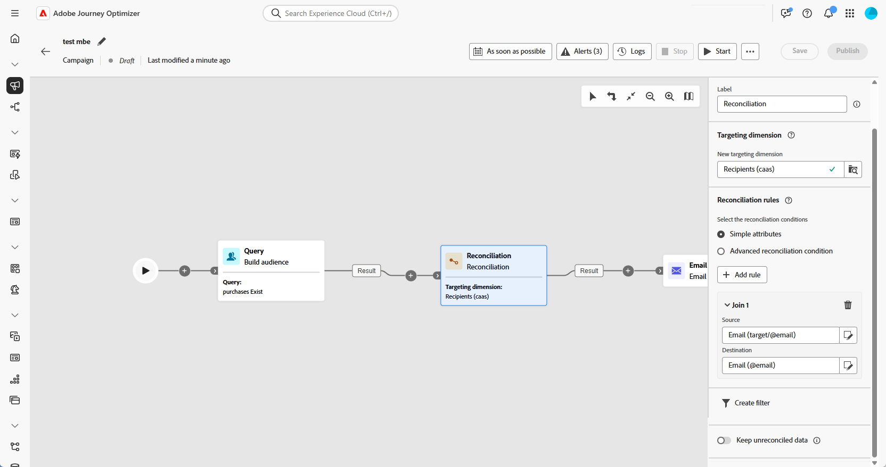

# Riconciliazione {#reconciliation}

>[!CONTEXTUALHELP]
>id="ajo_orchestration_reconciliation"
>title="Attività di riconciliazione"
>abstract="L’attività di **riconciliazione** è un’attività di **targeting** che consente di definire il collegamento tra Adobe Journey Optimizer e i dati in una tabella di lavoro."

>[!CONTEXTUALHELP]
>id="ajo_orchestration_reconciliation_field"
>title="Campo di selezione riconciliazione"
>abstract="Campo di selezione riconciliazione"

>[!CONTEXTUALHELP]
>id="ajo_orchestration_reconciliation_condition"
>title="Condizione di creazione riconciliazione"
>abstract="Condizione di creazione riconciliazione"

>[!CONTEXTUALHELP]
>id="ajo_orchestration_reconciliation_complement"
>title="Complemento generato da riconciliazione"
>abstract="Complemento generato da riconciliazione"

+++ Sommario

| Benvenuto in campagne orchestrate | Avviare la prima campagna orchestrata | Eseguire query sul database | Attività di campagne orchestrate |
|---|---|---|---|
| [Introduzione alle campagne orchestrate](gs-orchestrated-campaigns.md)  [Passaggi di configurazione](configuration-steps.md)  [Passaggi chiave per la creazione di campagne orchestrate](gs-campaign-creation.md) | [Creare una campagna orchestrata](create-orchestrated-campaign.md)  [Orchestrare le attività](orchestrate-activities.md)  [Inviare messaggi con le campagne orchestrate](send-messages.md)  [Avviare e monitorare la campagna](start-monitor-campaigns.md)  [Generazione rapporti](reporting-campaigns.md) | [Utilizzare Query Modeler](orchestrated-query-modeler.md)  [Creare la prima query](build-query.md)  [Modificare le espressioni](edit-expressions.md) | [Inizia a usare le attività](activities/about-activities.md)  Attività: [Partecipa/Partecipa](activities/and-join.md) - [Genera pubblico](activities/build-audience.md) - [Modifica dimensione](activities/change-dimension.md) - [Combina](activities/combine.md) - [Deduplicazione](activities/deduplication.md) - [Arricchimento](activities/enrichment.md) - [Fork](activities/fork.md) - [Riconciliazione](activities/reconciliation.md) - [Dividi](activities/split.md) - [Attendi](activities/wait.md) |

{style="table-layout:fixed"}

+++

  

L&#39;attività **Reconciliation** è un&#39;attività **Targeting** che consente di definire il collegamento tra i dati in Adobe Journey Optimizer e i dati in una tabella di lavoro, ad esempio i dati caricati da un file esterno.

## Best practice {#reconciliation-best-practices}

Mentre l&#39;attività **Enrichment** ti consente di definire i dati aggiuntivi da elaborare nella campagna orchestrata (puoi utilizzare un&#39;attività **Enrichment** per combinare dati provenienti da più set o per creare collegamenti a una risorsa temporanea), l&#39;attività **Reconciliation** ti consente di collegare dati non identificati a risorse esistenti.

>[!NOTE]
>L&#39;operazione Reconciliation implica che i dati delle dimensioni collegate siano già presenti nel database.  Ad esempio, se importi un file di acquisti che mostra quale prodotto è stato acquistato in un determinato momento da uno specifico cliente, ecc., il prodotto e il cliente devono già esistere nel database.

## Configurare l’attività di riconciliazione {#reconciliation-configuration}

>[!CONTEXTUALHELP]
>id="ajo_orchestration_reconciliation_targeting"
>title="Dimensione targeting"
>abstract="Seleziona la nuova dimensione targeting. Una dimensione consente di definire la popolazione target: destinatari, abbonati all’app, operatori, iscritti, ecc. Per impostazione predefinita, è selezionata la dimensione targeting corrente."

>[!CONTEXTUALHELP]
>id="ajo_orchestration_reconciliation_rules"
>title="Regole di riconciliazione"
>abstract="Seleziona le regole di riconciliazione da utilizzare per la deduplica. Per utilizzare gli attributi, seleziona l’opzione **Attributi semplici** e scegli i campi di origine e di destinazione. Per creare una condizione di riconciliazione personalizzata utilizzando query modeler, seleziona l’opzione **Condizioni di riconciliazione avanzate**."
>additional-url="https://experienceleague.adobe.com/it/docs/campaign-web/v8/query-database/query-modeler-overview" text="Utilizzo del query modeler"

>[!CONTEXTUALHELP]
>id="ajo_orchestration_reconciliation_targeting_selection"
>title="Selezionare una dimensione di targeting"
>abstract="Seleziona la dimensione targeting per i dati in entrata per cui eseguire la riconciliazione."
>additional-url="https://experienceleague.adobe.com/docs/campaign-web/v8/audiences/gs-audiences-recipients.html?lang=it#targeting-dimensions" text="Dimensioni di targeting"

>[!CONTEXTUALHELP]
>id="ajo_orchestration_keep_unreconciled_data"
>title="Mantenere i dati non riconciliati"
>abstract="Per impostazione predefinita, i dati non riconciliati vengono conservati nella transizione in uscita e sono disponibili nella tabella di lavoro per utilizzi futuri. Per rimuovere i dati non riconciliati, disattiva l’opzione **Mantieni i dati non riconciliati**."

>[!CONTEXTUALHELP]
>id="ajo_orchestration_reconciliation_attribute"
>title="Attributo di riconciliazione"
>abstract="Seleziona l’attributo da utilizzare per riconciliare i dati e fai clic su Conferma."

Per configurare l&#39;attività **Reconciliation**, eseguire la procedura seguente:

1. Aggiungi un&#39;attività **Reconciliation** nella campagna orchestrata.

1. Seleziona la nuova dimensione targeting. Una dimensione ti consente di definire la popolazione target: destinatari, abbonati all’app, operatori, abbonati, ecc.

1. Seleziona i campi da utilizzare per la riconciliazione. Puoi utilizzare uno o più criteri di riconciliazione.

   1. Per utilizzare gli attributi per riconciliare i dati, selezionare l&#39;opzione **Attributi semplici**. Nel campo **Source** sono elencati i campi disponibili nella transizione di input che devono essere riconciliati. Il campo **Destinazione** corrisponde ai campi della dimensione di targeting selezionata. I dati vengono riconciliati quando l’origine e la destinazione sono uguali. Ad esempio, seleziona i campi **E-mail** per deduplicare i profili in base al loro indirizzo e-mail.

      Per aggiungere un altro criterio di riconciliazione, fare clic sul pulsante **Aggiungi regola**. Se sono specificate più condizioni di unione, è necessario verificarle TUTTE in modo che i dati possano essere collegati tra loro.

      

   1. Per utilizzare altri attributi per riconciliare i dati, selezionare l&#39;opzione **Condizioni di riconciliazione avanzate**. Puoi quindi creare una condizione di riconciliazione personalizzata utilizzando Query Modeler.

1. Puoi filtrare i dati da riconciliare utilizzando il pulsante **Crea filtro**. Questo consente di creare una condizione personalizzata utilizzando il modellatore di query.

Per impostazione predefinita, i dati non riconciliati vengono conservati nella transizione in uscita e sono disponibili nella tabella di lavoro per utilizzi futuri. Per rimuovere i dati non riconciliati, disattiva l’opzione **Mantieni i dati non riconciliati**.
