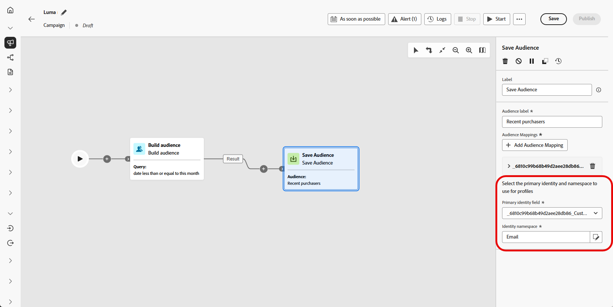
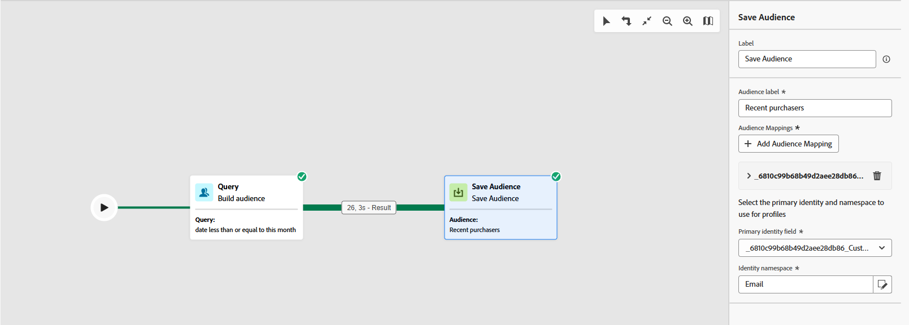

# Salva pubblico {#save-audience}

>[!BEGINSHADEBOX]

**In questa pagina:** scopri come utilizzare l&#39;attività Save audience targeting per creare o sovrascrivere un pubblico riutilizzabile dalla popolazione creata in precedenza in una campagna orchestrata.

>[!ENDSHADEBOX]

>[!CONTEXTUALHELP]
>id="ajo_orchestration_save_audience"
>title="Attività Salva pubblico"
>abstract="L’attività **Salva pubblico** è un’attività di **targeting** che consente di aggiornare un pubblico esistente o crearne uno nuovo dalla popolazione generata in precedenza nella campagna orchestrata. Una volta creati, questi tipi di pubblico vengono aggiunti all’elenco dei tipi di pubblico dell’applicazione e sono accessibili dal menu **Tipi di pubblico**."

L&#39;attività **[!UICONTROL Save audience]** è un&#39;attività **[!UICONTROL Targeting]** utilizzata per creare un nuovo pubblico o aggiornarne uno esistente in base alla popolazione generata in precedenza nella campagna orchestrata. Una volta salvato, il pubblico viene aggiunto all&#39;elenco dei tipi di pubblico dell&#39;applicazione e diventa accessibile dal menu **[!UICONTROL Tipi di pubblico]**.

Viene comunemente utilizzato per acquisire segmenti di pubblico generati nello stesso flusso di lavoro della campagna, rendendoli disponibili per il riutilizzo in campagne future. In genere, è connesso ad altre attività di targeting, come **[!UICONTROL Genera pubblico]** o **[!UICONTROL Combina]**, per salvare la popolazione di destinazione finale.
Tieni presente che con l&#39;attività **[!UICONTROL Save audience]** non è possibile aggiornare un pubblico esistente. Puoi solo creare un nuovo pubblico o sovrascriverne uno esistente con una nuova definizione.

## Configurare l’attività Salva pubblico {#save-audience-configuration}

Per configurare l’attività **[!UICONTROL Salva pubblico]**, segui questi passaggi:

1. Aggiungi un&#39;attività **[!UICONTROL Save audience]** alla tua campagna orchestrata.

1. Immetti un’**[!UICONTROL etichetta del pubblico]** che identificherà il pubblico salvato.

   >[!NOTE]
   >
   >Il pubblico **[!UICONTROL Label]** deve essere univoco in tutte le campagne. Non puoi riutilizzare un nome di pubblico già utilizzato nell&#39;attività **[!UICONTROL Salva pubblico]** di un&#39;altra campagna.

1. Scegli un **[!UICONTROL campo di mappatura profilo&#x200B;]** dalla dimensione di targeting della campagna. Questa mappatura definisce il modo in cui i profili nel **pubblico salvato** sono collegati alla dimensione di destinazione della campagna durante l&#39;esecuzione.

   Nell’elenco a discesa saranno disponibili solo le mappature compatibili con la dimensione di destinazione corrente, ovvero quella della transizione in ingresso, per garantire la corretta riconciliazione tra il pubblico e il contesto della campagna.

   ➡️ [Segui i passaggi descritti in questa pagina per creare la tua dimensione di targeting delle campagne](../target-dimension.md)

   

1. Fai clic su **[!UICONTROL Aggiungi mappature pubblico]** per includere dati aggiuntivi dagli attributi della **[!UICONTROL dimensione di destinazione]** o **[!UICONTROL attributi profilo]** arricchiti.

   Ciò ti consente di associare ulteriori informazioni all&#39;attività **[!UICONTROL Pubblico salvato]** oltre alla mappatura del profilo principale, migliorando le opzioni di targeting e personalizzazione.

   

1. Completa la configurazione salvando e pubblicando la campagna orchestrata. Questo genererà e archivierà il tuo pubblico.

1. Pubblica la campagna per il pubblico da creare o sostituire poiché l&#39;attività **[!UICONTROL Salva pubblico]** non viene eseguita mentre la campagna è in modalità **[!UICONTROL Bozza]**.

>[!NOTE]
>
>Al momento della pubblicazione, le attività **[!UICONTROL Save audience]** vengono sempre eseguite prima di qualsiasi attività messaggio nel flusso di lavoro. Viene creata la shell del pubblico e i profili iniziano l’acquisizione nel portale dell’audience prima che qualsiasi attività di canale inizi l’elaborazione. [Ulteriori informazioni sulla sequenza di esecuzione al momento della pubblicazione](../start-monitor-campaigns.md#publication-sequence)

Il contenuto del pubblico salvato è quindi disponibile nella relativa visualizzazione dettagliata, accessibile dal menu **[!UICONTROL Tipi di pubblico]** oppure può essere selezionato quando si esegue il targeting di un pubblico, ad esempio con un&#39;attività **[!UICONTROL Read audience]**.

>[!NOTE]
>
>Se la definizione del pubblico utilizza gli attributi dello schema di Experience Platform etichettati con l’utilizzo dei dati (DULE), queste etichette vengono ereditate automaticamente dal pubblico salvato. Non è necessario riapplicarli. [Ulteriori informazioni sulla governance dei dati](../../action/action-privacy.md)

## Esempio {#save-audience-example}

L’esempio seguente illustra come creare un pubblico semplice utilizzando il targeting. Una query identifica tutti i destinatari che hanno prenotato un viaggio negli ultimi 30 giorni filtrando questa popolazione nella campagna orchestrata. Scegliendo **Destinatari - CRMID** come **dimensione di targeting**, il pubblico esegue il targeting di ogni singolo evento di prenotazione anziché del solo destinatario nel suo insieme. L’attività **[!UICONTROL Salva pubblico]** acquisisce quindi questi profili per creare un pubblico riutilizzabile di acquirenti recenti.

