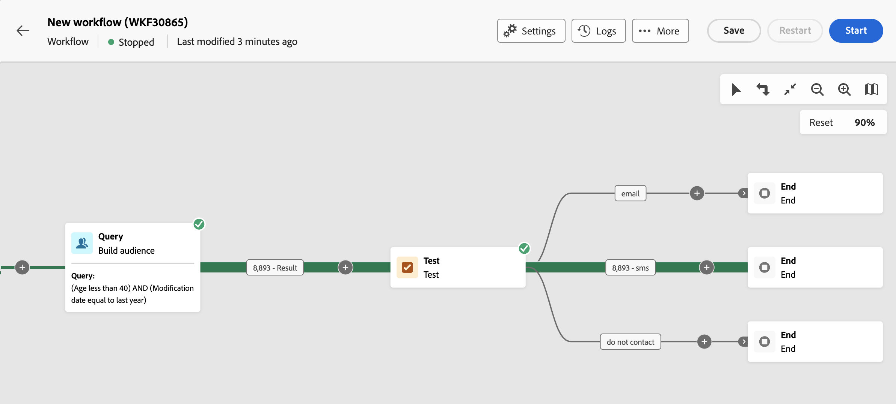

# Test {#test}

>[!CONTEXTUALHELP]
>id="ajo_orchestration_test"
>title="Attività di test"
>abstract="L’attività **Test** è un’attività di **Controllo del flusso**. Consente di abilitare le transizioni in base a condizioni specificate."

>[!CONTEXTUALHELP]
>id="ajo_orchestration_test_conditions"
>title="Condizioni"
>abstract="L&#39;attività **Test** può avere più transizioni di output. Durante l’esecuzione della campagna orchestrata, ogni condizione viene testata in sequenza fino a quando non ne viene soddisfatta una. Se nessuna delle condizioni è soddisfatta, la campagna orchestrata prosegue lungo il percorso della **[!UICONTROL condizione predefinita]**. Se non viene attivata alcuna condizione predefinita, la campagna orchestrata si interrompe in questo punto."

L’attività **[!UICONTROL Test]** è un’attività di **[!UICONTROL Controllo del flusso]**. Utilizzalo per diramare il flusso della campagna attivando diverse transizioni a seconda delle condizioni che definisci. Ogni condizione può valutare i dati della transizione in entrata e puoi scegliere quale transizione viene eseguita per prima in base all’ordine in cui vengono valutate le condizioni.

## Configurare l’attività Test {#test-configuration}

Per impostare l&#39;attività **[!UICONTROL Test]**:

1. Rilascia un&#39;attività **[!UICONTROL Test]** nell&#39;area di lavoro della campagna orchestrata.

1. Per impostazione predefinita, l’attività fornisce un singolo test booleano: quando viene soddisfatta la condizione &quot;True&quot;, tale transizione viene attivata; in caso contrario viene attivata la transizione &quot;False&quot; (predefinita).

   

1. Definisci la condizione per una transizione completando questi campi:

   * **Etichetta**: nome della transizione che consente di identificarla nell&#39;area di lavoro.

   * **Tipo di condizione**: i dati da valutare, per impostazione predefinita, il conteggio della popolazione.  Qui sono elencate anche le variabili (provenienti da variabili globali o da un segnale di attivazione) che possono essere selezionate per basare una condizione su un valore di variabile. [Scopri come utilizzare le variabili nelle campagne orchestrate](../variables-orchestrated-campaigns.md)

   * **Operatore**: confronto da applicare, ad esempio uguale a, maggiore di, minore di. L’elenco degli operatori dipende dal tipo di dati del tipo di condizione.

   * **Valore**: valore con cui confrontare il tipo di condizione.

   

1. Per eseguire il branch su più di due risultati, fare clic su **[!UICONTROL Aggiungi condizione]** e definire un&#39;etichetta e una condizione per ogni transizione aggiuntiva.

1. In fase di esecuzione, la campagna valuta le condizioni in ordine e segue la prima che corrisponde a. Se nessuna condizione corrisponde, l&#39;esecuzione segue **[!UICONTROL La condizione predefinita]** se ne è stata impostata una; in caso contrario la campagna si arresta all&#39;attività **[!UICONTROL Test]**.

## Esempio {#example}

In questo esempio vengono attivate transizioni diverse in base al numero di profili interessati da un&#39;attività **[!UICONTROL Genera pubblico]**. Le condizioni vengono valutate in ordine; l’ultima transizione è l’impostazione predefinita e viene utilizzata quando nessuna condizione precedente corrisponde.

* Se il targeting riguarda più di 10.000 profili, viene inviato un messaggio e-mail.
* Impostazione predefinita (nessuna condizione corrispondente): quando il conteggio è pari o inferiore a 10.000, la popolazione viene indirizzata a una transizione &quot;non contattare&quot;.

