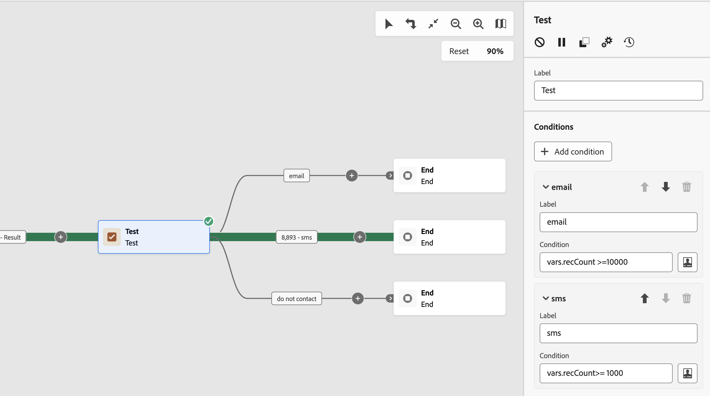

# Test {#test}

>[!CONTEXTUALHELP]
>id="ajo_orchestration_test"
>title="Attività di test"
>abstract="L’attività **Test** è un’attività di **Controllo del flusso**. Consente di abilitare le transizioni in base a condizioni specificate."

>[!CONTEXTUALHELP]
>id="ajo_orchestration_test_conditions"
>title="Condizioni"
>abstract="L&#39;attività **Test** può avere più transizioni di output. Durante l’esecuzione della campagna orchestrata, ogni condizione viene testata in sequenza fino a quando non ne viene soddisfatta una. Se nessuna delle condizioni è soddisfatta, la campagna orchestrata prosegue lungo il percorso della **[!UICONTROL condizione predefinita]**. Se non viene attivata alcuna condizione predefinita, la campagna orchestrata si interrompe in questo punto."

L’attività **[!UICONTROL Test]** è un’attività di **[!UICONTROL Controllo del flusso]**. Consente di abilitare le transizioni in base a condizioni specificate.

## Configurare l’attività Test {#test-configuration}

Per configurare l’attività **[!UICONTROL Test]** segui questi passaggi:

1. Aggiungi un&#39;attività **[!UICONTROL Test]** alla campagna orchestrata.

1. Per impostazione predefinita, l’attività **[!UICONTROL Test]** presenta un semplice test booleano. Se la condizione definita nella transizione “True” è soddisfatta, questa transizione verrà attivata. In caso contrario, verrà attivata una transizione predefinita “False”.

1. Per configurare la condizione associata a una transizione, fai clic sull’icona **[!UICONTROL Apri finestra di personalizzazione]**. Utilizza l’editor di espressioni per definire le regole necessarie per attivare questa transizione. Puoi anche sfruttare le variabili evento, le condizioni e le funzioni data/ora.

   Inoltre, puoi modificare il campo **[!UICONTROL Etichetta]** per personalizzare il nome della transizione nell&#39;area di lavoro della campagna orchestrata.

   

1. Puoi aggiungere più transizioni di output a un’attività **[!UICONTROL Test]**. A tale scopo, fai clic sul pulsante **[!UICONTROL Aggiungi condizione]** e configura l’etichetta e la condizione associata per ogni transizione.
v
1. Durante l’esecuzione della campagna orchestrata, ogni condizione viene testata in sequenza fino a quando non ne viene soddisfatta una. Se nessuna delle condizioni è soddisfatta, le campagne orchestrate continuano lungo il percorso della **[!UICONTROL condizione predefinita]**. Se non viene attivata alcuna condizione predefinita, la campagna si interrompe a questo punto.

## Esempio {#example}

In questo esempio vengono attivate diverse transizioni in base al numero di profili interessati da un’attività **[!UICONTROL Crea pubblico]**:

* Se il targeting riguarda più di 10.000 profili, viene inviato un messaggio e-mail.
* Per un numero di profili compreso tra 1.000 e 10.000, viene inviato un SMS.
* Se i profili target scendono al di sotto di 1.000, vengono indirizzati a una transizione “non contattare”.

A questo scopo, la variabile dell’evento `vars.recCount` è stata utilizzata nelle condizioni “e-mail” e “sms” per contare il numero di profili target e attivare la transizione appropriata.

