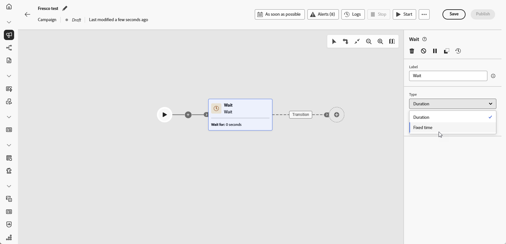

# Attendi {#wait}

>[!CONTEXTUALHELP]
>id="ajo_orchestration_wait"
>title="Attività Attendi"
>abstract="L’attività **Attendi** viene utilizzata per ritardare la transizione da un’attività a un’altra."

L&#39;attività **[!UICONTROL Wait]** è un componente del **[!UICONTROL controllo di flusso]** utilizzato per introdurre un ritardo tra due attività in una campagna orchestrata. In questo modo le attività di follow-up saranno più tempestive e rilevanti per il coinvolgimento dell’utente.

Ad esempio, puoi attendere alcuni giorni dopo una consegna e-mail per tenere traccia di aperture e clic prima di inviare un messaggio di follow-up.

## Configurazione{#wait-configuration}

>[!IMPORTANT]
>
>I dati nelle tabelle temporanee non persistono oltre i **5 giorni**. Quando usi **[!UICONTROL Durata]** o **[!UICONTROL Tempo fisso]** attende, assicurati che il tempo trascorso fino al completamento dell&#39;attività successiva entro tale limite in modo che i dati intermedi rimangano disponibili.

Per configurare l’attività **[!UICONTROL Attendi]**, segui questi passaggi:

1. Aggiungi un&#39;attività **[!UICONTROL Wait]** alla campagna orchestrata.

1. Seleziona il tipo di Attesa più adatta alle tue esigenze:

   * **[!UICONTROL Durata]**: specifica un ritardo in secondi, minuti, ore o giorni prima di procedere all’attività successiva.

   * **[!UICONTROL Ora fissa]**: imposta una data e un’ora specifiche dopo le quali inizia l’attività successiva.

   

## Esempio{#wait-example}

L’esempio seguente illustra l’attività **[!UICONTROL Attendi]** in un caso d’uso tipico.  Un’e-mail con un codice promozionale viene inviata ai profili che festeggiano il loro compleanno. Dopo 2 giorni, un SMS viene inviato allo stesso gruppo come promemoria che il loro codice promozionale di compleanno sta per scadere.

