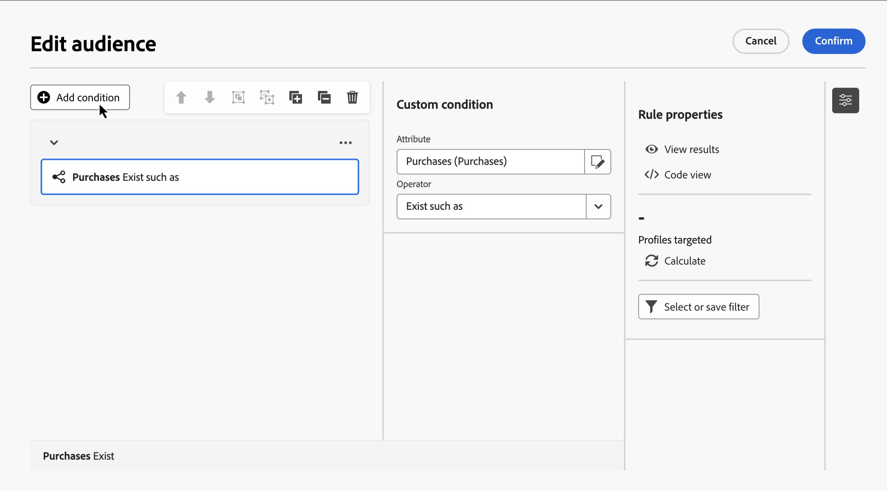
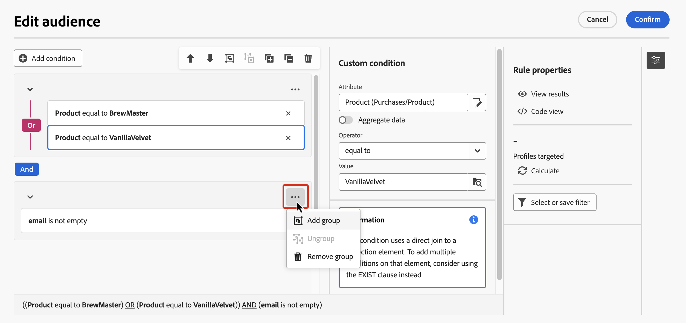

# Creare la prima regola {#build-query}

I passaggi principali per creare regole per le campagne orchestrate sono i seguenti:

1. **Aggiungi condizioni** - Crea condizioni personalizzate per filtrare la query creando la tua condizione con gli attributi del database e le espressioni avanzate.
1. **Combina condizioni** - Dispone le condizioni nell&#39;area di lavoro utilizzando gruppi e operatori logici.
1. **Verifica e convalida la regola**. Prima di salvarla, controlla i dati risultanti dalla regola.

## Aggiungi una condizione {#conditions}

Per aggiungere condizioni nella query, effettua le seguenti operazioni:

1. Accedi al generatore di regole da un&#39;attività **[!UICONTROL Genera pubblico]**.

1. Fai clic sul pulsante **Aggiungi condizione** per creare una prima condizione per la query.

   È inoltre possibile avviare la query utilizzando un filtro predefinito. A tale scopo, fare clic sul pulsante **[!UICONTROL Seleziona o salva filtro]** e scegliere **[!UICONTROL Seleziona filtro predefinito]**.

   

1. Identifica l’attributo dal database da utilizzare come criterio per la condizione. L&#39;icona &quot;i&quot; accanto a un attributo fornisce informazioni sulla tabella in cui è memorizzato e sul relativo tipo di dati.

   

   >[!NOTE]
   >
   >Il pulsante **Modifica espressione** consente di utilizzare l&#39;editor espressioni per definire manualmente un&#39;espressione utilizzando i campi del database e le funzioni di supporto. [Scopri come modificare le espressioni](../orchestrated/edit-expressions.md)

1. Fai clic sull&#39;immagine  accanto a un attributo per accedere a queste opzioni aggiuntive:

+++ Distribuzione dei valori

   Analizzare la distribuzione dei valori per un determinato attributo all&#39;interno della tabella. Questa funzione è utile per comprendere i valori disponibili, i relativi conteggi e le percentuali. Consente inoltre di evitare problemi come l’utilizzo incoerente delle maiuscole o ortografia errata durante la creazione di query o di espressioni.

   Per gli attributi con un numero elevato di valori, lo strumento mostra solo i primi venti. In questi casi, viene visualizzata la notifica **[!UICONTROL Caricamento parziale]** per indicare questa limitazione. Puoi applicare filtri avanzati per perfezionare i risultati visualizzati e concentrarti su valori o sottoinsiemi di dati specifici.

   

+++

+++ Aggiungi ai preferiti

   L’aggiunta di attributi al menu dei preferiti consente di accedere rapidamente agli attributi utilizzati con maggiore frequenza. Puoi aggiungere fino a 20 attributi ai preferiti. Gli attributi preferiti e recenti sono associati a ogni utente all’interno di un’organizzazione, garantendo l’accessibilità tra computer diversi e fornendo un’esperienza fluida tra i dispositivi.

   Per accedere agli attributi preferiti, utilizzare il menu **[!UICONTROL Preferiti e recenti]**. Gli attributi preferiti vengono visualizzati per primi, seguiti da quelli utilizzati di recente, semplificando l&#39;individuazione degli attributi richiesti. Per rimuovere un attributo dai preferiti, selezionare di nuovo l’icona a forma di stella.

   

+++

1. Fai clic su **[!UICONTROL Conferma]** per aggiungere l&#39;attributo selezionato alla condizione.

1. Viene visualizzato un riquadro delle proprietà in cui è possibile configurare il valore desiderato per l’attributo.

   

1. Selezionare l&#39;**[!UICONTROL operatore]** da applicare dall&#39;elenco a discesa. Sono disponibili diversi operatori da utilizzare. Gli operatori disponibili nell’elenco a discesa dipendono dal tipo di dati dell’attributo.

   +++Elenco degli operatori disponibili

   | Operatore | Scopo | Esempio |
   |---|---|---|
   | Uguale a | Restituisce un risultato identico ai dati immessi nella seconda colonna Valore. | Il cognome (@lastName) uguale a &quot;Jones&quot; restituirà solo i destinatari il cui cognome è Jones. |
   | Non uguale a | Restituisce tutti i valori non identici al valore inserito. | Lingua (@language) non uguale a &#39;Inglese&#39;. |
   | Maggiore di | Restituisce un valore maggiore del valore immesso. | L&#39;età (@age) maggiore di 50 restituirà tutti i valori maggiori di &#39;50&#39;, ad esempio &#39;51&#39;, &#39;52&#39;. |
   | Minore di | Restituisce un valore minore del valore immesso. | La data di creazione (@created) prima di &#39;DaysAgo(100)&#39; restituirà tutti i destinatari creati meno di 100 giorni fa. |
   | Maggiore o uguale a | Restituisce tutti i valori uguali o maggiori del valore immesso. | L’età (@age) maggiore o uguale a &quot;30&quot; restituirà tutti i destinatari di età pari o superiore a 30 anni. |
   | Minore o uguale a | Restituisce tutti i valori uguali o inferiori al valore immesso. | L’età (@age) inferiore o uguale a &quot;60&quot; restituirà tutti i destinatari di età pari o inferiore a 60 anni. |
   | Incluso in | Restituisce i risultati inclusi nei valori indicati. Questi valori devono essere separati da una virgola. | La data di nascita (@birthDate) è inclusa in &quot;12/10/1979,12/10/1984&quot; per restituire i destinatari nati tra queste date. |
   | Non in | Funziona come l’operatore Incluso in. In questo caso, i destinatari vengono esclusi in base ai valori immessi. | La data di nascita (@birthDate) non è inclusa in “10/12/1979,10/12/1984”. I destinatari nati in queste date non verranno restituiti. |
   | È vuoto | Restituisce risultati che corrispondono a un valore vuoto nella seconda colonna Valore. | Cellulare (@mobilePhone) è vuoto restituisce tutti i destinatari che non hanno un numero di cellulare. |
   | Non è vuoto | Funziona in modo inverso rispetto all’operatore È vuoto. Non è necessario immettere dati nella seconda colonna Valore. | Il campo E-mail (@email) non è vuoto. |
   | Inizia con | Restituisce i risultati che iniziano con il valore inserito. | Account # (@account) inizia con “32010”. |
   | Non inizia con | Restituisce i risultati che non iniziano con il valore inserito. | Il numero account (@account) non inizia con &quot;20&quot;. |
   | Contains | Restituisce risultati contenenti almeno il valore inserito. | Il dominio e-mail (@domain) contiene &#39;mail&#39; restituirà tutti i nomi di dominio che contengono &#39;mail&#39;, ad esempio &#39;gmail.com&#39;. |
   | Non contiene | Restituisce risultati che non contengono il valore immesso. | Il dominio e-mail (@domain) non contiene &#39;vo&#39;. I nomi di dominio contenenti &#39;vo&#39;, ad esempio &#39;voilà.fr&#39;, non verranno visualizzati nei risultati. |
   | Simile a | Simile all&#39;operatore Contains, consente di inserire un carattere jolly % nel valore. | Cognome (@lastName) simile a “Jon%s”. Il carattere jolly funge da &quot;jolly&quot; per trovare nomi come &quot;Jones&quot;. |
   | Diverso da | Simile all&#39;operatore Contains, consente di inserire un carattere jolly % nel valore. | Cognome (@lastName) diverso da “Smi%h”. I destinatari il cui cognome è &quot;Smith&quot; non verranno restituiti. |

   +++

1. Nel campo **Valore**, definisci il valore previsto. È inoltre possibile utilizzare l’editor espressioni per definire manualmente un’espressione utilizzando i campi delle funzioni di database e helper. A tale scopo, fare clic sull&#39;immagine . [Scopri come modificare le espressioni](../orchestrated/edit-expressions.md)

   Per gli attributi di tipo data, i valori predefiniti sono disponibili utilizzando l&#39;opzione **[!UICONTROL Predefiniti]**.

   +++Vedi esempio

   

   +++

### Condizioni personalizzate sulle tabelle collegate (collegamenti 1-1 e 1-N){#links}

Le condizioni personalizzate consentono di eseguire query sulle tabelle collegate alla tabella attualmente utilizzata dalla regola. Questo include tabelle con un collegamento di cardinalità 1-1 o tabelle di raccolta (collegamento 1-N).

Per un collegamento **1-1**, passare alla tabella collegata, selezionare l&#39;attributo desiderato e definire il valore previsto.

Puoi anche selezionare direttamente un collegamento alla tabella nel selettore **Valore** e confermare. In tal caso, i valori disponibili per la tabella selezionata devono essere selezionati utilizzando un selettore dedicato, come illustrato nell’esempio seguente.

+++Esempio di query

In questo caso, la query esegue il targeting dei brand la cui etichetta è &quot;in esecuzione&quot;.

1. Naviga nella tabella **Brand** e seleziona l&#39;attributo **Label**.

   

1. Definisci il valore previsto per l’attributo.

   

Di seguito è riportato un esempio di query in cui è stato selezionato direttamente un collegamento di tabella. I valori disponibili per questa tabella devono essere selezionati da un selettore dedicato.

+++

Per un collegamento **1-N**, puoi definire le condizioni secondarie per perfezionare la query, come illustrato nell&#39;esempio seguente.

+++Esempio di query

In questo caso, la query è destinata a destinatari che hanno effettuato acquisti relativi al prodotto Brewmsaster per più di 100$.

1. Seleziona la tabella **Acquisti** e conferma.

1. Fai clic su **[!UICONTROL Aggiungi condizione]** per definire le condizioni secondarie da applicare alla tabella selezionata.

   

1. Aggiungi condizioni secondarie in base alle tue esigenze.

   

+++

### Condizioni personalizzate con dati aggregati {#aggregate}

Le condizioni personalizzate consentono di eseguire operazioni di aggregazione. A questo scopo, devi selezionare direttamente un attributo da una tabella di raccolta:

1. Spostarsi all&#39;interno della tabella di raccolta desiderata e selezionare l&#39;attributo sul quale si desidera eseguire un&#39;operazione di aggregazione.

1. Nel riquadro delle proprietà, attivare l&#39;opzione **Aggregate data** e selezionare la funzione di aggregazione desiderata.

   

## Combinare le condizioni utilizzando gli operatori {#operators}

Ogni volta che si aggiunge una nuova condizione nella regola, questa viene automaticamente collegata alla condizione esistente da un operatore **AND**. Ciò significa che i risultati delle due condizioni sono combinati.

Per cambiare l’operatore tra le condizioni, fai clic su di esso e seleziona l’operatore desiderato.

Gli operatori disponibili sono:

* **AND (intersezione)**: combina i risultati che corrispondono a tutti i componenti di filtraggio nelle transizioni in uscita.
* **OR (Unione)**: include i risultati che corrispondono ad almeno uno dei componenti di filtraggio nelle transizioni in uscita.
* **ECCETTO (esclusione)**: esclude i risultati che corrispondono a tutti i componenti di filtro nella transizione in uscita.

## Manipolare le condizioni {#manipulate}

La barra degli strumenti dell’area di lavoro del generatore di regole fornisce opzioni per manipolare facilmente le condizioni all’interno della regola:

| Icona barra degli strumenti | Descrizione |
|--- |--- |
|  | Sposta il componente su di una riga. |
|  | Sposta il componente in basso di una riga. |
|  | Inserire due componenti in un gruppo. |
|  | Separare i componenti di un singolo gruppo. |
|  | Espandere tutti i gruppi. |
|  | Comprimi tutti i gruppi. |
|  | Rimuovere tutti i gruppi e i componenti. |

A seconda delle esigenze, potrebbe essere necessario creare gruppi intermedi di componenti raggruppando i componenti in uno stesso gruppo e collegandoli tra loro.

* Per raggruppare due condizioni esistenti, selezionare una delle due condizioni e fare clic sul pulsante  o  per raggrupparla con la condizione precedente o successiva.

* Per raggruppare una condizione esistente con una nuova, selezionala, fai clic sull&#39;immagine  e seleziona **[!UICONTROL Aggiungi gruppo]**. Seleziona il nuovo attributo da aggiungere al gruppo, quindi conferma.

  

Nell’esempio seguente, abbiamo creato un gruppo intermedio per il targeting dei clienti che hanno acquistato il prodotto BrewMaster o VanillaVelvet.

## Controllare e convalidare la query

Dopo aver creato la query nell&#39;area di lavoro, puoi controllarla utilizzando il riquadro **Proprietà regola**. Le operazioni disponibili sono:

* **Visualizza risultati:** visualizza i dati risultanti dalla query.
* **Vista codice**: visualizza una versione della query basata su codice in SQL.
* **Calcola**: aggiorna e visualizza il numero di record interessati dalla regola.
* **Seleziona o salva il filtro**: scegli un filtro predefinito esistente da utilizzare nell&#39;area di lavoro oppure salva la query come filtro predefinito da riutilizzare in futuro.

 

    >[ !IMPORTANTE]
    >
    >Selezionare un filtro predefinito dal riquadro delle proprietà delle regole sostituisce la regola creata nell&#39;area di lavoro con il filtro selezionato.

Quando la regola è pronta, fai clic sul pulsante **[!UICONTROL Conferma]** in per salvarla.
