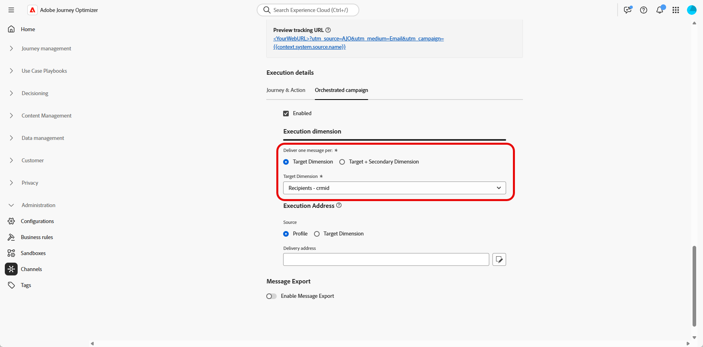

# Configurazione del canale {#channel-configuration}

Dopo aver configurato il [Dimension di destinazione](target-dimension.md), è necessario configurare la **[!UICONTROL configurazione canale]** e definire i **[!UICONTROL dettagli di esecuzione]** appropriati. Questo consente di definire:

* **Livello di recapito dei messaggi**: ad esempio, l&#39;invio di un messaggio per destinatario, ad esempio una singola e-mail per singolo destinatario.

* **Indirizzo di esecuzione**: il campo del contatto specifico da utilizzare per l&#39;invio, ad esempio un indirizzo e-mail o un numero di telefono.

Per configurare la configurazione del canale:

1. Per iniziare, crea e configura la **[!UICONTROL configurazione canale]**.

   È inoltre possibile aggiornare una **[!UICONTROL configurazione canale]** esistente.

   ➡️ [Segui i passaggi descritti in questa pagina](../email/surface-personalization.md)

1. Dalla sezione **[!UICONTROL Dettagli esecuzione]** della **[!UICONTROL Configurazione canale]**, accedi alla scheda **[!UICONTROL Campagne orchestrate]**.

   

1. Fai clic su **[!UICONTROL Abilitato]** per renderlo compatibile con le campagne orchestrate.

1. Scegli il metodo di consegna:

   * **[!UICONTROL Dimension di destinazione]**: invia all&#39;entità principale, ad esempio destinatario.

   * **[!UICONTROL Destinazione + Dimension secondario]**: inviare utilizzando entità primarie e secondarie, ad esempio destinatario + contratto.

1. Seleziona dall&#39;elenco a discesa [Dimension di Target creato in precedenza](#targeting-dimension).

   

1. Se hai selezionato **[!UICONTROL Target + Dimension]** secondario come metodo di consegna, scegli un **[!UICONTROL Dimension secondario]** per definire il contesto per la consegna dei messaggi.

1. Nella sezione **[!UICONTROL Indirizzo di esecuzione]**, scegli quale **[!UICONTROL Source]** deve essere utilizzato per recuperare l&#39;indirizzo di consegna, ad esempio l&#39;indirizzo e-mail o il numero di telefono:

   * **[!UICONTROL Profilo]**: selezionare questa opzione se l&#39;indirizzo di consegna, ad esempio e-mail, è memorizzato direttamente nel profilo cliente principale.

     Utile quando si inviano messaggi al cliente principale, non a una specifica entità associata.

   * **[!UICONTROL Dimension di destinazione]**: scegliere questa opzione se l&#39;indirizzo di consegna è archiviato nell&#39;entità principale, ad esempio un destinatario.

     Utile quando ogni destinatario ha il proprio indirizzo di consegna, ad esempio un indirizzo e-mail o un numero di telefono diverso.

   * **[!UICONTROL Dimension secondario]**: quando si utilizza **[!UICONTROL Target + Dimension secondario]** come metodo di consegna, selezionare il **[!UICONTROL Dimension secondario]** pertinente configurato in precedenza.

     Ad esempio, se la dimensione secondaria rappresenta una prenotazione o un abbonamento, l’indirizzo di esecuzione, ad esempio un’e-mail, può essere preso da tale livello. Ciò è utile nei casi in cui i profili utilizzano un recapito diverso al momento della prenotazione o dell’abbonamento a un servizio.

1. Dal campo **[!UICONTROL Indirizzo di consegna]**, fai clic su  per scegliere il campo specifico da utilizzare per la consegna del messaggio.

   

1. Una volta configurata, fai clic su **[!UICONTROL Invia]**.

Il tuo canale è ora pronto per essere utilizzato con **Campagne orchestrate** e i messaggi verranno recapitati in base alla dimensione di destinazione selezionata.
