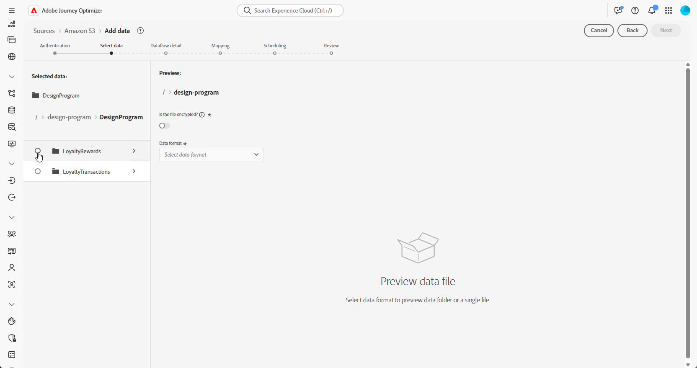

# Passaggi di configurazione {#configuration-steps}

+++ Sommario

| Benvenuto in campagne orchestrate | Lanciare la prima campagna orchestrata | Eseguire query sul database | Attività di campagne orchestrate |
|---|---|---|---|
| [Introduzione alle campagne orchestrate](gs-orchestrated-campaigns.md)<br/><br/><b>[Passaggi di configurazione](configuration-steps.md)</b><br/><br/>[Accesso e gestione delle campagne orchestrate](access-manage-orchestrated-campaigns.md)<br/><br/>[Passaggi chiave per creare una campagna orchestrata](gs-campaign-creation.md) | [Crea e pianifica la campagna](create-orchestrated-campaign.md)<br/><br/>[Orchestrazione attività](orchestrate-activities.md)<br/><br/>[Avvia e monitora la campagna](start-monitor-campaigns.md)<br/><br/>[Generazione rapporti](reporting-campaigns.md) | [Utilizzare il generatore di regole](orchestrated-rule-builder.md)<br/><br/>[Creare la prima query](build-query.md)<br/><br/>[Modificare le espressioni](edit-expressions.md)<br/><br/>[Retargeting](retarget.md) | [Inizia a usare le attività](activities/about-activities.md)<br/><br/>Attività:<br/>[Partecipa e unisci](activities/and-join.md) - [Genera pubblico](activities/build-audience.md) - [Modifica dimensione](activities/change-dimension.md) - [Attività canale](activities/channels.md) - [Combina](activities/combine.md) - [Deduplicazione](activities/deduplication.md) - [Arricchimento](activities/enrichment.md) - [Fork](activities/fork.md) - [Riconciliazione](activities/reconciliation.md) - [Salva pubblico](activities/save-audience.md) - [Dividi](activities/split.md) - [Attendi](activities/wait.md) |

{style="table-layout:fixed"}

+++

</br>

>[!BEGINSHADEBOX]

Documentazione in corso

>[!ENDSHADEBOX]

Questa guida illustra i passaggi necessari per creare uno schema relazionale, configurare un set di dati per campagne orchestrate, acquisire dati tramite un’origine S3 ed eseguire query sui dati acquisiti nella piattaforma AP.

In questo esempio, la configurazione include l&#39;integrazione di due entità chiave, **Transazioni fedeltà** e **Premi fedeltà**, e collegarle alle entità di base esistenti **Destinatari** e **Marchi**.


1. [Carica file DDL](#upload-ddl)

   Definisci il modello dati relazionale per le campagne orchestrate, incluse le entità **Transazioni fedeltà** e **Premi fedeltà**, insieme alle chiavi e agli attributi di controllo delle versioni richiesti.

1. [Seleziona entità](#entities)

   Stabilisci relazioni significative tra le tabelle dello schema per creare un modello di dati coeso e interconnesso.

1. [Schema collegamento](#link-schema)

   Collega l&#39;entità **Transazioni fedeltà** a **Destinatari** e **Premi fedeltà** a **Marchi**, per creare un modello di dati connesso che supporta percorsi di clienti personalizzati.

1. [Acquisire dati](#ingest)

   Importa dati in Adobe Experience Platform da origini supportate come SFTP, archiviazione cloud o database.

## Carica file DDL {#upload-ddl}

Questa sezione fornisce istruzioni dettagliate su come creare uno schema relazionale all’interno di Adobe Experience Platform caricando un file DDL (Data Definition Language). L&#39;utilizzo di un file DDL consente di definire in anticipo la struttura del modello dati, incluse tabelle, attributi, chiavi e relazioni.

1. Accedi a AP Platform.

1. Passa a **Gestione dati** > **Schema**.

1. Fai clic su **Crea schema**.

1. Viene richiesto di selezionare due tipi di schema:

   * **Standard**
   * **Relazionale**, utilizzato in modo specifico per le campagne orchestrate

   

1. Selezionare **Carica file DDL** per definire un diagramma delle relazioni tra entità e creare schemi.

   La struttura della tabella deve contenere:
   * Almeno una chiave primaria
   * Identificatore di versione, ad esempio un campo `lastmodified` di tipo `datetime` o `number`.

1. Trascina il file DDL e fai clic su **[!UICONTROL Avanti]**.

1. Digita il tuo **[!UICONTROL nome schema]**.

1. Imposta ogni schema e le relative colonne, assicurandoti che sia specificata una chiave primaria.

   Un attributo, ad esempio `lastmodified`, deve essere designato come descrittore di versione. Questo attributo, in genere di tipo `datetime`, `long` o `int`, è essenziale per i processi di acquisizione affinché il set di dati venga aggiornato con la versione più recente.

   

1. Al termine, fai clic su **[!UICONTROL Fine]**.

Ora puoi verificare le definizioni della tabella e dei campi all’interno dell’area di lavoro. [Ulteriori informazioni nella sezione seguente](#entities)

## Seleziona entità {#entities}

Per definire connessioni logiche tra tabelle all’interno dello schema, segui la procedura riportata di seguito.

1. Accedi alla vista area di lavoro del modello dati e scegli le due tabelle da collegare

1. Fai clic sul pulsante  accanto a Source Join, quindi trascina e guida la freccia verso Target Join per stabilire la connessione.

   

1. Compila il modulo specificato per definire il collegamento e fai clic su **Applica** una volta configurato.

   

   **Cardinalità**:

   * **1-N**: una occorrenza della tabella di origine può avere diverse occorrenze corrispondenti della tabella di destinazione, ma una occorrenza della tabella di destinazione può avere al massimo una occorrenza corrispondente della tabella di origine.

   * **N-1**: una occorrenza della tabella di destinazione può avere diverse occorrenze corrispondenti della tabella di origine, ma una occorrenza della tabella di origine può avere al massimo una occorrenza corrispondente della tabella di destinazione.

   * **1-1**: una occorrenza della tabella di origine può avere al massimo una occorrenza corrispondente della tabella di destinazione.

1. Tutti i collegamenti definiti nel modello dati sono rappresentati da frecce nella vista area di lavoro. Fai clic su una freccia tra due tabelle per visualizzare i dettagli, apportare modifiche o rimuovere il collegamento in base alle esigenze.

   

1. Utilizza la barra degli strumenti per personalizzare e regolare l’area di lavoro.

   

   * **Zoom in**: ingrandisci l&#39;area di lavoro per visualizzare più chiaramente i dettagli del modello dati.

   * **Zoom indietro**: riduci le dimensioni dell&#39;area di lavoro per una visualizzazione più ampia del modello dati.

   * **Adatta visualizzazione**: regola lo zoom per adattarlo a tutti gli schemi all&#39;interno dell&#39;area visibile.

   * **Filtro**: scegliere lo schema da visualizzare nell&#39;area di lavoro.

   * **Forza layout automatico**: disponi automaticamente gli schemi per una migliore organizzazione.

   * **Visualizza mappa**: consente di attivare o disattivare la sovrapposizione minima per spostarsi più facilmente nei layout di schema complessi o di grandi dimensioni.

1. Al termine, fai clic su **Salva**. Questa azione crea gli schemi e i set di dati associati e abilita il set di dati da utilizzare nelle campagne orchestrate.

1. Fai clic su **[!UICONTROL Processi aperti]** per monitorare l&#39;avanzamento del processo di creazione. Questo processo può richiedere alcuni minuti, a seconda del numero di tabelle definite nel file DDL.

   

## Schema collegamento {#link-schema}

Stabilisci una relazione tra lo schema **transazioni fedeltà** e lo schema **Destinatari** per associare ogni transazione al record cliente corretto.

1. Passa a **[!UICONTROL Schemi]** e apri le **transazioni fedeltà** create in precedenza.

1. Fare clic su **[!UICONTROL Aggiungi relazione]** dalle proprietà del campo **[!UICONTROL Cliente]**.

   

1. Selezionare **[!UICONTROL Many-to-One]** come relazione **[!UICONTROL Type]**.

1. Collegamento allo schema **Destinatari** esistente.

   

1. Immetti un nome di relazione **[!UICONTROL dallo schema corrente]** e un nome di relazione **[!UICONTROL dallo schema di riferimento]**.

1. Fai clic su **[!UICONTROL Applica]** per salvare le modifiche.

Continua creando una relazione tra lo schema **premi fedeltà** e lo schema **Marchi** per associare ogni premio al marchio appropriato.


## Acquisire dati {#ingest}

>[!IMPORTANT]
>
>Ogni set di dati in Adobe Experience Platform supporta un solo flusso di dati attivo alla volta. Per istruzioni dettagliate su come cambiare origine dati, consulta questa [sezione](#cdc-ingestion).

Adobe Experience Platform consente di acquisire dati da origini esterne e allo stesso tempo di strutturare, etichettare e migliorare i dati in arrivo tramite i servizi Experience Platform. È possibile acquisire dati da diverse origini, ad esempio applicazioni Adobe, archivi basati su cloud, database e molte altre.

1. Dal menu **[!UICONTROL Connessioni]**, accedere al menu **[!UICONTROL Origini]**.

1. Seleziona la categoria **[!UICONTROL Archiviazione cloud]**, quindi Amazon S3 e fai clic su **[!UICONTROL Aggiungi dati]**.

   

1. Connetti il tuo account S3:

   * Con un account esistente

   * Con un nuovo account

   [Ulteriori informazioni nella documentazione di Adobe Experience Platform](https://experienceleague.adobe.com/en/docs/experience-platform/destinations/catalog/cloud-storage/amazon-s3#connect)

   

1. Scegli la cartella **[!UICONTROL Formato dati]**, **[!UICONTROL Delimitatore]** e **[!UICONTROL Tipo di compressione]**.

1. Naviga nell&#39;origine S3 connessa fino a individuare le due cartelle create in precedenza, ovvero **premi fedeltà** e **transazioni fedeltà**.

1. Selezionare la cartella contenente i dati.

   La selezione di una cartella garantisce che tutti i file correnti e futuri con la stessa struttura vengano elaborati automaticamente. La selezione di un singolo file, tuttavia, richiede il caricamento manuale di ogni nuovo incremento di dati.

   

1. Scegli la cartella **[!UICONTROL Formato dati]**, **[!UICONTROL Delimitatore]** e **[!UICONTROL Tipo di compressione]**. Verifica la precisione dei dati di esempio, quindi fai clic su **[!UICONTROL Avanti]**.

   

1. Selezionare **[!UICONTROL Abilita Change data capture]** per effettuare una selezione da set di dati mappati a schemi relazionali e per i quali sono definiti sia una chiave primaria che un descrittore di versione.

1. Seleziona il [set di dati creato in precedenza](#entities) e fai clic su **[!UICONTROL Avanti]**.

   

1. Nella finestra **[!UICONTROL Mapping]**, verifica che ogni attributo del file di origine sia mappato correttamente con i campi corrispondenti nello schema di destinazione.

   Al termine, fai clic su **[!UICONTROL Avanti]**.

   

1. Configura il flusso di dati **[!UICONTROL Pianificazione]** in base alla frequenza desiderata.

1. Fare clic su **[!UICONTROL Fine]** per creare il flusso di dati. Viene eseguito automaticamente in base alla pianificazione definita.

1. Dal menu **[!UICONTROL Connessioni]**, seleziona **[!UICONTROL Origini]** e accedi alla scheda **[!UICONTROL Flussi di dati]** per monitorare l&#39;esecuzione del flusso, esaminare i record acquisiti e risolvere eventuali errori.

   

<!--### Setting Up Change data capture ingestion {#cdc-ingestion}

If you need to change the data source, you must delete the existing dataflow and create a new one pointing to the same dataset with the new source.

When using Change Data Capture (CDC), it is essential that the source and dataset remain in sync to ensure accurate incremental updates. Follow the steps below:

1. **Schema Requirements**
   - Your schema must include:
     - A **primary key** (e.g., `transaction_id`)
     - A **versioning field** (e.g., `lastmodified` or an incrementing `version_id`)
   - Enable the dataset for **Orchestrated Campaigns** if needed.

2. **CDC Dataflow Setup**
   - During dataflow creation, after choosing your source and files:
     - **Enable the CDC option**
     - Select your CDC-ready dataset
     - Confirm field mappings (especially version field)

3. **Keep Source and Target in Sync**
   - The source system must consistently update the version field so the platform can detect changes accurately.

Once set up, the platform will automatically ingest **only changed or new records** each time the flow runs.
-->
<!--manual
## Create a relational schema manual


1. Log in to the AP Platform.
1. Navigate to the **Schema Management** section.
1. Click on **Create Schema**.

1. You will be prompted to select between two schema types:
    * **Standard**
    * **Relational** (used specifically for AGO campaigns)

1. Click on **Create Manual**.
1. Provide a **Schema Name** (e.g., `test_demo_ck001`).
1. Choose **Schema Type**:
    - **Record Type** (required for AGO campaigns)
    - **Time Series** (not applicable here)
1. Click **Finish** to proceed to the schema design canvas.

## Select entities and fields to import

1. In the canvas, add attributes (fields) to your schema.
1. Add a **Primary Key** (mandatory).
1. Add a **Version Descriptor** attribute (for CDC support):
    - This must be of type **DateTime** or **Numeric** (Integer, Long, Short, Byte).
    - Common example: `last_modified`

> **Why?** The **Primary Key** uniquely identifies each record, and the **Version Descriptor** tracks changes, supporting CDC (Change Data Capture) and data mirroring.

1. Mark the appropriate fields as **Primary Key** and **Version Descriptor**.
1. Click **Save**.

---


## 5. Creating a Dataset

1. Navigate to **Datasets**.
1. Click on **Create Dataset**.
1. Select the schema you just created.
1. Assign a **Dataset Name** (same as schema is fine).
1. Optionally, add tags (e.g., `AGO_campaigns`).
6. Ensure the checkbox **"Relational Schema"** is checked.
7. Click **Finish**.

> **Note:** Only one dataset can be created per relational schema.


## 6. Enabling the Dataset

1. Click **Enable** for the dataset.
1. Wait a few moments for the status to show **Enabled**.

> **Why?** Without enabling, the dataset cannot be used in orchestrated campaigns or ingest data.

## 7. Creating a Data Source (S3)

1. Navigate to **Sources**.
1. Click **Create Source**.
1. Choose the source type (e.g., **S3 Bucket**).
1. Provide connection details:
    - Bucket Path (optionally include subfolder path)
1. Save the source.

## 8. Preparing and Uploading Data

1. Prepare your CSV file with:
    - Column headers matching your schema attributes
    - `last_modified` column
    - `change_type` column (`U`/`DU` for upsert, `D` for delete)

> **Important:** `change_type` is required but does not need to be defined in the schema.

1. Save the file as `.csv`.

1. Upload the file to the specified folder in your S3 bucket.


## 9. Ingesting Data from S3

1. Go to **Sources** and find your S3 source.
1. Click **Add Data**.
1. Select the uploaded file.
1. Specify the file format as **CSV** and any compression type if applicable.
1. Review the data preview (ensure `change_type`, `last_modified`, and primary key are visible).
1. Click **Next**.

### Enable Change Data Capture (CDC)

- Check **Enable Change Data Capture**.
- Select the dataset enabled for AGO campaigns.

### Field Mapping

- Fields are auto-mapped (note that `change_type` is not mapped and that's expected).
- Click **Next**.

### Scheduling

- Schedule ingestion frequency (minute, hour, day, week).
- Set start time (immediate or future).
- Click **Finish** to create the data flow.

## 10. Monitoring Data Flow

1. Navigate back to **Sources > Data Flows**.
1. Wait 4–5 minutes for the first run (initial overhead).
1. Monitor:
    - Status (Started, Completed)
    - Number of records ingested
    - Errors (if any)

> **Tip:** Ingested data first lands in the **Data Lake**.

## 11. Data Replication to Data Store

The **Data Store** is updated:

- Every **15 minutes**, or

- If **Data Lake size exceeds 5MB**

This is a background replication process.


## 12. Querying the Dataset

1. Navigate to **Query Services**.
1. Click **Create Query**.
1. Example query:

   ```sql
   SELECT * FROM test_demo_ck001;
   ```

1. Run the query.

> **Note:** If ingestion is incomplete, query will return an error. Check data flow status.

-->