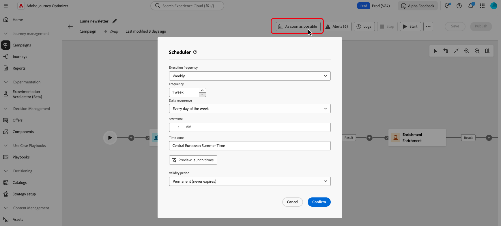

# Creare e pianificare una campagna orchestrata {#create-first-campaign}

Creare una campagna orchestrata in [!DNL Adobe Journey Optimizer] e configurarne la pianificazione di esecuzione per controllare quando viene avviata e con quale frequenza viene eseguita. Scegli di avviare la campagna immediatamente, a una data e un’ora specifiche o su base ricorrente utilizzando opzioni di pianificazione flessibili, ad esempio frequenze giornaliere, settimanali o mensili.

## Creare la campagna {#create}

>[!CONTEXTUALHELP]
>id="ajo_campaign_creation_workflow"
>title="Elenco delle campagne orchestrate"
>abstract="Nella scheda **Orchestrazione** sono elencate tutte le campagne orchestrate. Fai clic sul nome di una campagna orchestrata per modificarla. Utilizza il pulsante **Crea campagna orchestrata** per aggiungere una nuova campagna orchestrata."

Per creare una campagna orchestrata, effettua le seguenti operazioni:

1. Passa al menu **[!UICONTROL Campagne]** e seleziona la scheda **[!UICONTROL Orchestrazione]**.

1. Fai clic sul pulsante **[!UICONTROL Crea campagna]** e seleziona il tipo di campagna **[!UICONTROL Orchestrazione - Marketing]**.

   

1. Definisci le proprietà della campagna. A tale scopo, fare clic sul pulsante  accanto al nome della campagna.

   

   1. Immetti **[!UICONTROL Nome]** e **[!UICONTROL Descrizione]** per la campagna.

   1. Seleziona un **[!UICONTROL criterio di unione]** per la campagna.

      In [!DNL Adobe Experience Platform], ogni pubblico è associato a un criterio di unione specifico, che definisce il modo in cui le informazioni del profilo vengono combinate per formare un profilo unito. Quando selezioni un criterio di unione nell’attività Read audience, sono disponibili solo i tipi di pubblico basati sullo stesso criterio di unione. Per impostazione predefinita, il sistema utilizza il criterio di unione predefinito, ma è possibile modificarlo se necessario. Per ulteriori informazioni sui criteri di unione, consulta la [documentazione di Adobe Experience Platform](https://experienceleague.adobe.com/it/docs/experience-platform/profile/merge-policies/overview){target="_blank"}.

   1. Utilizza il campo **[!UICONTROL Tag]** per assegnare alla campagna i tag unificati di Adobe Experience Platform. Ciò ti consente di classificarli facilmente e di migliorare la ricerca dall’elenco delle campagne orchestrate. [Scopri come utilizzare i tag](../start/search-filter-categorize.md#tags)

   1. Fai clic su **[!UICONTROL Salva]**.

## Pianificare la campagna {#schedule}

>[!CONTEXTUALHELP]
>id="ajo_orchestration_scheduler"
>title="Modulo di pianificazione"
>abstract="In qualità di manager della campagna, puoi pianificare il lancio automatico delle campagne in momenti specifici, abilitando un calendario e dati di targeting precisi per le comunicazioni di marketing."

>[!CONTEXTUALHELP]
>id="ajo_orchestration_schedule_validity"
>title="Validità del modulo di pianificazione"
>abstract="È possibile definire un periodo di validità per il modulo di pianificazione. Può essere permanente (impostazione predefinita) o valido fino a una data specifica."

>[!CONTEXTUALHELP]
>id="ajo_orchestration_schedule_options"
>title="Opzioni del modulo di pianificazione"
>abstract="Definisci la frequenza del modulo di pianificazione. Può essere eseguito in un determinato momento, una o più volte al giorno, alla settimana o al mese."

Per impostazione predefinita, le campagne orchestrate iniziano quando vengono attivate manualmente e terminano una volta eseguite le attività associate. Se preferisci ritardare l’esecuzione o eseguire la campagna su base ricorrente, puoi definire una pianificazione per la campagna.

Quando pianifichi campagne orchestrate, considera le seguenti best practice per garantire prestazioni e comportamenti ottimali:

* Non pianificare l’esecuzione di una campagna orchestrata per più di 15 minuti, in quanto potrebbe impedire le prestazioni complessive del sistema e creare blocchi nel database.
* Se desideri inviare un messaggio unico nella campagna orchestrata, puoi impostarlo per l&#39;esecuzione **Una volta**.
* Se desideri inviare un messaggio ricorrente nella campagna orchestrata, devi utilizzare le opzioni **Pianificazione** e impostare la frequenza di esecuzione. L’attività di consegna ricorrente non ti consente di definire una pianificazione.

Per configurare la pianificazione della campagna, effettua le seguenti operazioni:

1. Apri la campagna e fai clic sul pulsante **[!UICONTROL Non appena possibile]**.

   

1. Seleziona una frequenza di esecuzione per la campagna, quindi configura le opzioni disponibili. Le impostazioni variano a seconda della frequenza selezionata:

   +++Una volta

   Esegui la campagna una sola volta a una data e un’ora specificate.

   * **[!UICONTROL Data]**: seleziona la data di esecuzione della campagna.
   * **[!UICONTROL Ora]**: seleziona l’ora specifica in cui la campagna deve essere eseguita.

   +++

   +++Giornaliero

   Esegui la campagna ogni giorno o nei giorni selezionati.

   * **[!UICONTROL Ricorrenza giornaliera]**: scegli la frequenza di esecuzione della campagna:
      * **[!UICONTROL Ogni giorno]**: esegue la campagna ogni giorno della settimana, inclusi i fine settimana.
      * **[!UICONTROL Nei giorni feriali]**: esegue la campagna solo dal lunedì al venerdì.
      * **[!UICONTROL In un periodo specifico]**: esegue la campagna ogni giorno entro un intervallo di date definito (ad esempio, dal 1° luglio al 15 luglio). La campagna non verrà eseguita al di fuori di questo intervallo.
      * **[!UICONTROL Nei giorni della settimana selezionati]**: esegue la campagna solo nei giorni della settimana specificati (ad esempio, lunedì, mercoledì, venerdì).

   * **[!UICONTROL Ora di inizio]**: definisci l’ora in cui la campagna deve essere eseguita ogni giorno.

   +++

   +++Più volte al giorno

   Esegui la campagna più volte nello stesso giorno. È possibile scegliere orari specifici o impostare una frequenza periodica.

   * **[!UICONTROL Ore selezionate]**: seleziona le ore specifiche in cui la campagna deve essere eseguita e configurane la ricorrenza giornaliera (eseguita ogni giorno della settimana o in alcuni giorni).
   * **[!UICONTROL Periodico]**: scegli di eseguire la campagna ogni n minuti o ore. Puoi anche definire l’intervallo di tempo all’interno del giorno in cui sono consentite le esecuzioni.

   +++

   +++Settimanale

   Esegui la campagna su base settimanale, con opzioni per giorni specifici.

   * **[!UICONTROL Frequenza]**: scegli la frequenza di esecuzione della campagna (ad esempio, ogni settimana, ogni 2 settimane).
   * **[!UICONTROL A partire dalla data]**: seleziona la data di inizio della ricorrenza.
   * **[!UICONTROL Ricorrenza giornaliera]**: scegli giorni della settimana specifici per l’esecuzione (ad esempio, ogni lunedì e giovedì).
   * **[!UICONTROL Ora di inizio]**: imposta l’ora in cui la campagna deve essere eseguita nei giorni selezionati.

   +++

   +++Mensile

   Esegui la campagna su base mensile, con opzioni per giorni specifici.

   * **[!UICONTROL Ricorrenza mensile]**: seleziona se la campagna viene eseguita ogni mese o solo durante mesi specifici.
   * **[!UICONTROL Ricorrenza giornaliera]**:
      * **[!UICONTROL Ogni giorno]**: esegue la campagna in ogni giorno del mese, inclusi i fine settimana.
      * **[!UICONTROL Ultimo giorno del mese]**: esegue la campagna solo nell’ultimo giorno di calendario di ogni mese (ad esempio, 31 gennaio, 28/29 febbraio).
      * **[!UICONTROL Giorno del mese specifico (ad esempio, 15)]**: esegue la campagna in un giorno specificato (ad esempio, il 15 di ogni mese).
      * **[!UICONTROL Primo/Ultimo o n-esimo giorno della settimana]** (ad esempio, primo lunedì): esegue la campagna in un giorno feriale specificato (ad esempio, il 15° di ogni settimana).
      * **[!UICONTROL Giorni della settimana selezionati]**: esegue la campagna in un giorno specificato.

   * **[!UICONTROL Ora di inizio]**: imposta l’ora di esecuzione della campagna.

   +++

1. Utilizza l’impostazione **[!UICONTROL Periodo di validità]** per definire una data di inizio e una data di fine specifiche, limitando l’esecuzione della campagna a un intervallo di tempo limitato.

1. Per le pianificazioni ricorrenti, fai clic sul pulsante **[!UICONTROL Anteprima data/ora di avvio]** per visualizzare in anteprima le date e le ore di esecuzione imminenti esatte in base alla configurazione corrente. Questo permette di convalidare la pianificazione prima dell’attivazione e garantisce che la campagna venga eseguita come previsto.

>[!NOTE]
>
>Quando pianifichi campagne in [!DNL Adobe Journey Optimizer], assicurati che la data/ora di inizio sia allineata alla prima consegna desiderata. Per le campagne ricorrenti, se l’ora pianificata iniziale è già passata, le campagne passeranno al successivo intervallo di tempo disponibile in base alle relative regole di ricorrenza.

Nell’esempio seguente, l’attività è configurata in modo che la campagna orchestrata venga eseguita due volte al giorno alle 9 e alle 12, ogni giorno della settimana dal 1° ottobre 2025 al 1° gennaio 2026.

{width="50%" align="left"}

## Passaggi successivi {#next}

Una volta configurate le impostazioni e la pianificazione della campagna, è tutto pronto per iniziare a orchestrare le diverse attività che eseguirà. [Scopri come orchestrare le attività della campagna](../orchestrated/orchestrate-activities.md)
