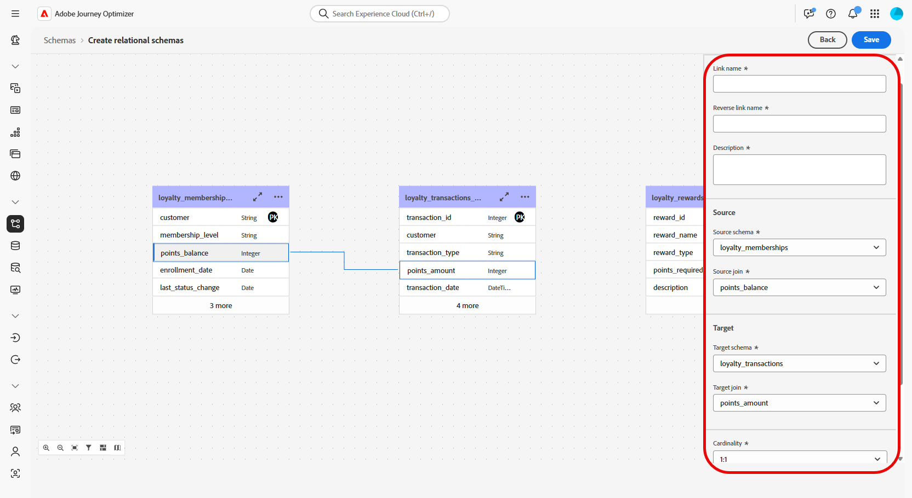
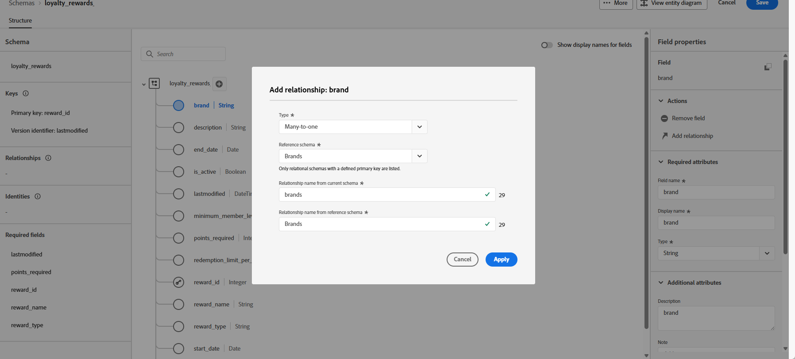

# Creare schemi basati su modelli utilizzando un file DDL {#file-upload-schema}

Definisci il modello di dati basato su modello richiesto per le campagne orchestrate creando schemi come **Iscrizioni fedeltà**, **Transazioni fedeltà** e **Premi fedeltà**. Ogni schema deve includere una chiave primaria, un attributo di controllo delle versioni e relazioni appropriate con entità di riferimento quali **Destinatari** o **Marchi**.

Gli schemi possono essere creati manualmente tramite l’interfaccia o importati in blocco utilizzando un file DDL.

Questa sezione fornisce istruzioni dettagliate su come creare uno schema basato su modelli in Adobe Experience Platform caricando un file DDL (Data Definition Language). L’utilizzo di un file DDL consente di definire in anticipo la struttura del modello dati, incluse tabelle, attributi, chiavi e relazioni.

1. [Caricare un file DDL](#ddl-upload) per creare schemi basati su modelli e definirne la struttura.

1. [Definisci le relazioni](#relationships) tra le tabelle nel modello dati.

1. [Collega schemi](#link-schema) per collegare i dati basati su modelli con entità profilo esistenti, ad esempio Destinatari o Marchi.

1. [Acquisisci i dati](ingest-data.md) nel set di dati da origini supportate.

➡️ [Ulteriori informazioni sugli schemi basati su modelli nella documentazione di Adobe Experience Platform](https://experienceleague.adobe.com/en/docs/experience-platform/xdm/schema/model-based)

## Carica un file DDL{#ddl-upload}

Caricando un file DDL, puoi definire in anticipo la struttura del modello dati, incluse tabelle, attributi, chiavi e relazioni.

Sono supportati i caricamenti di file di schema basati su Excel. Scarica il [modello fornito](assets/template.zip) per preparare facilmente le definizioni dello schema.

+++Le seguenti funzioni sono supportate durante la creazione di schemi basati su modelli in Adobe Experience Platform

* **ENUM**\
  I campi ENUM sono supportati sia nella creazione manuale dello schema basata su DDL, che consente di definire gli attributi con un set fisso di valori consentiti.
Ecco un esempio:

  ```
  CREATE TABLE orders (
  order_id     INT NOT NULL,
  product_id   INT NOT NULL,
  order_date   DATE NOT NULL,
  customer_id  INT NOT NULL,
  quantity     INT NOT NULL,
  order_status enum ('PENDING', 'SHIPPED', 'DELIVERED', 'CANCELLED'),
  PRIMARY KEY (order_id, product_id)
  );
  ```

* **Etichetta schema per governance dei dati**\
  L’etichettatura è supportata a livello di campo dello schema per applicare i criteri di governance dei dati, ad esempio il controllo degli accessi e le restrizioni di utilizzo. Per ulteriori dettagli, consulta [Documentazione di Adobe Experience Platform](https://experienceleague.adobe.com/docs/experience-platform/xdm/home.html?lang=it).

* **Chiave composita**\
  Le chiavi primarie composite sono supportate nelle definizioni di schemi basate su modelli, consentendo l’utilizzo di più campi insieme per identificare in modo univoco i record.

+++

1. Accedi a Adobe Experience Platform.

1. Passa al menu **Gestione dati** > **Schema**.

1. Fare clic su **Crea schema**.

1. Seleziona **[!UICONTROL Basato su modello]** come **Tipo di schema**.

   

1. Seleziona **[!UICONTROL Carica un file DDL]** per definire un diagramma di relazioni tra entità e creare gli schemi

   La struttura della tabella deve contenere:
   * Almeno una chiave primaria.
   * Un identificatore di versione, ad esempio un campo `lastmodified` di tipo `datetime` o `number`.
   * Per l&#39;acquisizione Change Data Capture (CDC), una colonna speciale denominata `_change_request_type` di tipo `String` che indica il tipo di modifica dei dati (ad esempio, inserimento, aggiornamento, eliminazione) e abilita l&#39;elaborazione incrementale.
   * Il file DDL non deve definire più di 200 tabelle.


   >[!IMPORTANT]
   >
   > Qualsiasi schema utilizzato per il targeting deve includere almeno un campo di identità di tipo `String` con un **spazio dei nomi identità** associato.\
   >Questo garantisce la compatibilità con le funzionalità di targeting e risoluzione delle identità di Adobe Journey Optimizer.

1. Trascina il file DDL e fai clic su **[!UICONTROL Avanti]**.

   La dimensione massima supportata per un file DDL è 10 MB.

1. Digita il **[!UICONTROL nome dello schema]**.

1. Configura ogni schema e le relative colonne, assicurandoti di specificare una chiave primaria e un descrittore di versione.

   Un attributo, ad esempio `lastmodified`, deve essere designato come descrittore di versione (tipo `datetime`, `long` o `int`) per garantire che i set di dati vengano aggiornati con i dati più recenti. Gli utenti possono modificare il descrittore di versione, che diventa obbligatorio una volta impostato. Un attributo non può essere sia una chiave primaria (PK) che un descrittore di versione.

   

1. Contrassegna un attributo come `identity` e mappalo su uno spazio dei nomi di identità definito.

1. Rinominare, eliminare o aggiungere una descrizione a ogni tabella.

1. Al termine, fai clic su **[!UICONTROL Fine]**.

Ora puoi verificare le definizioni della tabella e dei campi all’interno dell’area di lavoro. [Ulteriori informazioni sono disponibili nella sezione qui sotto](#entities)

## Definire le relazioni {#relationships}

Durante la creazione dello schema, è possibile specificare relazioni direttamente all&#39;interno del file DDL. Se preferisci definire relazioni esterne al file, puoi farlo nell’interfaccia seguendo i passaggi seguenti.

1. Accedi alla vista area di lavoro del modello dati e scegli le due tabelle da collegare

1. Fai clic sul pulsante  accanto a Join di origine, quindi trascina e guida la freccia verso Join di destinazione per stabilire la connessione.

   >[!NOTE]
   >
   >Le chiavi composite sono supportate se definite nel file DDL.

   

1. Compila il modulo specificato per definire il collegamento e, una volta configurato, fai clic su **Applica**.

   

   **Cardinalità**:

   * **1-N**: un’occorrenza della tabella di origine può avere diverse occorrenze corrispondenti della tabella target, ma un’occorrenza della tabella target può avere al massimo un’occorrenza corrispondente della tabella di origine.

   * **N-1**: un’occorrenza della tabella di origine può avere diverse occorrenze corrispondenti della tabella target, ma un’occorrenza della tabella target può avere al massimo un’occorrenza corrispondente della tabella di origine.

   * **1-1**: un’occorrenza della tabella di origine può avere al massimo un’occorrenza corrispondente della tabella target.

1. Tutti i collegamenti definiti nel modello dati sono rappresentati da frecce nella vista area di lavoro. Fai clic su una freccia tra due tabelle per visualizzare i dettagli, apportare modifiche o rimuovere il collegamento in base alle esigenze.

   

1. Utilizza la barra degli strumenti per personalizzare e regolare l’area di lavoro.

   

   * **Ingrandisci**: ingrandisci l’area di lavoro per visualizzare più chiaramente i dettagli del modello dati.

   * **Riduci**: riduci le dimensioni dell’area di lavoro per una visualizzazione più ampia del modello dati.

   * **Adatta vista**: regola lo zoom per adattarlo a tutti gli schemi all’interno dell’area visibile.

   * **Filtro**: scegli lo schema da visualizzare nell’area di lavoro.

   * **Forza layout automatico**: disponi automaticamente gli schemi per una migliore organizzazione.

   * **Visualizza mappa**: consente di attivare o disattivare la sovrapposizione minima per spostarsi più facilmente nei layout di schema complessi o di grandi dimensioni.

1. Al termine, fai clic su **Salva**. Questa azione crea gli schemi e i set di dati associati e abilita il set di dati da utilizzare nelle campagne orchestrate.

1. Fai clic su **[!UICONTROL Processi aperti]** per monitorare l’avanzamento del processo di creazione. Questo processo può richiedere alcuni minuti, a seconda del numero di tabelle definite nel file DDL.

   Per accedere ai processi di importazione DDL, aprire la finestra **[!UICONTROL Carica file DDL]** e selezionare **[!UICONTROL Visualizza tutti i processi di importazione DDL]**.

   

## Collegare gli schemi {#link-schema}

>[!IMPORTANT]
>
> Solo le relazioni definite in modo esplicito all&#39;interno del file DDL vengono riconosciute dal sistema. Tutte le relazioni di entità esistenti al di fuori del file DDL verranno ignorate e non elaborate.

Stabilisci una relazione tra lo schema **transazioni fedeltà** e lo schema **Destinatari** per associare ogni transazione al record cliente corretto.

1. Passa a **[!UICONTROL Schemi]** e apri le **transazioni fedeltà** create in precedenza.

1. Fai clic su **[!UICONTROL Aggiungi relazione]** dalle proprietà del campo **[!UICONTROL Cliente]**.

   

1. Seleziona **[!UICONTROL Molti a uno]** come **[!UICONTROL Tipo]** di relazione.

1. Collega allo schema **Destinatari** esistente.

   

1. Immetti un **[!UICONTROL nome di relazione dallo schema corrente]** e un nome di **[!UICONTROL relazione dallo schema di riferimento]**.

1. Fai clic su **[!UICONTROL Applica]** per salvare le modifiche.

Continua creando una relazione tra lo schema **premi fedeltà** e lo schema **Brand** per associare ogni premio al brand appropriato.


