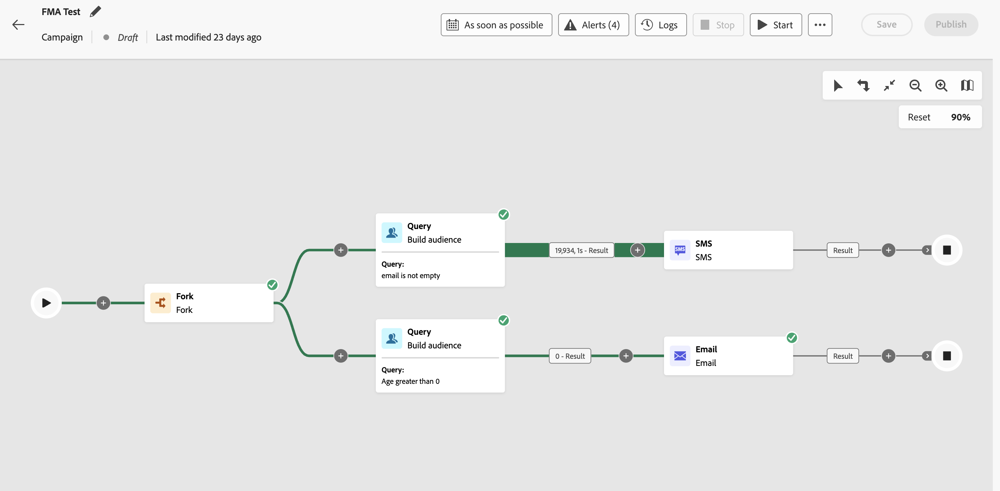

# Introduzione alle campagne orchestrate {#orchestrated-camp}

>[!CONTEXTUALHELP]
>id="campaigns_overview_orchestrated"
>title="campaigns_overview_orchestrated"
>abstract="<b>Orchestrazione campagna</b> Dividere, combinare, arricchire e manipolare set di dati relazionali per definire il pubblico   <b>Sfruttare dati con più entità</b> Scopri in che modo le campagne orchestrate possono sfruttare i set di dati relazionali per arricchire i dati per la segmentazione e la personalizzazione  <b>Segmentazione ad hoc e conteggi esatti</b> Crea il segmento passo dopo passo con conteggi esatti  <b>Canali disponibili</b> Notifiche e-mail, SMS e push"

L’orchestrazione delle campagne in [!DNL Adobe Journey Optimizer] potenzia campagne di marketing sofisticate e avviate dal brand su tutti i canali, aiutandoti a incrementare il coinvolgimento, i ricavi e la fidelizzazione della clientela su larga scala.

>[!IMPORTANT]
>
>Per accedere all’orchestrazione della campagna, la licenza deve includere il pacchetto **Journey Optimizer - Campagne e Percorsi** o **Journey Optimizer - Campagne**. Contatta il tuo rappresentante Adobe per confermare la licenza e aggiornare, se necessario.

Anche se il marketing cross-channel è essenziale, le campagne orchestrate lo rendono semplice. Grazie a un’interfaccia visiva basata su un trascinamento, puoi progettare e automatizzare flussi di lavoro di marketing complessi, dalla segmentazione alla consegna dei messaggi, su più canali. Tutto avviene in un ambiente intuitivo, progettato per velocità, controllo ed efficienza.

{zoomable="yes"}

➡️ [Scopri le campagne orchestrate nel video](#video-oc)

## Funzionalità di base

L’orchestrazione delle campagne si basa su quattro pilastri chiave:

<table style="table-layout:auto">
<tr style="border: 0;">
<td></a></td><td><b>Tipi di pubblico on-demand</b> Esegui una query istantanea tra set di dati per creare segmenti di pubblico utilizzando qualsiasi combinazione di tipi di dati e dimensioni.</td></tr>
<tr style="border: 0;">
<td></a></td><td><b>Segmentazione e invio di più entità</b> Oltre alle campagne basate su persone, utilizza entità quali cataloghi di prodotti, posizioni di archiviazione o dati del servizio per eseguire il targeting con precisione.  
È supportato l’invio su più livelli, in cui viene inviato un messaggio per profilo e per entità secondaria associata. Tali entità secondarie possono includere indirizzi di contatto, prenotazioni, abbonamenti, contratti o altri dati collegati. Questo consente, ad esempio, di inviare le campagne a tutti gli indirizzi noti di un profilo o a ogni prenotazione associata a quel profilo.</td></tr>
<tr style="border: 0;">
<td></a></td><td><b>Visibilità e precisione pre-invio</b> Ottieni conteggi di segmentazione esatti e l’ambito completo della campagna prima del lancio, garantendo precisione e affidabilità.</td></tr>
<tr style="border: 0;">
<td></a></td><td><b>Flussi di lavoro della campagna con più passaggi</b> Progetta campagne con più passaggi, dai messaggi giornalieri alle campagne complesse come le promozioni stagionali o i principali lanci di prodotti.</td></tr>
</table>

>[!NOTE]
>
>I canali supportati sono: [E-mail](../email/get-started-email.md), [SMS/MMS/RCS](../sms/get-started-sms.md), [Notifiche push](../push/get-started-push.md).
>
>I canali disponibili variano in base al modello di licenza e ai componenti aggiuntivi.

## Percorsi e campagne orchestrate

Anche se la visualizzazione delle campagne orchestrate è simile ai percorsi, è adatta a diversi scopi e casi d’uso:

* **Percorsi**: da area di lavoro individuale in cui ogni profilo percorre i diversi passaggi al proprio ritmo. Lo stato di ciascun cliente viene mantenuto nel relativo contesto per attivare azioni in tempo reale.

* **Campagne orchestrate**: a differenza dei percorsi, le campagne orchestrate funzionano utilizzando un’area di lavoro batch per il calcolo dei segmenti. Tutti i profili vengono elaborati contemporaneamente.

Entrambe le aree di lavoro sono ottimizzate per i rispettivi casi d’uso: l’area di lavoro del percorso pubblica percorsi che tendono a durare per un periodo di tempo più lungo, mentre l’area di lavoro della campagna è progettata per esecuzioni iterative e incrementali di una campagna batch.

## Che cosa c’è all’interno di una campagna orchestrata? {#gs-ms-campaign-inside}

L’area di lavoro della campagna orchestrata è una rappresentazione di ciò che dovrebbe accadere. Descrive le varie attività da eseguire e il modo in cui vengono collegate tra loro.

Ogni campagna orchestrata contiene:

* **Attività**: un’attività è un’attività da eseguire. Le [varie attività](activities/about-activities.md) sono rappresentate nell&#39;area di lavoro da icone. Ogni attività presenta proprietà specifiche e altre proprietà comuni a tutte le attività.

  In un’area di lavoro della campagna orchestrata, una determinata attività può produrre più attività, in particolare in presenza di un ciclo o di azioni ricorrenti.

* **Transizioni**: le transizioni collegano un’attività di origine a un’attività di destinazione e ne definiscono la sequenza.

* **Tabelle di lavoro**: la tabella di lavoro contiene tutte le informazioni riportate dalla transizione. Ogni campagna orchestrata utilizza diverse tabelle di lavoro. I dati trasmessi in queste tabelle possono essere utilizzati in tutto il ciclo di vita della campagna orchestrata.

## Video introduttivo {#video-oc}

Scopri i concetti chiave e le funzionalità disponibili con le campagne orchestrate.

>[!VIDEO](https://video.tv.adobe.com/v/3471538/?learn=on&enablevpops)

## Approfondiamo

Ora che sai che cosa sono le campagne orchestrate, è necessario approfondire le sezioni della documentazione per iniziare a utilizzare questa funzione.

<table><tr style="border: 0; text-align: center;">
<td>

<a href="gs-campaign-creation.md"><strong>Passaggi di configurazione</strong></a>

</td>
<td>

<a href="create-orchestrated-campaign.md"><strong>Creare una campagna orchestrata</strong>

</td>
<td>

<a href="activities/about-activities.md"><strong>Utilizzare le attività</strong></a>

</td>
</tr></table>
