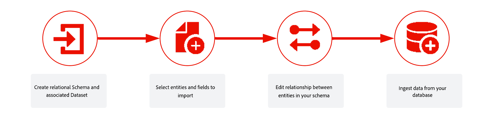

# Introduzione a schemi e set di dati basati su modelli{#gs-schemas}

Questa guida illustra i passaggi necessari per creare uno schema basato su modelli, configurare un set di dati per campagne orchestrate e acquisire dati.

{zoomable="yes"}

## Concetti chiave

Nel contesto di campagne orchestrate, un **set di dati** è un costrutto di archiviazione e gestione per una raccolta di dati, in genere una tabella, che contiene uno schema (righe) e campi (colonne). I dati acquisiti correttamente in Experience Platform vengono memorizzati nel data lake come set di dati.

Uno **schema** rappresenta e convalida la struttura e il formato dei dati. Fornisce una definizione astratta di un oggetto reale (ad esempio una persona) e delinea quali dati includere in ogni istanza di tale oggetto (ad esempio nome, compleanno e così via).

Un **modello dati** è il progetto concettuale per la normalizzazione dei dati

Descrive:

* Le entità (ad esempio, Cliente, Campagna, Segmento)
* Attributi di tali entità (ad esempio, Nome cliente, Data di inizio campagna)
* Le relazioni tra entità (ad esempio, i clienti appartengono a segmenti, le campagne a segmenti target)

Un modello dati è logico e concettuale, non legato a un’implementazione fisica in Orchestrated Campaign

In un **modello dati basato su modello**, i dati sono organizzati in tabelle correlate ad altre tabelle.

* Ogni tabella contiene righe(record) e colonne(attributi)
* Ogni tabella dispone di una chiave primaria per identificare in modo univoco le righe
* Le relazioni tra tabelle sono espresse utilizzando chiavi esterne

Uno schema **basato su modello** è la definizione formale del modello dati basato su modello.

Specifica:

* Il set di tabelle
* Colonne in ogni tabella
* I vincoli
* Le relazioni tra le tabelle

L’organizzazione di schemi o tabelle in un modello di dati basato su modelli riguarda la strutturazione dei dati in più tabelle. Assicurati che ogni tabella memorizzi un tipo di entità/schemi

➡️ [Ulteriori informazioni sugli schemi nella documentazione di Adobe Experience Platform](https://experienceleague.adobe.com/en/docs/experience-platform/xdm/ui/resources/schemas#create-model-based-schema)

## Passaggi di implementazione {#implementation}

Per acquisire i dati e creare uno schema basato su modello, effettua le seguenti operazioni:

1. Crea [schema basato su modello manualmente](manual-schema.md) o [utilizzando un file DDL](file-upload-schema.md)

   Definisci la struttura del modello dati, incluse tabelle, attributi e relazioni. Scegli se creare lo schema manualmente nell&#39;interfaccia utente o caricare un file DDL per velocizzare l&#39;installazione.

   Quando crei manualmente lo schema, anche il set di dati deve essere creato e abilitato manualmente. Quando si utilizza un file DDL, la creazione e l’abilitazione dei set di dati sono automatiche.

1. [Collegare gli schemi](file-upload-schema.md)

   Stabilisci relazioni tra gli schemi per garantire la coerenza dei dati e abilitare query tra più entità. Ad esempio, puoi collegare le transazioni di fidelizzazione a destinatari o premi a marchi.

1. [Crea set di dati](manual-schema.md#dataset)

   Dopo aver definito lo schema, devi creare un set di dati basato su di esso. Questo set di dati funge da archiviazione per i dati acquisiti.

1. [Abilita campagne orchestrate](manual-schema.md#enable)

   Il set di dati memorizza i dati acquisiti e deve essere abilitato per le campagne orchestrate per garantire che sia accessibile in Adobe Journey Optimizer.

1. [Acquisire i dati](ingest-data.md)

   Importa dati in Adobe Experience Platform da origini supportate come SFTP, archiviazione cloud o database.

