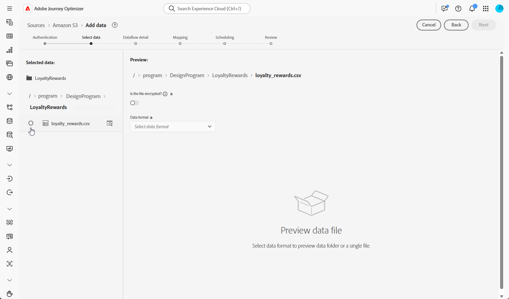

# Acquisire i dati {#ingest-data}

>[!IMPORTANT]
>
>Per modificare l’origine dati per un set di dati, devi prima eliminare il flusso di dati esistente prima di crearne uno nuovo che faccia riferimento allo stesso set di dati e alla nuova origine.
>
>Adobe Experience Platform applica una stretta relazione uno-a-uno tra flussi di dati e set di dati. Questo consente di mantenere la sincronizzazione tra l’origine e il set di dati per un’acquisizione incrementale accurata.

Adobe Experience Platform consente di acquisire dati da origini esterne e allo stesso tempo di strutturare, etichettare e migliorare i dati in arrivo tramite i servizi Platform. È possibile acquisire dati da diverse origini, ad esempio applicazioni Adobe, archivi basati su cloud, database e molte altre.

Un set di dati è un costrutto di archiviazione e gestione per una raccolta di dati, in genere una tabella, che contiene uno schema (colonne) e dei campi (righe). I dati acquisiti correttamente in Experience Platform vengono memorizzati nel data lake come set di dati.

## Origini supportate per le campagne orchestrate {#supported}

Le seguenti origini sono supportate per l’utilizzo con campagne orchestrate:

<table>
  <thead>
    <tr>
      <th>Tipo</th>
      <th>Origine</th>
    </tr>
  </thead>
  <tbody>
    <tr>
      <td rowspan="3">Archiviazione cloud</td>
      <td><a href="https://experienceleague.adobe.com/en/docs/experience-platform/sources/ui-tutorials/create/cloud-storage/s3">Amazon S3</a></td>
    </tr>
    <tr>
      <td><a href="https://experienceleague.adobe.com/en/docs/experience-platform/sources/ui-tutorials/create/cloud-storage/google-cloud-storage">Google Cloud Storage</a></td>
    </tr>
    <tr>
      <td><a href="https://experienceleague.adobe.com/en/docs/experience-platform/sources/ui-tutorials/create/cloud-storage/sftp">SFTP</a></td>
    </tr>
      <td rowspan="4">Data Warehouse cloud</td>
      <td><a href="https://experienceleague.adobe.com/en/docs/experience-platform/sources/ui-tutorials/create/databases/snowflake">Snowflake</a></td>
    </tr>
    <tr>
      <td><a href="https://experienceleague.adobe.com/en/docs/experience-platform/sources/ui-tutorials/create/databases/bigquery">Google BigQuery</a></td>
    </tr>
    <tr>
      <td><a href="https://experienceleague.adobe.com/en/docs/experience-platform/sources/ui-tutorials/create/cloud-storage/data-landing-zone">Data Landing Zone<a></td>
    </tr>
    <tr>
      <td><a href="https://experienceleague.adobe.com/en/docs/experience-platform/sources/ui-tutorials/create/databases/databricks">Azure Databricks</a></td>
    </tr>
    <tr>
      <td rowspan="3">Caricamenti basati su file</td>
      <td><a href="https://experienceleague.adobe.com/en/docs/experience-platform/sources/ui-tutorials/create/local-system/local-file-upload">Caricamento file locale<a></td>
    </tr>

</tbody>
</table>

## Linee guida per l’igiene dei dati dello schema basato su modelli {#cdc}

Per i set di dati abilitati con **[!UICONTROL Change data capture]**, tutte le modifiche dei dati, comprese le eliminazioni, vengono automaticamente riflesse dal sistema di origine in Adobe Experience Platform.

Poiché le campagne Adobe Journey Optimizer richiedono che tutti i set di dati onboarded siano abilitati con **[!UICONTROL Change data capture]**, è responsabilità del cliente gestire le eliminazioni all&#39;origine. Tutti i record eliminati dal sistema di origine verranno rimossi automaticamente dal set di dati corrispondente in Adobe Experience Platform.

Per eliminare i record tramite l&#39;acquisizione basata su file, il file di dati del cliente deve contrassegnare il record utilizzando un valore `D` nel campo `Change Request Type`. Questo indica che il record deve essere eliminato in Adobe Experience Platform, rispecchiando il sistema di origine.

Se il cliente desidera eliminare i record solo da Adobe Experience Platform senza influire sui dati di origine originali, sono disponibili le seguenti opzioni:

* **Proxy o tabella pulita per la replica dell&#39;acquisizione dati di modifica**

  Il cliente può creare un proxy o una tabella di origine bonificata per controllare quali record vengono replicati in Adobe Experience Platform. Le eliminazioni possono quindi essere gestite in modo selettivo da questa tabella intermedia.

* **Eliminazione tramite Data Distiller**

  Se concesso in licenza, **Data Distiller** può essere utilizzato per supportare operazioni di eliminazione direttamente in Adobe Experience Platform, indipendentemente dal sistema di origine.

  [Ulteriori informazioni su Data Distiller](https://experienceleague.adobe.com/en/docs/experience-platform/query/data-distiller/overview)

## Configurare un flusso di dati

In questo esempio viene illustrato come configurare un flusso di dati per l’acquisizione di dati strutturati in Adobe Experience Platform. Il flusso di dati configurato supporta l’acquisizione automatizzata e pianificata e consente aggiornamenti in tempo reale.

1. Dal menu **[!UICONTROL Connessioni]**, accedi al menu **[!UICONTROL Origini]**.

1. Scegli la tua origine in base alle [origini supportate per le campagne orchestrate](#supported).

   

1. Connetti l’account Cloud Storage o Google Cloud Storage se hai scelto sorgenti basate su cloud.

   

1. Scegli i dati da acquisire in Adobe Experience Platform.

   

1. Dalla pagina **[!UICONTROL Dettagli set di dati]**, selezionare **[!UICONTROL Abilita acquisizione dati modifica]** per visualizzare solo i set di dati mappati a schemi basati su modello e che includono sia una chiave primaria che un descrittore di versione.

[Ulteriori informazioni sulle linee guida per l’igiene dei dati degli schemi basati su modelli](#cdc)

   >[!IMPORTANT]
   >
   > Solo per **origini basate su file**, ogni riga nel file di dati deve includere una colonna `_change_request_type` con valori `U` (upsert) o `D` (delete). Senza questa colonna, il sistema non riconoscerà i dati come supporto del rilevamento delle modifiche e l’interruttore Campagna orchestrata non verrà visualizzato, impedendo al set di dati di essere selezionato per il targeting.

   

1. Seleziona il set di dati creato in precedenza e fai clic su **[!UICONTROL Avanti]**.

   

1. Se utilizzi solo origini basate su file, dalla finestra **[!UICONTROL Seleziona dati]**, carica i file locali e visualizzane in anteprima la struttura e il contenuto.

   La dimensione massima supportata è 100 MB.

1. Nella finestra **[!UICONTROL Mapping]**, verifica che ogni attributo del file di origine sia mappato correttamente con i campi corrispondenti nello schema di destinazione. [Ulteriori informazioni sulle dimensioni di targeting](target-dimension.md).

   Al termine, fai clic su **[!UICONTROL Avanti]**.

   

1. Configura il flusso di dati **[!UICONTROL Pianificazione]** in base alla frequenza desiderata.

1. Fai clic su **[!UICONTROL Fine]** per creare il flusso di dati. Viene eseguito automaticamente in base alla pianificazione definita.

1. Dal menu **[!UICONTROL Connessioni]**, seleziona **[!UICONTROL Origini]** e accedi alla scheda **[!UICONTROL Flussi di dati]** per monitorare l’esecuzione del flusso, rivedere i record acquisiti e risolvere eventuali errori.

   

