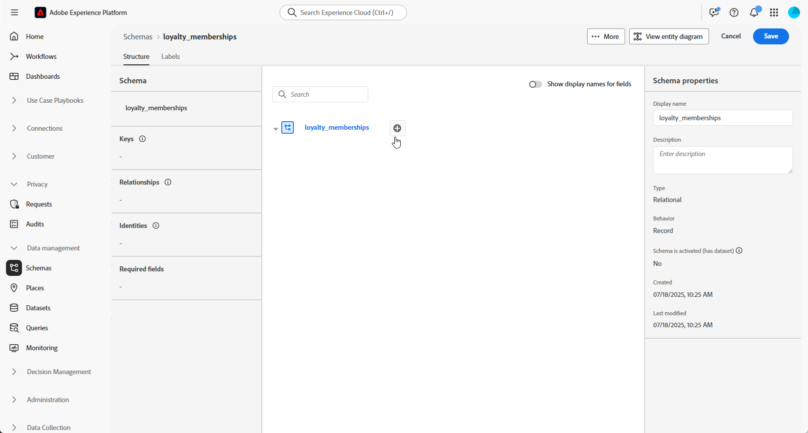
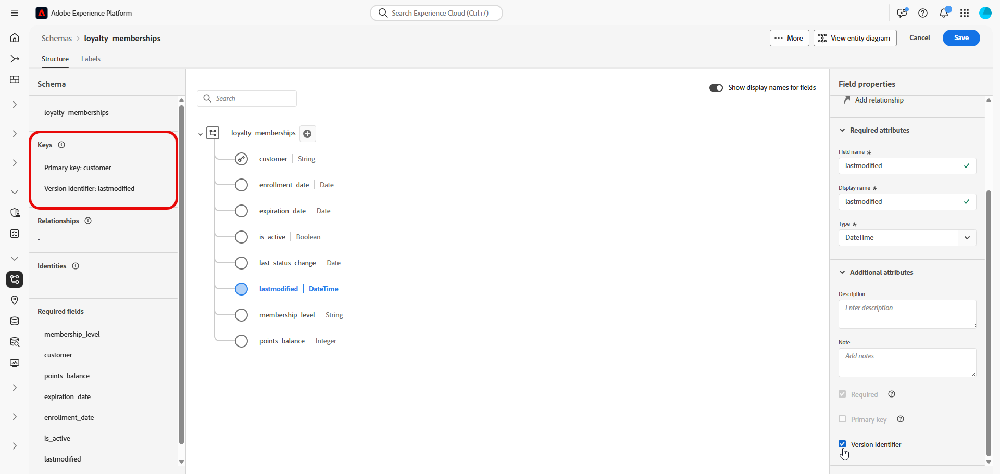

# Impostare uno schema manuale basato su modello {#manual-schema}

Gli schemi basati su modelli possono essere creati direttamente tramite l’interfaccia utente, consentendo la configurazione dettagliata di attributi, chiavi primarie, campi per il controllo delle versioni e relazioni.

L&#39;esempio seguente definisce manualmente lo schema **Iscrizioni fedeltà** per illustrare la struttura richiesta per le campagne orchestrate.

1. [Creare manualmente uno schema basato su modello](#schema) utilizzando l&#39;interfaccia di Adobe Experience Platform.

1. [Aggiungi attributi](#schema-attributes) quali ID cliente, livello di iscrizione e campi di stato.

1. [Collega lo schema](#link-schema) a schemi incorporati, ad esempio Destinatari per il targeting della campagna.

1. [Crea un set di dati](#dataset) in base allo schema e abilitalo per l&#39;utilizzo in campagne orchestrate.

1. [Acquisisci i dati](ingest-data.md) nel set di dati da origini supportate.

➡️ [Ulteriori informazioni sugli schemi manuali basati su modelli sono disponibili nella documentazione di Adobe Experience Platform](https://experienceleague.adobe.com/it/docs/experience-platform/xdm/ui/resources/schemas#create-manually)

## Creare lo schema {#schema}

Inizia creando manualmente un nuovo schema basato su modello in Adobe Experience Platform. Questo processo ti consente di definire la struttura dello schema da zero, incluso il nome e il comportamento.

1. Accedi a Adobe Experience Platform.

1. Passa al menu **[!UICONTROL Gestione dati]** > **[!UICONTROL Schema]**.

1. Fare clic su **[!UICONTROL Crea schema]**.

1. Seleziona **[!UICONTROL Basato su modello]** come **Tipo di schema**.

   {zoomable="yes"}

1. Scegli **[!UICONTROL Crea manualmente]** per creare lo schema aggiungendo manualmente i campi.

1. Immetti il nome visualizzato dello **[!UICONTROL schema]**.

   {zoomable="yes"}

1. Fai clic su **Fine** per procedere con la creazione dello schema.

Ora puoi iniziare ad aggiungere attributi allo schema per definirne la struttura.

## Aggiungere attributi allo schema {#schema-attributes}

Quindi, aggiungi gli attributi per definire la struttura dello schema. Questi campi rappresentano i punti dati chiave utilizzati nelle campagne orchestrate, ad esempio gli identificatori dei clienti, i dettagli di iscrizione e le date delle attività. Definendoli accuratamente si garantiscono personalizzazione, segmentazione e tracciamento affidabili.

Qualsiasi schema utilizzato per il targeting deve includere almeno un campo di identità di tipo `String` con uno spazio dei nomi di identità associato. Questo garantisce la compatibilità con le funzionalità di targeting e risoluzione delle identità di Adobe Journey Optimizer.

+++Le seguenti funzioni sono supportate durante la creazione di schemi basati su modelli in Adobe Experience Platform

* **ENUM**\
  I campi ENUM sono supportati sia nella creazione manuale dello schema basata su DDL, che consente di definire gli attributi con un set fisso di valori consentiti.

* **Etichetta schema per governance dei dati**\
  L’etichettatura è supportata a livello di campo dello schema per applicare i criteri di governance dei dati, ad esempio il controllo degli accessi e le restrizioni di utilizzo. Per ulteriori dettagli, consulta [Documentazione di Adobe Experience Platform](https://experienceleague.adobe.com/docs/experience-platform/xdm/home.html?lang=it).

* **Chiave composita**\
  Le chiavi primarie composite sono supportate nelle definizioni di schemi basate su modelli, consentendo l’utilizzo di più campi insieme per identificare in modo univoco i record.

+++

1. Nell&#39;area di lavoro, fai clic su  accanto al **nome schema** per iniziare ad aggiungere attributi.

   {zoomable="yes"}

1. Immetti l&#39;attributo **[!UICONTROL Nome campo]**, **[!UICONTROL Nome visualizzato]** e **[!UICONTROL Tipo]**.

   In questo esempio, sono stati aggiunti allo schema **Appartenenze fedeltà** gli attributi descritti nella tabella seguente.

   +++ Attributi, esempi

   | Nome attributo | Tipo di dati | Attributi aggiuntivi |
   |-|-|-|
   | cliente | STRINGA | Chiave primaria |
   | livello_di_iscrizione | STRINGA | Obbligatorio |
   | points_balance | NUMERO INTERO | Obbligatorio |
   | enrollment_date | DATA | Obbligatorio |
   | last_status_change | DATA | Obbligatorio |
   | data_scadenza | DATA | - |
   | is_active | BOOLEANO | Obbligatorio |
   | ultima modifica | DATETIME | Obbligatorio |

   +++ 

1. Assegna i campi appropriati come **[!UICONTROL Chiave primaria]** e **[!UICONTROL Descrittore versione]**.

   Quando crei uno schema manuale, accertati di includere i seguenti campi essenziali:

   * Almeno una chiave primaria
   * Un identificatore di versione, ad esempio un campo `lastmodified` di tipo `datetime` o `number`.
   * Per l&#39;acquisizione Change Data Capture (CDC), una colonna speciale denominata `_change_request_type` di tipo `String` che indica il tipo di modifica dei dati (ad esempio, inserimento, aggiornamento, eliminazione) e abilita l&#39;elaborazione incrementale. `_change_request_type` non deve far parte dello schema della tabella, deve essere aggiunto solo al file di dati durante l&#39;acquisizione.

   {zoomable="yes"}

1. Fai clic su **[!UICONTROL Salva]**.

Dopo aver creato e salvato gli attributi, puoi collegare lo schema con altri schemi relazionali definendo relazioni.

➡️ [Ulteriori informazioni sugli schemi relazionali nella documentazione di Adobe Experience Platform](https://experienceleague.adobe.com/it/docs/experience-platform/xdm/schema/relational#how-relational-schemas-differ-from-standard-xdm-schemas)

## Collegare gli schemi {#link-schema}

La creazione di una relazione tra due schemi consente di migliorare le campagne orchestrate con dati che vanno oltre lo schema di profilo principale.

1. Dallo schema appena creato, seleziona l&#39;attributo che desideri utilizzare come collegamento e fai clic su **[!UICONTROL Aggiungi relazione]**.

   {zoomable="yes"}

1. Scegli lo **[!UICONTROL schema di riferimento]** e il **[!UICONTROL campo di riferimento]** con cui stabilire la relazione.

   In questo esempio, l&#39;attributo `customer` è collegato allo schema `recipients`.

   {zoomable="yes"}

1. Immetti un nome di relazione dallo schema corrente e dallo schema di riferimento.

1. Una volta configurata, fai clic su **[!UICONTROL Applica]**.

## Creare un set di dati per lo schema {#dataset}

Dopo aver definito lo schema, ora puoi creare un set di dati basato su di esso. Il set di dati memorizza i dati acquisiti e deve essere abilitato affinché le campagne orchestrate siano accessibili.

1. Passa al menu **[!UICONTROL Gestione dati]** > **[!UICONTROL Set di dati]** e fai clic su **[!UICONTROL Crea set di dati]**.

   {zoomable="yes"}

1. Seleziona **[!UICONTROL Crea set di dati dallo schema]**.

1. Scegli lo schema creato in precedenza, qui **Appartenenze fedeltà**, quindi fai clic su **[!UICONTROL Successivo]**.

   {zoomable="yes"}

1. Immetti un **[!UICONTROL Nome]** per il **[!UICONTROL Set di dati]** e fai clic su **[!UICONTROL Fine]**.

Ora devi abilitare il set di dati per le campagne orchestrate.

## Abilitare il set di dati per le campagne orchestrate {#enable}

>[!CONTEXTUALHELP]
>id="ajo_oc_enable_dataset_for_oc"
>title="Campagne orchestrate"
>abstract="Dopo aver creato il set di dati, devi abilitarlo esplicitamente per le campagne orchestrate. Questo passaggio garantisce che il set di dati sia disponibile per l’orchestrazione e la personalizzazione in tempo reale in Adobe Journey Optimizer."

Dopo aver creato il set di dati, devi abilitarlo esplicitamente per le campagne orchestrate. Questo passaggio garantisce che il set di dati sia disponibile per l’orchestrazione e la personalizzazione in tempo reale in Adobe Journey Optimizer.

Consulta la [documentazione di Adobe Developer](https://developer.adobe.com/journey-optimizer-apis/references/orchestrated-campaign-dataset/#tag/DatasetEnablement) per convalidare o abilitare l&#39;estensione Orchestrated Campaign sul set di dati.

1. Individua il set di dati nell&#39;elenco **[!UICONTROL Set di dati]**.

1. Dalle impostazioni **[!UICONTROL Set di dati]**, abilita l&#39;opzione **Campagne orchestrate** per contrassegnare il set di dati disponibile per l&#39;utilizzo nelle campagne orchestrate.

   {zoomable="yes"}

1. Attendi alcuni minuti per il completamento del processo di abilitazione. Tieni presente che l’acquisizione dei dati e l’utilizzo della campagna saranno possibili solo dopo che questa impostazione sarà stata completamente attivata.

Ora puoi iniziare ad acquisire i dati nello schema utilizzando l’origine che preferisci.

➡️ [Scopri come acquisire i dati](ingest-data.md)
