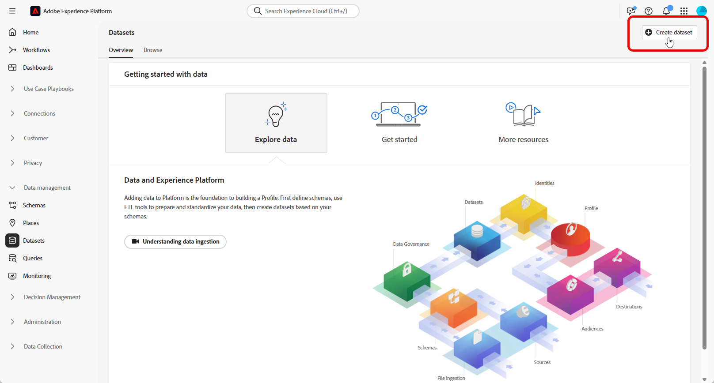

# Impostare uno schema relazionale manuale {#manual-schema}

+++ Sommario

| Benvenuto in campagne orchestrate | Lanciare la prima campagna orchestrata | Eseguire query sul database | Attività di campagne orchestrate |
|---|---|---|---|
| [Introduzione alle campagne orchestrate](gs-orchestrated-campaigns.md)  Creazione e gestione di schemi e set di dati relazionali: <ul><li>[Introduzione a schemi e set di dati](gs-schemas.md)</li><li>[Schema manuale](manual-schema.md)</li><li>[Schema di caricamento file](file-upload-schema.md)</li><li>[Acquisire dati](ingest-data.md)</li></ul>[Accedere e gestire campagne orchestrate](access-manage-orchestrated-campaigns.md)  [Passaggi chiave per creare una campagna orchestrata](gs-campaign-creation.md) | [Crea e pianifica la campagna](create-orchestrated-campaign.md)  [Orchestrazione attività](orchestrate-activities.md)  [Avvia e monitora la campagna](start-monitor-campaigns.md)  [Generazione rapporti](reporting-campaigns.md) | [Utilizzare il generatore di regole](orchestrated-rule-builder.md)  [Creare la prima query](build-query.md)  [Modificare le espressioni](edit-expressions.md)  [Retargeting](retarget.md) | [Inizia a usare le attività](activities/about-activities.md)  Attività: [Partecipa e unisci](activities/and-join.md) - [Genera pubblico](activities/build-audience.md) - [Modifica dimensione](activities/change-dimension.md) - [Attività canale](activities/channels.md) - [Combina](activities/combine.md) - [Deduplicazione](activities/deduplication.md) - [Arricchimento](activities/enrichment.md) - [Fork](activities/fork.md) - [Riconciliazione](activities/reconciliation.md) - [Salva pubblico](activities/save-audience.md) - [Dividi](activities/split.md) - [Attendi](activities/wait.md) |

{style="table-layout:fixed"}

+++

 

>[!BEGINSHADEBOX]

 

Il contenuto di questa pagina non è definitivo e potrebbe essere soggetto a modifiche.

>[!ENDSHADEBOX]

Gli schemi relazionali possono essere creati direttamente tramite l’interfaccia utente, consentendo la configurazione dettagliata di attributi, chiavi primarie, campi per il controllo delle versioni e relazioni.

L&#39;esempio seguente definisce manualmente lo schema **Iscrizioni fedeltà** per illustrare la struttura richiesta per le campagne orchestrate.

1. [Creare manualmente uno schema relazionale](#schema) tramite l&#39;interfaccia di Adobe Experience Platform.

1. [Aggiungi attributi](#schema-attributes) quali ID cliente, livello di iscrizione e campi di stato.

1. [Collega lo schema](#link-schema) a schemi incorporati, ad esempio Destinatari per il targeting della campagna.

1. [Crea un set di dati](#dataset) in base allo schema e abilitalo per l&#39;utilizzo in campagne orchestrate.

1. [Acquisisci dati](ingest-data.md) nel set di dati da origini supportate.

## Creare lo schema {#schema}

Inizia creando manualmente un nuovo schema relazionale in Adobe Experience Platform. Questo processo ti consente di definire la struttura dello schema da zero, incluso il nome e il comportamento.

1. Accedi a Adobe Experience Platform.

1. Passa al menu **[!UICONTROL Gestione dati]** > **[!UICONTROL Schema]**.

1. Fare clic su **[!UICONTROL Crea schema]**.

1. Seleziona **[!UICONTROL Relazionale]** come **tipo di schema**.

   {zoomable="yes"}

1. Scegli **[!UICONTROL Crea manualmente]** per creare lo schema aggiungendo manualmente i campi.

1. Immetti il nome visualizzato dello **[!UICONTROL schema]**.

1. Scegli **[!UICONTROL Record]** come **[!UICONTROL comportamento schema]**.

   {zoomable="yes"}

1. Fai clic su **Fine** per procedere con la creazione dello schema.

Ora puoi iniziare ad aggiungere attributi allo schema per definirne la struttura.

## Aggiungere attributi allo schema {#schema-attributes}

Quindi, aggiungi gli attributi per definire la struttura dello schema. Questi campi rappresentano i punti di dati chiave utilizzati nelle campagne orchestrate, ad esempio gli identificatori dei clienti, i dettagli di iscrizione e le date delle attività. Definendoli accuratamente si garantiscono personalizzazione, segmentazione e tracciamento affidabili.

1. Nell&#39;area di lavoro, fai clic su  accanto al **nome schema** per iniziare ad aggiungere attributi.

   {zoomable="yes"}

1. Immetti l&#39;attributo **[!UICONTROL Nome campo]**, **[!UICONTROL Nome visualizzato]** e **[!UICONTROL Tipo]**.

   In questo esempio, sono stati aggiunti allo schema **Appartenenze fedeltà** gli attributi descritti nella tabella seguente.

+++ Attributi, esempi

   | Nome attributo | Tipo di dati | Attributi aggiuntivi |
   |-|-|-|
   | cliente | STRINGA | Chiave primaria |
   | livello_di_iscrizione | STRINGA | Obbligatorio |
   | points_balance | NUMERO INTERO | Obbligatorio |
   | enrollment_date | DATA | Obbligatorio |
   | last_status_change | DATA | Obbligatorio |
   | data_scadenza | DATA | - |
   | is_active | BOOLEANO | Obbligatorio |
   | ultima modifica | DATETIME | Obbligatorio |

+++

1. Assegna i campi appropriati come **[!UICONTROL Chiave primaria]** e **[!UICONTROL Descrittore versione]**.

   La **[!UICONTROL chiave primaria]** garantisce che ogni record sia identificato in modo univoco, mentre il **[!UICONTROL descrittore di versione]** acquisisce gli aggiornamenti nel tempo, abilitando Change Data Capture e supportando il mirroring dei dati.

   {zoomable="yes"}

1. Fai clic su **[!UICONTROL Salva]**.

Una volta creati gli attributi, devi collegare lo schema appena creato con uno schema integrato.

## Collegare gli schemi {#link-schema}

Creare una relazione tra due schemi consente di arricchire le campagne orchestrate con dati memorizzati al di fuori dello schema del profilo principale.

1. Dallo schema appena creato, seleziona l&#39;attributo che desideri utilizzare come collegamento e fai clic su **[!UICONTROL Aggiungi relazione]**.

   {zoomable="yes"}

1. Scegli lo **[!UICONTROL schema di riferimento]** e il **[!UICONTROL campo di riferimento]** con cui stabilire la relazione.

   In questo esempio, l&#39;attributo `customer` è collegato allo schema `recipients`.

   {zoomable="yes"}

1. Immetti un nome di relazione dallo schema corrente e dallo schema di riferimento.

1. Una volta configurata, fai clic su **[!UICONTROL Applica]**.

Una volta stabilita la relazione, devi creare un set di dati basato sullo schema.

## Creare un set di dati per lo schema {#dataset}

Dopo aver definito lo schema, il passaggio successivo consiste nel creare un set di dati basato su di esso. Questo set di dati archivia i dati acquisiti e deve essere abilitato per le campagne orchestrate affinché sia accessibile in Adobe Journey Optimizer. L’abilitazione di questa opzione assicura che il set di dati sia riconosciuto per l’utilizzo in flussi di lavoro di orchestrazione e personalizzazione in tempo reale.

1. Passa al menu **[!UICONTROL Gestione dati]** > **[!UICONTROL Set di dati]** e fai clic su **[!UICONTROL Crea set di dati]**.

   {zoomable="yes"}

1. Seleziona **[!UICONTROL Crea set di dati dallo schema]**.

1. Scegli lo schema creato in precedenza, qui **Appartenenze fedeltà**, quindi fai clic su **[!UICONTROL Successivo]**.

   {zoomable="yes"}

1. Immetti un **[!UICONTROL Nome]** per il **[!UICONTROL Set di dati]** e fai clic su **[!UICONTROL Fine]**.

1. Abilita l&#39;opzione **Campagne orchestrate** per rendere il set di dati disponibile per l&#39;utilizzo nelle campagne AJO.

   L’attivazione potrebbe richiedere alcuni minuti. L’acquisizione dei dati è possibile solo dopo che l’opzione è stata completamente attivata.

   {zoomable="yes"}

Ora puoi iniziare ad acquisire i dati nello schema utilizzando l’origine che preferisci.

➡️ [Scopri come acquisire i dati](ingest-data.md)
