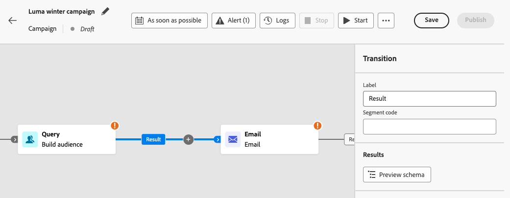

# Orchestrare le attività campagna {#orchestrate}

+++ Sommario

| Benvenuto in campagne orchestrate | Lanciare la prima campagna orchestrata | Eseguire query sul database | Attività di campagne orchestrate |
|---|---|---|---|
| [Introduzione alle campagne orchestrate](gs-orchestrated-campaigns.md)  [Passaggi di configurazione](configuration-steps.md)  [Accedere e gestire le campagne orchestrate](access-manage-orchestrated-campaigns.md) | [Passaggi chiave per la creazione orchestrata della campagna](gs-campaign-creation.md)  [Creare e pianificare la campagna](create-orchestrated-campaign.md)  [Orchestrare le attività](orchestrate-activities.md)  <b>[Avviare e monitorare la campagna](start-monitor-campaigns.md)</b>  [Generazione rapporti](reporting-campaigns.md) | [Utilizzare il generatore di regole](orchestrated-rule-builder.md)  [Creare la prima query](build-query.md)  [Modificare le espressioni](edit-expressions.md)  [Retargeting](retarget.md) | [Inizia a usare le attività](activities/about-activities.md)  Attività: [Partecipa e unisci](activities/and-join.md) - [Genera pubblico](activities/build-audience.md) - [Modifica dimensione](activities/change-dimension.md) - [Attività canale](activities/channels.md) - [Combina](activities/combine.md) - [Deduplicazione](activities/deduplication.md) - [Arricchimento](activities/enrichment.md) - [Fork](activities/fork.md) - [Riconciliazione](activities/reconciliation.md) - [Salva pubblico](save-audience.md) - [Dividi](activities/split.md) - [Attendi](activities/wait.md) |

{style="table-layout:fixed"}

+++

 

Dopo aver [creato una campagna orchestrata](gs-campaign-creation.md), puoi iniziare a orchestrare le diverse attività che eseguirà. A questo scopo, viene fornita un’area di lavoro visiva che consente di creare un diagramma orchestrato per una campagna. All’interno di questo diagramma, puoi aggiungere varie attività e collegarle in ordine sequenziale.

## Aggiungere attività {#add}

In questa fase della configurazione, il diagramma viene visualizzato con un’icona iniziale che rappresenta l’inizio della campagna orchestrata. Per aggiungere la prima attività, fare clic sul pulsante **+** connesso all&#39;icona Start.

Viene visualizzato un elenco di attività che possono essere aggiunte al diagramma. Le attività disponibili dipendono dalla posizione all’interno del diagramma orchestrato della campagna. Ad esempio, quando aggiungi la prima attività, puoi avviare la campagna orchestrata eseguendo il targeting di un pubblico, suddividendo il percorso della campagna orchestrata o impostando un&#39;attività **Attendi** per ritardare l&#39;esecuzione della campagna orchestrata. Al contrario, dopo un&#39;attività di **Generazione pubblico**, puoi perfezionare il target con le attività di targeting, inviare una consegna al pubblico con le attività del canale o organizzare il processo della campagna orchestrato con le attività di controllo del flusso.

{zoomable="yes"}

Dopo aver aggiunto un’attività al diagramma, viene visualizzato un riquadro a destra che consente di configurarla con impostazioni specifiche. Informazioni dettagliate su come configurare ogni attività sono disponibili in [questa sezione](activities/about-activities.md).

{zoomable="yes"}

Ripeti questo processo per aggiungere tutte le attività desiderate, a seconda delle attività da eseguire per la campagna orchestrata. Puoi anche inserire una nuova attività tra due attività. A tale scopo, fare clic sul pulsante **+** sulla transizione tra le attività, selezionare l&#39;attività desiderata e configurarla nel riquadro di destra.

Hai la possibilità di personalizzare il nome delle transizioni tra ciascuna attività. A questo scopo, seleziona la transizione e modifica la relativa etichetta nel riquadro a destra.

### Barra degli strumenti dell’area di lavoro {#toolbar}

La barra degli strumenti dell’area di lavoro offre opzioni per manipolare facilmente le attività e navigare nell’area di lavoro:

 Seleziona più attività per eliminarle tutte contemporaneamente o copiarle e incollarle. [Scopri come copiare e incollare le attività](#copy)

 Cambia l&#39;area di lavoro verticalmente.

 Adatta il livello di zoom dell&#39;area di lavoro allo schermo.

  Zoom indietro o nell&#39;area di lavoro.

 Apre un&#39;istantanea dell&#39;area di lavoro che mostra che ci si trova.

### Gestire le attività {#manage}

Quando si aggiungono attività, nel riquadro delle proprietà sono disponibili pulsanti di azione che consentono di eseguire più operazioni.

 Elimina l&#39;attività dall&#39;area di lavoro.

  Disabilita/Abilita l&#39;attività. Quando viene eseguita la campagna orchestrata, le attività disabilitate e le attività seguenti sullo stesso percorso non vengono eseguite e la campagna orchestrata viene interrotta.

  Sospendi/Riprendi l&#39;attività. Quando la campagna orchestrata viene eseguita, si interrompe all’attività in pausa. L’attività corrispondente e tutte quelle che la seguono nello stesso percorso non vengono eseguite.

 Copia l&#39;attività. [Scopri come copiare e incollare le attività](#copy)

 Accedi ai registri e alle attività dell&#39;attività.

Diverse attività di **targeting**, come **Combina** o **Deduplicazione**, ti consentono di elaborare il gruppo rimanente e includerlo in un&#39;ulteriore transizione in uscita. Ad esempio, se utilizzi un&#39;attività **Split**, il complemento è costituito dal gruppo che non corrisponde a nessuno dei sottoinsiemi definiti in precedenza. Per utilizzare questa funzionalità, attivare l&#39;opzione **[!UICONTROL Genera complemento]**.

### Attività di copia e incolla {#copy}

Puoi copiare le attività e incollarle in qualsiasi area di lavoro della campagna orchestrata. La campagna di destinazione può trovarsi in una scheda del browser diversa.

* Per copiare un&#39;attività, fare clic sull&#39;icona  nel riquadro delle proprietà dell&#39;attività.
* Per copiare più attività, fare clic sull&#39;icona  nella barra degli strumenti dell&#39;area di lavoro.

| Copia un’attività | Copiare più attività |
|  ---  |  ---  |
| {width="200" align="center" zoomable="yes"} | {width="200" align="center" zoomable="yes"} |

Per incollare le attività, fare clic sul pulsante **+** su una transizione e selezionare &quot;Incolla x attività&quot;.

{zoomable="yes"}{width="50%"}

## Esempio di diagramma {#example}

Di seguito è riportato un esempio di campagna orchestrata progettata per inviare un messaggio e-mail a tutti i clienti che hanno effettuato un acquisto di almeno 100$, escludendo al contempo tutti i clienti che hanno meno di 50 punti fedeltà.

{zoomable="yes"}

A questo scopo, sono state aggiunte le seguenti attività:

* Un&#39;attività **[!UICONTROL Fork]** divide la campagna orchestrata in tre percorsi.
* Le attività **[!UICONTROL Genera pubblico]** sono indirizzate ai tre gruppi di clienti:

   * Clienti con un’e-mail,
   * Clienti che hanno acquistato almeno 100$
   * Clienti con meno di 50 punti fedeltà.

* Un&#39;attività **[!UICONTROL Combina]** i clienti con un&#39;e-mail e quelli che hanno effettuato un acquisto di almeno 100$,
* Un&#39;attività **[!UICONTROL Combina]** esclude i clienti con meno di 50 punti fedeltà,
* Un&#39;attività **[!UICONTROL Email delivery]** invia un&#39;e-mail ai clienti risultanti.

## Passaggi successivi {#next}

Dopo aver progettato correttamente il diagramma della campagna orchestrata, puoi eseguire la campagna orchestrata e tenere traccia dell’avanzamento delle sue varie attività. [Scopri come avviare una campagna orchestrata e monitorarne l&#39;esecuzione](start-monitor-campaigns.md)
