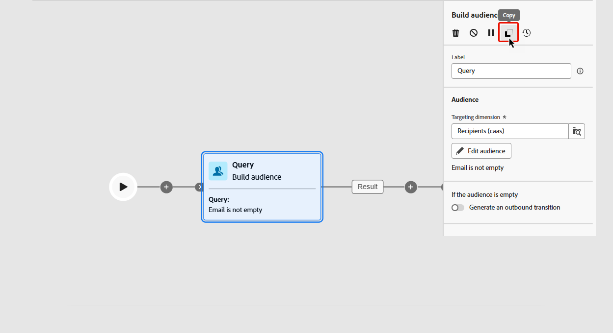

# Orchestrare le attività delle campagne orchestrate {#orchestrate}

+++ Sommario

| Benvenuto in campagne orchestrate | Avviare la prima campagna orchestrata | Eseguire query sul database | Attività di campagne orchestrate |
|---|---|---|---|
| [Introduzione alle campagne orchestrate](gs-orchestrated-campaigns.md)  [Passaggi di configurazione](configuration-steps.md)  [Passaggi chiave per la creazione di campagne orchestrate](gs-campaign-creation.md) | [Creare una campagna orchestrata](create-orchestrated-campaign.md)  [Orchestrare le attività](orchestrate-activities.md)  [Inviare messaggi con le campagne orchestrate](send-messages.md)  [Avviare e monitorare la campagna](start-monitor-campaigns.md)  [Generazione rapporti](reporting-campaigns.md) | [Utilizzare Query Modeler](orchestrated-query-modeler.md)  [Creare la prima query](build-query.md)  [Modificare le espressioni](edit-expressions.md) | [Inizia a usare le attività](activities/about-activities.md)  Attività: [Partecipa/Partecipa](activities/and-join.md) - [Genera pubblico](activities/build-audience.md) - [Modifica dimensione](activities/change-dimension.md) - [Combina](activities/combine.md) - [Deduplicazione](activities/deduplication.md) - [Arricchimento](activities/enrichment.md) - [Fork](activities/fork.md) - [Riconciliazione](activities/reconciliation.md) - [Dividi](activities/split.md) - [Attendi](activities/wait.md) |

{style="table-layout:fixed"}

+++

 

Dopo aver [creato una campagna orchestrata](gs-campaign-creation.md), dal menu della campagna orchestrata o all&#39;interno di una campagna, puoi iniziare a orchestrare le diverse attività che eseguirà. A questo scopo, viene fornita un’area di lavoro visiva che consente di creare un diagramma orchestrato per una campagna. All’interno di questo diagramma, puoi aggiungere varie attività e collegarle in ordine sequenziale.

## Aggiungere attività {#add}

In questa fase della configurazione, il diagramma viene visualizzato con un’icona iniziale che rappresenta l’inizio della campagna orchestrata. Per aggiungere la prima attività, fare clic sul pulsante **+** connesso all&#39;icona Start.

Viene visualizzato un elenco di attività che possono essere aggiunte al diagramma. Le attività disponibili dipendono dalla posizione all’interno del diagramma orchestrato della campagna. Ad esempio, quando aggiungi la prima attività, puoi avviare la campagna orchestrata eseguendo il targeting di un pubblico, suddividendo il percorso della campagna orchestrata o impostando un&#39;attività **Attendi** per ritardare l&#39;esecuzione della campagna orchestrata. Al contrario, dopo un&#39;attività di **Generazione pubblico**, puoi perfezionare il target con le attività di targeting, inviare una consegna al pubblico con le attività del canale o organizzare il processo della campagna orchestrato con le attività di controllo del flusso.

{zoomable="yes"}

Una volta aggiunta un’attività al diagramma, viene visualizzato un riquadro a destra che consente di configurare l’attività appena aggiunta con impostazioni specifiche. Informazioni dettagliate su come configurare ogni attività sono disponibili in [questa sezione](activities/about-activities.md).

{zoomable="yes"}

Ripeti questo processo per aggiungere tutte le attività desiderate, a seconda delle attività da eseguire per la campagna orchestrata. Puoi anche inserire una nuova attività tra due attività. A tale scopo, fare clic sul pulsante **+** sulla transizione tra le attività, selezionare l&#39;attività desiderata e configurarla nel riquadro di destra.

Per rimuovere un&#39;attività, selezionarla nell&#39;area di lavoro e fare clic sull&#39;icona **Elimina** nelle proprietà dell&#39;attività.

>[!TIP]
>
>Hai la possibilità di personalizzare il nome delle transizioni tra ciascuna attività. A questo scopo, seleziona la transizione e modifica la relativa etichetta nel riquadro a destra.

## Barra degli strumenti {#toolbar}

La barra degli strumenti situata nell’angolo superiore destro dell’area di lavoro offre opzioni per manipolare facilmente le attività e navigare nell’area di lavoro:

* **Modalità di selezione multipla**: selezionare più attività per eliminarle tutte contemporaneamente oppure copiarle e incollarle. Consulta [questa sezione](#copy).
* **Ruota**: cambia l&#39;area di lavoro verticalmente.
* **Adatta allo schermo**: adatta il livello di zoom dell&#39;area di lavoro allo schermo.
* **Zoom indietro** / **Zoom avanti**: Zoom indietro o nell&#39;area di lavoro.
* **Mappa di visualizzazione**: apre uno snapshot dell&#39;area di lavoro che mostra che ci si trova.

{zoomable="yes"}{width="50%"}

## Gestire le attività {#manage}

Quando si aggiungono attività, nel riquadro delle proprietà sono disponibili pulsanti di azione che consentono di eseguire più operazioni.

{zoomable="yes"}

Puoi eseguire le seguenti operazioni:

* **Elimina** l’attività dall’area di lavoro.
* **Disattiva/Attiva** l’attività. Quando viene eseguita la campagna orchestrata, le attività disabilitate e le attività seguenti sullo stesso percorso non vengono eseguite e la campagna orchestrata viene interrotta.
* **Pausa/Riprendi** l’attività. Quando la campagna orchestrata viene eseguita, si interrompe all’attività in pausa. L’attività corrispondente e tutte quelle che la seguono nello stesso percorso non vengono eseguite.
* **Copia** l’attività. Consulta [questa sezione](#copy).
* Accedi a **Registri e attività**.

Diverse attività di **targeting**, come **Combina** o **Deduplicazione**, ti consentono di elaborare il gruppo rimanente e includerlo in un&#39;ulteriore transizione in uscita. Ad esempio, se utilizzi un&#39;attività **Split**, il complemento è costituito dal gruppo che non corrisponde a nessuno dei sottoinsiemi definiti in precedenza. Per utilizzare questa funzionalità, attivare l&#39;opzione **Genera complemento**.

## Spostare o copiare attività {#move-copy}

### Attività di copia e incolla {#copy}

Puoi copiare le attività della campagna orchestrate e incollarle in qualsiasi flusso di lavoro. La campagna orchestrata di destinazione può trovarsi in una scheda del browser diversa.

Per copiare le attività, puoi scegliere tra due opzioni:

* copia un’attività utilizzando il pulsante azione.

  {zoomable="yes"}{width="70%"}

* copia più attività utilizzando il pulsante della barra degli strumenti.

  {zoomable="yes"}{width="70%"}

Per incollare le attività copiate, fare clic sul pulsante **+** su una transizione e selezionare &quot;Incolla attività X&quot;.

{zoomable="yes"}{width="50%"}

<!--
### Move activities and their child nodes {#move}

Journey Optimizer allows you to move an activity, along with the entire content of its child nodes (including all transitions and activities within it) to the end of another transition within the same orchestrated campaign.

This process disconnects the activity and everything in its outbound transition from the initial location, moving it to the new target transition.

To move an activity:

1. Select the activity you wish to move.
1. In the activity's properties pane, click the **Move** button.
1. Select the transition where you want to place the activity and its outbound transition, then confirm.

## Execution options {#execution}

All activities allow you to manage their execution options. Select an activity and click on the **Execution options** button. This lets you define the activity's execution mode and behavior in case of errors.

{zoomable="yes"}{width="70%"}

### Properties

The **Execution** field allows you to define the action to be carried out when the task is started.

The **Maximum execution duration** field allows you to specify a duration such as "30s" or "1h". If the activity is not finished after the duration specified has been elapsed, an alert is triggered. This has no impact on how the orchestrated campaign functions.

The **Time zone** field allows you to select the time zone of the activity. Adobe Journey Optimizer allows you to manage the time differences between multiple countries on the same instance. The setting applied is configured when the instance is created.

**The Affinity** field allows you to force an orchestrated campaign or an orchestrated campaign activity to execute on a particular machine. To do this, you must specify one or several affinities for the orchestrated campaign or activity in question.

The **Behavior** field allows you to define the procedure to follow if asynchronous tasks are used.

### Error management

The **In case of error** field allows you to specify the action to be carried out should the activity encounter an error.

### Initialization script

The **Initialization script** lets you initialize variables or modify activity properties. Click the **Edit code** button and type the snippet of code to execute. The script is called when the activity executes. 

## Example {#example}

Here is an orchestrated campaign example designed to send an email to all customers (other than VIP customers) with an email who are interested in coffee machines.

{zoomable="yes"}{zoomable="yes"}

To achieve this, activities below have been added:

* A **[!UICONTROL Fork]** activity that divides the orchestrated campaign into three paths (one for each set of customer),
* **[!UICONTROL Build audience]** activities to target the three sets of customers:

    * Customers with an email,
    * Customers belonging to the pre-existing "Interrested in Coffee Machine(s)" audience,
    * Customers belonging to the pre-existing "VIP ro reward" audience.

* A **[!UICONTROL Combine]** activity that groups together customers with an email and those interested in coffee machines,
* A **[!UICONTROL Combine]** activity that excludes VIP customers,
* An **[!UICONTROL Email delivery]** activity that sends an email to the resulting customers. 

Once you have completed the orchestrated campaign, add en **[!UICONTROL End]** activity at the end of the diagram. This activity allow you to visually mark the end of a workflow and has no functional impact.

After successfully designing the orchestrated campaign diagram, you can execute the orchestrated campaign and track the progress of its various tasks. [Learn how to start an orchestrated campaign and monitor its execution](start-monitor-campaigns.md)
-->