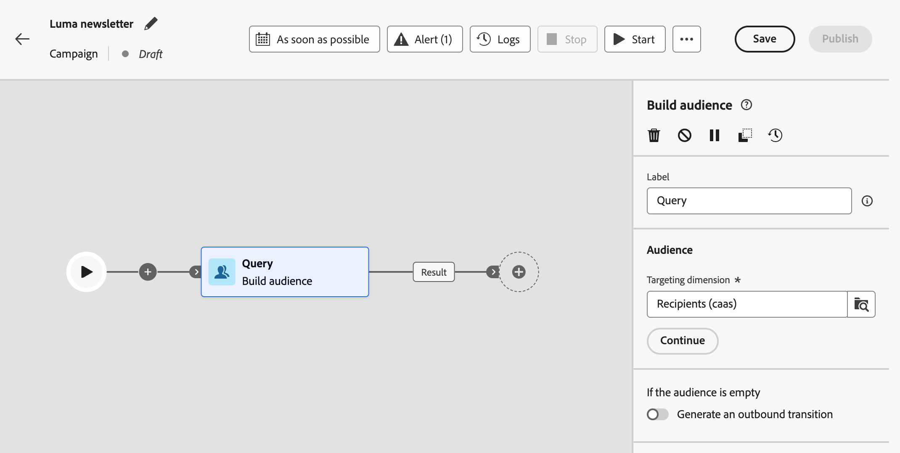
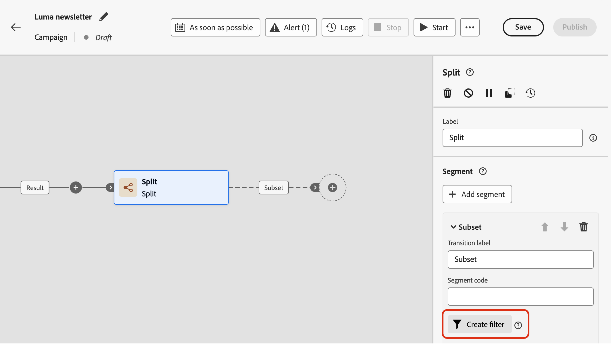
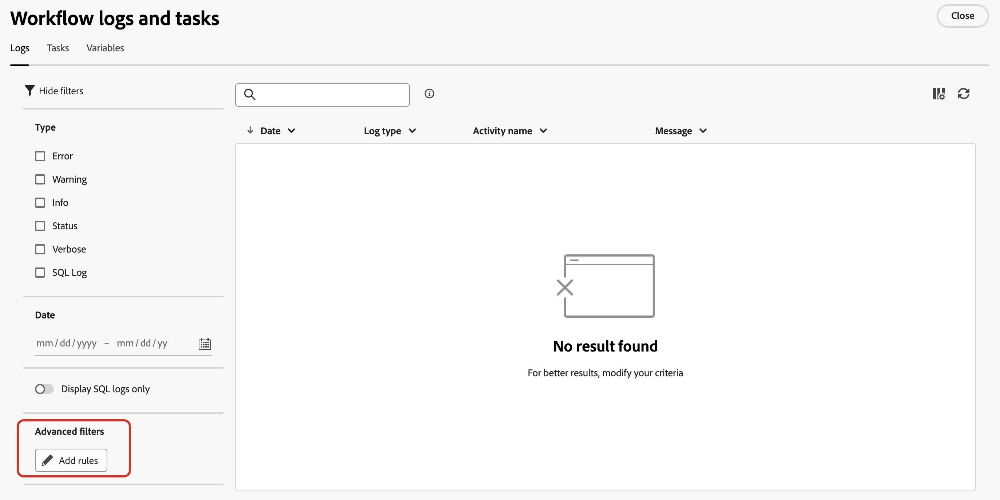
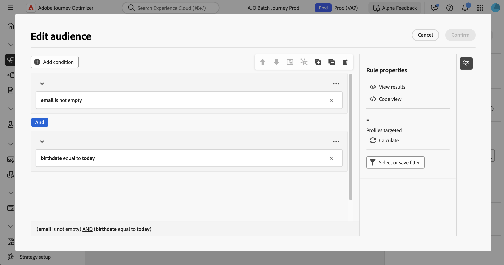

# Utilizzare il generatore di regole {#orchestrated-rule-builder}

Le campagne orchestrate dispongono di un generatore di regole che semplifica il processo di filtro del database in base a vari criteri. Il generatore di regole gestisce in modo efficiente query molto complesse e lunghe, offrendo maggiore flessibilità e precisione.

Supporta anche filtri preimpostati all’interno di condizioni, consentendoti di perfezionare le query con facilità utilizzando espressioni avanzate e operatori per strategie complete di targeting e segmentazione del pubblico.

## Accedere al generatore di regole {#access}

Il generatore di regole è disponibile in ogni contesto in cui è necessario definire regole per filtrare i dati.

| Utilizzo | Esempio |
|  ---  |  ---  |
| **Genera tipi di pubblico**: specifica la popolazione di cui desideri eseguire il targeting nelle campagne orchestrate utilizzando un&#39;attività **[!UICONTROL Genera pubblico]** e crea facilmente nuovi tipi di pubblico su misura per le tue esigenze. [Scopri come creare tipi di pubblico](../orchestrated/activities/build-audience.md) | {width="200" align="center" zoomable="yes"} |
| **Creare condizioni nell’area di lavoro della campagna**: applica le regole nell’area di lavoro della campagna utilizzando un’attività **[!UICONTROL Dividi]**, per allinearle ai requisiti specifici. [Scopri come utilizzare l’attività Dividi](../orchestrated/activities/split.md) | {width="200" align="center" zoomable="yes"} |
| **Creare filtri avanzati**: genera regole per filtrare i dati visualizzati in elenchi quali i registri delle campagne o le dimensioni di targeting. | {width="200" align="center" zoomable="yes"} |

## Interfaccia del generatore di regole {#interface}

Il generatore di regole fornisce un’area di lavoro centrale in cui generare la query e un riquadro delle proprietà che fornisce informazioni sulla regola.

* L’**area di lavoro centrale** è il luogo in cui aggiungere e combinare i diversi componenti per generare la regola. [Scopri come creare una regola](../orchestrated/build-query.md)

* Il riquadro **[!UICONTROL Proprietà regola]** fornisce informazioni sulla regola. Consente di eseguire varie operazioni per verificare la regola e assicurarti che si adatti alle tue esigenze.

  Questo riquadro viene visualizzato quando si genera una query per creare un pubblico. [Scopri come controllare e convalidare la query](build-query.md#check-and-validate-your-query)

## Utilizzare filtri preimpostati

I filtri predefiniti consentono di riutilizzare le query salvate nel generatore di regole, incluse le versioni con parametri. Per informazioni dettagliate su come salvare, applicare e gestire filtri predefiniti, vedere [Operazioni con filtri predefiniti](predefined-filters.md).
