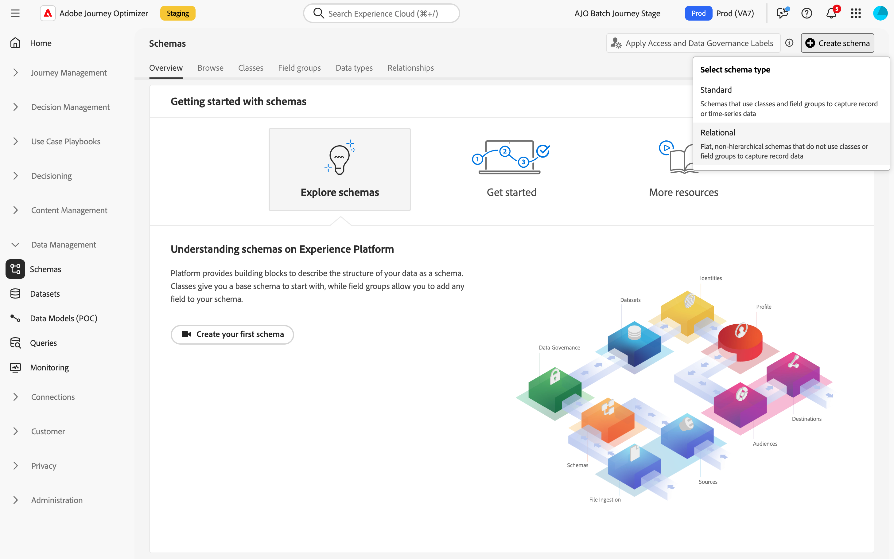

# Creare schemi relazionali {#orchestrated-schemas}

+++ Sommario

| Benvenuto in campagne orchestrate | Avviare la prima campagna orchestrata | Eseguire query sul database | Attività di campagne orchestrate |
|---|---|---|---|
| [Introduzione alle campagne orchestrate](gs-orchestrated-campaigns.md)  [Passaggi di configurazione](configuration-steps.md)  [Passaggi chiave per la creazione di campagne orchestrate](gs-campaign-creation.md) | [Creare una campagna orchestrata](create-orchestrated-campaign.md)  [Impostazioni campagne orchestrate](orchestrated-campaign-settings.md)  [Orchestrare le attività](orchestrate-activities.md)  [Inviare messaggi con campagne orchestrate](send-messages.md)  [Avviare e monitorare la campagna](start-monitor-campaigns.md)  [Generazione rapporti](reporting-campaigns.md) | [Utilizzare il generatore di regole](orchestrated-rule-builder.md)  [Creare la prima query](build-query.md)  [Modificare le espressioni](edit-expressions.md) | [Inizia a usare le attività](activities/about-activities.md)  Attività: [Partecipa/Partecipa](activities/and-join.md) - [Genera pubblico](activities/build-audience.md) - [Modifica dimensione](activities/change-dimension.md) - [Combina](activities/combine.md) - [Deduplicazione](activities/deduplication.md) - [Arricchimento](activities/enrichment.md) - [Fork](activities/fork.md) - [Riconciliazione](activities/reconciliation.md) - [Dividi](activities/split.md) - [Attendi](activities/wait.md) |

{style="table-layout:fixed"}

+++

 

Uno schema rappresenta e convalida la struttura e il formato dei dati. Fornisce una definizione astratta di un oggetto reale (come una persona) e delinea quali dati dovrebbero essere inclusi in ogni istanza di tale oggetto (come nome, data di nascita e così via).

