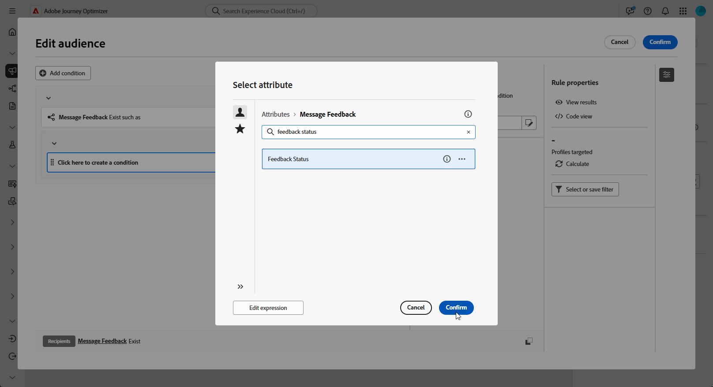

# Creazione di query di retargeting {#retarget}

Il retargeting ti consente di monitorare i destinatari in base al modo in cui hanno risposto a una campagna orchestrata precedente. Ad esempio, puoi inviare una seconda e-mail ai destinatari che hanno ricevuto ma non hanno fatto clic sul primo.

**[!UICONTROL La campagna orchestrata]** fornisce due schemi principali per questo:

* **[!UICONTROL Feedback messaggio]**: acquisisce eventi relativi alla consegna, ad esempio messaggi inviati, aperti, non recapitati e così via.
* **[!UICONTROL Tracciamento e-mail]**: acquisisce le azioni dell&#39;utente, ad esempio clic e aperture.

{zoomable="yes"}

## Creare una regola di retargeting basata sul feedback {#feedback-retarget}

La regola di retargeting basata sul feedback consente di eseguire il retargeting dei destinatari in base agli eventi di consegna dei messaggi acquisiti nello schema **[!UICONTROL Feedback messaggio]**. Questi eventi includono risultati quali messaggi inviati, aperti, non recapitati o contrassegnati come spam.

Utilizzando questi dati, puoi definire regole per identificare i destinatari che hanno ricevuto un messaggio precedente, abilitando la comunicazione di follow-up in base a stati di consegna specifici.

1. Crea una nuova **[!UICONTROL campagna orchestrata]**.

1. Aggiungi un&#39;attività **[!UICONTROL Genera pubblico]** e imposta la dimensione di targeting su **[!UICONTROL Destinatario (caas)]**. Fai clic su **[!UICONTROL Continua]**.

1. Per iniziare rapidamente, puoi utilizzare un filtro **[!UICONTROL Feedback campagna]** integrato per eseguire il targeting dei destinatari in base agli eventi di consegna dei messaggi.

   +++ Dettagliato passo dopo passo

   1. Nel **[!UICONTROL Generatore regole]**, fai clic su **[!UICONTROL Seleziona o salva un filtro]** e scegli **[!UICONTROL Feedback campagna]** dall&#39;elenco.

   1. Selezionare la regola di filtro e scegliere il **[!UICONTROL Comportamento]** di destinazione, ad esempio **[!UICONTROL Messaggio inviato]**.

   1. Fai clic sull&#39;icona  per selezionare la campagna specifica di cui vuoi eseguire il retargeting. Sono disponibili due opzioni:

      * **[!UICONTROL Seleziona una campagna specifica]**: scegli una determinata campagna dal tuo elenco per eseguire il retargeting dei destinatari che hanno interagito con quella campagna.

      * **[!UICONTROL Campagna dalla transizione]**: fai riferimento a una campagna da un&#39;attività precedente nella campagna orchestrata.

   +++

1. In alternativa, puoi creare manualmente regole personalizzate. Nel **[!UICONTROL Generatore regole]**, fai clic su **[!UICONTROL Aggiungi condizione]** e seleziona **[!UICONTROL Feedback messaggio]** dal **[!UICONTROL Selettore attributi]**. Fai clic su **[!UICONTROL Conferma]** per creare **Il feedback del messaggio esiste, ad esempio** condizione.

   {zoomable="yes"}

1. Scegli l&#39;attributo **[!UICONTROL Stato feedback]** per eseguire il targeting degli eventi di consegna dei messaggi.

   +++ Dettagliato passo dopo passo

   1. Aggiungi un&#39;altra condizione collegata all&#39;attributo **[!UICONTROL Feedback messaggio]**.

   1. Cerca l&#39;attributo **[!UICONTROL Stato feedback]** e fai clic su **[!UICONTROL Conferma]**.

      {zoomable="yes"}

   1. Nel menu **[!UICONTROL Condizione personalizzata]**, scegli lo stato di consegna da tracciare nel menu a discesa **[!UICONTROL Valore]**.

      {zoomable="yes"}

   +++

1. Scegli l&#39;attributo **[!UICONTROL Nome campagna orchestrata]** per eseguire il targeting di una campagna orchestrata specifica.

   +++ Dettagliato passo dopo passo

   1. Aggiungi un&#39;altra condizione collegata all&#39;attributo **[!UICONTROL Feedback messaggio]**, cerca **[!UICONTROL entità]** e passa a:

      `_experience > CustomerJourneyManagement > Entities > AJO Orchestrated Campaign entity`.

   1. Seleziona **[!UICONTROL Nome campagna orchestrata]**.

      {zoomable="yes"}

   1. Nel menu **[!UICONTROL Condizione personalizzata]**, specifica il nome della campagna nel campo **[!UICONTROL Valore]**.

   +++

1. Scegli l&#39;attributo **[!UICONTROL Nome azione campagna orchestrata]** per eseguire il targeting di un messaggio o un&#39;attività specifica all&#39;interno di una campagna orchestrata.

   +++ Dettagliato passo dopo passo

   1. Aggiungi un&#39;altra condizione collegata all&#39;attributo **[!UICONTROL Feedback messaggio]**, cerca **[!UICONTROL entità]** e passa a:

      `_experience > CustomerJourneyManagement > Entities > AJO Orchestrated Campaign entity`.

   1. Selezionare **[!UICONTROL Nome azione campagna orchestrata]**.

      {zoomable="yes"}

   1. Nel menu **[!UICONTROL Condizione personalizzata]**, specifica il nome dell&#39;azione della campagna nel campo **[!UICONTROL Valore]**.

      Per trovare i nomi delle azioni, fai clic sull&#39; accanto al campo Etichetta dell&#39;attività.

   +++

1. In alternativa, puoi anche filtrare in base al **[!UICONTROL ID campagna]** (UUID), che si trova nelle proprietà della campagna.

Ora hai configurato una regola di retargeting basata sul feedback per identificare i destinatari in base allo stato di consegna di un messaggio precedente, ad esempio inviato, aperto, non recapitato o contrassegnato come spam. Una volta definito questo pubblico, puoi aggiungere un&#39;e-mail di follow-up o perfezionare ulteriormente il targeting [configurando una regola di retargeting basata sul tracciamento](#tracking-based), che utilizza i dati di interazione dell&#39;utente.

{zoomable="yes"}

## Creare una regola di retargeting basata sul tracciamento {#tracking-based}

La regola di retargeting basata sul tracciamento indirizza i destinatari in base alle loro interazioni con un messaggio, utilizzando i dati dello schema **[!UICONTROL Tracciamento e-mail]**. Acquisisce le azioni dell’utente, ad esempio le aperture delle e-mail e i clic sui collegamenti.

Per eseguire il retargeting dei destinatari in base alle interazioni con i messaggi (ad esempio, apri o fai clic su di essi), utilizza l&#39;entità **[!UICONTROL Tracciamento e-mail]** come segue:

1. Crea una nuova **[!UICONTROL campagna orchestrata]**.

1. Aggiungi un&#39;attività **[!UICONTROL Genera pubblico]** e imposta la dimensione di targeting su **[!UICONTROL Destinatario (caas)]** per concentrarsi sui destinatari della campagna orchestrata precedente.

1. Per iniziare rapidamente, puoi utilizzare un filtro **[!UICONTROL Feedback campagna]** integrato per eseguire il targeting dei destinatari in base agli eventi di consegna dei messaggi.

   +++ Dettagliato passo dopo passo

   1. Nel **[!UICONTROL Generatore regole]**, fai clic su **[!UICONTROL Seleziona o salva un filtro]** e scegli **[!UICONTROL Feedback campagna]** dall&#39;elenco.

      {zoomable="yes"}

   1. Selezionare la regola di filtro e scegliere il **[!UICONTROL Comportamento]** di cui si desidera eseguire il targeting, ad esempio **[!UICONTROL Messaggio aperto]** o **[!UICONTROL Messaggio su cui è stato fatto clic]**.

      {zoomable="yes"}

   1. Fai clic sull&#39;icona  per selezionare la campagna specifica di cui vuoi eseguire il retargeting. Sono disponibili due opzioni:

      * **[!UICONTROL Seleziona una campagna specifica]**: scegli una determinata campagna dal tuo elenco per eseguire il retargeting dei destinatari che hanno interagito con quella campagna.

      * **[!UICONTROL Campagna dalla transizione]**: fai riferimento a una campagna da un&#39;attività precedente nella campagna orchestrata.

   +++

1. In alternativa, puoi creare manualmente regole personalizzate. Nel **[!UICONTROL Generatore regole]**, fai clic su **[!UICONTROL Aggiungi condizione]** e seleziona **[!UICONTROL Verifica e-mail]** dal **[!UICONTROL Selettore attributi]**.

   Fai clic su **[!UICONTROL Conferma]** per creare **Verifica e-mail esistente come** condizione.

   {zoomable="yes"}

1. Per eseguire il targeting delle interazioni dei destinatari con un messaggio, aggiungi un&#39;altra condizione collegata all&#39;attributo **[!UICONTROL Tracciamento e-mail]** e cerca l&#39;attributo **[!UICONTROL Tipo di interazione]**.

   {zoomable="yes"}

1. Dalle opzioni di condizione personalizzate, utilizza **[!UICONTROL Incluso in]** come operatore e seleziona uno o più valori a seconda del caso d&#39;uso, ad esempio **[!UICONTROL Messaggio aperto]** o **[!UICONTROL Messaggio link fatto clic]**.

   {zoomable="yes"}

Hai configurato una regola di retargeting basata sul tracciamento per eseguire il targeting dei destinatari in base alle loro interazioni con un messaggio precedente, ad esempio aperture di e-mail o clic sui collegamenti, utilizzando i dati dell&#39;attributo **[!UICONTROL Tracciamento e-mail]**. Una volta definito questo pubblico, puoi aggiungere un&#39;azione di follow-up o perfezionare ulteriormente il targeting combinandolo con una [regola di retargeting basata sul feedback](#feedback-retarget) per includere i risultati dei messaggi, ad esempio inviati, non recapitati o contrassegnati come spam.

{zoomable="yes"}
