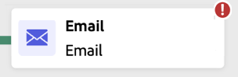

# Avviare e monitorare le campagne orchestrate {#start-monitor}

>[!CONTEXTUALHELP]
>id="ajo_campaign_publication"
>title="Pubblicare una campagna orchestrata"
>abstract="Per avviare la campagna, è necessario pubblicarla. Assicurati che tutti gli errori siano cancellati prima della pubblicazione."

Dopo aver creato e orchestrato le attività da eseguire nell’area di lavoro, puoi pubblicarle e monitorarne la modalità di esecuzione.

Puoi anche eseguire la campagna in modalità di test per verificarne l’esecuzione e il risultato delle diverse attività.

## Testare la campagna prima della pubblicazione {#test}

[!DNL Journey Optimizer] consente di testare le campagne orchestrate prima della pubblicazione. Quando viene creata una campagna, per impostazione predefinita questa entra nello stato **Bozza**. In questo stato, puoi eseguire la campagna manualmente per testare il flusso.

>[!IMPORTANT]
>
>Tutte le attività nell&#39;area di lavoro vengono eseguite ad eccezione delle attività **[!UICONTROL Salva pubblico]** e delle attività del canale. Non esiste alcun impatto funzionale sui dati o sul pubblico.

Per verificare una campagna orchestrata, aprire la campagna e selezionare **[!UICONTROL Inizio]**.

{zoomable="yes"}

Ogni attività nella campagna viene eseguita in sequenza fino al raggiungimento della fine dell’area di lavoro. Durante il test, puoi controllare l’esecuzione della campagna utilizzando la barra delle azioni nell’area di lavoro. Da qui, puoi:

* **Interrompere** l’esecuzione in qualsiasi momento.
* **Avviare** di nuovo l’esecuzione.
* **Riprendi** l&#39;esecuzione se è stata precedentemente sospesa.

L&#39;icona **[!UICONTROL Avvisi]** / **[!UICONTROL Avviso]** nella barra degli strumenti dell&#39;area di lavoro notifica i problemi, inclusi gli avvisi che possono apparire in modo proattivo prima dell&#39;esecuzione e gli errori che si verificano durante o dopo l&#39;esecuzione.

{zoomable="yes"}

Puoi anche identificare rapidamente le attività non riuscite utilizzando gli [indicatori di stato visivi](#activities) visualizzati direttamente su ogni attività. Per una risoluzione dettagliata dei problemi, apri i [registri della campagna](#logs-tasks), che forniscono informazioni approfondite sull’errore e sul relativo contesto.

Se hai aggiunto attività di canale nell&#39;area di lavoro, puoi visualizzare in anteprima e verificare il contenuto dei messaggi utilizzando il pulsante **[!UICONTROL Simula contenuto]**. [Scopri come utilizzare le attività del canale](activities/channels.md)

Una volta convalidata, la campagna può essere pubblicata.

## Pubblicare la campagna {#publish}

Una volta che la campagna è testata e pronta, fai clic su **[!UICONTROL Pubblica]** per renderla disponibile.

{zoomable="yes"}

>[!NOTE]
>
>Se il pulsante **[!UICONTROL Pubblica]** è disabilitato (disattivato), accedere ai registri dalla barra delle azioni e controllare i messaggi di errore. Tutti gli errori devono essere corretti prima di poter pubblicare una campagna.

Il flusso visivo si riavvia e i profili reali iniziano a fluire nel percorso in tempo reale.

Se l’azione di pubblicazione non riesce (ad esempio, a causa di contenuto del messaggio mancante), viene visualizzato un avviso e devi risolvere il problema prima di riprovare. Una volta completata la pubblicazione, la campagna inizia l&#39;esecuzione (immediatamente o secondo pianificazione), passa dallo stato **Bozza** allo stato **Live** e diventa &quot;Sola lettura&quot;.

## Monitorare l’esecuzione della campagna {#monitor}

### Monitoraggio del flusso visivo {#flow}

Durante l’esecuzione (in modalità di test o live), il flusso visivo mostra come i profili si spostano all’interno del percorso in tempo reale. Viene visualizzato il numero di profili che passano da un’attività all’altra.

{zoomable="yes"}

I dati trasferiti da un’attività all’altra tramite transizioni vengono archiviati in una tabella di lavoro temporanea. Questi dati possono essere visualizzati per ogni transizione. Per analizzare i dati trasferiti tra le attività:

1. Seleziona una transizione.
1. Nel riquadro delle proprietà fai clic su **[!UICONTROL Anteprima schema]** per visualizzare lo schema della tabella di lavoro. Seleziona **[!UICONTROL Anteprima risultati]** per visualizzare i dati trasferiti.

   {zoomable="yes"}

### Indicatori di esecuzione delle attività {#activities}

Gli indicatori di stato visivi consentono di comprendere le prestazioni di ogni attività:

| Indicatore visivo | Descrizione |
|-----|------------|
| {zoomable="yes"}{width="70%"} | L’attività è attualmente in esecuzione. |
| {zoomable="yes"}{width="70%"} | L’attività richiede la tua attenzione. Ciò potrebbe implicare la conferma dell’invio di una consegna o l’adozione di un’azione necessaria. |
| {zoomable="yes"}{width="70%"} | L’attività ha rilevato un errore. Per risolvere il problema, apri i registri della campagna orchestrata per ulteriori informazioni. |
| {zoomable="yes"}{width="70%"} | L’attività è stata eseguita correttamente. |

### Registri e attività {#logs-tasks}

>[!CONTEXTUALHELP]
>id="ajo_campaign_logs"
>title="Registri e attività"
>abstract="La schermata **Registri e attività** fornisce una cronologia dell’esecuzione della campagna orchestrata, registrando tutte le azioni dell’utente e gli errori riscontrati."

Monitorare registri e attività è un passaggio chiave per analizzare le campagne orchestrate e assicurarti che vengano eseguite correttamente. I registri e le attività sono accessibili dal pulsante **[!UICONTROL Registri]** disponibile sia in modalità di test che in modalità live nella barra degli strumenti dell&#39;area di lavoro.

{zoomable="yes"}

La schermata **[!UICONTROL Registri e attività]** fornisce una cronologia completa dell’esecuzione della campagna orchestrata, registrando tutte le azioni dell’utente e gli errori riscontrati.

{zoomable="yes"}

Sono disponibili due tipi di informazioni:

* La scheda **[!UICONTROL Registro]** contiene la cronologia di tutte le operazioni e di tutti gli errori.
* La scheda **[!UICONTROL Attività]** descrive la sequenza di esecuzione dettagliata delle attività.

In entrambe le schede, puoi scegliere le colonne visualizzate e il rispettivo ordine, applicare filtri e utilizzare il campo di ricerca per trovare rapidamente le informazioni desiderate.

## Passaggi successivi {#next}

Dopo aver avviato l’area di lavoro della campagna orchestrata, puoi utilizzare le funzionalità di reporting di Journey Optimizer per ottenere informazioni quali comprendere il comportamento del pubblico e misurare le prestazioni di ogni passaggio nel percorso di clienti. [Ulteriori informazioni sul reporting delle campagne orchestrate](../orchestrated/reporting-campaigns.md)
