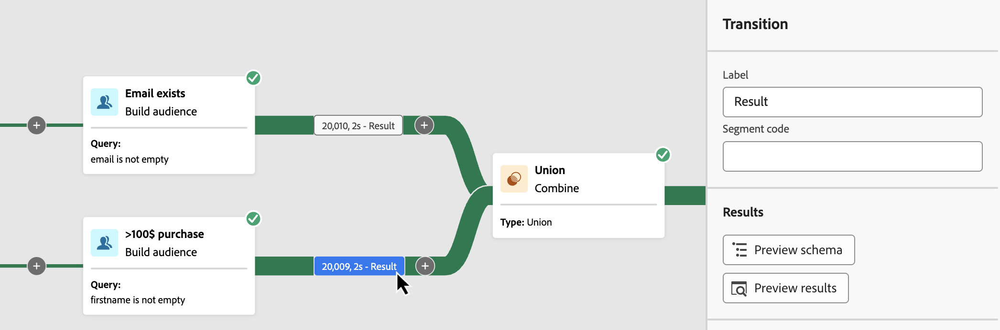

# Avviare e monitorare le campagne orchestrate {#start-monitor}

>[!CONTEXTUALHELP]
>id="ajo_campaign_publication"
>title="Pubblicare una campagna orchestrata"
>abstract="Per avviare la campagna, è necessario pubblicarla. Assicurati che tutti gli errori siano cancellati prima della pubblicazione."

Dopo aver creato la campagna orchestrata e progettato le attività da eseguire nell’area di lavoro, puoi pubblicarla e monitorarne l’esecuzione. Puoi anche eseguire la campagna in modalità di test per verificarne l’esecuzione e il risultato delle diverse attività.

## Panoramica del ciclo di vita della campagna {#lifecycle}

Le campagne orchestrate passano attraverso un set definito di stati. Le fasi principali del flusso di lavoro di pubblicazione sono:

| Stato | Che cosa significa |
|---|---|
| **Bozza** | La campagna è in fase di creazione e test, non ancora attiva. |
| **Live** | La campagna è stata pubblicata ed è in esecuzione. |
| **Chiuso** | La campagna ricorrente è chiusa alle nuove voci, ma i profili attivi continuano fino al completamento di tutte le attività. |
| **Completato** | Esecuzione della campagna completata. |

>[!NOTE]
>
>Per tutti gli stati (inclusi Pianificato, Interrotto, Archiviato) e le azioni disponibili in ogni fase, vedere [Informazioni sugli stati delle campagne](../campaigns/manage-campaigns.md#statuses).

## Testare la campagna prima della pubblicazione {#test}

[!DNL Journey Optimizer] consente di testare le campagne orchestrate prima della pubblicazione. Quando viene creata una campagna, per impostazione predefinita questa entra nello stato **Bozza**. In questo stato, puoi eseguire la campagna manualmente per testare il flusso.

>[!IMPORTANT]
>
>Tutte le attività nell&#39;area di lavoro vengono eseguite ad eccezione delle attività **[!UICONTROL Salva pubblico]** e delle attività del canale. Non esiste alcun impatto funzionale sui dati o sul pubblico.

Per verificare una campagna orchestrata, aprire la campagna e selezionare **[!UICONTROL Inizio]**. Ogni attività nella campagna viene eseguita in sequenza fino al raggiungimento della fine dell’area di lavoro.

{zoomable="yes"}

Per **campagne orchestrate attivate**, il sistema attende una chiamata API per avviare la campagna. Devi inviare il segnale per continuare il test. [Scopri come testare le campagne attivate dal segnale](trigger-orchestrated-campaign.md#complete-and-test).

Durante il test, puoi controllare l’esecuzione della campagna utilizzando la barra delle azioni nell’area di lavoro. Da qui, puoi:

* **Interrompere** l’esecuzione in qualsiasi momento.
* **Avviare** di nuovo l’esecuzione.
* **Riavvia** l&#39;esecuzione per reimpostare ed eseguire nuovamente il flusso di lavoro in un&#39;unica azione. Questa funzione è particolarmente utile quando desideri verificare nuovamente e rapidamente il flusso della campagna dopo aver apportato modifiche.
* **Riprendi** l&#39;esecuzione se è stata precedentemente sospesa.

L&#39;icona **[!UICONTROL Avvisi]** / **[!UICONTROL Avviso]** nella barra degli strumenti dell&#39;area di lavoro notifica i problemi, inclusi gli avvisi che possono apparire in modo proattivo prima dell&#39;esecuzione e gli errori che si verificano durante o dopo l&#39;esecuzione.

{zoomable="yes"}

Puoi anche identificare rapidamente le attività non riuscite utilizzando gli [indicatori di stato visivi](#activities) visualizzati direttamente su ogni attività. Per una risoluzione dettagliata dei problemi, apri i [registri della campagna](#logs-tasks), che forniscono informazioni approfondite sull’errore e sul relativo contesto.

Se hai aggiunto attività di canale nell&#39;area di lavoro, puoi visualizzare in anteprima e verificare il contenuto dei messaggi utilizzando il pulsante **[!UICONTROL Simula contenuto]**. [Scopri come utilizzare le attività dei canali e simulare i contenuti](activities/channels.md#simulate-content-test-profiles).

>[!TIP]
>
>Prima di fare clic su **[!UICONTROL Pubblica]**, confermare quanto segue:
>* La campagna è stata eseguita correttamente in modalità di test senza errori nei [registri](#logs-tasks).
>* Il contenuto del messaggio è stato visualizzato in anteprima utilizzando **[!UICONTROL Simula contenuto]**.
>* La [pianificazione è configurata](create-orchestrated-campaign.md#schedule) se si tratta di una campagna pianificata.
>* Hai rivisto il comportamento [invio conferma](#confirm-sending). Per le campagne non ricorrenti, nessun messaggio viene inviato finché non approvi esplicitamente l&#39;invio dopo la pubblicazione.

## Pubblicare la campagna {#publish}

Una volta che la campagna è testata e pronta, fai clic su **[!UICONTROL Pubblica]** per renderla disponibile.

{zoomable="yes"}

>[!NOTE]
>
>Se il pulsante **[!UICONTROL Pubblica]** è disabilitato (disattivato), accedere ai registri dalla barra delle azioni e controllare i messaggi di errore. Tutti gli errori devono essere corretti prima di poter pubblicare una campagna.

Il flusso visivo si riavvia e i profili reali iniziano a fluire nel percorso in tempo reale.

Se l’azione di pubblicazione non riesce (ad esempio, a causa di contenuto del messaggio mancante), viene visualizzato un avviso e devi risolvere il problema prima di riprovare. Una volta completata la pubblicazione, la campagna inizia l&#39;esecuzione (immediatamente o secondo programma), si sposta dallo stato **Bozza** a **Live** e diventa &quot;Sola lettura&quot;.

>[!IMPORTANT]
>
>Per le campagne non ricorrenti, la consegna dei messaggi viene sospesa dopo la pubblicazione fino a quando non confermi esplicitamente l’invio dal riquadro delle proprietà dell’attività del canale. La campagna verrà visualizzata come **Live**, ma non verranno inviati messaggi fino alla conferma. [Ulteriori informazioni](#confirm-sending)

### Sequenza di esecuzione al momento della pubblicazione {#publication-sequence}

Quando fai clic su **[!UICONTROL Pubblica]**, la seguente sequenza si verifica internamente:

1. **Attivazione modulo di pianificazione** - Se la campagna ha una [pianificazione configurata](create-orchestrated-campaign.md#schedule), il modulo di pianificazione avvia l&#39;esecuzione all&#39;ora definita.
1. **Le attività Save Audience vengono eseguite per prime** — Qualsiasi attività [Save audience](activities/save-audience.md) nel flusso di lavoro viene eseguita prima delle attività messaggio. La shell del pubblico viene creata all&#39;interno del [Portale pubblico](../audience/about-audiences.md#browse) e i profili qualificati iniziano l&#39;acquisizione.
1. **Inizio esecuzione messaggio** — [Attività canale](activities/channels.md) iniziano l&#39;elaborazione per la prima attività messaggio nel flusso di lavoro.
1. **Ricerca snapshot profilo**: i dati del profilo vengono risolti in base a uno snapshot creato al momento della pubblicazione, non in base al profilo in tempo reale. Ciò garantisce la coerenza nell’intera esecuzione.
1. **Valutazione del consenso** - Per i profili corrispondenti, il consenso viene rispettato direttamente dal record del profilo. Il consenso non viene rivalutato al momento dell’invio. [Ulteriori informazioni sulla gestione del consenso](../action/consent.md)
1. **Creazione immediata di profili**: i profili che non corrispondono a un record esistente vengono creati al volo durante l&#39;esecuzione.
1. **Creazione del registro di consegna** — Gli eventi di consegna vengono registrati nel set di dati [`ajo_message_feedback_event`](../data/datasets-query-examples.md#message-feedback-event-dataset), che è l&#39;origine principale per i registri di consegna e la convalida post-invio.

Per convalidare i risultati dopo l’esecuzione, utilizza le funzionalità di reporting di Journey Optimizer. [Ulteriori informazioni sul reporting delle campagne orchestrate](reporting-campaigns.md)

## Ripristinare una campagna alla bozza {#back-to-draft}

La funzione **[!UICONTROL Torna alla bozza]** consente di annullare la pubblicazione e ripristinare lo stato bozza di una campagna orchestrata in situazioni specifiche. Questo è progettato come un meccanismo di ripristino per risolvere i problemi prima dell’invio di qualsiasi messaggio, mantenendo al contempo l’integrità del ciclo di vita della campagna.

Questa opzione è disponibile in due scenari:

* **Campagne pianificate in attesa di esecuzione**: quando è pianificata l&#39;esecuzione di una campagna in un momento specifico e tale momento non è ancora stato raggiunto, è possibile riutilizzare la bozza per rivedere e modificare la campagna prima che inizi l&#39;esecuzione. Tuttavia, se la campagna è ricorrente (ad esempio, una campagna pianificata giornaliera) e almeno un’esecuzione si è già verificata, l’opzione non è più disponibile. In tal caso, devi [duplicare la campagna](../campaigns/manage-campaigns.md#duplicate-a-campaign).

* **Campagne live con errori di esecuzione**: quando una campagna ha rilevato un errore durante l&#39;esecuzione e viene sospesa e non è ancora stata completata alcuna esecuzione della campagna, puoi riutilizzarla come bozza per correggere l&#39;errore e ripubblicare la campagna.

Per ripristinare lo stato bozza di una campagna, apri la campagna orchestrata e fai clic sul pulsante **[!UICONTROL Torna alla bozza]** nella barra degli strumenti dell&#39;area di lavoro della campagna.

La pubblicazione della campagna viene annullata e il flusso di lavoro viene interrotto. La campagna torna allo stato **Bozza**. Ora puoi risolvere i problemi identificati, quindi [verifica la campagna](#test) e [pubblicala](#publish) di nuovo quando sarà pronta.

## Conferma invio messaggio {#confirm-sending}

Per impostazione predefinita, per le campagne orchestrate non ricorrenti, la consegna dei messaggi viene sospesa fino all’approvazione esplicita dell’invio. Dopo aver pubblicato la campagna, conferma la richiesta di invio dal riquadro delle proprietà dell’attività del canale. Fino a quando non viene confermata, l’attività del canale rimane in sospeso e non viene inviato alcun messaggio.

Prima di pubblicare, puoi disabilitare l’invio di conferme dal riquadro delle proprietà dell’attività del canale. Per ulteriori dettagli, vedere [Conferma invio messaggio](activities/channels.md#confirm-message-sending).

## Monitorare l’esecuzione della campagna {#monitor}

### Monitoraggio del flusso visivo {#flow}

Durante l’esecuzione (in modalità di test o live), il flusso visivo mostra come i profili si spostano nel percorso in tempo reale. Viene visualizzato il numero di profili che passano da un’attività all’altra.

{zoomable="yes"}

I dati trasferiti da un’attività all’altra tramite transizioni vengono archiviati in una tabella di lavoro temporanea. Questi dati possono essere visualizzati per ogni transizione. Per analizzare i dati trasferiti tra le attività:

1. Seleziona una transizione.
1. Nel riquadro delle proprietà fai clic su **[!UICONTROL Anteprima schema]** per visualizzare lo schema della tabella di lavoro. Seleziona **[!UICONTROL Anteprima risultati]** per visualizzare i dati trasferiti.

   {zoomable="yes"}

Ora puoi esaminare i dati trasmessi tra le attività per convalidare il flusso della campagna e confermare che ogni attività elabora i profili previsti.

### Indicatori di esecuzione delle attività {#activities}

Gli indicatori di stato visivi consentono di comprendere le prestazioni di ogni attività:

| Indicatore visivo | Descrizione |
|-----|------------|
| {zoomable="yes"}{width="70%"} | L’attività è attualmente in esecuzione. |
| {zoomable="yes"}{width="70%"} | L’attività richiede la tua attenzione. Ciò potrebbe implicare la conferma dell’invio di una consegna o l’adozione di un’azione necessaria. |
| {zoomable="yes"}{width="70%"} | L’attività ha rilevato un errore. Per risolvere il problema, apri i registri della campagna orchestrata per ulteriori informazioni. |
| {zoomable="yes"}{width="70%"} | L&#39;attività è stata eseguita correttamente. |

### Registri e attività {#logs-tasks}

>[!CONTEXTUALHELP]
>id="ajo_campaign_logs"
>title="Registri e attività"
>abstract="La schermata **Registri e attività** fornisce una cronologia dell’esecuzione delle campagne orchestrate, registrando tutte le azioni dell’utente e gli errori riscontrati."

Monitorare registri e attività è un passaggio chiave per analizzare le campagne orchestrate e assicurarti che vengano eseguite correttamente. I registri e le attività sono accessibili dal pulsante **[!UICONTROL Registri]** disponibile sia in modalità di test che in modalità live nella barra degli strumenti dell&#39;area di lavoro.

{zoomable="yes"}

La schermata **[!UICONTROL Registri e attività]** fornisce una cronologia completa dell’esecuzione della campagna orchestrata, registrando tutte le azioni dell’utente e gli errori riscontrati.

{zoomable="yes"}

Sono disponibili due tipi di informazioni:

* La scheda **[!UICONTROL Registro]** contiene la cronologia di tutte le operazioni e di tutti gli errori.
* La scheda **[!UICONTROL Attività]** descrive la sequenza di esecuzione dettagliata delle attività.

In entrambe le schede, puoi scegliere le colonne visualizzate e il rispettivo ordine, applicare filtri e utilizzare il campo di ricerca per trovare rapidamente le informazioni desiderate.

## Passaggi successivi {#next}

Dopo aver avviato l’area di lavoro della campagna orchestrata, puoi utilizzare le funzionalità di reporting di Journey Optimizer per ottenere informazioni quali comprendere il comportamento del pubblico e misurare le prestazioni di ogni passaggio nel percorso di clienti. [Ulteriori informazioni sul reporting delle campagne orchestrate](../orchestrated/reporting-campaigns.md)

Hai domande sulle campagne orchestrate? Controlla le [Domande frequenti sulle campagne orchestrate](orchestrated-campaigns-faq.md) per ottenere risposte alle domande più comuni da parte dei professionisti.
