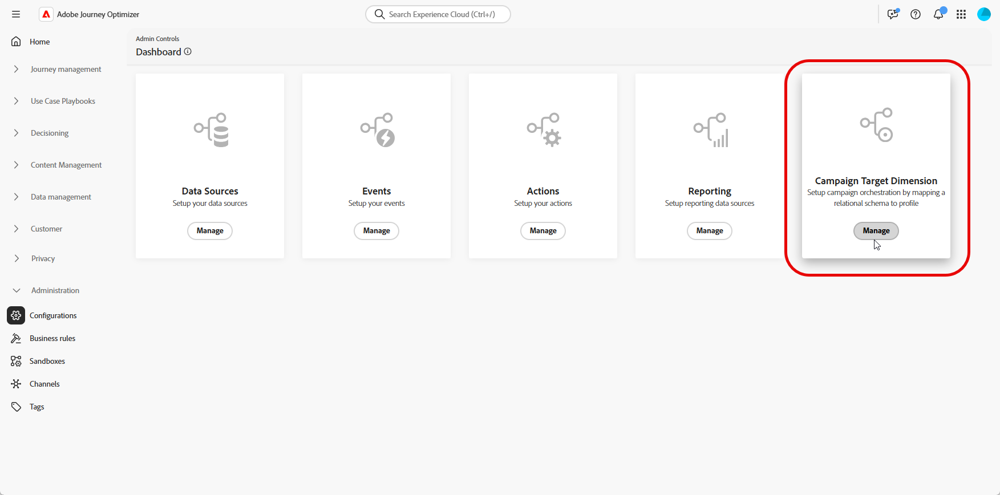
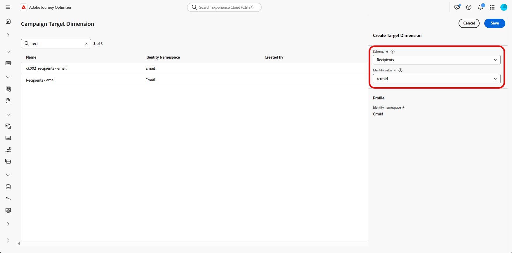

# Configurare una dimensione di targeting {#configuration}

>[!BEGINSHADEBOX]

**In questa pagina:** scopri come configurare una dimensione di targeting per le campagne orchestrate mappando uno schema relazionale al profilo cliente in modo da poter inviare messaggi a livello di entità.

>[!ENDSHADEBOX]

Con **[!UICONTROL Campagne orchestrate]**, puoi progettare e distribuire comunicazioni mirate a livello di entità, sfruttando le funzionalità dello schema relazionale di Adobe Experience Platform. Experience Platform utilizza gli schemi per descrivere la struttura dei dati in modo coerente e riutilizzabile. Quando i dati vengono acquisiti in Experience Platform, sono strutturati in base a uno schema XDM.

Anche se la segmentazione per **[!UICONTROL campagne orchestrate]** opera principalmente su schemi relazionali, la consegna effettiva dei messaggi avviene sempre al livello **Profilo**.

Durante la configurazione del targeting, puoi definire due aspetti chiave:

* **Schemi di destinazione**

  Puoi specificare quali schemi relazionali sono idonei per il targeting. Per impostazione predefinita, viene utilizzato lo schema denominato `Recipient`, ma è possibile configurare alternative quali `Visitors`, `Customers` e così via.

  >[!IMPORTANT]
  >
  > Le campagne orchestrate consentono il targeting su qualsiasi schema con una relazione diretta o correlata allo schema **Profilo**. Sebbene l&#39;utilizzo sia principalmente destinato a relazioni 1:1, supporta anche relazioni 1:N, come l&#39;account `>` destinatari, purché il percorso della relazione sia modellato correttamente nel modello di dati. Questo consente di eseguire il targeting in base ai dati a livello di account, risolvendo al contempo l’identità di profilo corretta per la consegna dei messaggi.

* **Collegamento profilo**

  Il sistema deve capire come lo schema di destinazione viene mappato allo schema `Profile`. Ciò si ottiene tramite un campo di identità condiviso, esistente sia nello schema di destinazione che nello schema `Profile`, configurato come spazio dei nomi dell&#39;identità.

➡️ [Ulteriori informazioni sugli schemi relazionali nella documentazione di Adobe Experience Platform](https://experienceleague.adobe.com/en/docs/experience-platform/xdm/schema/relational#how-relational-schemas-differ-from-standard-xdm-schemas)

## Creare la dimensione di targeting {#targeting-dimension}

Per iniziare, imposta l’orchestrazione delle campagne mappando uno schema relazionale al profilo cliente.

1. Da **[!UICONTROL Amministrazione]**, accedere al menu **[!UICONTROL Configurazioni]** e selezionare **[!UICONTROL Dimension di destinazione di Campaign]**.

   

1. Fai clic su **[!UICONTROL Crea]** per iniziare a creare la **[!UICONTROL dimensione di targeting]**.

1. Scegli lo [schema configurato in precedenza](gs-schemas.md) &#x200B;dal menu a discesa.

   Mentre vengono visualizzati tutti gli schemi relazionali, solo quelli con una relazione di identità diretta con **Profilo** sono idonei per la selezione. Evita di scegliere schemi non people, ad esempio acquisti, e seleziona uno schema direttamente associato a un profilo.

1. Selezionare il **[!UICONTROL valore identità]** che rappresenta l&#39;entità di destinazione.

   In questo esempio, il profilo cliente è collegato a più sottoscrizioni, ognuna rappresentata da un `crmID` univoco nello schema `Recipient`. Impostando lo schema `Recipient` e la relativa identità `crmID` per **[!UICONTROL Dimension]** di destinazione, è possibile inviare messaggi a livello di sottoscrizione anziché al profilo cliente principale, garantendo che ogni contratto o linea riceva il proprio messaggio personalizzato.

   [Ulteriori informazioni sono disponibili nella documentazione di Adobe Experience Platform](https://experienceleague.adobe.com/en/docs/experience-platform/xdm/schema/composition#identity)

   

1. Fai clic su **[!UICONTROL Salva]** per completare l&#39;installazione. Una volta creata, una **[!UICONTROL dimensione di destinazione]** non può essere rimossa o modificata.

Dopo aver configurato il **[!UICONTROL Dimension di destinazione]**, procedere con la creazione e la configurazione della **[!UICONTROL Configurazione canale]** e definire i **[!UICONTROL Dettagli esecuzione]** corrispondenti.