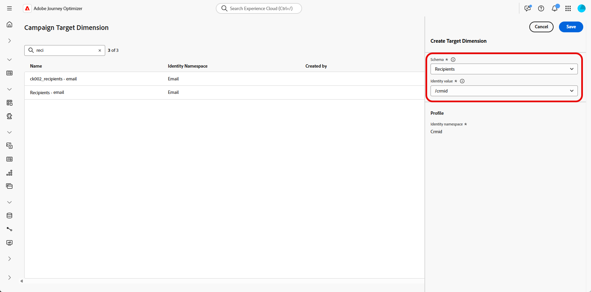

# Configurare una dimensione di targeting {#configuration}

+++ Sommario

| Benvenuto in Campagne orchestrate | Avviare la prima campagna orchestrata | Eseguire query sul database | Attività di campagne orchestrate |
|---|---|---|---|
| [Introduzione alle campagne orchestrate](gs-orchestrated-campaigns.md)  Creazione e gestione di schemi e set di dati relazionali:  <ul><li>[Introduzione a schemi e set di dati](gs-schemas.md)</li><li>[Schema manuale](manual-schema.md)</li><li>[Schema di caricamento file](file-upload-schema.md)</li><li>[Acquisire dati](ingest-data.md)</li></ul>[Accedere e gestire le campagne orchestrate](access-manage-orchestrated-campaigns.md)  [Passaggi chiave per creare una campagna orchestrata](gs-campaign-creation.md)  [Configurare una dimensione di destinazione](target-dimension.md) | <b>[Creare e pianificare la campagna](create-orchestrated-campaign.md)</b>  [Orchestrare le attività](orchestrate-activities.md)  [Avviare e monitorare la campagna](start-monitor-campaigns.md)  [Reporting](reporting-campaigns.md) | [Utilizzare il generatore di regole](orchestrated-rule-builder.md)  [Creare la prima query](build-query.md)  [Modificare le espressioni](edit-expressions.md)  [Retargeting](retarget.md) | [Introduzione alle attività](activities/about-activities.md)  Attività: [AND-join](activities/and-join.md) - [Crea pubblico](activities/build-audience.md) - [Modifica dimensione](activities/change-dimension.md) - [Attività canale](activities/channels.md) - [Combina](activities/combine.md) - [Deduplica](activities/deduplication.md) - [Arricchimento](activities/enrichment.md) - [Fork](activities/fork.md) - [Riconciliazione](activities/reconciliation.md) - [Salva pubblico](activities/save-audience.md) - [Dividi](activities/split.md) - [Attendi](activities/wait.md) |

{style="table-layout:fixed"}

+++

 

>[!BEGINSHADEBOX]

 

Il contenuto di questa pagina non è definitivo e potrebbe essere soggetto a modifiche.

>[!ENDSHADEBOX]

In molti casi, un singolo profilo cliente può essere collegato a più entità correlate, come abbonamenti, contratti di servizio o dispositivi, ciascuna con il proprio identificativo univoco e le proprie esigenze di comunicazione.

Con **Campagne orchestrate**, ora puoi progettare e distribuire comunicazioni mirate a livello di entità, utilizzando le **funzionalità dello schema relazionale di Adobe Experience Platform**. Questo consente di segmentare, personalizzare e generare rapporti per entità invece che per destinatario.

## Creare la dimensione di targeting {#targeting-dimension}

Un singolo profilo cliente può essere associato a più entità correlate, ad esempio contratti, dispositivi o abbonamenti, ciascuna con un proprio identificativo univoco. Questa configurazione consente di eseguire il targeting, segmentare e generare rapporti su ogni entità singolarmente.

Per iniziare, imposta l’orchestrazione delle campagne mappando uno schema relazionale al profilo cliente.

1. Da **[!UICONTROL Amministrazione]**, accedere al menu **[!UICONTROL Configurazioni]** e selezionare **[!UICONTROL Dimension di destinazione di Campaign]**.

   

1. Fai clic su **[!UICONTROL Crea]** per iniziare a creare la **[!UICONTROL dimensione di targeting]**.

1. Scegli lo [schema configurato in precedenza](gs-schemas.md) &#x200B;dal menu a discesa.

1. Selezionare il **[!UICONTROL valore identità]** che rappresenta l&#39;entità di destinazione.

   In questo esempio, il profilo cliente è collegato a più sottoscrizioni, ognuna rappresentata da un `crmID` univoco nello schema `Recipient`. Impostando lo schema **[!UICONTROL e la relativa identità]** per `Recipient`Dimension`crmID` di destinazione, è possibile inviare messaggi a livello di sottoscrizione anziché al profilo cliente principale, garantendo che ogni contratto o linea riceva il proprio messaggio personalizzato.

   [Ulteriori informazioni sono disponibili nella documentazione di Adobe Experience Platform](https://experienceleague.adobe.com/it/docs/experience-platform/xdm/schema/composition#identity)

   

1. Fai clic su **[!UICONTROL Salva]** per completare l&#39;installazione.

Dopo aver configurato il **[!UICONTROL Dimension di destinazione]**, procedere con la creazione e la configurazione della **[!UICONTROL Configurazione canale]** e definire i **[!UICONTROL Dettagli esecuzione]** corrispondenti.

## Configurazione del canale {#channel-configuration}

Dopo aver configurato il **[!UICONTROL Dimension di destinazione]**, devi configurare la **[!UICONTROL configurazione canale]** e definire i **[!UICONTROL dettagli di esecuzione]** appropriati. In questo modo i messaggi vengono inviati utilizzando l’identità e la logica di targeting corrette.

1. Per iniziare, crea e configura la **[!UICONTROL configurazione canale]**.

   È inoltre possibile aggiornare una **[!UICONTROL configurazione canale]** esistente.

   ➡️ [Segui i passaggi descritti in questa pagina](../email/surface-personalization.md)

1. Dalla sezione **[!UICONTROL Dettagli esecuzione]** della **[!UICONTROL Configurazione canale]**, accedi alla scheda **[!UICONTROL Campagne orchestrate]**.

   

1. Fai clic su **[!UICONTROL Abilitato]** per renderlo compatibile con le campagne orchestrate.

1. Scegli il metodo di consegna:

   * **[!UICONTROL Dimension di destinazione]**: invia all&#39;entità principale, ad esempio destinatario.

   * **[!UICONTROL Destinazione + Dimension secondario]**: inviare utilizzando entità primarie e secondarie, ad esempio destinatario + contratto.

1. Seleziona dall&#39;elenco a discesa [Dimension di Target creato in precedenza](#targeting-dimension).

   

1. Nella sezione **[!UICONTROL Indirizzo di esecuzione]**, scegli quale **[!UICONTROL Source]** deve essere utilizzato per recuperare l&#39;indirizzo di consegna, ad esempio l&#39;indirizzo e-mail o il numero di telefono:

   * **[!UICONTROL Profilo]**: selezionare questa opzione se l&#39;indirizzo di consegna, ad esempio e-mail, è memorizzato direttamente nel profilo cliente principale.

     Utile quando si inviano messaggi al cliente principale, non a una specifica entità associata.

   * **[!UICONTROL Dimension di destinazione]**: scegliere questa opzione se l&#39;indirizzo di consegna è archiviato nell&#39;entità correlata, ad esempio un destinatario o una sottoscrizione.

     Utile quando ogni destinatario ha il proprio indirizzo di consegna, ad esempio un indirizzo e-mail o un numero di telefono diverso.

1. Dal campo **[!UICONTROL Indirizzo di consegna]**, fai clic su  per scegliere il campo specifico da utilizzare per la consegna del messaggio.

   

1. Una volta configurata, fai clic su **[!UICONTROL Invia]**.

Il tuo canale è ora pronto per essere utilizzato con **Campagne orchestrate** e i messaggi verranno recapitati in base alla dimensione di destinazione selezionata.
