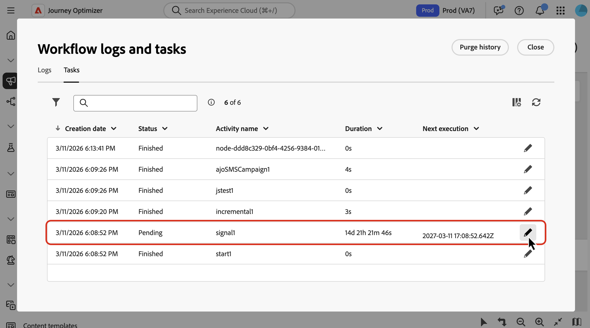

# Attivare campagne orchestrate utilizzando un segnale {#trigger-signal}

Puoi avviare una campagna orchestrata con un segnale invece di una pianificazione fissa. Quando la campagna riceve il segnale, viene eseguita e puoi trasmettere parametri nel payload. Diventano disponibili come variabili per il targeting, le condizioni o le espressioni.

Il segnale può provenire da uno dei seguenti elementi:

* API REST: l&#39;applicazione o l&#39;integrazione chiama l&#39;endpoint del trigger (vedere [Pubblicare e attivare la campagna](#publish) e il [riferimento API](https://developer.adobe.com/journey-optimizer-apis/references/oc-trigger){target="_blank"}).
* Altra campagna orchestrata: l&#39;attività **[!UICONTROL End]** di una campagna a monte invia lo stesso tipo di segnale al completamento di un ramo. [Scopri come configurare l&#39;attività End](#signal-end).

Questa pagina spiega come impostare la campagna che riceve il segnale (pianificazione, parametri, test, pubblicazione), quindi come attivarla dall&#39;API o da un&#39;attività **[!UICONTROL End]**. Quando le variabili saranno disponibili, per informazioni su come utilizzarle nelle regole e nelle condizioni **[!UICONTROL Test]**, vedere [Utilizzare le variabili nelle campagne orchestrate](variables-orchestrated-campaigns.md).

Per informazioni sulla specifica REST completa dell&#39;endpoint del trigger (percorsi, intestazioni, corpo, risposte ed errori), vedi [Attivare l&#39;API delle campagne orchestrate](https://developer.adobe.com/journey-optimizer-apis/references/oc-trigger){target="_blank"} nella documentazione dell&#39;API di Adobe Journey Optimizer.

Processo end-to-end per attivare una campagna orchestrata utilizzando un segnale:

1. [Pianificare l’attivazione della campagna da parte di un segnale](#configure-signal)
1. [Aggiungi parametri per il payload del segnale](#parameters) (facoltativo)
1. [Creare e testare la campagna](#build-and-test)
1. [Pubblicare e attivare la campagna](#publish)

>[!NOTE]
>
>Per attivare una campagna orchestrata utilizzando un segnale, è necessaria l&#39;autorizzazione **[!DNL Publish orchestrated campaigns]** (`orchestrated-campaign.publish`). Consulta [Autorizzazioni incorporate](../administration/ootb-permissions.md).

## Pianificare l’attivazione della campagna da parte di un segnale {#configure-signal}

Per impostare una campagna orchestrata in modo che inizi su un segnale invece che su una pianificazione, effettua le seguenti operazioni:

1. Apri la campagna orchestrata che desideri attivare utilizzando un segnale.

1. Apri la configurazione della pianificazione. [Scopri come pianificare una campagna orchestrata](create-orchestrated-campaign.md#schedule).

1. Seleziona **[!UICONTROL Attivato da un segnale]** in modo che la campagna attenda un segnale invece di essere eseguita secondo una pianificazione.

   {zoomable="yes"}

## Aggiungere parametri per il payload del segnale (facoltativo) {#parameters}

Puoi trasmettere parametri nel segnale di attivazione e utilizzarli nella campagna nel contesto di esecuzione, ad esempio nel targeting, nelle condizioni o nelle espressioni. Definisci prima ciascun parametro nelle impostazioni della pianificazione, quindi trasmettine il relativo valore quando chiami l&#39;API del trigger o quando mappi i parametri dall&#39;attività **[!UICONTROL Fine]** di una campagna a monte ([vedi di seguito](#signal-end)).

1. Apri il modulo di pianificazione campagne e seleziona **[!UICONTROL Aggiungi parametro]**.

1. Definisci il nome e il tipo di dati di ciascun parametro da inviare nel payload del segnale. Puoi anche fornire **valori di test** che verranno utilizzati quando attivi la campagna in modalità di test. [Scopri come verificare una campagna attivata](#build-and-test).

   {zoomable="yes"}

>[!NOTE]
>
>Per le campagne orchestrate attivate dall’API REST, se trasmetti un parametro nella chiamata API che non è stato definito nella pianificazione, la chiamata API ha comunque esito positivo e il parametro viene propagato, e puoi utilizzarlo nelle espressioni. Tuttavia, l’interfaccia orchestrata della campagna non ti sarà utile per utilizzarla, ad esempio, l’attività Test non elencherà o mostrerà parametri non definiti nell’utilità di pianificazione.

## Testare la campagna {#build-and-test}

Crea la campagna nell&#39;area di lavoro, quindi testala in **[!UICONTROL Bozza]** prima di pubblicarla inviando il segnale tramite l&#39;API REST.

* **Campagne orchestrate attivate dall&#39;API REST**. Utilizzare i passaggi seguenti per eseguire la campagna in bozza e convalidare il targeting, i parametri e la logica di consegna prima della pubblicazione.

* **Campagne orchestrate attivate da un&#39;attività End**. Impossibile eseguire la catena completa end-to-end nella bozza: dopo la pubblicazione della campagna upstream, l&#39;attività **[!UICONTROL End]** avvia solo una campagna downstream pubblicata. Per eseguire il test del lato a valle prima della pubblicazione di entrambe le campagne, mantieni la campagna in **[!UICONTROL Bozza]**, imposta **[!UICONTROL Valori di test]** per i parametri del segnale nella pianificazione ([Aggiungi parametri per il payload del segnale](#parameters)), quindi segui i passaggi dell&#39;API riportati di seguito. La chiamata API del trigger utilizza lo stesso payload di un&#39;attività **[!UICONTROL End]** in fase di runtime, pertanto è possibile convalidare l&#39;instradamento dei parametri e la logica dell&#39;area di lavoro prima di pubblicare la campagna a valle e configurare l&#39;attività **[!UICONTROL End]** a monte ([Trigger dall&#39;attività End di un&#39;altra campagna](#signal-end)).

1. Aggiungi e connetti attività (pubblico, targeting, consegne) sull’area di lavoro. [Scopri come orchestrare le attività della campagna](orchestrate-activities.md)

1. Se hai definito i parametri nel segnale, puoi collegarli alla logica dell’area di lavoro (ad esempio, in condizioni o nel targeting). In questo esempio, il parametro &quot;channel&quot; viene utilizzato come condizione in un&#39;attività **[!UICONTROL Test]**.

   

   Per utilizzare un parametro di segnale nell&#39;editor espressioni (ad esempio, per generare una query in un&#39;attività **[!UICONTROL Genera pubblico]**), digitare `$(vars/@<parameterName>)` nel campo espressione. Sostituire `<parameterName>` con il nome del parametro definito nella pianificazione, ad esempio `$(vars/@channel)`. [Scopri come utilizzare l&#39;editor espressioni](edit-expressions.md).

1. Apri l&#39;utilità di pianificazione della campagna, seleziona **[!UICONTROL Copia richiesta API]** e scegli il formato (cURL o richiesta HTTP).

   Le informazioni copiate includono l’ID della campagna orchestrata, il nome della sandbox, l’ID organizzazione e i valori di test per i parametri, se ne hai aggiunti alcuni.

   

   +++Richiesta cURL di esempio con un parametro e un valore di test

   ```bash
   POST https://platform.adobe.io/ajo/campaign-orchestration/orchestratedCampaigns/1c7529c7-7a8c-491a-a2c6-3d8131d2e17d/trigger
   
   Headers:
   Authorization: Bearer ## Access token ##
   Content-Type: application/json
   x-api-key: ## Provide API Key here ##
   x-api-version: 1
   x-gw-ims-org-id: 123456ABCDEFG@LumaOrg
   x-sandbox-name: prod
   
   Body:
   {
   "variables": {
      "channel": "sms"
   }
   }
   ```

   +++

1. Fai clic su **[!UICONTROL Inizio]** per avviare la campagna.

1. Invia la chiamata API del trigger utilizzando la richiesta di esempio copiata dal modulo di pianificazione. Per informazioni dettagliate su richieste e risposte, consulta [Attivare l&#39;API delle campagne orchestrate](https://developer.adobe.com/journey-optimizer-apis/references/oc-trigger){target="_blank"}.

Quando si è soddisfatti dei risultati del test, [pubblicare la campagna](#publish).

## Pubblicare e attivare la campagna {#publish}

Dopo aver [testato la campagna](#build-and-test), pubblicala in modo che possa ricevere un segnale dall&#39;applicazione o dall&#39;attività **[!UICONTROL End]** di un&#39;altra campagna. [Ulteriori informazioni sull&#39;avvio e il monitoraggio della campagna](start-monitor-campaigns.md#publish).

Potrai quindi attivarla dall&#39;API REST o dall&#39;attività **[!UICONTROL End]** di un&#39;altra campagna. Consulta le sezioni seguenti.

### Inviare il segnale con l’API REST {#publish-api}

Dopo la pubblicazione, segui questi passaggi ogni volta che attivi la campagna dalla tua applicazione:

1. Apri l&#39;utilità di pianificazione della campagna, seleziona **[!UICONTROL Copia richiesta API]** e scegli il formato (cURL o richiesta HTTP).

   Le informazioni copiate includono l’ID della campagna orchestrata, il nome della sandbox, l’ID dell’organizzazione e i parametri, se ne hai aggiunti alcuni.

   

1. Chiama l&#39;API del trigger dal sistema. Per informazioni sulla specifica dell&#39;endpoint attivo, consulta [API di attivazione di campagne orchestrate](https://developer.adobe.com/journey-optimizer-apis/references/oc-trigger){target="_blank"}.

   >[!IMPORTANT]
   >
   >Per una campagna orchestrata in tempo reale, un guardrail della velocità impone un intervallo minimo di un’ora tra due esecuzioni del trigger API. Se richiami nuovamente l’API prima che sia trascorso tale intervallo, l’API restituisce HTTP 429 (troppe richieste). Questo guardrail non viene applicato quando si attiva una versione bozza per testarla.

   Se hai aggiunto parametri al payload del segnale, i valori trasmessi nella chiamata API vengono esposti come variabili evento della campagna durante l’esecuzione della campagna. Per esaminarli, apri i registri della campagna dalla barra degli strumenti dell’area di lavoro della campagna. Nella scheda **[!UICONTROL Attività]**, identifica l&#39;attività corrispondente al segnale e fai clic sull&#39;icona a forma di matita per accedere alle variabili di evento correlate. [Scopri come accedere a registri e attività](start-monitor-campaigns.md#logs-tasks).

   {zoomable="yes"}

### Inviare il segnale dall’attività Fine di un’altra campagna {#signal-end}

Utilizza questo percorso per concatenare campagne orchestrate: al termine di un ramo della campagna a monte, l&#39;attività **[!UICONTROL End]** invia un segnale a una campagna a valle già impostata su **[!UICONTROL Attivata da un segnale]**. Ciò ti consente di riutilizzare campagne più piccole e di trasmettere un payload diverso da ogni chiamante.

>[!NOTE]
>
>* Puoi utilizzare diverse attività **[!UICONTROL End]** nella stessa area di lavoro e configurarle per attivare una campagna a valle diversa.
>* Diverse campagne possono attivare la stessa campagna a valle. Ogni chiamata può inviare un payload diverso.

Segui questi passaggi sulla campagna che deve essere eseguita per prima:

1. Apri la campagna orchestrata che deve inviare il segnale e seleziona un&#39;attività **[!UICONTROL Fine]** alla fine del ramo che deve essere completata prima dell&#39;inizio della campagna a valle.
1. Nella sezione **[!UICONTROL External signal]**, seleziona la campagna a valle da attivare.

1. Facoltativamente, aggiungi parametri: utilizza gli stessi nomi utilizzati nella pianificazione della campagna a valle e imposta ogni valore.

   

1. Per testare la campagna a valle in modalità bozza prima di pubblicarla, segui i passaggi descritti nella sezione [verifica della campagna](#build-and-test) per attivarla in bozza con l&#39;API REST.

La campagna a valle deve essere pubblicata prima che la campagna a monte venga eseguita abbastanza lontano da raggiungere l&#39;attività **[!UICONTROL End]** che la attiva. Se il segnale viene inviato mentre la campagna di destinazione non è pubblicata, l’esecuzione non riuscirà. Pubblica la campagna a valle, quindi riprendi o riavvia secondo necessità.
