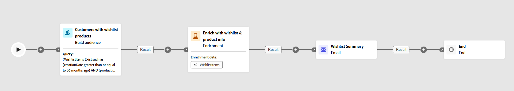
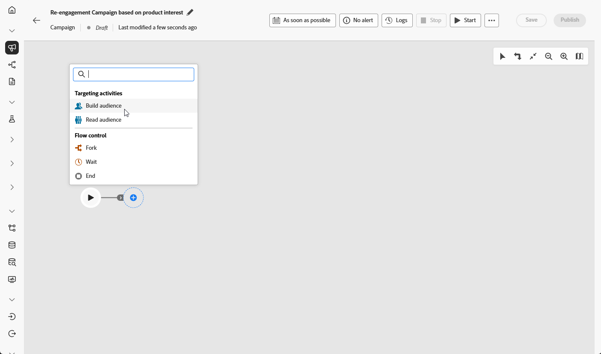
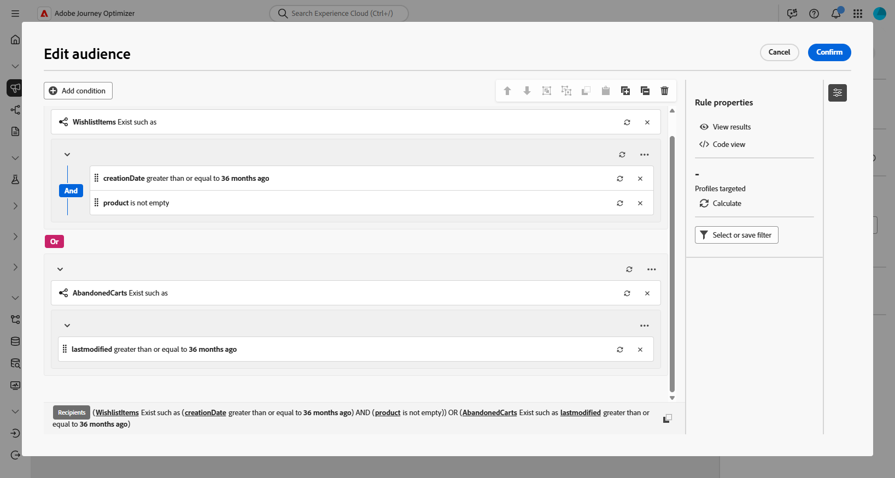
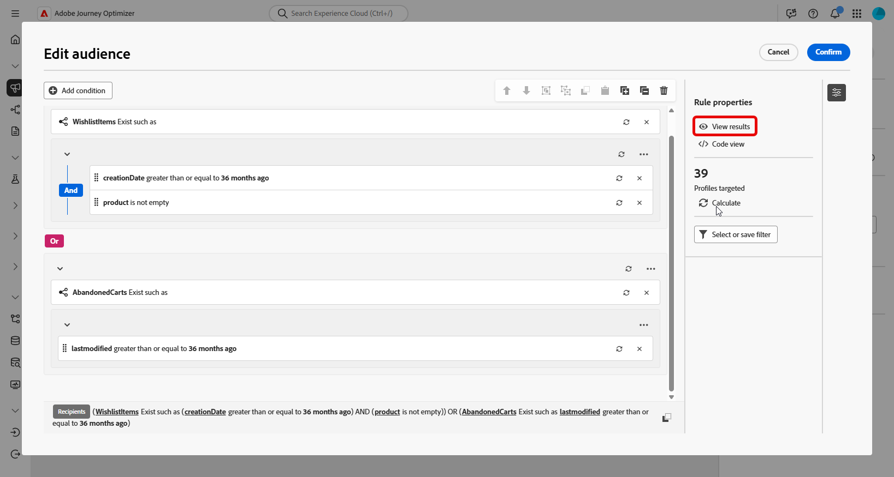
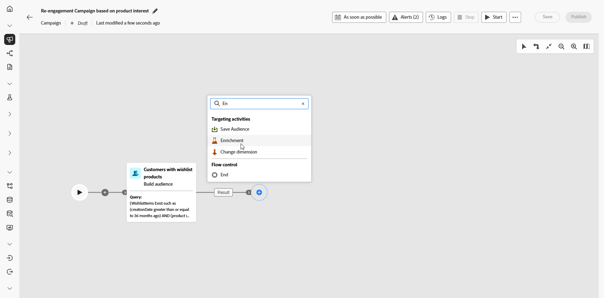
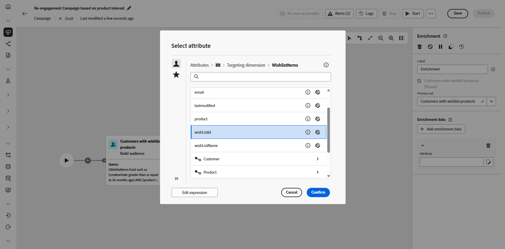
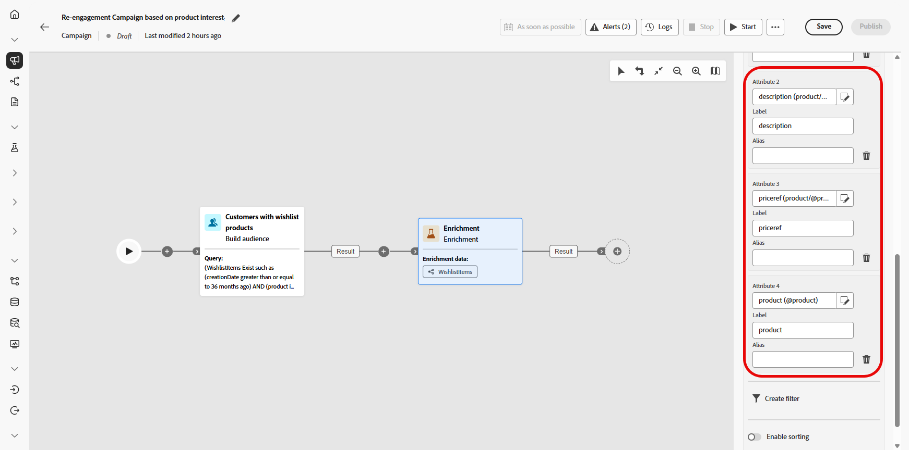
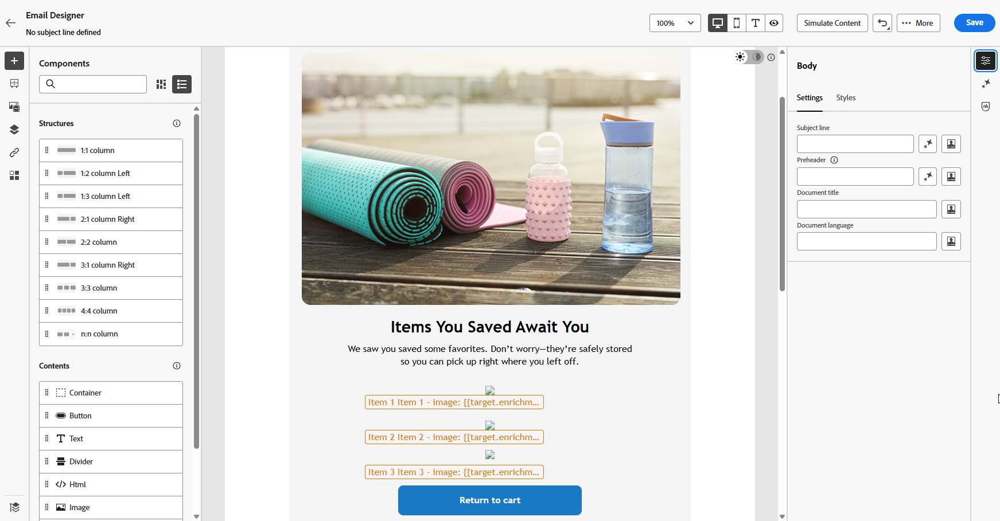
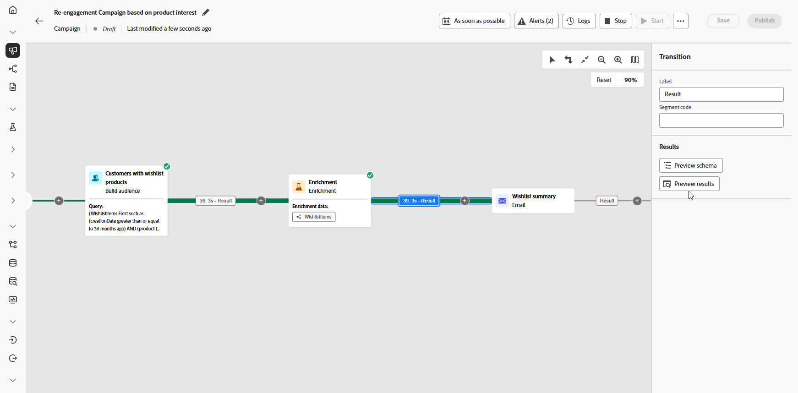

# Inviare aggiornamenti voci della wishlist {#wishist-uc}

>[!BEGINSHADEBOX]

Anche se questo esempio utilizza uno schema **Lista dei desideri**, lo stesso metodo si applica a qualsiasi entità con una relazione uno-a-molti con **Destinatari** come **Acquisti**, **Iscrizioni** o qualsiasi schema personalizzato in cui ogni destinatario può avere più record associati.

**Schemi necessari per questo caso d&#39;uso:**

* **Destinatari**: utilizzato come dimensione di targeting
* **Elementi elenco desideri**: con campi: `creationDate`, `product`, `Wishlistid`
* **Prodotto**: con campi: `description`, `priceref`, `imageurl`
* **AbandonedCarts** (facoltativo): con campo: `lastmodified`

➡️ [Scopri come configurare gli schemi relazionali](gs-schemas.md)

>[!ENDSHADEBOX]

{zoomable="yes"}

Questa campagna orchestrata si concentra sul coinvolgimento dei visitatori ricordando loro i prodotti salvati nella loro lista dei desideri. Utilizzando Campaign Orchestration, definisci il pubblico con condizioni basate sull’attività della lista dei desideri, aiutando i visitatori a riconvertirsi.

1. Inizia creando una nuova campagna mirata specificamente al coinvolgimento nella lista dei desideri. Questo aiuterà a focalizzare la messaggistica sui clienti che hanno mostrato l’intento di acquisto salvando gli articoli.

   {zoomable="yes"}

1. Inserisci le **impostazioni della campagna**.

1. Aggiungi un&#39;attività **[!UICONTROL Genera pubblico]** per identificare il gruppo di clienti di destinazione in base al comportamento della lista dei desideri.

   {zoomable="yes"}

1. Imposta un **[!UICONTROL Etichetta]** descrittivo per questo pubblico e scegli **[!UICONTROL Destinatari]** come **[!UICONTROL Dimensione targeting]**. Quindi fai clic su **[!UICONTROL Continua]** per configurare il pubblico.

1. Fai clic su **[!UICONTROL Aggiungi condizione]** per perfezionare il pubblico creando la seguente condizione:

   `WishlistItems Exist such as (creationDate greater than or equal to 36 months ago) AND (product is not empty`
OPPURE
   `AbandonedCarts Exist such as lastmodified greater than or equal to 36 months ago`

   Questo pubblico si basa su destinatari che hanno una lista dei desideri, contengono elementi con immagini di prodotto o hanno un carrello abbandonato entro l’intervallo di tempo definito.

   {zoomable="yes"}

1. Fai clic su **[!UICONTROL Calcola]** per visualizzare il numero di profili interessati da queste condizioni e su **[!UICONTROL Visualizza risultati]** per esaminare i dettagli di ciascuna condizione e confermare che il pubblico corrisponda al segmento di destinazione.

   {zoomable="yes"}

1. Fai clic su **[!UICONTROL Conferma]**.

1. Aggiungi un&#39;attività **[!UICONTROL Enrichment]** per personalizzare la campagna con **lista dei desideri** e **informazioni prodotto**.

   {zoomable="yes"}

1. Fai clic su **[!UICONTROL Aggiungi dati di arricchimento]**.

1. Accedi a `Targeting dimension > Wishlistitems > Wishlistid`.

   {zoomable="yes"}

1. Seleziona la modalità di raccolta dei dati, in questo caso **[!UICONTROL Raccogli dati]** per raccogliere i dettagli della lista dei desideri per il pubblico.

1. Scegliere il numero di righe da recuperare. Per impostazione predefinita, vengono recuperati tre elementi per lista dei desideri, ma questo può essere regolato a seconda che la campagna debba evidenziare un numero maggiore o minore di prodotti.

1. Fare clic su **[!UICONTROL Aggiungi attributo]** per creare i tre attributi seguenti:

   * `Product > description`
   * `Product > priceref`
   * `Product > imageurl`

   Questo arricchisce il messaggio con informazioni dettagliate sul prodotto per favorire le conversioni.

   {zoomable="yes"}

1. Aggiungi un’attività e-mail per creare un messaggio di ricoinvolgimento personalizzato individualmente per ogni cliente. Fai clic su **[!UICONTROL Modifica contenuto]** per iniziare a progettare il contenuto.

   ➡️ [Ulteriori informazioni sulla personalizzazione delle e-mail](../email/content-from-scratch.md)

   {zoomable="yes"}

1. Dopo aver finalizzato l&#39;e-mail, salva ed esegui la campagna in modalità bozza facendo clic su **[!UICONTROL Avvia]** dalla campagna orchestrata.

1. Dopo aver avviato la modalità bozza, visualizza l’anteprima del pubblico con i dettagli della lista dei desideri.

   Per approfondimenti, fai clic su un risultato e seleziona **[!UICONTROL Anteprima risultati]**.

   {zoomable="yes"}

Dopo l’esecuzione della campagna, possiamo esplorare i nostri rapporti, che ci forniscono un set affidabile di dati e KPI sulle prestazioni della campagna.

➡️ [Ulteriori informazioni sul reporting](../reports/campaign-global-report-cja.md)
