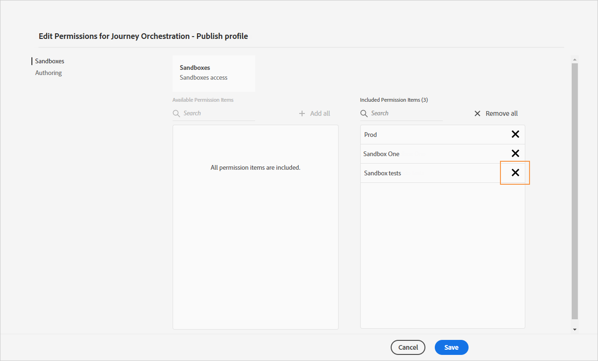
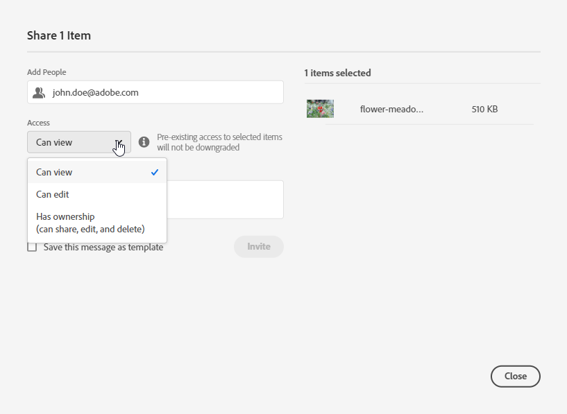

# Gestire le autorizzazioni {#manage-permissions}

## Accesso a Journey Optimizer {#access-CJM}

[!DNL Journey Optimizer] ti consente di assegnare agli utenti un set di autorizzazioni per definire a quale parte dell’interfaccia possono accedere.

Possono essere gestiti dagli amministratori che hanno accesso all’Admin Console. [Ulteriori informazioni su Adobe Admin Console](https://helpx.adobe.com/it/enterprise/managing/user-guide.html).

Per poter accedere a [!DNL Journey Optimizer], un utente deve essere:

* parte di un **[!UICONTROL product profile]** di [!DNL Journey Optimizer] associato alle autorizzazioni di [!DNL Journey Optimizer].

* parte di un **[!UICONTROL product profile]** di [!DNL Adobe Experience Platform]. Non c’è alcuna autorizzazione obbligatoria da possedere. L’utente deve disporre dell’autorizzazione **[!UICONTROL profile management]** per creare e modificare i segmenti di Platform dall’interfaccia di [!DNL Journey Optimizer]. [Ulteriori informazioni sul controllo](https://experienceleague.adobe.com/docs/experience-platform/access-control/home.html?lang=en#adobe-admin-console) degli accessi.

All’interno di Admin Console, puoi assegnare agli utenti uno dei seguenti profili di prodotto pronti all’uso:

* **[!UICONTROL Limited Access User]**: utente con accesso in sola lettura ai percorsi e ai rapporti. Questo profilo di prodotto include le seguenti autorizzazioni:
   * Lettura dei percorsi
   * Lettura dei rapporti

* **[!UICONTROL Administrators]**: utente con accesso ai menu di amministrazione con la possibilità di gestire percorsi, eventi e rapporti. Questo profilo di prodotto include le seguenti autorizzazioni:
   * Gestione dei percorsi
   * Pubblicazione dei percorsi
   * Gestione di eventi, origini dati e azioni
   * Gestione dei rapporti

* **[!UICONTROL Standard User]**: utente con accesso di base, ad esempio gestione del percorso. Questo profilo di prodotto include le seguenti autorizzazioni:
   * Gestione dei percorsi
   * Pubblicazione dei percorsi
   * Gestione dei rapporti
   * Leggi eventi, origini dati e azioni

Puoi anche creare profili di prodotto personalizzati, se i profili forniti non sono sufficienti per la gestione dei tuoi utenti.
Gli utenti devono essere sempre collegati a un profilo di prodotto che consenta loro di assegnare autorizzazioni incorporate specifiche, ad esempio:

* **[!UICONTROL Read journeys]**
* **[!UICONTROL Read reports]**
* **[!UICONTROL Manage events, data sources and actions]**
* **[!UICONTROL Read events, data sources and actions]**
* **[!UICONTROL Manage journeys]**
* **[!UICONTROL Publish journeys]**
* **[!UICONTROL Manage reports]**

>[!NOTE]
>
> La gestione delle autorizzazioni non include i messaggi: ogni utente può creare o modificare messaggi.

### Creazione di un profilo di prodotto {#create-product-profile}

[!DNL Journey Optimizer] consente di creare profili di prodotto personalizzati e di assegnare agli utenti un set di autorizzazioni e sandbox. Con i profili di prodotto, puoi autorizzare o negare l’accesso a determinate funzionalità o oggetti all’interno dell’interfaccia.

Per ulteriori informazioni sulla modalità di creazione e di gestione delle sandbox, consulta la [documentazione di Adobe Experience Platform](https://experienceleague.adobe.com/docs/experience-platform/sandbox/ui/user-guide.html).

Per creare un profilo di prodotto e assegnare un set di autorizzazioni e sandbox:

1. All’interno di Admin Console, seleziona **[!UICONTROL Journey Orchestration]**. Dalla scheda **[!UICONTROL Product profile]**, fai clic su **[!UICONTROL New Profile]**.

   

1. Aggiungi **[!UICONTROL Profile Name]** e **[!UICONTROL Description]** per il tuo nuovo profilo di prodotto. Se desideri che il tuo profilo sia **[!UICONTROL Display name]** diverso, deseleziona **[!UICONTROL Same as Profile Name]** e digita il tuo **[!UICONTROL Display name]**.

1. Nella categoria **[!UICONTROL User Notifications]**, scegli di informare gli utenti via e-mail, quando verranno aggiunti o rimossi da questo profilo di prodotto.

1. Al termine, fai clic su **[!UICONTROL Done]**. È stato creato il tuo nuovo profilo di prodotto.

   

1. Seleziona il nuovo profilo di prodotto per iniziare a gestire le autorizzazioni. Nella scheda **[!UICONTROL Users]**, aggiungi gli utenti al tuo profilo di prodotto. [Scopri come assegnare il profilo](permissions.md#assigning-product-profile) di prodotto.

1. Effettua gli stessi passaggi descritti in precedenza per aggiungere **[!UICONTROL Admin]** al tuo profilo di prodotto.

1. Dalla scheda **[!UICONTROL Permissions]**, seleziona una delle due categorie **[!UICONTROL Sandbox]** o **[!UICONTROL Authoring]** per aprire la pagina **[!UICONTROL Edit Permissions]** e aggiungere o rimuovere le autorizzazioni per il profilo di prodotto.

   

1. Nella categoria di autorizzazioni **[!UICONTROL Sandboxes]**, seleziona le sandbox da assegnare al tuo profilo di prodotto. Nella sezione **[!UICONTROL Available Permissions Items]**, fai clic sull’icona più (+) per assegnare le sandbox al profilo. [Ulteriori informazioni sulle sandbox](https://experienceleague.adobe.com/docs/experience-platform/sandbox/home.html).

   

1. Se necessario, in **[!UICONTROL Included Permission Items]**, fai clic sull’icona X adiacente alla rimozione delle autorizzazioni dal tuo profilo di prodotto.

   

1. Dalla categoria di autorizzazioni **[!UICONTROL Authoring]**, esegui gli stessi passaggi indicati sopra per aggiungere le autorizzazioni al tuo profilo di prodotto.

   

1. Al termine, fai clic su **[!UICONTROL Save]**.

Adesso il tuo profilo di prodotto è stato creato e configurato. Gli utenti collegati a questo profilo ora possono connettersi a [!DNL Journey Optimizer].

### Assegnazione di un profilo di prodotto {#assigning-product-profile}

I profili di prodotto sono assegnati a un set di utenti che condividono le medesime autorizzazioni all’interno dell’organizzazione.
L’elenco di tutti i profili di prodotto forniti con autorizzazioni assegnate è disponibile all’interno di questa sezione.

Per assegnare un profilo di prodotto a un utente per accedere ai percorsi:

1. All’interno di Admin Console, seleziona **[!UICONTROL Journey Orchestration]**.

   

1. Scegli il profilo di prodotto a cui verrà collegato il nuovo utente.

   

1. Fai clic su **[!UICONTROL Add user]**.

   Puoi anche aggiungere il nuovo utente a un gruppo di utenti per ottimizzare il set di autorizzazioni condiviso. [Ulteriori informazioni sui gruppi](https://helpx.adobe.com/it/enterprise/using/user-groups.html) di utenti.

   

1. Digita l’indirizzo e-mail del nuovo utente e fai clic su **[!UICONTROL Save]**.

   

L’utente dovrebbe quindi ricevere un messaggio e-mail di reindirizzamento all’istanza .

## Utilizzo delle sandbox {#sandboxes}

[!DNL Journey Optimizer] consente di suddividere l’istanza in ambienti virtuali separati, denominati sandbox.
Le sandbox vengono assegnate tramite i profili di prodotto nella Admin Console. [Scopri come assegnare le sandbox](permissions.md#create-product-profile).

[!DNL Journey Optimizer] riflette le sandbox Adobe Experience Platform create per una determinata organizzazione.
Le sandbox di Adobe Experience Platform possono essere create o reimpostate dall’istanza Adobe Experience Platform. [Ulteriori informazioni sono disponibili nella guida utente della sandbox](https://experienceleague.adobe.com/docs/experience-platform/sandbox/ui/user-guide.html).

Il controllo del commutatore sandbox è disponibile in alto a sinistra sullo schermo. Per passare da una sandbox all’altra, fai clic sulla sandbox attualmente attiva nel commutatore e selezionane un’altra dall’elenco a discesa.

## Accesso al contenuto {#content-access}

Per configurare l’accessibilità dei contenuti, è necessario assegnare una cartella condivisa del contenuto a ciascuna delle sandbox. Puoi creare e configurare la cartella condivisa nella scheda **[!UICONTROL Storage]** visualizzata in [!DNL Admin Console] per gli amministratori. Se hai accesso a [!DNL Admin Console] come amministratore di sistema, puoi creare cartelle condivise e aggiungere delegati con diverso livello di accesso alle cartelle condivise.

Per sincronizzare il contenuto con la sandbox corretta, è necessario seguire la stessa sintassi della sandbox; ad esempio, se la sandbox è denominata sviluppo, la cartella condivisa deve avere lo stesso nome.

[Scopri come gestire le cartelle](https://helpx.adobe.com/enterprise/admin-guide.html/enterprise/using/manage-adobe-storage.ug.html) condivise.

## Autorizzazioni Assets Essentials {#assets-permissions}

Adobe Experience Manager Assets Essentials fornisce un archivio unico e centralizzato di risorse da utilizzare per compilare i messaggi.
Ogni risorsa viene salvata in cartelle o sottocartelle. Puoi scegliere di condividere le cartelle e il livello di accesso da assegnare.

1. Dalla scheda **[!UICONTROL Assets]** , naviga tra le cartelle per trovare quella da condividere.

1. Seleziona la cartella o la risorsa e fai clic su **[!UICONTROL Share]**.

   

1. Inserisci l’indirizzo e-mail della persona con cui desideri condividere l’accesso alla cartella.

1. Scegli tra i diversi livelli di accesso:

   * **[!UICONTROL Can view]**
   * **[!UICONTROL Can edit]**
   * **[!UICONTROL Has ownership (can share, edit, and delete)]**

   

1. Se necessario, aggiungi un messaggio all’invito.

1. Fai clic su **[!UICONTROL Invite]**.

   
