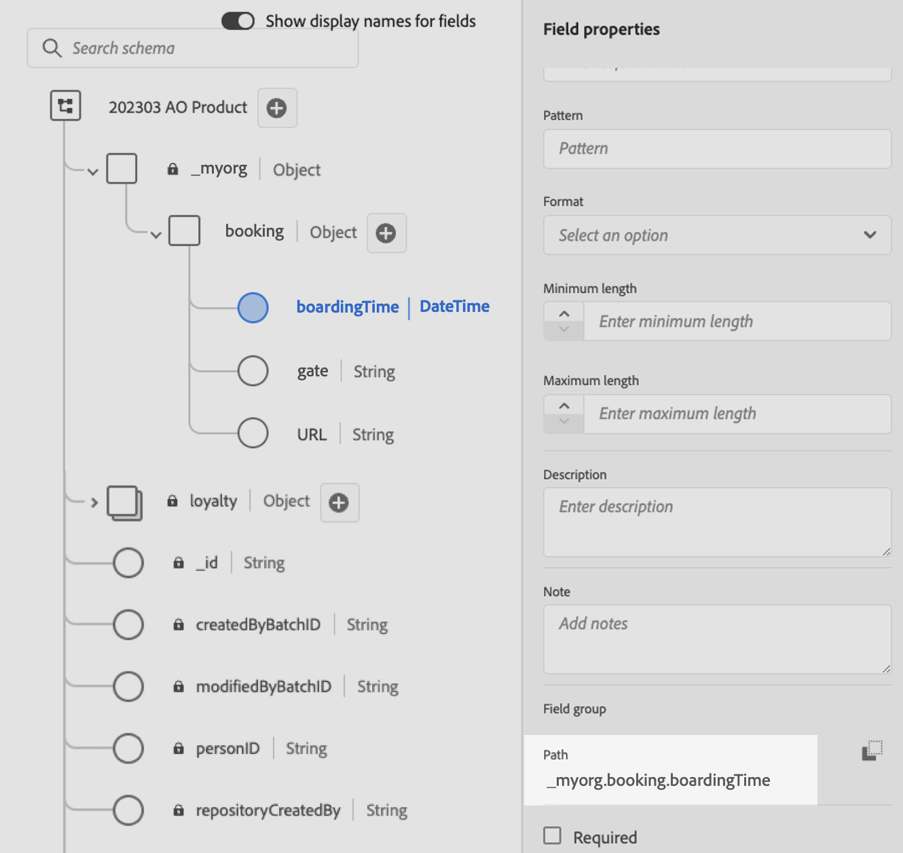

# Utilizzare i dati di Adobe Experience Platform per la personalizzazione {#aep-data}

>[!BEGINSHADEBOX]

**In questa pagina:** Scopri come utilizzare la funzione helper datasetLookup nell&#39;editor di personalizzazione per recuperare i campi dai set di dati dei record di Adobe Experience Platform e personalizzare il contenuto.

>[!ENDSHADEBOX]

>[!AVAILABILITY]
>
>Questa funzione è attualmente disponibile per tutti i clienti come versione a disponibilità limitata.
>
>Per il momento, la funzione helper &quot;datasetLookup&quot; può essere utilizzata all’interno di frammenti di espressione per un set limitato di clienti. Per potervi accedere, contatta il tuo rappresentante Adobe.

Journey Optimizer ti consente di sfruttare i dati dei set di dati dei record di Adobe Experience Platform nell&#39;editor di personalizzazione per [personalizzare il contenuto](../personalization/personalize.md). Prima di iniziare, i set di dati necessari per la personalizzazione della ricerca devono essere abilitati per la ricerca. Informazioni dettagliate sono disponibili in questa sezione: [Usa dati di Adobe Experience Platform](../data/lookup-aep-data.md).

Dopo aver abilitato un set di dati per la personalizzazione di ricerca, puoi utilizzarne i dati per personalizzare il contenuto in [!DNL Journey Optimizer].

1. Apri l’editor di personalizzazione, disponibile in ogni contesto in cui puoi definire la personalizzazione, ad esempio i messaggi. [Scopri come utilizzare l&#39;editor di personalizzazione](../personalization/personalization-build-expressions.md)

1. Passare all&#39;elenco delle funzioni di supporto e aggiungere la funzione di supporto **datasetLookup** al riquadro del codice.

   

1. Questa funzione fornisce una sintassi predefinita per consentire di chiamare campi dai set di dati di Adobe Experience Platform. La sintassi è la seguente:

   ```
   {{datasetLookup datasetId="datasetId" id="key" result="store" required=false}}
   ```

   * **datasetId** è l&#39;ID del set di dati con cui stai lavorando.
   * **id** è l&#39;ID della colonna di origine che deve essere unita all&#39;identità primaria del set di dati di ricerca.

     >[!NOTE]
     >
     >Il valore immesso per questo campo può essere un ID campo (`profile.packages.packageSKU`), un campo passato in un evento di percorso (`context.journey.events.event_ID.productSKU`) o un valore statico (`sku007653`). In ogni caso, il sistema utilizzerà il valore e la ricerca nel set di dati per verificare se corrisponde a una chiave.
     >
     >Se utilizzi un valore stringa letterale per la chiave, tieni il testo tra virgolette. Esempio: `{{datasetLookup datasetId="datasetId" id="SKU1234" result="store" required=false}}`. Se si utilizza un valore di attributo come chiave dinamica, rimuovere le virgolette. Esempio: `{{datasetLookup datasetId="datasetId" id=category.product.SKU result="SKU" required=false}}`

   * **result** è un nome arbitrario che devi fornire per fare riferimento a tutti i valori di campo che stai per recuperare dal set di dati. Questo valore verrà utilizzato nel codice per chiamare ogni campo.

   * **required=false**: se required è impostato su TRUE, il messaggio verrà recapitato solo se viene trovata una chiave corrispondente. Se è impostato su false, non è necessaria una chiave corrispondente e il messaggio può ancora essere recapitato. Se impostato su false, è consigliabile tenere conto dei valori di fallback o predefiniti nel contenuto del messaggio.

   +++Dove recuperare un ID set di dati?

   Gli ID dei set di dati possono essere recuperati nell’interfaccia utente di Adobe Experience Platform. Scopri come utilizzare i set di dati nella [documentazione di Adobe Experience Platform](https://experienceleague.adobe.com/en/docs/experience-platform/catalog/datasets/user-guide#view-datasets){target="_blank"}.

   

   +++

1. Adatta la sintassi in base alle tue esigenze. In questo esempio, vogliamo recuperare i dati relativi ai voli dei passeggeri. La sintassi è la seguente:

   ```
   {{datasetLookup datasetId="1234567890abcdtId" id=profile.upcomingFlightId result="flight"}}
   ```

   * Stiamo lavorando nel set di dati il cui ID è &quot;1234567890abcdtId&quot;,
   * Il campo che si desidera utilizzare per effettuare un&#39;unione con il set di dati di ricerca è *profile.upcomingFlightId*,
   * Vogliamo includere tutti i valori dei campi nel riferimento &quot;volo&quot;.

1. Una volta configurata la sintassi da chiamare nel set di dati di Adobe Experience Platform, puoi specificare quali campi recuperare. La sintassi è la seguente:

   ```
   {{result.fieldId}}
   ```

   >[!NOTE]
   >
   >Quando fai riferimento a un campo di set di dati, accertati di corrispondere al percorso completo del campo definito all’interno dello schema.
   >
   >Non vi sono limiti rigidi al numero di campi che possono essere richiamati utilizzando la funzione helper. Tuttavia, per prestazioni ottimali, si consiglia di mantenere il numero di campi al di sotto di 50 per evitare di influire sulla velocità effettiva.

   * **result** è il valore assegnato al parametro **result** nella funzione helper **datasetLookup**. In questo esempio, &quot;flight&quot;.
   * **fieldID** è l&#39;ID del campo che si desidera recuperare. Questo ID è visibile nell&#39;interfaccia utente di [!DNL Adobe Experience Platform] durante la navigazione nello schema di record relativo al set di dati:

     +++Dove recuperare un ID campo?

     Gli ID dei campi possono essere recuperati durante l’anteprima di un set di dati nell’interfaccia utente di Adobe Experience Platform. Scopri come visualizzare in anteprima i set di dati nella [documentazione di Adobe Experience Platform](https://experienceleague.adobe.com/en/docs/experience-platform/catalog/datasets/user-guide#preview){target="_blank"}.

     

     +++

   In questo esempio, vogliamo utilizzare le informazioni relative all&#39;orario di imbarco e al gate dei passeggeri. Pertanto, aggiungiamo queste due righe:

   * `{{flight._myorg.booking.boardingTime}}`
   * `{{flight._myorg.booking.gate}}`

1. Ora che il codice è pronto, puoi completare il contenuto come di consueto e testarlo utilizzando uno dei due metodi di simulazione: fai clic su **[!UICONTROL Simula contenuto]** per testare le varianti di contenuto con dati di input di esempio o generazione automatica di IA, oppure fai clic su **[!UICONTROL Simula contenuto]**, quindi seleziona **[!UICONTROL Simula contenuto (profili AEP)]** dal menu a discesa per visualizzare l&#39;anteprima con i profili di test. [Scopri come visualizzare in anteprima e testare il contenuto](../content-management/preview-test.md)


   

## Riferimento rapido {#quick-reference}

Questa sezione contiene informazioni strutturate che supportano l&#39;interpretazione, il recupero e la risposta alle domande relative a questo argomento.

Per una comprensione completa, queste informazioni devono essere unite alla documentazione su questa pagina. Nessuna delle due origini è progettata per essere indipendente; la pagina descrive la funzione, mentre questa sezione fornisce un contesto aggiuntivo che aiuta a non ambiguare la terminologia, le finalità, l’applicabilità e i vincoli.

>[!BEGINTABS]

>[!TAB Panoramica]

**TL;DR**

Questa pagina illustra come utilizzare la funzione helper `datasetLookup` nell&#39;editor di personalizzazione di Journey Optimizer per recuperare i campi dai set di dati dei record di Adobe Experience Platform e incorporarli nella personalizzazione dei messaggi.

**Intenti**

* Abilitare un set di dati di record di AEP per la personalizzazione della ricerca
* Aggiungi la funzione helper `datasetLookup` a un&#39;espressione di personalizzazione
* Configura la funzione con un ID set di dati, una chiave di join, un alias risultato e un flag obbligatorio
* Fai riferimento ai campi del set di dati recuperato nelle espressioni di personalizzazione utilizzando l’alias del risultato
* Testare contenuti personalizzati utilizzando il flusso di contenuto Simula

>[!TAB Glossario]

* **datasetLookup**: una funzione di supporto nell&#39;editor di personalizzazione che recupera i valori dei campi da un set di dati di record di AEP unendosi a una chiave specificata. *(specifico per prodotto)*
* **Set di dati record**: tipo di set di dati Adobe Experience Platform contenente dati a livello di record che può essere abilitato per la personalizzazione di ricerca. *(specifico per prodotto)*
* **Ricerca personalizzazione**: processo di recupero dei campi da un set di dati di record di AEP al momento dell&#39;invio per personalizzare il contenuto del messaggio. *(specifico per prodotto)*
* **parametro risultato**: alias arbitrario assegnato nella chiamata `datasetLookup`; utilizzato per fare riferimento a tutti i valori di campo recuperati nelle espressioni successive (ad esempio, `{{result.fieldId}}`).
* **parametro obbligatorio**: un flag booleano in `datasetLookup` che controlla se la consegna dei messaggi richiede una chiave corrispondente da trovare nel set di dati.

>[!TAB Terminologia]

* **Nome canonico:** datasetLookup — varianti: ricerca set di dati, helper ricerca set di dati, funzione helper ricerca set di dati
* **Sinonimi:** &quot;datasetLookup&quot; = &quot;funzione helper per ricerca set di dati&quot;
* **Non confondere:** &quot;datasetId&quot; (identificatore del set di dati di AEP) ≠ &quot;id&quot; (colonna di origine utilizzata per l&#39;unione con l&#39;identità primaria del set di dati) ≠ &quot;result&quot; (alias per il riferimento ai valori dei campi recuperati)

>[!TAB Guardrail e limitazioni]

* La funzione è a disponibilità limitata e non è ancora disponibile per tutti i clienti.
* La funzione helper `datasetLookup` all&#39;interno dei frammenti di espressione è disponibile solo per un gruppo limitato di clienti. Per ottenere l&#39;accesso, contatta il tuo rappresentante Adobe.
* Prima di poter essere utilizzati con `datasetLookup`, i set di dati devono essere abilitati esplicitamente per la personalizzazione della ricerca.
* Mantieni il numero di campi recuperati per chiamata `datasetLookup` al di sotto di 50 per evitare di influire sulla velocità effettiva (limite consigliato, non è indicato alcun limite rigido nella pagina).

>[!TAB Domande frequenti]

**Q: Cos&#39;è la funzione helper `datasetLookup`?**

Si tratta di una funzione di supporto nell’editor di personalizzazione che recupera i valori dei campi dai set di dati dei record di Adobe Experience Platform, consentendoti di incorporarli nella personalizzazione dei messaggi.

**D: cosa succede se `required=false` e non viene trovata alcuna chiave corrispondente nel set di dati?**

Il messaggio può ancora essere consegnato. Si consiglia di tenere conto dei valori di fallback o predefiniti nel contenuto del messaggio quando si utilizza `required=false`.

**D: cosa succede se `required=true` e non viene trovata alcuna chiave corrispondente?**

Il messaggio verrà recapitato solo se nel set di dati viene trovata una chiave corrispondente.

**D: Dove posso trovare l&#39;ID del set di dati e gli ID dei campi necessari per la sintassi?**

Gli ID dei set di dati possono essere recuperati nell’interfaccia utente di Adobe Experience Platform in Set di dati. Gli ID dei campi sono visibili quando si visualizza l’anteprima di un set di dati e si sfoglia lo schema dei record nell’interfaccia utente di AEP.

**Q: come posso testare il contenuto che utilizza `datasetLookup`?**

Utilizza il pulsante **Simula contenuto** per eseguire il test con dati di input di esempio o generazione automatica di IA oppure seleziona **Simula contenuto (profili AEP)** dal menu a discesa per visualizzare l&#39;anteprima con i profili di test.

>[!ENDTABS]

<!-- ai-section-version: 1 | source-hash: 89d99e47 -->
