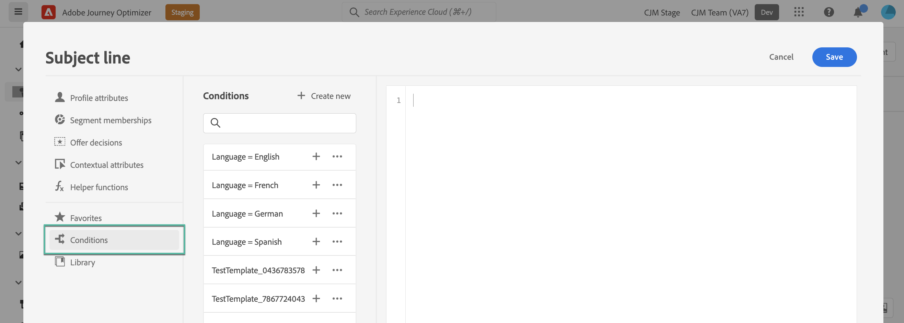

# Utilizzare le regole condizionali {#conditions}

>[!BEGINSHADEBOX]

**In questa pagina:** scopri come creare regole condizionali dagli attributi di profilo, dagli eventi contestuali e dai tipi di pubblico nell&#39;editor di personalizzazione e salvarle nella libreria per riutilizzarle nei contenuti.

>[!ENDSHADEBOX]

Le regole condizionali sono insiemi di regole che definiscono quale contenuto deve essere visualizzato nei messaggi, a seconda di vari criteri come gli attributi dei profili, l’appartenenza a un pubblico o gli eventi contestuali.

Le regole condizionali vengono create utilizzando l’editor di personalizzazione e possono essere memorizzate se desideri riutilizzarle nei contenuti. [Scopri come salvare una regola condizionale nella libreria](#save)

>[!NOTE]
>
>Gli utenti dovranno disporre dell&#39;autorizzazione [Gestisci elementi libreria](../administration/ootb-product-profiles.md) per salvare o eliminare le regole condizionali. Le condizioni salvate sono disponibili per l’utilizzo da parte di tutti gli utenti di un’organizzazione.

## Accedere al generatore di regole condizionali {#access}

Le regole condizionali vengono create dal menu **[!UICONTROL Condizioni]** all&#39;interno dell&#39;editor di personalizzazione, accessibile:

* Da E-mail Designer, quando si abilita il contenuto dinamico per un componente nel corpo dell’e-mail. [Scopri come aggiungere contenuto dinamico alle e-mail](dynamic-content.md#emails)

  

* In qualsiasi campo in cui puoi aggiungere la personalizzazione utilizzando l&#39;[editor di personalizzazione](personalization-build-expressions.md).

  

## Creare una regola condizionale {#create-condition}

>[!CONTEXTUALHELP]
>id="ajo_expression_editor_conditions_create"
>title="Creare una condizione"
>abstract="Combina gli attributi di profilo, gli eventi contestuali o i segmenti di pubblico per creare regole che definiscano quali contenuti visualizzare nei messaggi."

>[!CONTEXTUALHELP]
>id="ajo_expression_editor_conditions"
>title="Creare una condizione"
>abstract="Combina gli attributi di profilo, gli eventi contestuali o i segmenti di pubblico per creare regole che definiscano quali contenuti visualizzare nei messaggi."

I passaggi per creare una regola condizionale sono i seguenti:

1. Accedi al menu **[!UICONTROL Condizioni]** dall&#39;editor di personalizzazione o da E-mail Designer, quindi fai clic su **[!UICONTROL Crea nuovo]**.

1. Crea la regola condizionale in base alle tue esigenze. A questo scopo, trascina e rilascia nell’area di lavoro gli attributi desiderati dal menu a sinistra.

   I passaggi per combinare gli attributi nell’area di lavoro sono simili all’esperienza di creazione dei segmenti. Per ulteriori informazioni su come utilizzare l&#39;area di lavoro del generatore di regole, consultare [questa documentazione](https://experienceleague.adobe.com/docs/experience-platform/segmentation/ui/segment-builder.html#rule-builder-canvas).

   

   Gli attributi sono organizzati in tre schede:

   * **[!UICONTROL Profilo]**:
      * **[!UICONTROL Tipi di pubblico]** elenca tutti gli attributi del pubblico (ad esempio stato, versione ecc.) per [Servizio di segmentazione Adobe Experience Platform](https://experienceleague.adobe.com/docs/experience-platform/segmentation/home.html?lang=it){target="_blank"},
      * **[!UICONTROL Profili individuali XDM]** elenca tutti gli attributi di profilo associati allo schema [Experience Data Model (XDM)](https://experienceleague.adobe.com/docs/experience-platform/xdm/home.html?lang=it){target="_blank"} definito in Adobe Experience Platform.
   * **[!UICONTROL Contestuale]**: quando il messaggio viene utilizzato in un percorso, i campi del percorso contestuale sono disponibili tramite questa scheda.
   * **[!UICONTROL Tipi di pubblico]**: elenca tutti i tipi di pubblico generati dalle definizioni dei segmenti create nel [servizio di segmentazione di Adobe Experience Platform](https://experienceleague.adobe.com/docs/experience-platform/segmentation/home.html?lang=it){target="_blank"}.

1. Una volta che la regola condizionale è pronta, puoi aggiungerla al messaggio per creare contenuto dinamico. [Scopri come aggiungere contenuti dinamici](dynamic-content.md)

   Puoi anche salvare la regola per consentire un ulteriore riutilizzo. [Scopri come salvare una condizione](#save)

## Salvare una regola condizionale {#save}

Se esistono regole di condizione che riutilizzerai frequentemente, puoi salvarle nella libreria delle condizioni. Tutte le regole salvate sono condivise e possono essere accessibili e utilizzate da singoli utenti all’interno dell’organizzazione.

>[!NOTE]
>
>Le regole condizionali che sfruttano gli attributi contestuali dei percorsi non possono essere salvate nella libreria.

1. Nella schermata di modifica della condizione, fare clic sul pulsante **[!UICONTROL Salva condizione]**.

1. Assegna un nome e una descrizione (facoltativa) alla regola, quindi fai clic su **[!UICONTROL Aggiungi]**.

   

1. La regola condizionale viene salvata nella libreria. Ora puoi utilizzarlo per creare contenuto dinamico nei messaggi. [Scopri come aggiungere contenuti dinamici](dynamic-content.md)

>[!CAUTION]
>
>Quando si denominano le varianti di contenuto condizionale, utilizza solo caratteri alfanumerici (A-Z, a-z, 0-9). L&#39;uso di caratteri speciali (ad esempio `<`, `>`, `=`, `{`, `}`, ecc.) nei nomi delle varianti può causare l’interruzione o la mancata visualizzazione dei componenti da parte dell’editor modelli.

## Modificare ed eliminare le regole condizionali salvate {#edit-delete}

Puoi eliminare una regola condizionale in qualsiasi momento utilizzando il pulsante con i puntini di sospensione.

Le regole condizionali salvate nella libreria non possono essere modificate. Tuttavia, puoi comunque utilizzarli per creare nuove regole. A questo scopo, apri la regola condizionale, apporta le modifiche desiderate, quindi salvala nella libreria. [Scopri come salvare una condizione nella libreria](#save)

## Riferimento rapido {#quick-reference}

Questa sezione contiene informazioni strutturate che supportano l&#39;interpretazione, il recupero e la risposta alle domande relative a questo argomento.

Per una comprensione completa, queste informazioni devono essere unite alla documentazione su questa pagina. Nessuna delle due origini è progettata per essere indipendente; la pagina descrive la funzione, mentre questa sezione fornisce un contesto aggiuntivo che aiuta a non ambiguare la terminologia, le finalità, l’applicabilità e i vincoli.

>[!BEGINTABS]

>[!TAB Panoramica]

**TL;DR**

Questa pagina spiega come creare regole condizionali dagli attributi di profilo, dagli eventi contestuali e dai tipi di pubblico nell’editor di personalizzazione e come salvarli nella libreria per riutilizzarli nel contenuto dei messaggi.

**Intenti**

* Accedere al generatore di regole condizionali dall’editor di personalizzazione o da E-mail Designer
* Creare una regola condizionale combinando attributi di profilo, appartenenza a un pubblico e campi di percorso contestuali
* Aggiungere una regola condizionale a un messaggio per creare contenuto dinamico
* Salvare una regola condizionale nella libreria delle condizioni per riutilizzarla nell&#39;organizzazione
* Modificare o eliminare una regola condizionale salvata

>[!TAB Glossario]

* **Regola condizionale**: un insieme di regole che definisce il contenuto da visualizzare nei messaggi, in base a criteri quali gli attributi del profilo, l&#39;appartenenza a un pubblico o gli eventi contestuali. *(specifico per prodotto)*
* **Libreria delle condizioni**: repository condiviso all&#39;interno di un&#39;organizzazione in cui le regole condizionali salvate sono archiviate e accessibili a tutti gli utenti. *(specifico per prodotto)*
* **Contenuto dinamico**: contenuto del messaggio la cui visualizzazione è disciplinata da regole condizionali. *(specifico per prodotto)*
* **Campi contestuali**: campi specifici del Percorso disponibili nel generatore di regole quando un messaggio viene utilizzato in un percorso; le regole che utilizzano questi campi non possono essere salvate nella libreria.
* **Profili individuali XDM**: attributi di profilo associati allo schema Experience Data Model (XDM) definito in Adobe Experience Platform, disponibili come criteri delle regole.

>[!TAB Terminologia]

* **Nome canonico:** regola condizionale — varianti: condizione, condizioni, regola contenuto condizionale
* **Sinonimi:** &quot;regola condizionale&quot; = &quot;condizione&quot; (come etichettato nell&#39;interfaccia utente)
* **Non confondere:** scheda &quot;Profilo&quot; (contiene sia gli attributi di pubblico che le sottosezioni dei profili individuali XDM) ≠ scheda &quot;Tipi di pubblico&quot; (elenca tutti i tipi di pubblico generati dalle definizioni dei segmenti nel servizio di segmentazione di AEP)
* **Non confondere:** &quot;salva una condizione&quot; (archiviazione di una regola nella libreria condivisa) ≠ &quot;crea una condizione&quot; (creazione di una nuova regola nell&#39;editor)

>[!TAB Guardrail e limitazioni]

* Le regole condizionali che sfruttano gli attributi contestuali del percorso non possono essere salvate nella libreria delle condizioni.
* Solo gli utenti con l&#39;autorizzazione **Gestisci elementi libreria** possono salvare o eliminare regole condizionali dalla libreria.
* Le condizioni salvate sono condivise e accessibili a tutti gli utenti all’interno dell’organizzazione.
* Le regole condizionali salvate nella libreria non possono essere modificate direttamente; apri la regola, apporta le modifiche desiderate e salvala nella libreria.
* I nomi delle varianti devono utilizzare solo caratteri alfanumerici (A-Z, a-z, 0-9); caratteri speciali come `<`, `>`, `=`, `{`, `}` possono causare l&#39;interruzione o la mancata visualizzazione dei componenti nell&#39;editor modelli.

>[!TAB Domande frequenti]

**D: quali criteri posso utilizzare per creare una regola condizionale?**

Attributi di profilo, appartenenza a un pubblico e campi di percorso contestuali (quando il messaggio viene utilizzato in un percorso).

**Q: è possibile salvare una regola condizionale che utilizza attributi contestuali di percorso?**

No. Le regole condizionali che sfruttano gli attributi contestuali del percorso non possono essere salvate nella libreria delle condizioni.

**D: chi può salvare o eliminare le regole condizionali nella libreria?**

Solo gli utenti con l&#39;autorizzazione **Gestisci elementi libreria** possono salvare o eliminare le regole condizionali.

**D: posso modificare una regola condizionale già salvata nella libreria?**

Le regole condizionali salvate nella libreria non possono essere modificate direttamente. Puoi aprire una regola salvata, apportare le modifiche desiderate e salvarla nella libreria.

**Q: esistono restrizioni alla denominazione delle varianti di contenuto condizionale?**

Sì. I nomi delle varianti devono contenere solo caratteri alfanumerici (A-Z, a-z, 0-9). Caratteri speciali come `<`, `>`, `=`, `{`, `}` possono causare l&#39;interruzione o la mancata visualizzazione dei componenti nell&#39;editor modelli.

>[!ENDTABS]

<!-- ai-section-version: 1 | source-hash: f375658d -->
