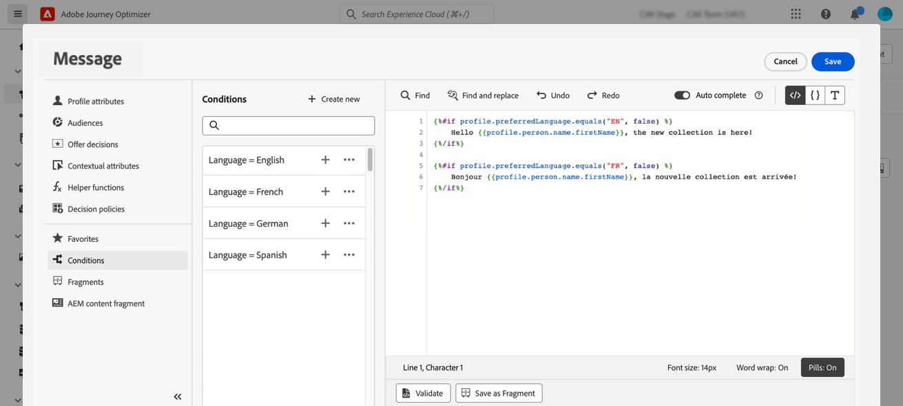

# Creare contenuti dinamici {#dynamic-content}

Adobe Journey Optimizer consente di sfruttare le regole condizionali create nella libreria per aggiungere contenuto dinamico ai messaggi.

Il contenuto dinamico può essere creato in qualsiasi campo in cui puoi aggiungere la personalizzazione utilizzando l’editor di personalizzazione. Ciò include l’oggetto, i collegamenti, il contenuto delle notifiche push o le rappresentazioni delle offerte di tipo testo. [Ulteriori informazioni sulla personalizzazione](personalize.md)

Inoltre, puoi utilizzare le regole condizionali nel Designer e-mail per creare più varianti di un componente di contenuto.

## Aggiungere contenuto dinamico alle espressioni {#perso-expressions}

I passaggi per aggiungere contenuto dinamico nelle espressioni sono i seguenti:

1. Passa al campo in cui desideri aggiungere contenuto dinamico, quindi apri l’editor di personalizzazione.

1. Selezionare il menu **[!UICONTROL Condizioni]** per visualizzare l&#39;elenco delle regole condizionali disponibili. Fai clic sul pulsante + accanto a una regola per aggiungerla all’espressione corrente.

   Puoi anche creare una nuova regola selezionando **[!UICONTROL Crea nuovo]**. [Scopri come creare le condizioni](create-conditions.md)

   

1. Aggiungere tra i tag `{%if}` e `{%/if}` il contenuto da visualizzare se la regola condizionale è soddisfatta. Puoi aggiungere tutte le regole necessarie per creare diverse varianti di un’espressione.

   Nell’esempio seguente, sono state create due varianti per un contenuto SMS, a seconda della lingua preferita del destinatario.

   

1. Quando il contenuto è pronto, puoi visualizzare in anteprima le diverse varianti utilizzando il pulsante **[!UICONTROL Simula contenuto]**. [Scopri come verificare e visualizzare in anteprima i messaggi](../content-management/preview-test.md)

   

>[!CAUTION]
>
>Se il rendering di E-mail Designer non riesce dopo l’aggiunta di blocchi condizionali, verifica che la sintassi di ogni nuova condizione sia corretta e che non esistano istruzioni duplicate o in conflitto. Se i problemi persistono, è consigliabile ricostruire le sezioni problematiche in un nuovo modello e testare ogni blocco condizionale in modo incrementale.

## Aggiungere contenuto dinamico alle e-mail {#emails}

>[!CONTEXTUALHELP]
>id="ac_conditional_content"
>title="Contenuto condizionale"
>abstract="Utilizza le regole condizionali per creare più varianti di un componente di contenuto. Se non viene soddisfatta alcuna condizione durante l’invio del messaggio, verrà visualizzato il contenuto della variante predefinita."

>[!CONTEXTUALHELP]
>id="ac_conditional_content_select"
>title="Contenuto condizionale"
>abstract="Utilizza una regola condizionale salvata nella libreria o creane una nuova."

I passaggi per creare varianti di un componente di contenuto nel Designer e-mail sono i seguenti:

1. In [E-mail Designer](../email/content-from-scratch.md), seleziona un componente di contenuto, quindi fai clic su **[!UICONTROL Abilita contenuto condizionale]**.

   

1. Il riquadro **[!UICONTROL Contenuto condizionale]** viene visualizzato a sinistra. In questo riquadro, puoi utilizzare le condizioni per creare più varianti del componente di contenuto selezionato.

   Configura la prima variante selezionando il pulsante **[!UICONTROL Seleziona condizione]**.

   

1. Viene visualizzata la libreria delle condizioni. Seleziona la regola condizionale da associare alla variante, quindi fai clic su **[!UICONTROL Seleziona]**. In questo esempio, vogliamo adattare il testo del componente in base alla lingua preferita del destinatario.

   

   Puoi anche creare una nuova regola facendo clic su **[!UICONTROL Crea nuovo]**. [Scopri come creare le condizioni](create-conditions.md)

1. La regola condizionale è associata alla variante. Per una migliore leggibilità, rinomina la variante selezionando l&#39;azione **[!UICONTROL Rinomina]** dall&#39;icona Altre azioni.

   

1. Configura il modo in cui il componente verrà visualizzato se la regola viene soddisfatta al momento dell’invio del messaggio. In questo esempio, se la lingua preferita del destinatario è il francese, il testo dovrà essere in francese.

   

1. Aggiungi tutte le varianti necessarie per il componente contenuto. Puoi passare in qualsiasi momento da una variante all’altra per verificare come verrà visualizzato il componente contenuto a seconda delle regole condizionali.

   >[!NOTE]
   >
   >* Se nessuna delle regole definite nelle varianti viene soddisfatta durante l&#39;invio del messaggio, il componente contenuto visualizzerà il contenuto definito nella **[!UICONTROL variante predefinita]**.
   >
   >* Il contenuto condizionale verrà valutato in base alle regole associate nell’ordine in cui vengono visualizzate le varianti. La variante predefinita viene sempre visualizzata se non sono soddisfatte altre condizioni.
   >
   >* Durante la simulazione o il rendering delle bozze per e-mail contenenti più varianti condizionali, Journey Optimizer potrebbe richiedere più tempo di elaborazione. In caso di timeout o messaggi di errore, considera di ridurre il numero totale di varianti o di semplificare le regole condizionali. Ulteriori informazioni sulla verifica del contenuto in [questa pagina](../content-management/preview-test.md).

1. Per eliminare una variante, fai clic sull&#39;icona Altre azioni accanto alla variante desiderata e seleziona **[!UICONTROL Elimina]**.

   
