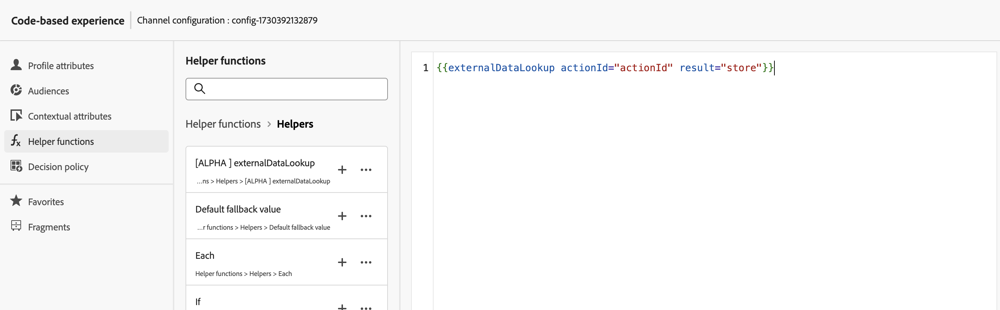

# Helper per ricerca dati esterna

>[!BEGINSHADEBOX]

**In questa pagina:** Scopri come utilizzare l&#39;helper externalDataLookup per recuperare dinamicamente i dati da un endpoint esterno e personalizzare il contenuto per i canali in entrata in Adobe Journey Optimizer.

>[!ENDSHADEBOX]

L&#39;helper `externalDataLookup` nell&#39;editor di personalizzazione [!DNL Journey Optimizer] può essere utilizzato per recuperare dinamicamente i dati da un endpoint esterno per la generazione di contenuti per i canali in entrata come Esperienza basata su codice, Canali Web e Messaggi in-app.

>[!AVAILABILITY]
>
>Questa funzionalità è disponibile solo per un set di organizzazioni (LA, disponibilità limitata).

Per utilizzare l&#39;helper, devi prima definire un&#39;azione nel menu **[!UICONTROL Amministrazione]** > **[!UICONTROL Configurazioni]**. Un’azione è il luogo in cui puoi configurare i dettagli di un endpoint esterno, ad esempio URL, metodo GET vs. POST, parametri di intestazione, parametri di query, schema JSON del corpo POST e schema JSON di risposta.

Una volta definita l’azione, questa può essere utilizzata in entrambi i modi:

* Nei percorsi, in un’attività Azione personalizzata per recuperare il contenuto,
* Nei percorsi e nelle campagne in entrata, in un helper externalDataLookup per recuperare dati in un’azione in entrata.

## Guardrail e limitazioni

Fare riferimento alle azioni personalizzate anche in [!DNL Journey Optimizer] campagne e Percorsi di canali in entrata#GuardrailsandGuidelines

* **Timeout predefinito** - Per impostazione predefinita, [!DNL Journey Optimizer] utilizza un timeout di 300 ms quando chiama un endpoint esterno. Per aumentare il timeout per un endpoint, contatta il rappresentante Adobe.
* **Esplorazione schema di risposta e convalida espressione** - Nell&#39;editor di personalizzazione non è possibile sfogliare lo schema della risposta dell&#39;endpoint durante l&#39;inserimento delle espressioni. [!DNL Journey Optimizer] non convalida i riferimenti agli attributi JSON dalla risposta utilizzata nelle espressioni.
* **Tipi di dati supportati per i parametri** - I tipi di dati supportati per i parametri della variabile di payload da sostituire tramite l&#39;helper externalDataLookup sono `String`, `Integer`, `Decimal`, `Boolean`, `listString`, `listInt`, `listInteger`, `listDecimal`.
* **Aggiornamento automatico per azioni aggiornate** - Le modifiche alla configurazione di un&#39;azione non vengono applicate alle corrispondenti chiamate externalDataLookup nelle campagne e nei percorsi live. Affinché una modifica venga rispecchiata, è necessario copiare o modificare tutte le campagne o i percorsi live che utilizzano l’azione in un helper externalDataLookup.
* **Sostituzione variabile** - Per il momento, l&#39;utilizzo delle variabili non è supportato nei parametri helper externalDataLookup.
* **Percorso dinamico** - Per il momento, il percorso URL dinamico non è supportato.
* **Rendering a più passaggi** - È supportato il rendering a più passaggi.
* **Autenticazione** - Per il momento, le opzioni di autenticazione nella configurazione Action non sono supportate dall&#39;helper externalDataLookup. Nel frattempo, per l’autenticazione basata su chiave API o altre chiavi di autorizzazione in testo normale, puoi specificarle come campi di intestazione nella configurazione Azione.

## Configurare un’azione e utilizzare l’helper

Per definire un’azione e utilizzare l’helper per la personalizzazione, segui questi passaggi:

1. Crea un’azione per configurare l’endpoint per la ricerca. Questa operazione deve essere eseguita solo una volta per ogni endpoint e deve essere eseguita da un utente tecnico. [Scopri come configurare un&#39;azione personalizzata](../action/about-custom-action-configuration.md)

   Prendi nota dell’ID azione e copialo.

   

1. Crea una campagna in entrata o un’azione di percorso. Per questo esempio, viene mostrato come utilizzare l’helper externalDataLookup in un’azione JSON di esperienza basata su codice, ma può essere utilizzato in un campo di personalizzazione in qualsiasi canale in entrata.

1. Modifica il contenuto dell&#39;azione, vai a Funzioni helper nell&#39;editor di personalizzazione e passa a **[!UICONTROL Funzioni helper]** > **[!UICONTROL Helper]**.

1. Fare clic sul pulsante `+` per inserire l&#39;helper externalDataLookup. L&#39;espressione helper viene inserita nell&#39;editor, con valori segnaposto per `actionId` e `result`.

   

   Sostituire i valori segnaposto come segue:

   * `actionId`: incolla l&#39;ID azione copiato in precedenza.
   * `result`: impostare il nome desiderato. Utilizzerai questa variabile di risultati per accedere al contenuto recuperato.

1. Aggiungi eventuali valori dei parametri della variabile da passare come parte della chiamata dell&#39;endpoint. Ad esempio, ecco come si può trasmettere un parametro di linguaggio e un parametro di elementi max.

   

1. Utilizza la variabile di risultati per accedere ai dati recuperati e inserirli nel contenuto per l’azione in entrata. Ad esempio, ecco come restituire un array JSON di elementi recuperati dall’endpoint.

   

## Come funziona

### Esecuzione runtime

Quando un&#39;azione in entrata include un helper externalDataLookup, l&#39;endpoint viene chiamato in modo dinamico nel momento in cui la richiesta di personalizzazione [!DNL Journey Optimizer] viene ricevuta ed elaborata dall&#39;Edge Network di AEP.

Ciò significa che l’endpoint esterno deve essere in grado di gestire un carico e una velocità effettiva simultanei almeno pari a quelli che il client invia per la superficie specificata all’Edge Network di AEP.

### Sintassi

`{{externalDataLookup actionId="d130c8e2-9a2d-45d5-bcb6-bc39865b4a56" result="result" optional-parameters...}}`

### Trasmissione dei parametri

Quando viene chiamato l&#39;endpoint esterno, tutti i valori di intestazione costanti, i parametri di query e il valore di payload della richiesta definiti nell&#39;azione vengono inviati con i valori forniti nella configurazione dell&#39;azione.

Per qualsiasi valore di intestazione variabile, parametri di query/percorso o valori di payload della richiesta, è possibile trasmettere valori in modo dinamico utilizzando i parametri all’helper externalDataLookup.

Nomi parametri:

* Parametri intestazione: `header.<parameter-name>`
* Parametri query: `query.<parameter-name>`
* Parametri payload: `payload.<parameter-name>`
* Parametri percorso: `dynamic_path.<parameter-name>`

Ad esempio:

```
{{externalDataLookup actionId="..." result="result" header.myHeaderParameter="value1" query.myQueryParameter="value2" payload.myPayloadParameter="value3"}}`
```

I valori dei parametri possono essere valori fissi o personalizzati facendo riferimento a campi di profilo o altri attributi contestuali, ad esempio:

```
{{externalDataLookup actionId="..." result="result" query.myQueryParameter=profile.myProfileValue}}
```

I parametri di payload possono essere forniti utilizzando la notazione del punto per fare riferimento agli attributi JSON nidificati, ad esempio:

```
{{externalDataLookup actionId="..." result="result" payload.context.channel="web"}}
```

### Accesso al risultato

Per accedere ai dati recuperati da una chiamata di ricerca dell’endpoint esterno, puoi fare riferimento ai campi definiti nel payload di risposta nella definizione dell’azione utilizzando espressioni di personalizzazione e funzioni di supporto.

Ad esempio, se il payload di risposta nell’azione è simile al seguente:

```
{
    "videos": [
        {
            "id": "integer",
            "title": "string",
            "description": "string",
            "thumbnail_url": "string",
            "video_page_url": "string",
            "url": "string",
            "video_type": "string",
            "start_timestamp": "dateOnly",
            "created_on": "dateOnly",
            ...
        }
    ]
}
```

Ad esempio, puoi recuperare e accedere alla descrizione del primo video in un’azione Experience HTML basata su codice come questa:

```
{{externalDataLookup actionId="d130c8e2-9a2d-45d5-bcb6-bc39865b4a56" result="result"}}
 
First video description: <b>result.videos[0].description</b>
```

Oppure, ad esempio, puoi recuperare e sfogliare gli elementi per restituire un array di elementi in un’azione JSON per l’esperienza basata su codice come segue:

```
{{externalDataLookup actionId="d130c8e2-9a2d-45d5-bcb6-bc39865b4a56" result="result"}}
 
[
{{#each result.videos as |item|}}
    {                                                  
        "title": "{{item.title}}",
        "url": "{{item.video_page_url}}",
        "thumbnail_url": "{{item.thumbnail_url}}",
        "start_timestamp": "{{item.start_timestamp}}"
    },
{{/each}}
]
```

## Risoluzione dei problemi

### Timeout e gestione degli errori

[!DNL Journey Optimizer] utilizza un timeout rigido quando chiama l&#39;endpoint esterno per mantenere le caratteristiche di prestazioni a bassa latenza e throughput elevato per Adobe Experience Platform Edge Network.

Se l’endpoint si interrompe o viene rilevato un errore di qualsiasi tipo che raggiunge l’endpoint, la variabile di risultato sarà vuota. Anche eventuali riferimenti agli attributi all’interno della variabile di risultato in questo caso saranno vuoti. Se visualizzi semplicemente l’attributo nel contenuto, questo verrà visualizzato come vuoto. Se si tenta di scorrere ciclicamente un attributo di array nel risultato, non verrà restituito alcun elemento.

Se desideri gestire in modo più appropriato i timeout o gli errori mostrando il contenuto di fallback, puoi verificare se il risultato della ricerca è vuoto e visualizzare in tal caso il contenuto di fallback.

Ad esempio, puoi visualizzare un valore di fallback per un singolo attributo come questo:

```
First video description: 
```

oppure puoi eseguire il rendering condizionale di un intero blocco di contenuto come questo:

```
{{externalDataLookup actionId="d130c8e2-9a2d-45d5-bcb6-bc39865b4a56" result="result"}}
 

   ... do something with result ...

    ... return fallback content ...

```

### Eseguire il debug

Per facilitare il debug, i dettagli del timeout e dell’errore per le ricerche di dati esterni sono inclusi nella vista Edge Delivery in Adobe Experience Platform Assurance. Se non visualizzi i risultati previsti per un helper externalDataLookup in un&#39;azione in entrata, puoi avviare una sessione Assurance, avviare una chiamata [!DNL Journey Optimizer] da un&#39;implementazione web o mobile e utilizzare la visualizzazione Edge Delivery per verificare i dettagli di timeout o errore.

Ad esempio:

Nella sezione Edge Delivery di traccia dell’affidabilità come parte dei dettagli di esecuzione è stato aggiunto un nuovo blocco customActions con dettagli di richiesta e risposta simili a quelli riportati di seguito. La sezione errori dovrebbe facilitare il debug in caso di problemi durante l’esecuzione di un’azione personalizzata


## Domande frequenti {#faq-external-data}

Di seguito sono riportate le domande frequenti sull’helper per la ricerca di dati esterni.

Hai bisogno di altri dettagli? Utilizza le opzioni di feedback nella parte inferiore di questa pagina per porre la tua domanda o connetterti alla [community Adobe Journey Optimizer](https://experienceleaguecommunities.adobe.com/t5/adobe-journey-optimizer/ct-p/journey-optimizer?profile.language=it){target="_blank"}.

+++ Come passare un attributo contestuale dalla richiesta come parametro a una ricerca dati esterna?

Utilizza il menu Attributi contestuali > Stream di dati > Evento per sfogliare lo schema Experience Event in uso e inserire l’attributo rilevante come valore di parametro come segue:

```
{{externalDataLookup actionId="..." result="result" query.myQueryParameter=context.datastream.event.<schemaId>.my.xdm.attribute}}
```

+++

+++ [!DNL Journey Optimizer] esegue la memorizzazione nella cache delle risposte dell&#39;endpoint esterno?

Non al momento. Questa funzione sarà supportata in futuro.

+++

## Riferimento rapido {#quick-reference}

Questa sezione contiene informazioni strutturate che supportano l&#39;interpretazione, il recupero e la risposta alle domande relative a questo argomento.

Per una comprensione completa, queste informazioni devono essere unite alla documentazione su questa pagina. Nessuna delle due origini è progettata per essere indipendente; la pagina descrive la funzione, mentre questa sezione fornisce un contesto aggiuntivo che aiuta a non ambiguare la terminologia, le finalità, l’applicabilità e i vincoli.

>[!BEGINTABS]

>[!TAB Panoramica]

**TL;DR**

In questa pagina viene illustrato come configurare un&#39;azione per un endpoint esterno e utilizzare l&#39;helper `externalDataLookup` nell&#39;editor di personalizzazione per recuperare dinamicamente tali dati in fase di esecuzione per personalizzare il contenuto del canale in entrata.

**Intenti**

* Configurare un’azione che definisce un endpoint esterno (URL, metodo HTTP, parametri, schemi di richiesta/risposta)
* Inserisci l&#39;helper `externalDataLookup` in un&#39;espressione di personalizzazione per un&#39;azione in entrata
* Trasferisci i parametri di intestazione, query, payload o percorso della variabile all’endpoint esterno al momento della chiamata
* Accedere ai dati recuperati tramite l’alias dei risultati utilizzando espressioni di personalizzazione e funzioni di supporto
* Gestire i timeout e gli errori in modo corretto con i modelli di contenuto di fallback
* Debug dei problemi di ricerca esterna tramite Adobe Experience Platform Assurance

>[!TAB Glossario]

* **externalDataLookup**: una funzione di supporto nell&#39;editor di personalizzazione che recupera dinamicamente i dati da un endpoint esterno configurato al momento della richiesta, per l&#39;utilizzo nella personalizzazione dei contenuti del canale in entrata. *(specifico per prodotto)*
* **Azione**: oggetto di configurazione in Journey Optimizer (Amministrazione > Configurazioni) che definisce un endpoint esterno, ovvero URL, metodo HTTP, parametri di intestazione/query, schema del corpo del POST e schema di risposta. Obbligatorio prima di utilizzare `externalDataLookup`. *(specifico per prodotto)*
* **variabile risultato**: alias arbitrario assegnato nella chiamata `externalDataLookup`; utilizzato per fare riferimento a tutti i campi della risposta recuperata nelle espressioni di personalizzazione successive.
* **Canali in entrata**: canali in cui il contenuto viene distribuito su richiesta quando un utente apre una superficie: Esperienza basata su codice, Web, Messaggio in-app. *(specifico per prodotto)*
* **AEP Edge Network**: l&#39;infrastruttura che riceve le richieste di personalizzazione e attiva la chiamata di ricerca dati esterna in fase di esecuzione.

>[!TAB Terminologia]

* **Nome canonico:** externalDataLookup — varianti: ricerca dati esterna, helper ricerca dati esterna, helper ricerca dati esterna
* **Sinonimi:** &quot;externalDataLookup&quot; = &quot;external data lookup helper&quot;
* **Non confondere:** `actionId` (ID dell&#39;azione configurata, che identifica l&#39;endpoint esterno) ≠ `result` (alias per i dati di risposta recuperati) ≠ nomi dei parametri (valori delle variabili passati all&#39;endpoint al momento della chiamata)
* **Non confondere:** utilizzando `externalDataLookup` in un&#39;azione di personalizzazione in entrata (recupera i dati in modo dinamico al momento della richiesta di Edge Network) ≠ utilizzando un&#39;azione personalizzata in un&#39;attività di percorso (recupera il contenuto all&#39;interno di un flusso di percorso)

>[!TAB Guardrail e limitazioni]

* La funzione è a disponibilità limitata, disponibile solo per un set di organizzazioni.
* Timeout predefinito per le chiamate degli endpoint esterni: 300 ms (impostazione predefinita; contatta il rappresentante Adobe per aumentare il timeout per un endpoint specifico).
* L’esplorazione dello schema di risposta non è supportata nell’editor di personalizzazione; Journey Optimizer non convalida i riferimenti agli attributi JSON dalla risposta utilizzata nelle espressioni.
* Tipi di dati supportati per i parametri della variabile di payload: `String`, `Integer`, `Decimal`, `Boolean`, `listString`, `listInt`, `listInteger`, `listDecimal`.
* La sostituzione della variabile all&#39;interno dei parametri helper `externalDataLookup` non è attualmente supportata.
* I percorsi URL dinamici non sono attualmente supportati.
* Le opzioni di autenticazione nella configurazione dell&#39;azione non sono attualmente supportate da `externalDataLookup`. Utilizzare i campi di intestazione per l&#39;autorizzazione basata su chiave API o con testo normale come soluzione alternativa.
* Le modifiche alla configurazione di un’azione non vengono applicate alle campagne o ai percorsi live che la utilizzano; copia o modifica eventuali campagne/percorsi live per applicare le modifiche.
* È supportato il rendering a più passaggi.
* Al momento Journey Optimizer non memorizza nella cache le risposte agli endpoint esterni.
* L’endpoint esterno deve essere in grado di gestire un carico e una velocità effettiva simultanei almeno pari al traffico in entrata inviato ad AEP Edge Network per la superficie specificata.

>[!TAB Domande frequenti]

**D: cosa succede se l&#39;endpoint esterno riceve un timeout o restituisce un errore?**

La variabile di risultato sarà vuota. I riferimenti agli attributi all’interno del risultato verranno visualizzati come vuoti e le iterazioni di matrice non restituiranno alcun elemento. Utilizzare i modelli di contenuto di fallback, ad esempio `?: "none found"` per attributi singoli o `……` per blocchi di contenuto interi, per gestire questi casi in modo corretto.

**D: come posso passare un attributo contestuale dalla richiesta come parametro a una ricerca dati esterna?**

Utilizza il menu Attributi contestuali > Stream di dati > Evento nell&#39;editor di personalizzazione per sfogliare lo schema Experience Event e inserire l&#39;attributo pertinente come valore di parametro, ad esempio: `query.myQueryParameter=context.datastream.event.<schemaId>.my.xdm.attribute`.

**Q: Journey Optimizer memorizza nella cache le risposte dell&#39;endpoint esterno?**

Non al momento. La memorizzazione in cache sarà supportata in futuro.

**D: come si eseguono i debug dei problemi con externalDataLookup?**

Utilizza Adobe Experience Platform Assurance. Avvia una sessione di Assurance, avvia una chiamata Journey Optimizer dall’implementazione web o mobile e utilizza la vista Edge Delivery per controllare il blocco customActions per i dettagli sul timeout o sull’errore.

**Q: è possibile utilizzare l&#39;autenticazione nella configurazione dell&#39;azione con externalDataLookup?**

Le opzioni di autenticazione nella configurazione Azione non sono attualmente supportate. Per l’autorizzazione basata su chiave API o con altro testo non crittografato, specifica le credenziali come campi di intestazione nella configurazione Azione.

>[!ENDTABS]

<!-- ai-section-version: 1 | source-hash: a3ce801a -->
