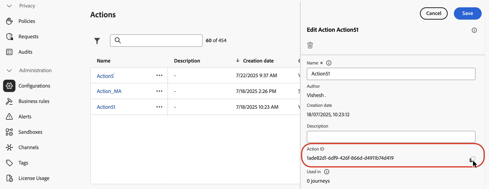
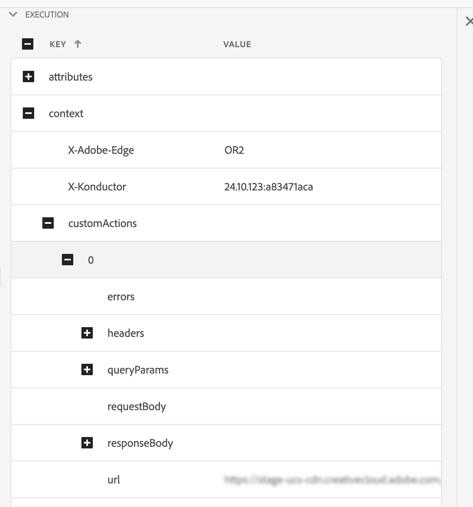

# Helper per la ricerca di dati esterni

L&#39;helper `externalDataLookup` nell&#39;editor di personalizzazione [!DNL Journey Optimizer] può essere utilizzato per recuperare dinamicamente i dati da un endpoint esterno per la generazione di contenuti per i canali in entrata come Esperienza basata su codice, Canali Web e Messaggi in-app.

>[!AVAILABILITY]
>
>Questa funzionalità è disponibile solo per un set di organizzazioni (disponibilità limitata).

Per utilizzare l&#39;helper, devi prima definire un&#39;azione nel menu **[!UICONTROL Amministrazione]** > **[!UICONTROL Configurazioni]**. Un’azione è il luogo in cui puoi configurare i dettagli di un endpoint esterno, ad esempio URL, metodo GET vs. POST, parametri di intestazione, parametri di query, schema JSON del corpo del POST e schema JSON di risposta.

Una volta definita l’azione, questa può essere utilizzata in entrambi i modi:

* Nei percorsi, in un’attività Azione personalizzata per recuperare il contenuto,
* Nei percorsi e nelle campagne in entrata, in un helper externalDataLookup per recuperare dati in un’azione in entrata.

## Guardrail e limitazioni

Fare riferimento alle azioni personalizzate anche in [!DNL Journey Optimizer] campagne e Percorsi di canali in entrata#GuardrailsandGuidelines

* **Timeout predefinito** - Per impostazione predefinita, [!DNL Journey Optimizer] utilizza un timeout di 300 ms quando chiama un endpoint esterno. Per aumentare il timeout per un endpoint, contatta il rappresentante Adobe.
* **Esplorazione schema di risposta e convalida espressione** - Nell&#39;editor di personalizzazione non è possibile sfogliare lo schema della risposta dell&#39;endpoint durante l&#39;inserimento delle espressioni. [!DNL Journey Optimizer] non convalida i riferimenti agli attributi JSON dalla risposta utilizzata nelle espressioni.
* **Tipi di dati supportati per i parametri** - I tipi di dati supportati per i parametri della variabile di payload da sostituire tramite l&#39;helper externalDataLookup sono `String`, `Integer`, `Decimal`, `Boolean`, `listString`, `listInt`, `listInteger`, `listDecimal`.
* **Aggiornamento automatico per azioni aggiornate** - Le modifiche alla configurazione di un&#39;azione non vengono applicate alle corrispondenti chiamate externalDataLookup nelle campagne e nei percorsi live. Affinché una modifica venga rispecchiata, è necessario copiare o modificare tutte le campagne o i percorsi live che utilizzano l’azione in un helper externalDataLookup.
* **Sostituzione variabile** - Per il momento, l&#39;utilizzo delle variabili non è supportato nei parametri helper externalDataLookup.
* **Percorso dinamico** - Per il momento, il percorso URL dinamico non è supportato.
* **Rendering a più passaggi** - È supportato il rendering a più passaggi.
* **Autenticazione** - Per il momento, le opzioni di autenticazione nella configurazione Action non sono supportate dall&#39;helper externalDataLookup. Nel frattempo, per l’autenticazione basata su chiave API o altre chiavi di autorizzazione in testo normale, puoi specificarle come campi di intestazione nella configurazione Azione.

## Configurare un’azione e utilizzare l’helper

Per definire un’azione e utilizzare l’helper per la personalizzazione, segui questi passaggi:

1. Crea un’azione per configurare l’endpoint per la ricerca. Questa operazione deve essere eseguita solo una volta per ogni endpoint e deve essere eseguita da un utente tecnico. [Scopri come configurare un&#39;azione personalizzata](../action/about-custom-action-configuration.md)

   Prendi nota dell’ID azione e copialo.

   

1. Crea una campagna in entrata o un’azione di percorso. Per questo esempio, viene mostrato come utilizzare l’helper externalDataLookup in un’azione JSON di esperienza basata su codice, ma può essere utilizzato in un campo di personalizzazione in qualsiasi canale in entrata.

1. Modifica il contenuto dell&#39;azione, vai a Funzioni helper nell&#39;editor di personalizzazione e passa a **[!UICONTROL Funzioni helper]** > **[!UICONTROL Helper]**.

1. Fare clic sul pulsante `+` per inserire l&#39;helper externalDataLookup. L&#39;espressione helper viene inserita nell&#39;editor, con valori segnaposto per `actionId` e `result`.

   

   Sostituire i valori segnaposto come segue:

   * `actionId`: incolla l&#39;ID azione copiato in precedenza.
   * `result`: impostare il nome desiderato. Utilizzerai questa variabile di risultati per accedere al contenuto recuperato.

1. Aggiungi eventuali valori dei parametri della variabile da passare come parte della chiamata dell&#39;endpoint. Ad esempio, ecco come si può trasmettere un parametro di linguaggio e un parametro di elementi max.

   

1. Utilizza la variabile di risultati per accedere ai dati recuperati e inserirli nel contenuto per l’azione in entrata. Ad esempio, ecco come restituire un array JSON di elementi recuperati dall’endpoint.

   

## Come funziona

### Esecuzione runtime

Quando un&#39;azione in entrata include un helper externalDataLookup, l&#39;endpoint viene chiamato in modo dinamico nel momento in cui la richiesta di personalizzazione [!DNL Journey Optimizer] viene ricevuta ed elaborata dall&#39;Edge Network di AEP.

Ciò significa che l’endpoint esterno deve essere in grado di gestire un carico e una velocità effettiva simultanei almeno pari a quelli che il client invia per la superficie specificata all’Edge Network di AEP.

### Sintassi

`{{externalDataLookup actionId="d130c8e2-9a2d-45d5-bcb6-bc39865b4a56" result="result" optional-parameters...}}`

### Trasmissione dei parametri

Quando viene chiamato l&#39;endpoint esterno, tutti i valori di intestazione costanti, i parametri di query e il valore di payload della richiesta definiti nell&#39;azione vengono inviati con i valori forniti nella configurazione dell&#39;azione.

Per qualsiasi valore di intestazione variabile, parametri di query/percorso o valori di payload della richiesta, è possibile trasmettere valori in modo dinamico utilizzando i parametri all’helper externalDataLookup.

Nomi parametri:

* Parametri intestazione: `header.<parameter-name>`
* Parametri query: `query.<parameter-name>`
* Parametri payload: `payload.<parameter-name>`
* Parametri percorso: `dynamic_path.<parameter-name>`

Ad esempio:

```
{{externalDataLookup actionId="..." result="result" header.myHeaderParameter="value1" query.myQueryParameter="value2" payload.myPayloadParameter="value3"}}`
```

I valori dei parametri possono essere valori fissi o personalizzati facendo riferimento a campi di profilo o altri attributi contestuali, ad esempio:

```
{{externalDataLookup actionId="..." result="result" query.myQueryParameter=profile.myProfileValue}}
```

I parametri di payload possono essere forniti utilizzando la notazione del punto per fare riferimento agli attributi JSON nidificati, ad esempio:

```
{{externalDataLookup actionId="..." result="result" payload.context.channel="web"}}
```

### Accesso al risultato

Per accedere ai dati recuperati da una chiamata di ricerca dell’endpoint esterno, puoi fare riferimento ai campi definiti nel payload di risposta nella definizione dell’azione utilizzando espressioni di personalizzazione e funzioni di supporto.

Ad esempio, se il payload di risposta nell’azione è simile al seguente:

```
{
    "videos": [
        {
            "id": "integer",
            "title": "string",
            "description": "string",
            "thumbnail_url": "string",
            "video_page_url": "string",
            "url": "string",
            "video_type": "string",
            "start_timestamp": "dateOnly",
            "created_on": "dateOnly",
            ...
        }
    ]
}
```

Ad esempio, puoi recuperare e accedere alla descrizione del primo video in un’azione Experience HTML basata su codice come questa:

```
{{externalDataLookup actionId="d130c8e2-9a2d-45d5-bcb6-bc39865b4a56" result="result"}}
 
First video description: <b>result.videos[0].description</b>
```

Oppure, ad esempio, puoi recuperare e sfogliare gli elementi per restituire un array di elementi in un’azione JSON per l’esperienza basata su codice come segue:

```
{{externalDataLookup actionId="d130c8e2-9a2d-45d5-bcb6-bc39865b4a56" result="result"}}
 
[
{{#each result.videos as |item|}}
    {                                                  
        "title": "{{item.title}}",
        "url": "{{item.video_page_url}}",
        "thumbnail_url": "{{item.thumbnail_url}}",
        "start_timestamp": "{{item.start_timestamp}}"
    },
{{/each}}
]
```

## Risoluzione dei problemi

### Timeout e gestione degli errori

[!DNL Journey Optimizer] utilizza un timeout rigido quando chiama l&#39;endpoint esterno per mantenere le caratteristiche di prestazioni a bassa latenza e throughput elevato per Adobe Experience Platform Edge Network.

Se l’endpoint si interrompe o viene rilevato un errore di qualsiasi tipo che raggiunge l’endpoint, la variabile di risultato sarà vuota. Anche eventuali riferimenti agli attributi all’interno della variabile di risultato in questo caso saranno vuoti. Se visualizzi semplicemente l’attributo nel contenuto, questo verrà visualizzato come vuoto. Se si tenta di scorrere ciclicamente un attributo di array nel risultato, non verrà restituito alcun elemento.

Se desideri gestire in modo più appropriato i timeout o gli errori mostrando il contenuto di fallback, puoi verificare se il risultato della ricerca è vuoto e visualizzare in tal caso il contenuto di fallback.

Ad esempio, puoi visualizzare un valore di fallback per un singolo attributo come questo:

```
First video description: 
```

oppure puoi eseguire il rendering condizionale di un intero blocco di contenuto come questo:

```
{{externalDataLookup actionId="d130c8e2-9a2d-45d5-bcb6-bc39865b4a56" result="result"}}
 

   ... do something with result ...

    ... return fallback content ...

```

### Debug

Per facilitare il debug, i dettagli del timeout e dell’errore per le ricerche di dati esterni sono inclusi nella vista Edge Delivery in Adobe Experience Platform Assurance. Se non visualizzi i risultati previsti per un helper externalDataLookup in un&#39;azione in entrata, puoi avviare una sessione Assurance, avviare una chiamata [!DNL Journey Optimizer] da un&#39;implementazione web o mobile e utilizzare la visualizzazione Edge Delivery per verificare i dettagli di timeout o errore.

Ad esempio:

Nella sezione Edge Delivery di traccia dell’affidabilità come parte dei dettagli di esecuzione è stato aggiunto un nuovo blocco customActions con dettagli di richiesta e risposta simili a quelli riportati di seguito. La sezione errori dovrebbe facilitare il debug in caso di problemi durante l’esecuzione di un’azione personalizzata



## Domande frequenti

* Come passare un attributo contestuale dalla richiesta come parametro a una ricerca dati esterna?

  Utilizza il menu Attributi contestuali > Stream di dati > Evento per sfogliare lo schema Experience Event in uso e inserire l’attributo rilevante come valore di parametro come segue:

  ```
  {{externalDataLookup actionId="..." result="result" query.myQueryParameter=context.datastream.event.<schemaId>.my.xdm.attribute}}
  ```

* [!DNL Journey Optimizer] esegue la memorizzazione nella cache delle risposte dell&#39;endpoint esterno?

  Non al momento. Questa funzione sarà supportata in futuro.
