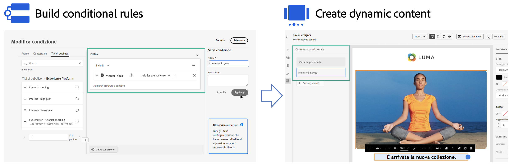

# Introduzione ai contenuti dinamici {#start-dynamic-content}

>[!CONTEXTUALHELP]
>id="ajo_conditions_list"
>title="Condizioni"
>abstract="Le regole condizionali consentono di visualizzare più varianti di contenuto nei messaggi in base agli attributi del profilo, agli eventi contestuali o ai tipi di pubblico."

I contenuti dinamici consentono di adattare il contenuto dei messaggi in base a **regole condizionali** che possono essere composte da attributi di profilo, eventi contestuali o tipi di pubblico. Le regole condizionali vengono create utilizzando un generatore di regole visive nell’editor di personalizzazione, in cui puoi memorizzarle per un ulteriore riutilizzo in tutti i percorsi e le campagne.

Le regole condizionali possono essere utilizzate in E-mail Designer e nell&#39;editor di personalizzazione per **creare contenuto dinamico** che si adatterà ai profili target nei messaggi.

* [Scopri come utilizzare le regole condizionali](create-conditions.md)
* [Scopri come creare contenuti dinamici](dynamic-content.md)

## Video introduttivo {#video}

Scopri come creare contenuti dinamici con il generatore di regole di condizione.

>[!VIDEO](https://video.tv.adobe.com/v/3409815?quality=12)
