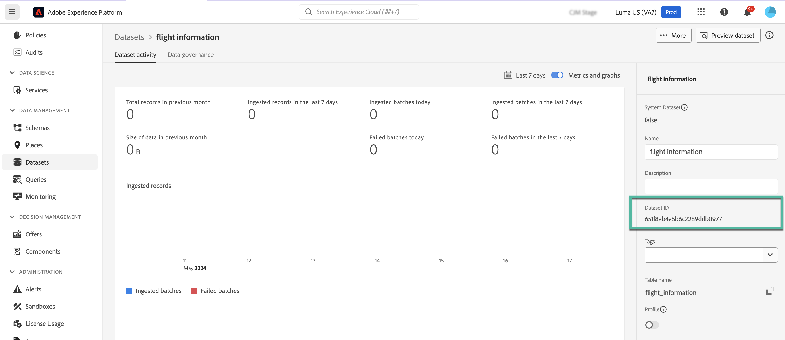

# Utilizzare i dati di Adobe Experience Platform per la personalizzazione (beta) {#aep-data}

>[!AVAILABILITY]
>
>Questa funzione è attualmente disponibile solo come versione beta privata.
>
>Per il momento, è disponibile solo per **canale e-mail** e a scopo di test nella sandbox non di produzione fornita ad Adobe e per i set di dati richiesti per la versione beta.

Journey Optimizer ti consente di sfruttare i dati provenienti da Adobe Experience Platform nell’editor di personalizzazione per [personalizzare i contenuti](../personalization/personalize.md). I passaggi sono i seguenti:

1. Apri l’editor di personalizzazione, disponibile in ogni contesto in cui puoi definire la personalizzazione, ad esempio i messaggi. [Scopri come utilizzare l’editor di personalizzazione](../personalization/personalization-build-expressions.md)

1. Passa all’elenco delle funzioni di assistenza e aggiungi **datasetLookup** funzione helper nel riquadro del codice.

   

1. Questa funzione fornisce una sintassi predefinita per consentire di chiamare campi dai set di dati di Adobe Experience Platform. La sintassi è la seguente:

   ```
   {{entity.datasetId="datasetId" id="key" result="store"}}
   ```

   * **entity.datasetId** è l’ID del set di dati con cui stai lavorando,
   * **id** è il campo utilizzato come identità primaria nel set di dati,

     >[!NOTE]
     >
     >Il valore immesso per questo campo può essere l&#39;ID campo (*profile.couponValue*), un campo passato in un evento di percorso (*context.percorsi.events.event_ID.couponValue*) o un valore statico (*couponAbcd*). In ogni caso, il sistema utilizzerà il valore e la ricerca nel set di dati per verificare se corrisponde a una chiave).

   * **risultato** è un nome arbitrario che devi fornire per fare riferimento a tutti i valori di campo che stai per recuperare dal set di dati. Questo valore verrà utilizzato nel codice per chiamare ogni campo.

   +++Dove recuperare un ID set di dati?

   Gli ID dei set di dati possono essere recuperati nell’interfaccia utente di Adobe Experience Platform. Scopri come utilizzare i set di dati in [Documentazione di Adobe Experience Platform](https://experienceleague.adobe.com/en/docs/experience-platform/catalog/datasets/user-guide#view-datasets){target="_blank"}.

   

+++

   +++Come identificare un campo di identità primaria in un set di dati?

   Il campo definito come identità primaria per un determinato set di dati si trova nello schema collegato al set di dati. Scopri come utilizzare i campi di identità in [Documentazione di Adobe Experience Platform](https://experienceleague.adobe.com/en/docs/experience-platform/xdm/ui/fields/identity){target="_blank"}.

   

+++

1. Adatta la sintassi in base alle tue esigenze. In questo esempio, vogliamo recuperare i dati relativi ai voli dei passeggeri. La sintassi è la seguente:

   ```
   {{entity.datasetId="1234567890abcdtId" id="profile.personalEmail.address" result="flight"}}
   ```

   * Stiamo lavorando nel set di dati il cui ID è &quot;1234567890abcdtId&quot;,
   * Il campo utilizzato come chiave primaria in questo set di dati è l’indirizzo e-mail,
   * Vogliamo includere tutti i valori dei campi nel riferimento &quot;volo&quot;.

1. Una volta configurata la sintassi da chiamare nel set di dati di Adobe Experience Platform, puoi specificare quali campi recuperare. La sintassi è la seguente:

   ```
   {{result.fieldId}}
   ```

   * **risultato** è il valore che hai assegnato al **risultato** parametro in **MultiEntity** funzione helper. In questo esempio &quot;flight&quot;.
   * **fieldID** è l’ID del campo da recuperare. Questo ID è visibile nell’interfaccia utente di Adobe Experience Platform durante la navigazione nel set di dati. Espandi la sezione seguente per visualizzare un esempio:

     +++Dove recuperare un ID campo?

     Gli ID dei campi possono essere recuperati durante l’anteprima di un set di dati nell’interfaccia utente di Adobe Experience Platform. Scopri come visualizzare in anteprima i set di dati in [Documentazione di Adobe Experience Platform](https://experienceleague.adobe.com/en/docs/experience-platform/catalog/datasets/user-guide#preview){target="_blank"}.

     

+++

   In questo esempio, vogliamo utilizzare le informazioni relative all&#39;orario di imbarco e al gate dei passeggeri. Pertanto, aggiungiamo queste due righe:

   * `{{flight._myorg.booking.boardingTime}}`
   * `{{flight._myorg.booking.gate}}`

1. Ora che il codice è pronto, puoi completare il contenuto come di consueto e testarlo utilizzando **Simula contenuto** per controllare la personalizzazione. [Scopri come visualizzare in anteprima e testare i contenuti](../content-management/preview-test.md)


   
